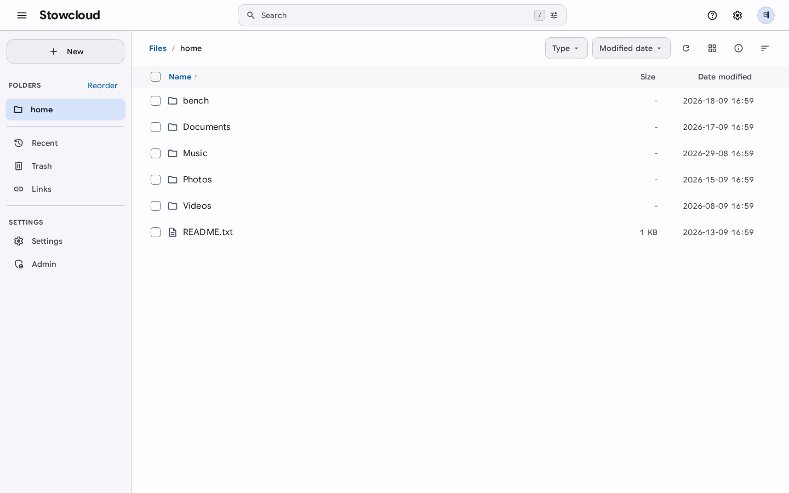
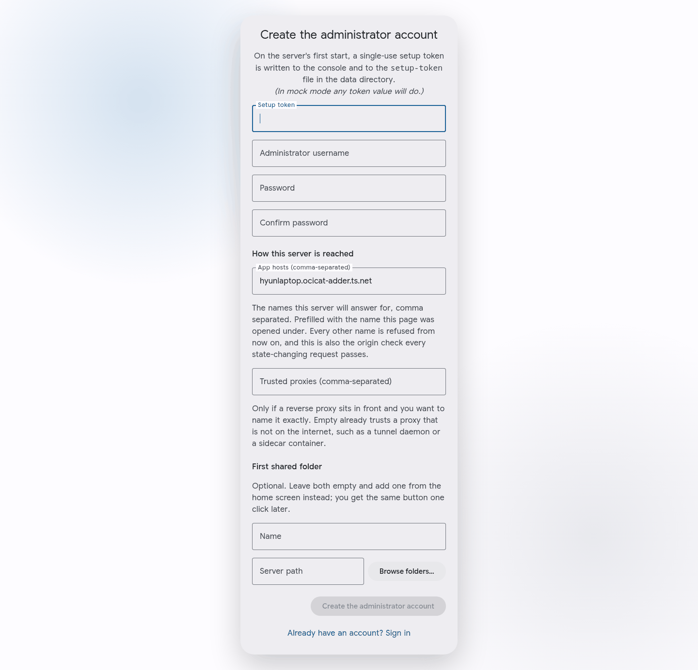
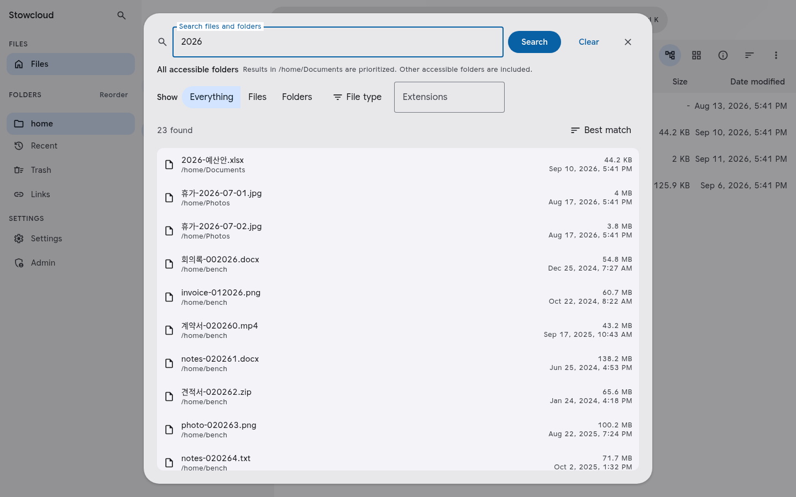
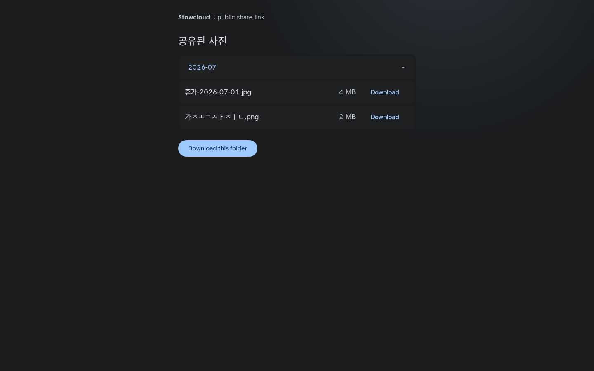
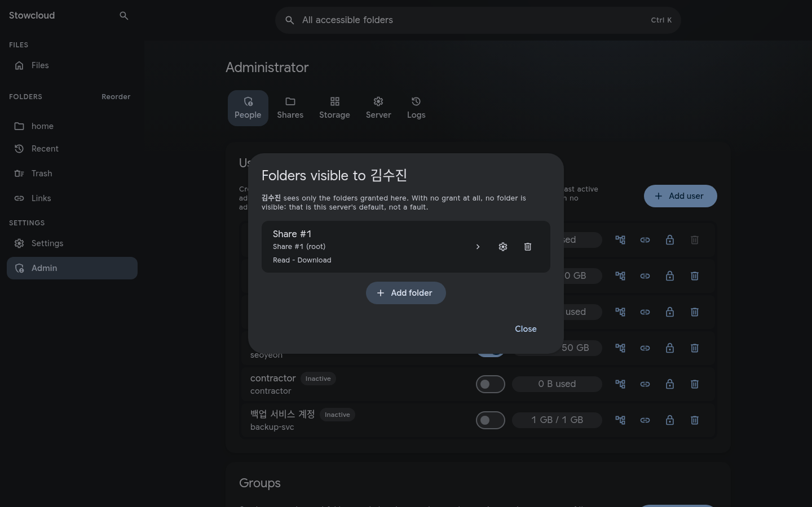
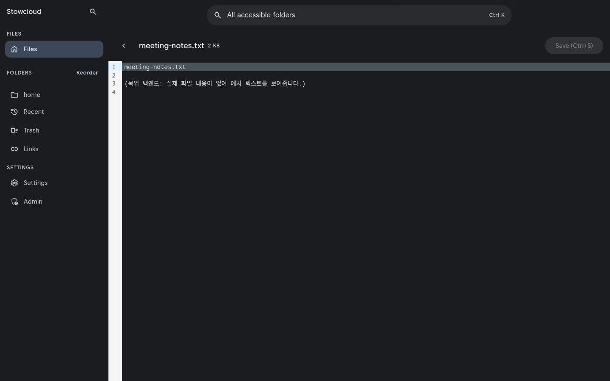

# Stowcloud

[](https://github.com/heavycaffeiner/stowcloud/actions/workflows/verify.yml)
[](https://github.com/heavycaffeiner/stowcloud/actions/workflows/docker.yml)

[English](README.md) | **한국어**

**Stowcloud는 이미 가지고 있는 폴더에 웹 화면을 붙여 줍니다. 파일을 옮기지도,
복사하지도 않습니다.**

`/srv/photos`를 가리키게 하면 브라우저 화면, 네트워크 드라이브로 연결할 수 있는
경로, 노트북 폴더를 최신 상태로 맞춰 주는 동기화 앱이 생깁니다. 파일은 원래
자리에 원래 이름 그대로 남아 있고, 그 서버의 다른 프로그램도 계속 읽을 수
있습니다.

<picture>
  <source media="(prefers-color-scheme: dark)" srcset="docs/screenshots/browse-dark.png">
  
</picture>

> 이 문서의 스크린샷은 전부 이 저장소의 CI가 빌드해서 게시한 이미지
> `ghcr.io/heavycaffeiner/stowcloud:core`(리비전 `d82d880`)를
> `docker compose up`으로 띄운 화면입니다. Rocky Linux 10 호스트에서 그 디스크의
> 실제 파일을 열어 찍었습니다. 목업도 아니고 디자인 도구로 꾸민 것도 아닙니다.

## 어떤 문제를 푸는가

미디어 서버가 하나 있다고 해 봅시다. Jellyfin이 `/srv/photos`를 훑고, 백업
스크립트가 매일 밤 rsync로 복사하고, 가족은 노트북에서 SMB로 접근합니다.

이제 그 사진을 휴대폰에서도 보고 싶고, 계정이 없는 친구에게 폴더 하나를 보내고
싶어집니다. 그래서 셀프호스팅 클라우드 드라이브를 설치합니다. 그런데 그 프로그램은
사진을 자기 안으로 **업로드**하라고 합니다. 업로드가 끝나면 파일은 그 프로그램의
저장소 안에, 그 프로그램이 지은 이름으로 들어가고, Jellyfin은 더 이상 그 파일을
보지 못합니다. 결국 사본이 두 벌 생기고, 그중 한 벌은 인질이 됩니다.

Stowcloud는 그렇게 하지 않습니다. 가져오기 단계 자체가 없습니다. 디스크의 폴더가
곧 저장소이기 때문입니다. 데이터베이스는 캐시일 뿐이라, 지워도 다시 만드는 시간
말고는 잃을 것이 없습니다. 다른 프로그램이 같은 폴더에 쓰는 것은 고장이 아니라
당연한 일로 취급하고, 다른 프로그램도 함께 쓰는 폴더는 화면에 그렇게 표시해서
되돌릴 수 없는 작업 전에 알려 줍니다.

## 나에게 맞는 도구인가

**잘 맞는 경우**

- 리눅스 서버에 이미 파일이 있고, 거기에 웹 화면을 얹고 싶다
- 그 파일을 다른 프로그램도 함께 쓴다 (미디어 서버, 백업, Samba)
- 공용 비밀번호 하나가 아니라, 사람별로 특정 폴더만 열어 주고 싶다
- Docker를 돌릴 수 있고, 앞에 리버스 프록시를 세울 수 있다

**다른 것을 찾는 편이 나은 경우**

- 서버를 직접 운영하지 않는 호스팅 서비스를 원한다
- 서버가 윈도우나 macOS여야 한다 (설계상 리눅스 전용입니다)
- 문서 공동 편집, 캘린더, 주소록, 채팅이 필요하다
- 외부 감사를 거친 제품이어야 한다. 이 저장소 바깥의 누구도 아직 검토하지
  않았습니다.

## 5분 만에 띄워 보기

Docker가 설치된 리눅스 머신이 필요합니다.

**1. compose 파일을 받습니다.**

```sh
git clone https://github.com/heavycaffeiner/stowcloud
cd stowcloud
```

**2. 실행합니다.**

```sh
docker compose up -d
```

설정은 이게 전부입니다. 이 저장소의 CI가 빌드하고 기동 테스트까지 마친 30MB
남짓한 이미지를 받아옵니다. 컨테이너는 읽기 전용으로, root가 아닌 사용자로,
리눅스 권한을 전부 버린 상태로 돌고, 8443 포트에서 HTTPS를 제공합니다.

만들 폴더도, chown 할 것도 없습니다. 업로드한 파일은 named volume에 들어가고,
이미지가 그 자리의 디렉터리를 실행 uid 소유로 미리 만들어 두기 때문에 volume이
쓸 수 있는 소유권을 물려받습니다. 이미 가지고 있는 폴더를 서비스하려면
`volumes:`의 `sc-files` 줄을 bind mount로 바꾸고, 그 디렉터리를 uid 1000이
읽고 쓸 수 있게 해 두면 됩니다.

```yaml
      - /srv/my-files:/shares/files:z
```

단, 처음 실행하기 전에 디렉터리를 미리 만들어 두세요. bind mount는 named
volume처럼 소유권을 물려받지 않습니다. 없는 경로를 Docker가 대신 만들면 root
소유가 되고, 그럼 서버가 쓰지 못해 `state.db`를 열 수 없다며 죽습니다.

```sh
sudo mkdir -p /srv/my-files
sudo chown -R 1000:1000 /srv/my-files
```

**3. 관리자 계정을 만듭니다.**

```sh
docker compose logs sc | grep 'setup token'
```

`https://<서버 주소>:8443/setup`을 열고 그 토큰을 붙여 넣은 다음, 아이디와
비밀번호를 정합니다.

첫 접속에서 브라우저가 인증서 경고를 띄웁니다. 정상입니다. 사설 주소에는 인증
기관이 보증해 줄 공인 도메인이 없어서 서버가 스스로 발급한 인증서를 씁니다.
브라우저마다 한 번씩 허용해 주면 됩니다. 대신 쓸 `http://` 포트는 없습니다.



이 토큰은 한 번만 쓸 수 있고, 15분이 지나면 만료되며, 관리자가 생기는 순간 영구히
사라집니다. 로그가 이미 넘어갔다면 `data/setup-token` 파일에도 적혀 있습니다.
첫 비밀번호를 넣는 환경 변수는 일부러 두지 않았습니다. 환경 변수로 넘긴 값은
`docker inspect`와 프로세스 목록에 그대로 보이기 때문입니다.

여기까지가 시작입니다. 아래는 이제부터 할 수 있는 일들입니다.

**내부망에서는** `https://<서버 주소>:8443`으로 접속하세요. 공유기 내부망은
물론 Tailscale이나 WireGuard로 붙어도 따로 설정할 것이 없습니다. 서버가 스스로
발급한 인증서라 브라우저가 한 번 확인을 요구합니다. 사설 주소에는 공인 도메인이
없으니 그 경고가 대가입니다.

**`http://` 포트는 없습니다.** 내부망에도, 루프백에도, 어디에도 없습니다.
소켓 하나이고 항상 TLS입니다. 세션 쿠키가 보안 origin에서만 유지되므로 평문
로그인은 조용히 풀리기만 하고, 아무도 공개하지 않는 동안에만 안전한 포트는
애초에 두지 않는 편이 낫습니다.

> **바깥에서 접근하게 만들기 전에** 정식 인증서를 가진 리버스 프록시를 앞에 두고,
> `data/sc.toml`의 `trusted_proxies`에 그 프록시 주소를 적으세요. 이 마지막
> 설정이 빠지면 모든 접속자가 프록시 하나로 보여서, 로그인 횟수 제한과 감사
> 로그가 전부 주소 하나에 몰립니다. 공격자 한 명이 전원을 잠글 수 있게 됩니다.
>
> 프록시는 이 서버에 HTTPS로 붙되 자체 서명 인증서 검증은 건너뜁니다. 루프백
> 구간이라 문제되지 않습니다. Caddy 기준으로는 이렇습니다.
>
> ```
> cloud.example.com {
>   reverse_proxy https://127.0.0.1:8443 {
>     transport http { tls_insecure_skip_verify }
>   }
> }
> ```

## 무엇을 할 수 있나

| | |
|---|---|
| **탐색과 정리** | 업로드, 이동, 복사, 이름 변경, 삭제. 두 사람이 같은 것을 건드리면 조용히 덮어쓰지 않고 충돌 화면을 띄웁니다. 오래 걸리는 작업은 탭을 새로 고쳐도 계속됩니다. |
| **이어받는 업로드** | 연결이 끊기거나, 탭을 닫거나, 프록시에 용량 제한이 걸려도 전송을 처음부터 다시 하지 않습니다. |
| **검색** | 이름으로, 그 사람이 볼 수 있는 모든 폴더에서 한 번에 찾습니다. |
| **공유 링크** | 계정 없는 사람에게 폴더를 보냅니다. 비밀번호, 만료일, 다운로드 횟수 제한을 걸 수 있고, 안을 보여 주지 않고 파일만 받는 업로드 전용 링크도 만듭니다. |
| **폴더별 권한** | 계정마다 폴더 하나, 또는 그 안의 하위 폴더 하나만 열어 줍니다. 읽기와 쓰기는 따로 정합니다. 새 계정의 기본값은 아무것도 안 보이는 상태입니다. |
| **네트워크 드라이브** | WebDAV로 윈도우 탐색기, 파인더, 리눅스에서 연결합니다. SMB는 별도 컨테이너로 제공하며 켜기 전까지 꺼져 있습니다. |
| **동기화 앱** | 기존 Nextcloud 데스크톱, 모바일 클라이언트가 수정 없이 로그인해서 동기화합니다.[^tm] |
| **계정** | 자체 비밀번호, OIDC 통합 로그인(Keycloak, Authentik 등), 인증 앱 코드, 앱 비밀번호, 복구 코드. |

### 폴더 구조가 그대로 보입니다

폴더 창은 공유가 가리키는 바로 그 디렉터리를 따라갑니다. 가져오기를 한 적이
없으니, 여기 보이는 것이 `ls`가 보는 것입니다.


### 검색은 폴더를 가로지릅니다

한 번의 검색이 그 계정이 볼 수 있는 모든 폴더를 훑습니다. 여러 곳을 돌아다닐
필요가 없습니다. 파일 이름만 찾으며, 파일 내용 검색은 따로 켜는 기능입니다.



### 링크는 만들 때 한 번만 보여 줍니다

전체 링크는 딱 한 번의 응답에만 존재하고 그 뒤로는 다시 볼 수 없습니다. 대화
상자가 그 사실을 그대로 적어 두는 이유입니다. 창을 닫기 전에 복사하세요. 만료,
비밀번호, 다운로드 횟수는 만들 때 정합니다. 폐기는 되돌릴 수 없고, 같은 링크는
다시 만들어지지 않습니다.


받은 사람에게는 이 화면만 보입니다. 계정도, 다른 폴더도, 서버에 뭐가 더 있는지에
대한 단서도 없습니다.



### 누가 무엇을 볼지 직접 정합니다

권한은 공유 하나를, 원하면 그 안의 하위 폴더 하나를 지정합니다. 하위 폴더를
지정하면 그 계정에는 그 아래만 보이고, 상위 폴더나 공유 안의 다른 것이 존재한다는
사실조차 알 수 없습니다. 권한이 하나도 없는 계정은 빈 화면을 봅니다. 고장이 아니라
의도한 기본값입니다.



### 텍스트와 코드는 그 자리에서 고칩니다

작은 텍스트 파일은 브라우저 편집기에서 문법 강조와 함께 열리고, 저장할 때 다른
작업과 똑같은 충돌 검사를 거칩니다. 두 사람이 같은 파일을 고치면 수정이 사라지는
대신 충돌 화면이 뜹니다.



### 삭제를 서두르지 않습니다

휴지통은 폴더별로 켭니다. 켜기 전까지 삭제는 그냥 삭제이고, 설정 화면이 그렇게
적어 둡니다. 짐작하게 두지 않습니다.


## 필요한 것

- **리눅스** 커널 5.6 이상. 5.13 이상이면 이미지 미리보기에 쓰는 샌드박스까지
  동작합니다.
- **Docker** 20.10.0 이상. 이 버전부터 기본 seccomp 프로파일이 `openat2`를
  허용합니다. 그 이전 프로파일은 이 시스템 콜을 막는데, 서버는 모든 경로를
  이것으로만 해석하므로 아예 시작하지 않습니다.
- **약 30MB**의 이미지 공간과, 캐시 데이터베이스를 둘 폴더.

실행 환경은 리눅스만 지원합니다. 코드는 다른 운영체제에서도 컴파일되지만 배포
대상은 아닙니다. 이 프로젝트가 기대는 보증이 전부 리눅스 커널 기능이고, 다른
곳에는 대체물이 없기 때문입니다.

SMB를 쓰려면 `sc-smb` 서비스의 주소를 이 머신이 실제로 가진 주소로 고친 다음,
명시적으로 실행합니다.

```sh
docker compose --profile smb up -d
```

## 안 뜨는 경우

서버는 보장할 수 없는 상태로 도는 대신 아예 시작을 거부합니다. 처음 실행에서
마주치는 거부는 대개 둘입니다. 둘 다 진짜 원인에서 한 계층 떨어진 것을
가리키므로 주의가 필요합니다.

**`opening the store: ... unable to open database file`.** 데이터 디렉터리가
서버 실행 uid로 쓸 수 없는 상태입니다. SQLite는 파일을 만들 수 없는 디렉터리를
이런 식으로 보고해서, 메시지는 디렉터리가 아니라 파일 이름을 말합니다. 보통
컨테이너를 처음 띄울 때 경로가 없어서 Docker가 root 소유로 만들어 버린
bind mount입니다. 앞서처럼 1000 소유로 만들거나 named volume을 쓰세요.

**`openat2 ... refused`.** 모든 경로를 `openat2`로 해석하며 폴백이 없습니다.
경로를 한 컴포넌트씩 여는 방식이 바로 이 설계가 막으려는 레이스이기 때문입니다.
메시지는 세 원인을 구분해서 알려줍니다. `EPERM`은 seccomp 프로파일이니
Docker를 20.10.0 이상으로 올리고, `EACCES`는 파일시스템 권한이라 대개 이미지
디렉터리가 허용하지 않는 `user:` 재지정이 원인이며, `ENOSYS`는 커널이 5.6
미만인 경우입니다.

실제 배포된 컨테이너 안에서 커널이 무엇을 제공하는지 보려면:

```sh
docker compose exec sc /stowcloud caps
```

## 어떻게 만들어졌나

설계 대부분은 다섯 가지 규칙에서 나옵니다.

1. **디스크의 폴더가 진실이다.** 데이터베이스는 캐시입니다. 지우면 다시
   만들어집니다.
2. **경로는 문자열이 아니라 커널 핸들이다.** 경로는 커널이 한 번에 해석하므로,
   이미 통과한 검사 뒤에서 파일이 바꿔치기될 수 없습니다.
3. **그 폴더는 우리 것이 아니다.** 다른 프로그램이 동시에 쓰고 있다고 항상
   가정합니다.
4. **호환성 코드는 핵심에 들어오지 않는다.** 좋은 의도가 아니라 CI 검사로
   막습니다.
5. **기본값은 제한하는 쪽이다.** 홈 폴더 없음, 심볼릭 링크 따라가지 않음, SMB
   꺼짐, 업로드된 내용을 브라우저에서 바로 렌더링하지 않음.

이미지 미리보기는 별도 프로세스에서 만들고, 그 프로세스는 다른 프로그램을 실행할
수도 네트워크에 접근할 수도 없도록 격리됩니다. 동기화 클라이언트는 이 결과를
썸네일로 표시하고, 웹 화면은 아직 목록 안에 그리지 않고 미리보기가 있는 파일만
표시합니다.

## 문서

[`docs/README.md`](docs/README.md)가 목차이고 읽는 순서로 시작합니다. 원칙과
설계는
[Motivation and findings](docs/proposals/stowcloud-0-motivation-and-findings.md),
실제 운영은 [Deployment](docs/proposals/stowcloud-15-deployment.md)부터
보세요. 그 문서들은 이 저장소의 코드를 서술합니다. 문서는 영어입니다.

<details>
<summary><b>소스에서 빌드하기</b></summary>

```sh
cd web && npm ci && npm run build && cd ..          # 프론트엔드가 먼저
cd go && CGO_ENABLED=0 go build -tags embed_ui ./cmd/stowcloud
bash scripts/verify.sh                              # CI가 돌리는 검사
```

프론트엔드는 바이너리 안으로 컴파일되어 들어가므로 먼저 빌드해야 합니다.
`embed_ui` 태그가 기본으로 꺼져 있는 이유가 그것입니다. 방금 받은 저장소에는
아직 넣을 것이 없습니다. 프론트엔드는 그것을 포함하는 패키지 안으로
빌드됩니다. embed 지시자는 자기 패키지 밖의 경로를 지정할 수 없고, 바로 그
점이 진짜 의존 관계를 만들어 주므로, 다시 빌드한 프론트엔드는 다음 빌드가
집어 갑니다.

cgo는 꺼져 있고, 그것이 정적 바이너리의 전부입니다. 꺼져 있으면 동적 로더도
맞춰야 할 libc도 없으므로 런타임 이미지에 둘 다 필요 없습니다.
`Dockerfile`이 두 단계를 모두 처리해 줍니다.

SMB 사이드카는 별도 바이너리입니다. `go/cmd/sc-smb-agent`에 있습니다. Samba 데몬
옆에서 root로 돌면서 서버가 렌더링한 것을 적용합니다. 서버는 권한 없이, 호스트의
장치를 볼 수 없는 네트워크 네임스페이스에서 돌기 때문에 스스로 할 수 없는
일입니다. `Dockerfile.smb`가 이것을 빌드하고, `smb-agent/`에는 배포용 자료가
있습니다.

</details>

<details>
<summary><b>라이선스와 그에 따르는 의무</b></summary>

Copyright (C) 2026 heavycaffeiner.

GNU Affero General Public License v3.0 이상입니다. [`LICENSE`](LICENSE)를 보세요.
수정한 버전을 네트워크 서비스로 운영하면, 그것을 쓰는 사람들에게 소스를 제공할
의무가 생깁니다. 이 저장소가 대신해 주지는 않습니다. 게시된 이미지에는 여기를
가리키는 `org.opencontainers.image.source` 라벨만 붙어 있습니다.

기여물도 같은 라이선스로만 받습니다. 들어온 것과 나가는 것이 같습니다. CLA도
저작권 양도도 없어서 기여자가 저작권을 그대로 가지며, 저장소 작성자를 포함해
누구도 결과물을 독자적으로 재라이선스할 권리를 갖지 않습니다. 대가는 라이선스가
사실상 영구해진다는 점입니다. 바꾸려면 모든 기여자의 동의가 필요하기 때문입니다.
의도한 교환입니다.

바이너리는 의존성을 정적 링크하고 빌드된 프론트엔드를 포함하므로 둘 다 함께
배포됩니다. [`THIRD-PARTY-NOTICES.md`](THIRD-PARTY-NOTICES.md)에 그 라이선스와
저작권 표시가 들어 있고, 실행 이미지 안에도 `/THIRD-PARTY-NOTICES.md`로 같은
사본이 있습니다.

</details>

## 현재 상태

백엔드는 Go입니다. 전환하기 전에 운영자가 알아야 할 것은
[`docs/CUTOVER.md`](docs/CUTOVER.md)에 있습니다. 붙어 있는 모든 동기화
클라이언트가 한 번 전체 재조정을 수행하는 것도 포함됩니다.

주장이 아니라 측정한 것: [`docs/CONFORMANCE.md`](docs/CONFORMANCE.md)에 두 구현을
같은 WebDAV 적합성 검사로 돌린 결과가 실패 항목별 귀속과 함께 있고,
[`docs/FOOTPRINT.md`](docs/FOOTPRINT.md)에 메모리와 시간 수치가, 그리고 계획했지만
측정하지 못한 것이 무엇인지 적혀 있습니다.

아직 없는 것: 동기화 클라이언트 회귀 테스트 자동화, 샌드박스 증명을 위한 두 번째
아키텍처, 외부 보안 검토입니다. 네 개의 표면은 구현되지 않았다고 스스로 밝힙니다.
그 점을 감안해서 다루세요. 이 저장소 바깥의 누구도 아직 감사하지 않았습니다.

[^tm]: Nextcloud는 Nextcloud GmbH의 등록 상표입니다. Stowcloud는 Nextcloud GmbH와
    제휴, 보증, 후원 관계가 없습니다. 이 이름은 어떤 클라이언트가 호환되는지를
    사실대로 밝히기 위해서만 썼습니다.
