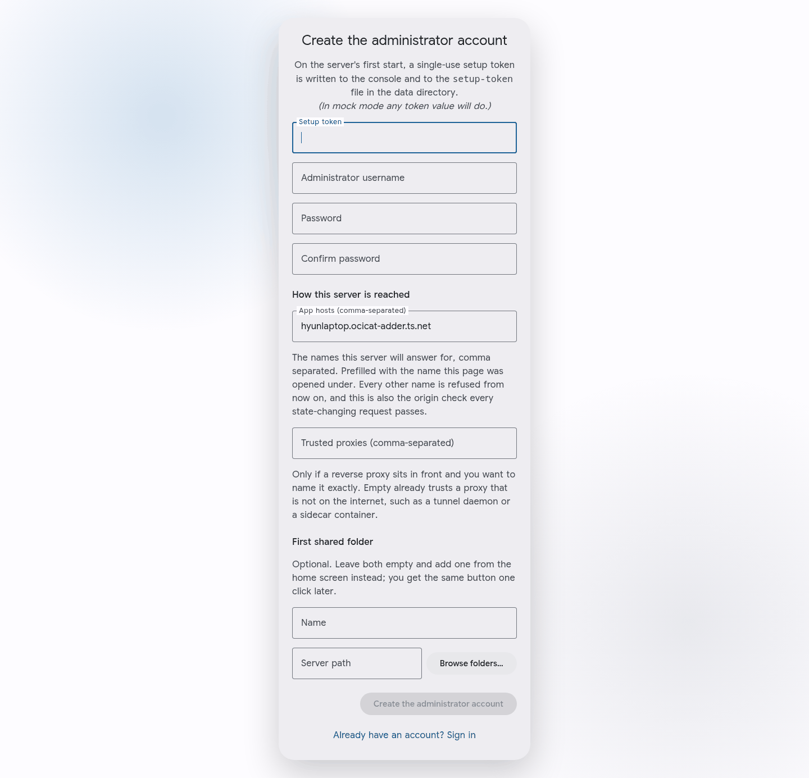
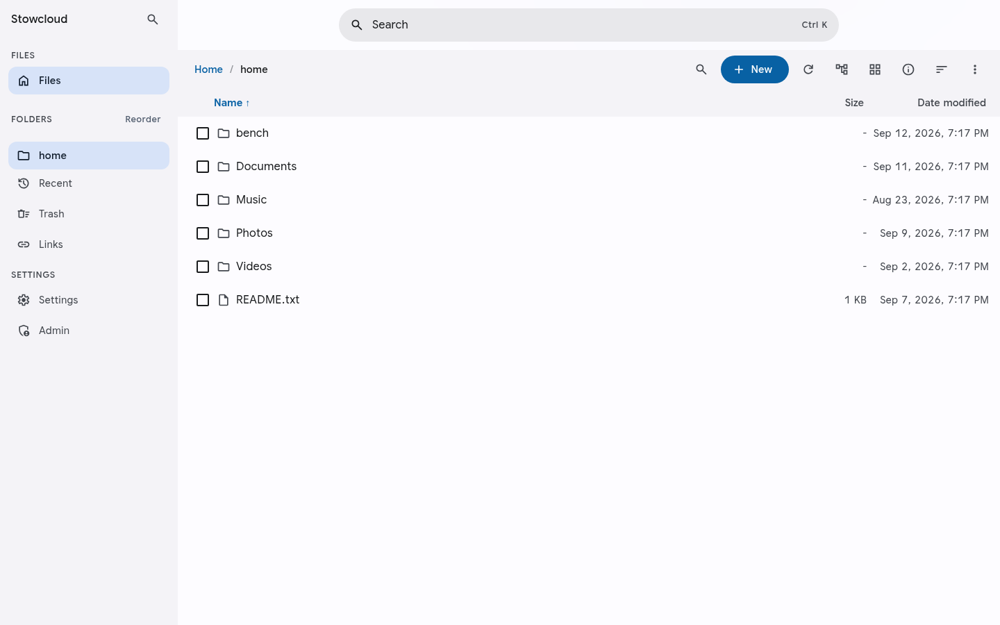
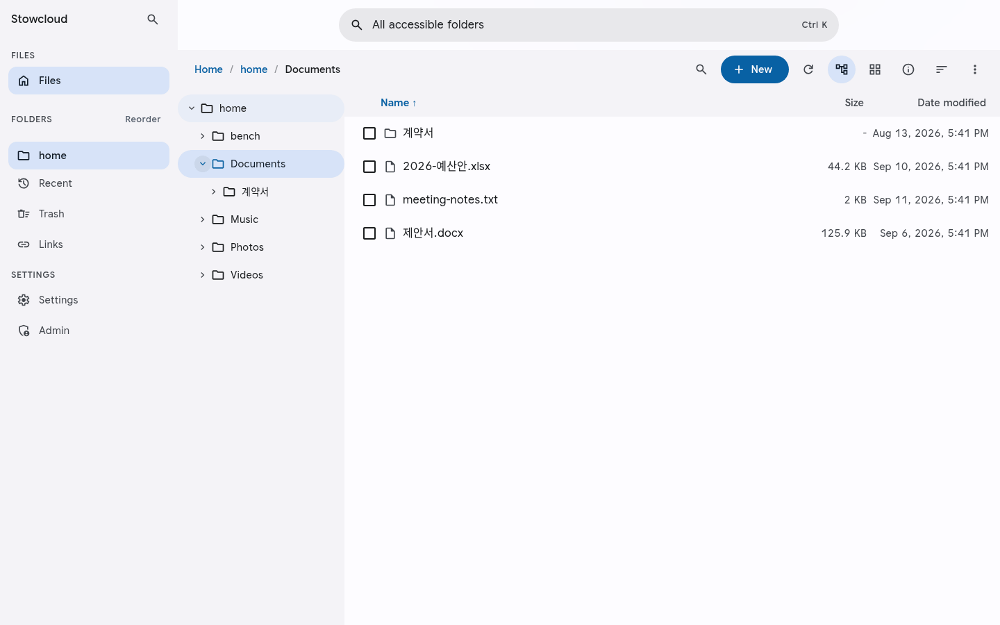
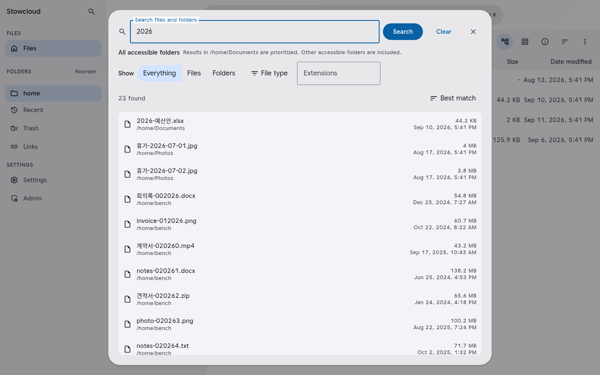
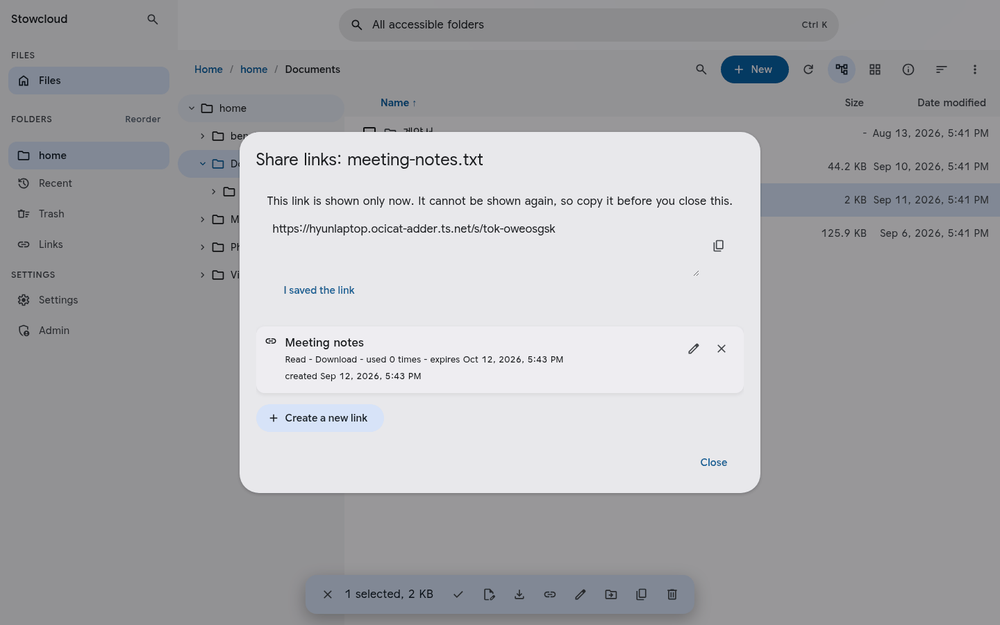
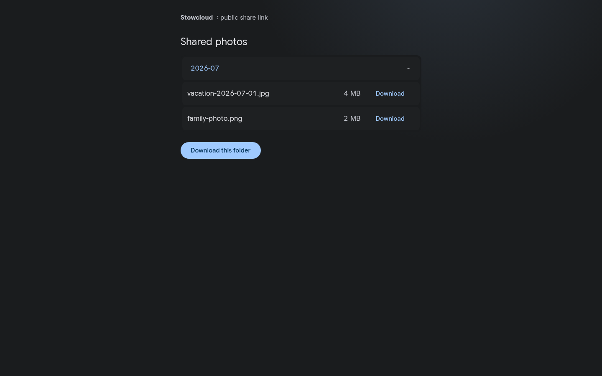
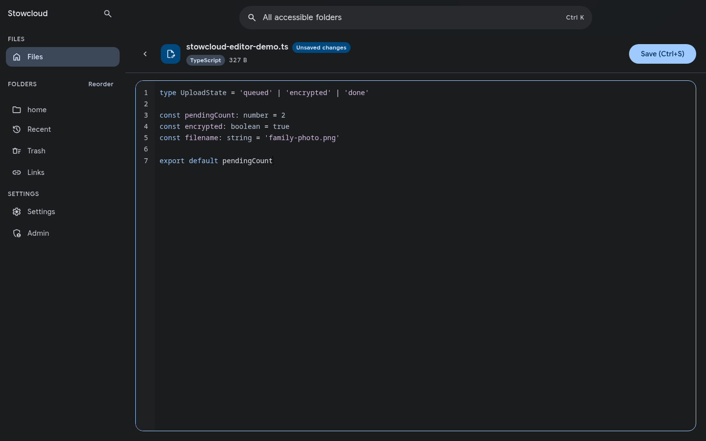
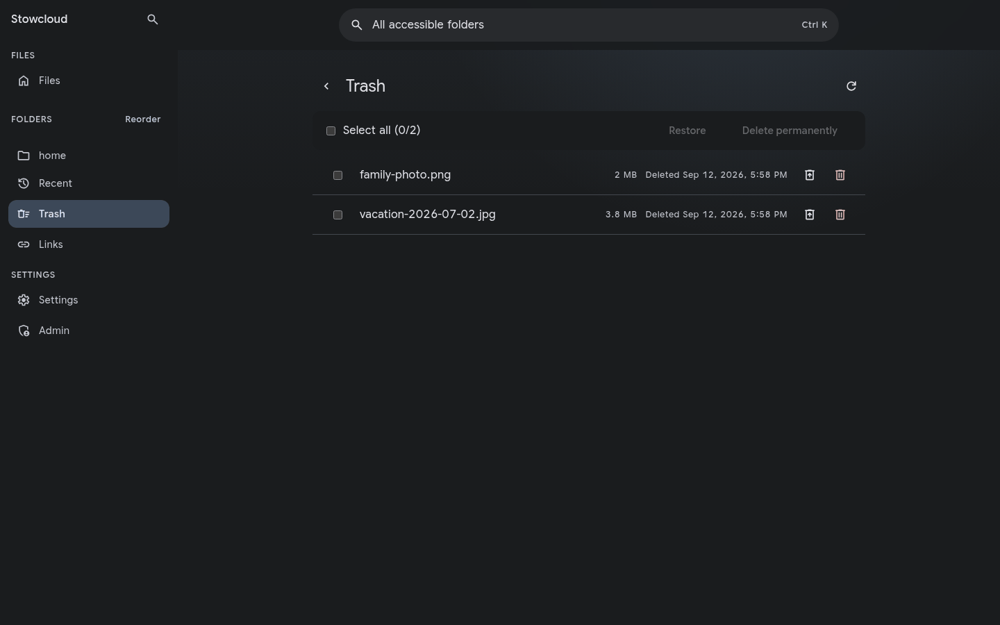

# Stowcloud

[](https://github.com/heavycaffeiner/stowcloud/actions/workflows/verify.yml)
[](https://github.com/heavycaffeiner/stowcloud/actions/workflows/docker.yml)

**English** | [한국어](README.ko.md)

## Installation

Stowcloud runs on Linux with Docker 20.10 or newer. The host needs Linux kernel 5.6 or newer.

### 1. Download the Compose file

```sh
wget https://raw.githubusercontent.com/heavycaffeiner/stowcloud/master/compose.yml
```

### 2. Choose where files are stored

The included Compose file starts with a Docker volume at `/shares/files`. You can keep that default and continue to the next step.

To use an existing host folder, replace the `sc-files` mount for both `sc` and `sc-smb`:

```yaml
volumes:
  - /srv/my-files:/shares/files:z
```

Create the host directory before starting the containers. Set `PUID` and `PGID` to the owner of that directory:

```sh
stat -c '%u:%g' /srv/my-files
```

```yaml
environment:
  PUID: 1000
  PGID: 1000
```

### 3. Start Stowcloud and create the administrator account

```sh
docker compose up -d
```

Stowcloud is now available at `https://<server-address>:8443`. The first connection shows a certificate warning because the server starts with a self-signed certificate.

Read the one-time setup token:

```sh
docker compose exec sc cat /var/lib/stowcloud/setup-token
```

Open `https://<server-address>:8443/setup`, enter the token, and choose an administrator username and password.



After signing in, add mounted folders from the administration screen. For access from the public internet, place Stowcloud behind a reverse proxy with a trusted certificate.

## Your folders, available everywhere

Stowcloud adds a web file manager, sharing, WebDAV, SMB, and sync-client access to folders already on your Linux server. It does not import files into a private storage layout. Existing applications can keep reading and writing the same paths.

Point Stowcloud at a photo library, project archive, family folder, or media collection. Browse it from a phone, mount it as a network drive, grant someone access to one subtree, or send a public link without making another copy.

<picture>
  <source media="(prefers-color-scheme: dark)" srcset="docs/screenshots/browse-dark-v0.15.1.png">
  
</picture>

## Features

- **File management:** Upload, download, move, copy, rename, and delete files from the browser.
- **Resumable uploads:** Continue large transfers after a dropped connection or closed tab.
- **Cross-folder search:** Search every folder available to your account and filter by item or file type.
- **Public links:** Share folders with optional passwords, expiration dates, download limits, or upload-only access.
- **Per-folder permissions:** Give each account access to an entire share or only one subtree, with separate read and write permissions.
- **Network drives:** Connect through WebDAV from Windows, macOS, or Linux. Enable SMB from the administration screen when needed.
- **Sync clients:** Use compatible desktop and mobile sync clients with your Stowcloud account.
- **Account security:** Use local accounts, OIDC sign-in, authenticator codes, app passwords, and recovery codes.
- **Browser editor:** Edit small text and source files with syntax highlighting.
- **Per-folder trash:** Enable recoverable deletion for the folders where you want it.
- **Responsive interface:** Use the same library from desktop and mobile browsers.

## Browse without changing your storage

Shares follow the directories already present on disk. The folder tree, file names, and hierarchy remain available to other software on the server.



## Search across every accessible folder

A single search covers all folders granted to the current account. Results can be narrowed to files, folders, common file groups, or specific extensions. On desktop, `Ctrl+K` or `Cmd+K` opens search from anywhere in the interface.



## Share with people who do not have an account

Create a public link for a folder and choose an expiration date, password, download limit, or upload-only mode. Copy the generated URL when it appears.



Recipients get a focused page for the shared folder. They do not need a Stowcloud account.



## Give each person the right folders

Accounts start without folder access. An administrator can grant a whole share or a selected subtree, then choose the allowed actions. Each account can arrange its own sidebar order.


## Edit text in the browser

Open small text and source files without downloading them first. The editor provides syntax highlighting, line numbers, unsaved-state feedback, and conflict handling when a file changes elsewhere.



## Recover deleted files

Trash can be enabled independently for each shared folder. Restore an item when it was removed by mistake, or purge it when it is no longer needed.


