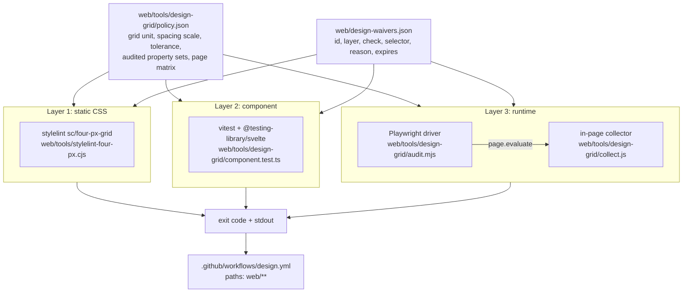

# Design Grid Audit Toolchain - Spec Proposal

| Item       | Detail                           |
|------------|----------------------------------|
| Author     | heavycaffeiner(Dong Hyun Kim)    |
| Created    | 2026-08-10                       |
| Status     | Implemented                      |
| Reviewers  |                                  |

---

## 1. Summary

A three-layer toolchain that verifies the web frontend obeys the 4 px grid: a widened
static CSS lint, a jsdom component check, and a runtime DOM audit that measures the real
rendered geometry in a headless browser. The runtime layer additionally checks that
sibling elements line up on their shared cross axis, that container padding is symmetric,
and that inter-sibling gaps come from a fixed spacing scale. All three run from a single
committed policy file, share one waiver file, and gate merges through a dedicated
`.github/workflows/design.yml` that fails hard on the first violation.

## 2. Background & Motivation

The repository already enforces one narrow slice of this. `web/.stylelintrc.cjs` enables
`sc/four-px-grid`, implemented in `web/tools/stylelint-four-px.cjs`, and `npm run build`
runs it via `lint:css` before Vite is invoked, so both `verify` CI jobs execute it today.
That rule rejects px literals that are not multiples of 4 in spacing, sizing, inset,
radius, border and outline properties.

What it does not and cannot cover:

- **It reads source text, not layout.** A stylesheet where every literal is a multiple of
  4 still produces a misaligned interface: percentage widths, `auto` margins, flex
  free-space distribution, intrinsic content sizing and sub-pixel rounding all land
  elements on fractional coordinates that no static reader can predict.
- **It has three wholesale escape hatches.** `collectPxViolations` returns `false` from
  the walker for `calc`, `min`, `max`, `clamp` and `var`, so nothing inside those
  functions is examined at all. `calc(100% - 13px)` and `var(--x, 13px)` pass silently.
- **Any multiple of 4 is accepted.** There is no spacing scale, so `20px`, `28px`, `36px`
  and `44px` are all legal gaps. The source currently contains seven `20px` literals,
  eight `40px`, three `88px` and three `96px`. A grid with no scale on top of it does not
  produce a coherent rhythm; it only produces values divisible by 4.
- **Typography is excluded by design.** The plugin's own comment states that `font-size`
  is intentionally out of scope because `line-height` is what affects layout. But
  `line-height` is not in `TARGET_PROP_RE` either, so neither is checked. A text block
  whose line box is 21 px tall breaks the grid for every element below it, and this is the
  single most common way a 4 px grid degrades in practice.
- **JS-computed geometry is invisible to it.** `marquee.ts`, `Menu.svelte`,
  `ProgressLinear.svelte` and the file list's row positioning write px values into the
  `style` attribute at runtime. Those values never appear in a stylesheet, so no CSS lint
  can see them.
- **Alignment is not a property of any single declaration.** Whether two siblings share a
  left edge, whether a container's left and right padding match, whether the gap between
  two rows is on the scale: none of these can be derived from one declaration in
  isolation. They are relations between rendered boxes.

The screenshots in `docs/screenshots/` cover eight distinct surfaces across two themes,
and the app renders at three navigation breakpoints (rail, drawer, mobile bar). Nothing
verifies any of them. The frontend also already carries a precedent for a machine-checked
frontend budget in CI: `web/tools/check-bundle-size.mjs`, wired into both `verify` jobs.
This proposal follows that pattern rather than inventing a new one.

## 3. Goals & Non-Goals

### 3.1 Goals

- [ ] Define the grid policy once, in a committed data file, and have every layer read it,
      so the static rule and the runtime audit can never disagree about what is legal.
- [ ] Widen `sc/four-px-grid`: descend into `calc`/`min`/`max`/`clamp` and into `var()`
      fallbacks; restrict spacing properties to the scale `{4, 8, 12, 16, 24, 32, 48, 64}`;
      detect asymmetric `padding`/`margin` shorthands; put `line-height` on the grid.
- [ ] Add a jsdom component layer that checks px geometry written into the `style`
      attribute, enforces approved spacing tokens, and pins each component's rendered
      shape across a matrix of prop combinations.
- [ ] Add a Playwright runtime audit that measures the real DOM and applies four checks:
      absolute grid snap, sibling cross-axis edge coherence, container padding symmetry,
      and inter-sibling spacing scale conformance.
- [ ] Run the runtime audit over every route, at three viewports, in both themes and both
      locales, including overlays (dialogs, menus, trays) that no route entry renders.
- [ ] Provide one explicit waiver file. Every waiver carries a reason and an expiry.
      A waiver with no reason, an expired waiver, or a waiver that matched nothing during
      a run all fail the build.
- [ ] Gate merges through `.github/workflows/design.yml`, failing hard on any violation.

### 3.2 Non-Goals

- [ ] **No screenshot capture, no image artifacts, no baseline image comparison.** The
      tools report to stdout and set an exit code. Nothing is uploaded.
- [ ] **No JSON artifact upload and no GitHub Step Summary table.** Same reason: console
      output plus exit code is the entire reporting surface, identical locally and in CI.
- [ ] **No PR review comments.** The workflow fails; the log says why.
- [ ] **No auto-fix.** The correct multiple of 4 is a design decision, not a mechanical
      derivation. This holds for the widened static rule exactly as it holds for the
      current one.
- [ ] **No colour, contrast, typography-scale or motion checking.** Geometry only.
- [ ] **No performance or Core Web Vitals measurement.** `check-bundle-size.mjs` already
      records why frame-timing gates are not run on shared runners; that reasoning is
      unchanged and this proposal does not revisit it.
- [ ] **No baseline snapshot of existing violations.** The policy is hard-fail from the
      first commit that lands it, so remediation is part of the implementation, not a
      backlog.
- [ ] **No changes to the shipping bundle.** The runtime audit drives the dev server with
      the existing mock backend. No mock switch, no audit hook and no instrumentation
      enters the production build.
- [ ] **No baseline-aligned containers in the cross-axis check.** Containers whose
      resolved `align-items` is a baseline value are excluded from that one check and
      counted as unchecked in the summary. Measuring a first-line baseline from script
      requires probe injection that changes the layout being measured.

## 4. Technical Design

### 4.1 Architecture Overview

Three checkers, one policy, one waiver file, one workflow.



New files:

| Path | Role |
|------|------|
| `web/tools/design-grid/policy.json` | The single source of truth. Data only, no code. |
| `web/tools/design-grid/policy.cjs` | CommonJS reader plus predicates, for the stylelint plugin. |
| `web/tools/design-grid/policy.mjs` | ESM reader plus predicates, for the audit driver and vitest. |
| `web/tools/design-grid/waivers.mjs` | Waiver load, schema validation, expiry check, usage tracking. |
| `web/tools/design-grid/waivers.cjs` | Same, for the stylelint plugin. |
| `web/tools/design-grid/collect.js` | Runs inside the page. Collects boxes and applies the four runtime checks. |
| `web/tools/design-grid/audit.mjs` | Playwright driver. Owns the page matrix, overlay scripts and reporting. |
| `web/tools/design-grid/scenarios.mjs` | Named scripts that open overlays not reachable by navigation alone. |
| `web/tools/design-grid/component.test.ts` | Layer 2. |
| `web/tools/design-grid/jsdom-shims.ts` | The one thing jsdom is missing that Layer 2 needs: `window.matchMedia`. |
| `web/tools/design-grid/vite.audit.config.ts` | The app's dev config with `server.proxy` removed, for the audit only. |
| `web/tools/design-grid/check.mjs` | The one entry point. Runs all three layers and owns the exit-code contract. |
| `web/tools/design-grid/policy.test.ts` | Unit tests for the shared predicates. |
| `web/tools/design-grid/waivers.test.ts` | Unit tests for every configuration-error path. |
| `web/design-waivers.json` | The waiver list. |
| `.github/workflows/design.yml` | The gate. |

Modified files:

| Path | Change |
|------|--------|
| `web/tools/stylelint-four-px.cjs` | Widened per §4.3.1. |
| `web/tools/stylelint-four-px.test.ts` | Cases for every new rejection and every new exemption. |
| `web/package.json` | `check:design` and `audit:grid` scripts, `playwright` devDependency. |
| `web/vite.config.ts` | `resolve.conditions: ['browser']` under `VITEST` only, so Layer 2 can mount a component. |

`scripts/verify.sh` and `.github/workflows/verify.yml` are deliberately untouched. The
static rule still runs inside `npm run build`, so `verify` keeps the coverage it has
today; the browser-dependent layers live in the new workflow so that a Playwright install
never enters the Rust gate.

### 4.2 Data Model Changes

No database change. Two new committed data files.

**`web/tools/design-grid/policy.json`**

```json
{
  "gridUnit": 4,
  "tolerancePx": 0.5,
  "spacingScale": [0, 4, 8, 12, 16, 24, 32, 48, 64],
  "hairlineExemptPx": [1, 2, 3],
  "pillRadiusPx": 9999,
  "spacingProperties": [
    "margin", "margin-top", "margin-right", "margin-bottom", "margin-left",
    "margin-block", "margin-block-start", "margin-block-end",
    "margin-inline", "margin-inline-start", "margin-inline-end",
    "padding", "padding-top", "padding-right", "padding-bottom", "padding-left",
    "padding-block", "padding-block-start", "padding-block-end",
    "padding-inline", "padding-inline-start", "padding-inline-end",
    "gap", "row-gap", "column-gap",
    "scroll-margin", "scroll-margin-top", "scroll-margin-right",
    "scroll-margin-bottom", "scroll-margin-left",
    "scroll-padding", "scroll-padding-top", "scroll-padding-right",
    "scroll-padding-bottom", "scroll-padding-left"
  ],
  "sizingProperties": [
    "width", "height", "min-width", "max-width", "min-height", "max-height",
    "inline-size", "block-size", "min-inline-size", "max-inline-size",
    "min-block-size", "max-block-size",
    "top", "right", "bottom", "left", "inset",
    "inset-block", "inset-block-start", "inset-block-end",
    "inset-inline", "inset-inline-start", "inset-inline-end"
  ],
  "hairlineProperties": [
    "border", "border-top", "border-right", "border-bottom", "border-left",
    "border-width", "border-top-width", "border-right-width",
    "border-bottom-width", "border-left-width", "outline-offset"
  ],
  "radiusProperties": [
    "border-radius", "border-top-left-radius", "border-top-right-radius",
    "border-bottom-left-radius", "border-bottom-right-radius"
  ],
  "typographyProperties": ["line-height"],
  "approvedSpacingTokens": ["--sc-row-height"],
  "runtime": {
    "viewports": [
      { "name": "mobile",  "width": 360,  "height": 800 },
      { "name": "tablet",  "width": 768,  "height": 1024 },
      { "name": "desktop", "width": 1440, "height": 900 }
    ],
    "themes": ["light", "dark"],
    "locales": ["en", "ko"],
    "skipTags": ["SCRIPT", "STYLE", "TEMPLATE", "HEAD", "META", "LINK", "TITLE", "BR", "svg"],
    "pages": [
      { "id": "login",         "path": "/login",              "minElements": 20 },
      { "id": "setup",         "path": "/setup",              "minElements": 20 },
      { "id": "browse",        "path": "/b/",                 "minElements": 60 },
      { "id": "browse-grid",   "path": "/b/",                 "minElements": 60, "scenario": "gridView" },
      { "id": "browse-detail", "path": "/b/",                 "minElements": 70, "scenario": "selectAndOpenDetails" },
      { "id": "edit",          "path": "/edit/notes.md",      "minElements": 30 },
      { "id": "trash",         "path": "/trash",              "minElements": 30 },
      { "id": "settings",      "path": "/settings",           "minElements": 40 },
      { "id": "settings-sec",  "path": "/settings/security",  "minElements": 40 },
      { "id": "admin",         "path": "/admin",              "minElements": 40 },
      { "id": "share",         "path": "/s/demo",             "minElements": 20 },
      { "id": "dialog-rename", "path": "/b/",  "minElements": 65, "scenario": "renameDialog" },
      { "id": "dialog-delete", "path": "/b/",  "minElements": 65, "scenario": "deleteDialog" },
      { "id": "dialog-share",  "path": "/b/",  "minElements": 70, "scenario": "shareManageDialog" },
      { "id": "dialog-newdir", "path": "/b/",  "minElements": 65, "scenario": "newFolderDialog" },
      { "id": "dialog-dest",   "path": "/b/",  "minElements": 70, "scenario": "destinationPicker" },
      { "id": "dialog-preview","path": "/b/",  "minElements": 65, "scenario": "previewDialog" },
      { "id": "menu-row",      "path": "/b/",  "minElements": 65, "scenario": "rowActionsMenu" },
      { "id": "tray-upload",   "path": "/b/",  "minElements": 65, "scenario": "uploadTray" },
      { "id": "tray-job",      "path": "/b/",  "minElements": 65, "scenario": "jobTray" },
      { "id": "snackbar",      "path": "/b/",  "minElements": 62, "scenario": "snackbar" }
    ]
  }
}
```

`minElements` is a floor, not a target. Its purpose is stated in §4.3.4: without it, a page
that failed to render passes with zero violations.

The full matrix is 21 pages x 3 viewports x 2 themes x 2 locales = 252 page audits.

**`web/design-waivers.json`**

```json
{
  "waivers": [
    {
      "id": "m3-checkbox-glyph-18px",
      "layer": "runtime",
      "check": "grid-snap",
      "selector": ".m3-checkbox svg",
      "subtree": true,
      "reason": "m3-svelte 7.2.0 draws its checkbox glyph at 18px inside a 48px target. We do not own the markup and the 48px hit area is on the grid.",
      "expires": "2027-02-10"
    }
  ]
}
```

Field semantics:

| Field | Type | Required | Meaning |
|-------|------|----------|---------|
| `id` | string | yes | Unique across the file. Duplicate ids are a configuration error. |
| `layer` | `"static"` \| `"component"` \| `"runtime"` | yes | Which checker owns this waiver and is responsible for marking it used. |
| `check` | string | yes | Check name. Must be one this layer emits; an unknown name is a configuration error. |
| `selector` | string | yes | For `runtime` and `component`: a CSS selector. For `static`: `<file>#<selector>#<property>`, matched literally. |
| `subtree` | boolean | no, default `false` | Runtime only. When true, descendants of a match are excluded too. |
| `reason` | string | yes | Minimum 30 characters after trimming. |
| `expires` | `YYYY-MM-DD` | yes | Compared against the run date. |

### 4.3 Core Logic

#### 4.3.1 Layer 1: the widened static rule

Four changes to `web/tools/stylelint-four-px.cjs`. The property classification comes from
`policy.json`, replacing the current single `TARGET_PROP_RE`.

**(a) Function descent.** `collectPxViolations` today returns `false` for
`calc|min|max|clamp|var`, which stops the walk. Replace with:

- `calc`, `min`, `max`, `clamp`: descend. Every px literal inside is checked against the
  same predicate the containing property would use. Unitless operands (multipliers,
  divisors) and non-px units (`%`, `rem`, `vh`, `fr`) are ignored, as are the operators.
  `calc(100% - 12px)` passes; `calc(100% - 13px)` is rejected.
- `var`: do not check the first argument (the custom-property name). Descend into the
  fallback arguments, if any. `var(--x)` is unchecked and stays unchecked; `var(--x, 13px)`
  is rejected.

Rationale: the current blanket skip is the only remaining loophole through which an
arbitrary px literal reaches a stylesheet, and `calc` is where a value is most likely to
be tuned by hand.

**(b) Property-class predicates.** One predicate per class, selected by property name:

| Class | Predicate |
|-------|-----------|
| spacing | `|v|` is a member of `spacingScale`. |
| sizing | `|v|` is a multiple of `gridUnit`, or `|v|` is in `hairlineExemptPx`. |
| hairline | `|v|` is in `hairlineExemptPx`, or `|v|` is a multiple of `gridUnit`. |
| radius | as hairline, plus `|v| === pillRadiusPx`. |
| typography | see (d). |
| anything else | not checked. |

Comparison is by magnitude, preserving the current rule's handling of negative offsets such
as an inward `outline-offset: -2px`.

The consequence is that spacing tightens from "any multiple of 4" to the eight-value scale.
Sizing does not, because breakpoint widths, panel widths and fixed element heights
legitimately take values off the spacing scale: the source already carries `360px`, `905px`,
`640px` and `56px`, and forcing those onto an eight-value scale would be a different and
much larger change to the design, not a grid check.

**(c) Shorthand symmetry.** After walking declarations, a second pass per rule block folds
`padding`, `padding-*`, `padding-block`, `padding-inline` (and the `margin` equivalents) in
source order into a resolved four-tuple `[top, right, bottom, left]`. Longhands override the
shorthand as CSS cascade order dictates. Then:

- If `left` and `right` are both px and unequal, report `asymmetric-padding` on the last
  declaration that set either side. This applies to both `padding` and `margin`.
- For `padding` only, the same for `top` and `bottom`.
- A side whose resolved value is not a px literal (`auto`, a percentage, a `var()`, a
  `calc()`) makes that axis unresolvable; skip that axis, do not report.

**Margin's block axis is deliberately not checked.** It was, in the first cut, and it
reported 38 violations of one shape and no defect: `margin: 0 0 8px` on a heading is how
flow spacing is written in CSS, and it means "space after me", not a box sitting too high.
Padding keeps both axes, and margin keeps the inline one, which is a block sitting off
centre and is a real defect.

The asymmetry that remains is frequently correct: a list row with a leading icon and a
trailing chevron does not want equal insets. Those cases are waived individually with a
reason, which is the point of the hard-fail plus waiver policy chosen for this toolchain.
Phase 2 budgets for that enumeration.

**(c2) Custom properties.** A declaration whose property starts with `--` has no property
class of its own, so it is held to the grid rather than to the spacing scale:
`--sc-nav-rail-width` is `96px` and legitimately off the scale. Without this the whole token
table was an unchecked hole, since every value it defines reaches a real property through
`var()`. Misuse of a token in a spacing slot is caught by the runtime layer, which sees the
used value.

**(d) Typography line height.** `line-height` joins the checked set.

- A px value is checked as a multiple of `gridUnit`. `line-height: 20px` is rejected.
- A unitless or percentage value is resolved only when a `font-size` with a px value exists
  in the same rule block. `computed = fontSizePx * factor` must be within `tolerancePx` of a
  multiple of `gridUnit`.
- A unitless value with no resolvable `font-size` in the same block is skipped silently.
  It is not reported as unverifiable: the resulting block height is measured by Layer 3's
  grid-snap check, which is where the real answer is.

#### 4.3.2 Layer 2: component checks in jsdom

jsdom does not compute layout: `getBoundingClientRect()` returns zeros and computed
lengths are the declared values, not used values. So this layer never measures geometry. It
covers the three things it genuinely can, all of which are invisible to both other layers.

The matrix is the leaf UI components that mount standalone: `Button`, `IconButton`, `Chip`,
`Checkbox`, `Switch`, `Divider`, `ProgressLinear`, `ProgressCircular`, `TextField`. The
composed screens (`FileTable`, `FileGrid`, every dialog) need app state to mount at all and
are covered by Layer 3, which renders them for real.

**Check A, inline geometry.** Walk the rendered DOM. For every element with a `style`
attribute, parse it and apply the §4.3.1(b) predicates to every px literal in a spacing,
sizing, hairline or radius property. A custom property in an inline style is a role remap
(`Button`'s danger palette, `ProgressLinear`'s tone), so it is held to the grid rather than
the scale, the same way §4.3.1(c2) holds one in a stylesheet.

This is the only check that sees values a script computed.

**Check B, token enforcement.** An inline geometry declaration that reads a `--sc-*` custom
property must name one listed in `approvedSpacingTokens`. Framework tokens (`--m3-*`,
`--m3c-*`) are the framework's to define and are not policed. A literal that conforms but
was computed from an unapproved source still passes; the check is on the emitted value, not
its provenance.

**Check C, prop-matrix regression.** Each component declares a table of prop combinations
covering the states a runtime audit cannot reach: long label, short label, icon present,
icon absent, disabled, loading, error, selected. Render each combination and serialize a
shape record per element: tag name, sorted class list, the state attributes (`disabled`,
`hidden`, `checked`, `aria-pressed`, `aria-expanded`, `aria-invalid` and friends) and the
geometry subset of the inline style. Compare against a committed snapshot. A diff fails and
must be updated deliberately.

The state attributes are in the record because without them the first cut produced
byte-identical shapes for `filled`, `disabled` and `loading`: a snapshot that cannot tell
two states apart cannot detect a regression in either. Svelte's per-component scope class
is filtered out for the opposite reason: it rehashes on every CSS edit, which would churn
the snapshot on changes that moved nothing.

This is a change detector, not a correctness proof. It exists so a component cannot silently
acquire an off-grid inline style in a state the browser matrix never renders.

Layer 2 runs under the existing vitest setup and adds no runner. It needs two small pieces
of plumbing, both of which exist because the app itself has never mounted a component in a
test before: `resolve.conditions: ['browser']` in `vite.config.ts`, guarded on `VITEST`,
because svelte's package exports otherwise resolve to its server build and `mount()` throws;
and a `window.matchMedia` stub, because `svelte/motion` evaluates a `prefers-reduced-motion`
query at module scope and jsdom ships no `matchMedia`, which fails the import before a single
component renders.

#### 4.3.3 Layer 3: the runtime audit

**Serving the page.** The driver starts `vite dev` (mode `development`, so
`web/.env.development` applies and `VITE_API_MOCK=1` selects the in-memory backend from
`src/lib/api/mock.ts`), waits for the port, then drives it. The dev server, not the
production build, because `.env.development` is explicitly never applied by `npm run build`,
and adding a mock switch to the shipping bundle to satisfy an audit would be a worse trade
than auditing the dev server. Vite serves the same CSS through the same `functionsMixins`
plugin in both modes, so the geometry under test is the geometry that ships.

The driver sets theme and locale by seeding `localStorage` in an init script, which is
where `state/ui.svelte.ts` and `i18n/state.svelte.ts` already read them from, then waits
for `document.fonts.ready` and two `requestAnimationFrame`s before measuring.

That init script also calls `localStorage.clear()` on **every** navigation, not just the
first. The app persists view mode, density, drawer and details state under `sc.*` keys, so
without it the grid toggle one scenario flips stays flipped for every page audited after
it, and the matrix stops describing itself.

**Two problems the dev server creates, and their answers.**

*Dependency pre-bundling.* Vite optimizes dependencies lazily. The first visit to a route
pulling in a module it has not seen restarts optimization, and every request in flight
returns `504 Outdated Optimize Dep`. That is a dev-server artifact, indistinguishable at
the console from a page fault. The driver therefore makes a warm-up pass over every
distinct path first, serially and before any shard starts, discarding the results. That
keeps the `console.error` guard strict instead of having to soften it.

*Orphaned servers.* A vite dev server does not die with its parent, and on Windows a
parent killed by a CI step timeout gets no signal to pass on. The driver writes the child's
pid to `node_modules/.cache/design-grid-vite.pid` and kills whatever that file names at the
next start. Interrupted runs then leak at most one server in total rather than one each,
which is what exhausted the port range during development.

*The mock's download links.* `mock.ts`'s `link()` returns a real same-origin
`/mock-download/<name>` URL so a component can follow it, but nothing serves those bytes.
The preview dialog's `` therefore 404s and logs a console error, which the guard reads
as a page fault. The driver fulfils that route with a 1x1 PNG.

*The dev proxy.* `vite.config.ts` proxies `^/api`, `^/dav`, `^/c/`, `^/s/`, `^/ocs`,
`^/remote.php`, `^/index.php` and `^/status.php` to a separately-running `sc-server`, so
`vite dev` can be pointed at a real backend. Under the mock every one of those is answered
in the browser and the proxy is dead weight, and `^/s/` actively breaks the audit: a
document request for a share link is proxied away and the SPA never renders it. The driver
therefore starts vite with `--config tools/design-grid/vite.audit.config.ts`, which spreads
the app's own config and sets `server.proxy` to `undefined`. Nothing else differs, so the
plugins, the CSS pipeline and the mode are the ones `npm run dev` uses.

**Normalizing scroll.** Before collection, every scrollable element in the document has
`scrollTop` and `scrollLeft` set to 0. `getBoundingClientRect()` is viewport-relative, so
with the page unscrolled the returned coordinates are absolute page coordinates and the
grid-snap check is meaningful. Without this step a scrolled list would report every row as
off-grid by the scroll remainder.

**Collecting the box set.** Starting from `document.body`, walk every element. Exclude:

1. Any tag in `policy.runtime.skipTags`, and every descendant of an `<svg>`: SVG interiors
   are drawing coordinates in a user coordinate system, not layout boxes.
2. Computed `display: none`, computed `visibility: hidden`, or a zero-area rect.
3. Computed `display: inline` (but not `inline-block`, `inline-flex` or `inline-grid`). An
   inline box's width is the sum of glyph advances and will essentially never be a multiple
   of 4. Its containing block's height is governed by `line-height`, which Layer 1 checks
   and whose result Layer 3 sees as the parent's height.
4. A rect entirely outside the viewport rectangle: it was not laid out for this pass.

Each surviving element yields a record: a stable path selector, the border-box rect, the
computed `display`, `position`, `flex-direction`, `grid-auto-flow`, `align-items`,
`justify-content`, the four resolved paddings and the four border widths.

Waivers are **not** applied by dropping elements from this set. Each `runtime` waiver's
selector is matched inside the page, and the elements it matches (plus their descendants
when `subtree` is true) carry a per-check exemption. A violation is dropped only when its
own check is the one the waiver names, or the waiver names `*`. Excluding whole elements at
collection time would have made the waiver's `check` field decorative: a waiver written to
excuse one framework component's size would also have silenced every alignment defect
around it.

**Check 1, grid snap.** Two narrowings, both about whose decision the number is. The
unnarrowed version - every one of `left`, `top`, `width`, `height` on every element - was
built first and reported 288 violations on the login screen alone, none of them actionable.

*Size* is checked only for a box with no text anywhere beneath it
(`el.textContent.trim() === ''`). Any box containing text is glyph-driven somewhere along
its size derivation: a `<button>` is as wide as its label, a card as tall as the line boxes
in it. Holding those to the grid measures the font, not the stylesheet. What remains is
pure structure - icon wells, dividers, thumbnails, progress bars, spacers, checkboxes - and
those a stylesheet does size. What a line box does to a text-bearing element's height is
covered instead by Layer 1, which holds `line-height` to the grid.

*Position* is checked only where it was authored, meaning computed `position` is `absolute`
or `fixed`, and then as the offset from the containing block rather than as an absolute page
coordinate. A centred layout puts its subtree on `(container - content) / 2`, fractional
whenever the content is, and every descendant inherits that fraction; nothing about it is a
defect. The inset from the containing block (`offsetParent`, or the viewport for a fixed
box) is the number a stylesheet actually wrote.

Where a box sits relative to its neighbours is covered by checks 2 to 4, all of which read
relative distances and are therefore immune to a fractional origin. Nothing is lost by
dropping the absolute frame.

The predicate itself is unchanged: `|v - gridUnit * round(v / gridUnit)| <= tolerancePx`.

**Check 2, sibling cross-axis edge coherence.** For every element with two or more
collected children that are in normal flow (computed `position` is `static`, `relative` or
`sticky`; `absolute` and `fixed` children have no flow relationship to their siblings and
are skipped by checks 2 through 4):

1. Determine the main axis. `display: flex` or `inline-flex`: horizontal when
   `flex-direction` is `row` or `row-reverse`, vertical otherwise. `display: grid` or
   `inline-grid`: horizontal. Anything else: vertical.
2. The cross axis is the other one.
3. **Split the children into the lines they visually occupy**, by overlap on the cross axis:
   sorted by cross-axis start, a child joins the current line while its start falls before
   the line's running end, and starts a new one otherwise. A non-wrapping stack yields
   exactly one line, which is what lets the same code serve a column, a row, a wrapped flex
   container and a grid. Without it, a grid's second row would be compared against its first
   and every gap would come out as the row height.
4. Skip the container if its resolved `align-items` is a baseline value, and count it in the
   run's `unchecked` tally.
5. Within each line, on the cross axis, compute for each child the start edge, the end edge
   and the centre. The line passes when at least one of those three agrees across every
   child within `tolerancePx`. A child that stretches, meaning its start equals the line's
   minimum start and its end equals its maximum end, is treated as agreeing on all three.
6. On failure, report the container, the axis, and the child whose deviation from the
   best-scoring edge is largest.

Treating a grid as horizontal is the only reading under which "the gap between these two"
means anything: a grid is two-dimensional, and step 3 turns its rows back into the
one-dimensional groups the rest of the check is written against.

This is what a person means by "the edges do not line up". It catches a button that sits
2 px lower than the text beside it, which no absolute grid check can see, because both boxes
can be individually on the grid and still be on different grid lines.

**Check 3, container padding symmetry and optical balance.** For every collected element:

1. If `padding-left` and `padding-right` differ, or `padding-top` and `padding-bottom`
   differ, report `padding-asymmetry`. These are used values from `getComputedStyle`, so
   the comparison is exact and `tolerancePx` does not apply.
2. If the element has two or more in-flow collected children and its resolved
   `justify-content` is `flex-start`, `start` or `normal`, compute the leading gap (the
   container's content-box start edge to the first child's start edge on the main axis) and
   the trailing gap (the last child's end edge to the content-box end edge). They must
   agree within `tolerancePx`. Other `justify-content` values distribute free space by
   definition and are skipped for this half of the check.

Part 2 is what catches a stray `margin-top` on a first child, the classic reason a padded
container looks bottom-heavy while every declared padding value is correct.

**Check 4, spacing scale.** Within each line from check 2's step 3, where the container's
resolved `justify-content` is not one of `space-between`, `space-around` or `space-evenly`
(those compute gaps from free space rather than from an authored value): sort that line's
children along the main axis and, for each consecutive pair, compute
`gap = next.start - prev.end`.

- `gap < -tolerancePx` is an overlap. Always a failure, never scale-checked.
- Otherwise `gap` must be within `tolerancePx` of a member of `spacingScale`. `0` is in the
  scale, so genuinely adjacent siblings pass.

**Check 5, box centring.** Checks 2 to 4 all begin `if (kids.length < 2) continue`, so
nothing ever asked whether a lone child sits centred in the box it was given. Two of this
app's visible defects were in that gap: a 20px icon pinned to the top-left of the 32px slot
built for it, and a 32px switch pinned to the top of the 40px cell a stretching flex row
gave its wrapper. Only boxes strictly smaller than their parent's content box on both axes
are asked, and only those with no text of their own: anything that fills its parent on
either axis is doing what it was told, and a line box is not a control.

**Check 6, control centring.** A row's own children can agree with each other and still
stagger, because a control nested one level deeper is nobody's sibling. Every
`button`, `input`, `select`, `textarea` and `label` whose nearest flex-row ancestor is this
container must share the container's cross-axis centre. Two exemptions, both about intent:
a container whose resolved `align-items` is an explicit start, end or baseline value has
answered the question already, and a container more than three times the height of the
control is a layout column rather than a row.

**Check 7, crowding.** `spacing-scale` accepts `0`, because two boxes really are meant to
touch in a bordered list or a segmented control, so it says nothing about a caption printed
hard against the control it describes. This reports two vertically stacked, text-bearing
block-flow siblings with nothing between them: no border, no background of their own,
neither one interactive. The distance measured is between the **text** in each, found with
a `Range`, not between their boxes. A box with padding still begins at its edge, which is
why the first version reported a 56px drawer header with one centred line in it and a grid
section whose label carries its own inset.

**Check 8, column coherence across repeated rows.** The one a person points at first. In a
list of repeated rows, the same control has to sit in the same column on every row; when
one row drops an optional badge or gains an extra action, everything after it slides and
the eye reads a zigzag down the right-hand side. Checks 2 to 4 are blind to it and provably
so: they compare siblings inside one container, and the elements that disagree here are in
different rows. Every row is internally correct, its own gaps on the scale and its own
children sharing an edge, and the rows only disagree with each other.

The container has to say it holds a list before its children are treated as repetitions of
one template: a `ul`, `ol`, `tbody` or `table`, a `list`, `grid`, `table`, `rowgroup`,
`listbox`, `menu` or `tree` role, or children that are `li` or carry a `row`, `listitem`,
`option`, `menuitem`, `treeitem` or `gridcell` role.

Shape alone was tried first and is not enough. The settings page's theme and language
sections are both an `h2`, a row of buttons and a hint, so they matched each other, and the
second button of the theme picker was then measured against the second button of the
language picker. Those two agree only by coincidence, and the coincidence is
platform-dependent: on the development machine's fonts they landed within half a pixel of
each other, so twelve clean local runs said nothing, and the first CI run on Linux failed.
A check that answers differently on two platforms is a check that was defined wrong, not a
flaky one.

Rows are then matched by tag, class signature and the sequence of their direct children's
signatures. Elements inside a row are matched by depth, parent class signature, tag and
class signature, and paired by ordinal within the row. A signature seen in two or more rows
must occupy one column: either every instance shares a start edge or every instance shares
an end edge. Sharing the start alone is enough, which is what lets a name cell be as wide
as its text.

Three exemptions: an element whose preceding sibling's width varies across rows is
positioned by that sibling rather than by a column (the audit log's result badge follows
the event name and is meant to); an inline-level element sits where text flow put it; and a
signature whose ancestor already reported is skipped, since one shifted control drags its
whole subtree with it.

**Waiver bookkeeping.** Each waiver carries a used flag for the run. A `runtime` waiver is
marked used when its selector matches at least one element on any page in the matrix, not
per page: an overlay waiver would otherwise look dead on the twenty pages that do not open
that overlay. After the whole matrix completes, any waiver still unused is reported as
dead and fails the run. A run narrowed by `--only` does not make that call at all: it
cannot tell a dead waiver from one whose page it skipped.

#### 4.3.4 Vacuous-pass protection

A page that throws during hydration renders an empty body. An empty body has no collected
elements, therefore no violations, therefore a clean pass. Three guards, all of which fail
the run:

1. After collection, the element count for a page audit must be at least that page's
   `minElements`.
2. Any `pageerror` (uncaught exception) during a page audit.
3. Any `console.error` emitted by the page during a page audit.

Guards 2 and 3 exit with the harness code, not the violation code, because a page that
crashed has told us nothing about its geometry.

#### 4.3.5 Reporting

Console and exit code only. One line per violation on stdout:

```
runtime  browse desktop dark ko  spacing-scale
  main > .sc-toolbar > button:nth-child(3)
  gap 20px to previous sibling is not on the scale [0,4,8,12,16,24,32,48,64]
```

A trailing summary counts violations by check and by layer, plus the unchecked tally from
baseline-aligned containers. The process exits per §5-2. The output is byte-identical
locally and in CI, because there is no CI-only reporting path.

## 5. API Design

### 5-1. New / Modified

All layers are internal Node tooling. No REST surface changes. Signatures below are the
contracts each module exposes.

**`web/tools/design-grid/policy.mjs` (and the `.cjs` twin, identical shape)**

```js
/**
 * Loads policy.json once and returns it frozen. Both wrappers read the same
 * JSON file so the CommonJS stylelint plugin and the ESM driver can never
 * diverge on what the policy says.
 * @returns {Readonly<Policy>}
 */
export function loadPolicy()

/**
 * Property class used to select a predicate. Returns null for properties the
 * toolchain does not check.
 * @param {string} prop - lowercased CSS property name
 * @returns {"spacing"|"sizing"|"hairline"|"radius"|"typography"|null}
 */
export function classifyProperty(prop)

/**
 * True when `px` is acceptable for the given class. Sign is ignored: a
 * negative offset follows the same rules as its positive counterpart.
 * @param {number} px
 * @param {"spacing"|"sizing"|"hairline"|"radius"} cls
 * @returns {boolean}
 */
export function isAllowed(px, cls)

/**
 * True when `v` lands on the grid within the policy tolerance.
 * @param {number} v
 * @returns {boolean}
 */
export function onGrid(v)
```

```
isAllowed(px, cls):
    a = abs(px)
    switch cls:
        spacing:  return spacingScale contains a
        sizing:   return hairlineExemptPx contains a  or  a mod gridUnit == 0
        hairline: return hairlineExemptPx contains a  or  a mod gridUnit == 0
        radius:   return a == pillRadiusPx
                      or hairlineExemptPx contains a
                      or a mod gridUnit == 0

onGrid(v):
    return abs(v - gridUnit * round(v / gridUnit)) <= tolerancePx
```

**`web/tools/design-grid/waivers.mjs` (and the `.cjs` twin)**

```js
/**
 * Reads and validates web/design-waivers.json. Throws WaiverConfigError on a
 * duplicate id, a missing or too-short reason, an unparseable or past expiry,
 * an unknown layer, or a check name the named layer does not emit.
 * @param {string} today - YYYY-MM-DD, injected so the check is testable
 * @returns {WaiverSet}
 */
export function loadWaivers(today)

/**
 * Marks a waiver used and returns true when the violation is covered.
 * Mutates the set's usage bookkeeping; call it for every violation before
 * deciding whether to report it.
 * @param {WaiverSet} set
 * @param {Violation} violation
 * @returns {boolean}
 */
export function isWaived(set, violation)

/**
 * Waivers never matched during the run, scoped to the layers that actually
 * executed. Calling this with a partial layer list would report a waiver as
 * dead only because its layer did not run, so the caller passes the layers it
 * ran and the CI job runs all three.
 * @param {WaiverSet} set
 * @param {Array<"static"|"component"|"runtime">} ranLayers
 * @returns {Array<Waiver>}
 */
export function deadWaivers(set, ranLayers)
```

**`web/tools/design-grid/collect.js`**

Serialized into the page by the driver. It must not reference anything outside its own
source, because it executes in the browser realm.

```js
/**
 * Collects every laid-out box under document.body and applies the four
 * runtime checks. Scroll positions must already be normalized by the caller.
 * @param {Policy} policy - structured-cloned from Node
 * @param {Array<{selector: string, subtree: boolean}>} excluded - resolved runtime waivers
 * @returns {{ elements: number, unchecked: number, violations: Array<Violation> }}
 */
function auditDocument(policy, excluded)
```

```
auditDocument(policy, excluded):
    boxes = []
    for each element E under document.body in tree order:
        if E.tagName in policy.runtime.skipTags: continue subtree
        if E is inside an <svg>: continue
        if E matches an excluded selector:
            if that exclusion is subtree: continue subtree
            else: continue this element only
        cs = getComputedStyle(E)
        if cs.display == "none" or cs.visibility == "hidden": continue subtree
        if cs.display == "inline": continue this element only
        r = E.getBoundingClientRect()
        if r.width == 0 or r.height == 0: continue this element only
        if r does not intersect the viewport: continue this element only
        boxes.push(record(E, r, cs))

    violations = []
    unchecked  = 0

    // Check 1
    for b in boxes:
        for v in [b.left, b.top, b.width, b.height]:
            if not onGrid(v): violations.push(gridSnap(b, v))

    // Checks 2 to 4
    for parent in boxes:
        kids = in-flow collected children of parent   // position static|relative|sticky
        if kids.length < 2: goto padding-only
        main  = mainAxisOf(parent)                     // flex-direction | grid-auto-flow | vertical
        cross = otherAxis(main)

        // Check 2
        if parent.alignItems is a baseline value:
            unchecked += 1
        else:
            starts  = kids.map(k => k.start(cross))
            ends    = kids.map(k => k.end(cross))
            centres = kids.map(k => k.centre(cross))
            stretched = kids.filter(k => k.start(cross) == min(starts)
                                      and k.end(cross) == max(ends))
            agrees = (edges) => every non-stretched kid is within tolerancePx of edges[0]
            if not (agrees(starts) or agrees(ends) or agrees(centres)):
                violations.push(siblingEdges(parent, cross, worstDeviatingKid))

        // Check 3, part 2
        if parent.justifyContent in ["flex-start", "start", "normal"]:
            lead  = first(kids, main).start(main) - parent.contentStart(main)
            trail = parent.contentEnd(main) - last(kids, main).end(main)
            if abs(lead - trail) > tolerancePx:
                violations.push(opticalImbalance(parent, main, lead, trail))

        // Check 4
        if parent.justifyContent not in ["space-between","space-around","space-evenly"]:
            for (prev, next) in consecutive pairs of kids sorted along main:
                gap = next.start(main) - prev.end(main)
                if gap < -tolerancePx:
                    violations.push(overlap(prev, next, gap))
                else if no s in policy.spacingScale with abs(gap - s) <= tolerancePx:
                    violations.push(spacingScale(prev, next, gap))

        padding-only:
        // Check 3, part 1
        if parent.paddingLeft != parent.paddingRight:
            violations.push(paddingAsymmetry(parent, "inline"))
        if parent.paddingTop != parent.paddingBottom:
            violations.push(paddingAsymmetry(parent, "block"))

    return { elements: boxes.length, unchecked, violations }
```

**`web/tools/design-grid/audit.mjs`**

```js
/**
 * Runs the whole matrix and returns the process exit code. Starts vite dev,
 * launches chromium, audits pages x viewports x themes x locales in parallel
 * shards, applies waivers, prints violations, then checks for dead waivers.
 * @param {{only?: string, headed?: boolean, workers?: number, shards?: number}} opts
 *   `only` filters by page id; `shards` splits each theme/locale cell that many
 *   ways; `workers` caps how many shards run at once.
 * @returns {Promise<0|1|2|3>}
 */
export async function runAudit(opts)
```

**Parallelism.** The unit is a browser context, not a page. Theme and locale are seeded
into `localStorage`, and pages inside one context share that origin's storage, so two pages
clearing and re-seeding it would race and each would occasionally render in the other's
theme. Each `(theme, locale)` cell is therefore split into `shards` contexts, and `workers`
of them run at once; the default is 2 shards per cell, 8 contexts, 6 concurrent. Shared
state is folded after all shards finish rather than inside them, and the violation list is
sorted before reporting, so the output does not depend on which shard finished first.

Measured on the development machine: 264 audits in about 2 minutes, against about 13
minutes for the same matrix run serially.

**Every wait is bounded.** An audit that hangs is worse than one that fails: it holds a
browser, a dev server and a CI runner, and reports nothing about the thing it was
measuring. The caps are collected in one `TIMEOUT` table: 90s per page audit, 30s for the
in-page collector, 15s for any locator wait inside a scenario (via `page.setDefaultTimeout`),
5s for `settle`, 15s for each close, and 20 minutes for the whole run, which is under the
CI job's 30.

Three of those exist because the unbounded version actually hung during development.
`requestAnimationFrame` never fires in a page the browser considers hidden, so `settle` is
capped inside the page as well as outside it. `page.evaluate` has no default timeout in
Playwright, so the collector call carries its own. And `killTree` waited on a child `exit`
event that never arrives if `taskkill` fails, which stalled every run after the last audit
had already completed.

**Progress goes to stderr, one line per audit**, so a slow run and a stuck one are
distinguishable from outside. The violation report stays on stdout and is printed before
teardown, so a slow shutdown can delay the process exiting but cannot withhold the answer.

**`web/tools/design-grid/check.mjs`**

```js
/**
 * Runs all three layers and returns the process exit code per §5-2.
 * Static runs in-process through stylelint's Node API, component as a vitest
 * child process, runtime through runAudit. The worst code wins, and the
 * ordering says why: a harness failure hides whatever a violation count would
 * have been, and a broken policy file hides both.
 * @returns {Promise<0|1|2|3>}
 */
export async function checkDesign()
```

An orchestrator rather than a chain of npm scripts, for two reasons. First, stylelint's own
CLI exit codes are its own (2 means lint problems found, 78 means a config error), so
shelling out to it would have made the contract in §5-2 a lie at the first failure. Second,
each layer's dead-waiver sweep has to run inside the process that did the matching:
`deadWaivers(set, ['static'])` next to the stylelint call, the component sweep as an
assertion inside the vitest file, the runtime sweep inside the audit. That removes any need
for cross-process waiver reporting.

**`web/package.json` scripts**

```json
{
  "check:design": "node tools/design-grid/check.mjs",
  "audit:grid": "node tools/design-grid/audit.mjs"
}
```

`lint:css` keeps its current name and stays in `build`, so `verify` is unaffected: the
static layer runs there exactly as it does today, waivers included, because the plugin
applies them itself.

**`.github/workflows/design.yml`**

```yaml
name: design

on:
  push:
    branches: [main, master]
    paths: ['web/**', '.github/workflows/design.yml']
  pull_request:
    paths: ['web/**', '.github/workflows/design.yml']
  workflow_dispatch:

permissions:
  contents: read

concurrency:
  group: design-${{ github.ref }}
  cancel-in-progress: true

jobs:
  grid:
    runs-on: ubuntu-latest
    timeout-minutes: 30
    steps:
      - uses: actions/checkout@v7
      - uses: actions/setup-node@v7
        with:
          node-version: '24'
          cache: npm
          cache-dependency-path: web/package-lock.json
      - run: npm ci
        working-directory: web
      - uses: actions/cache@v4
        with:
          path: ~/.cache/ms-playwright
          key: playwright-${{ runner.os }}-${{ hashFiles('web/package-lock.json') }}
      - run: npx playwright install --with-deps chromium
        working-directory: web
      - run: npm run check:design
        working-directory: web
```

One Linux job. The audit measures a browser's layout engine, and Chromium's layout on
Windows and on Linux differ only in font metrics. Fonts come from
`@fontsource-variable/google-sans-flex`, an npm dependency, so they are identical on both;
the system fallback in `--m3-font` is not, which is why the audit is pinned to one platform
rather than run on two and reconciled.

That difference is worth stating precisely, because the first CI run turned on it. Every
check here is supposed to be answerable from the layout alone, so a check that gives one
answer on Windows and another on Linux is not flaky: it is defined wrong, and it has found
a coincidence rather than a rule. Pinning the platform makes the gate reproducible; it does
not make a platform-dependent check correct, and when one appears the check is what gets
fixed. The column check's first version failed exactly this way, passing twelve local runs
and failing the first Linux one.

### 5-2. Error Handling

Not a REST surface. These are process exit codes, shared by all three entry points so that
`check:design` propagates a meaningful code regardless of which layer failed.

| Exit code | Condition |
|-----------|-----------|
| 0 | No violations. Every waiver was used and none had expired. |
| 1 | One or more design violations survived waiver matching. |
| 2 | Waiver or policy configuration error: malformed JSON, duplicate `id`, missing or under-length `reason`, unparseable or past `expires`, unknown `layer`, unknown `check`, or a waiver that matched nothing during the run. |
| 3 | Harness failure: `vite dev` did not start, the Chromium launch failed, navigation timed out, a page emitted `pageerror` or `console.error`, or a page collected fewer elements than its `minElements`. |

Exit codes 2 and 3 are separated from 1 on purpose. A 1 says the interface is off the grid
and a designer or developer must change a value. A 2 says the policy files are wrong. A 3
says the audit learned nothing and its silence must not be read as a pass.

Per-violation records carry: `layer`, `check`, `page`, `viewport`, `theme`, `locale`,
`selector`, `actual`, `expected`. The `check` values are:

| Layer | Check names |
|-------|-------------|
| static | `grid`, `spacing-scale`, `asymmetric-padding`, `line-height-grid` |
| component | `inline-geometry`, `unapproved-token`, `shape-snapshot` |
| runtime | `grid-snap`, `sibling-edges`, `padding-asymmetry`, `optical-imbalance`, `spacing-scale`, `overlap` |

A waiver naming a `check` outside its `layer`'s row is exit code 2, which is what stops a
waiver from silently covering nothing.

## 6. Implementation Plan

The phase numbers in this section are local to the design-audit rollout and
are complete. They are unrelated to the Go backend phases in `docs/phases/`.

### 6-1. Milestones

Durations are relative effort, not calendar dates. The Depends column is the only ordering
constraint; anything not listed there can proceed in parallel.

| Phase   | Task | Estimated Duration | Depends on | Owner |
|---------|------|--------------------|------------|-------|
| Phase 1 | Policy and waiver infrastructure: `policy.json`, the `.mjs`/`.cjs` reader pairs, `waivers.*` with schema validation, expiry and usage tracking, and unit tests for every rejection path in §5-2 exit code 2. | 1 unit | none | heavycaffeiner |
| Phase 2 | Widen `stylelint-four-px.cjs` per §4.3.1 (a) through (d). Extend `stylelint-four-px.test.ts` to cover each new rejection and each retained exemption. Then fix or waive everything the widened rule newly flags across `web/src`. | 2 units | Phase 1 | heavycaffeiner |
| Phase 3 | Runtime harness: `collect.js` with the four checks, `audit.mjs` driving `vite dev` and Chromium over the matrix, `scenarios.mjs` for the ten overlay states, scroll normalization, and the three vacuous-pass guards. Verified against the current tree, reporting only, not yet gating. | 3 units | Phase 1 | heavycaffeiner |
| Phase 4 | Remediate what Phase 3 reports. Fix real misalignments; author a waiver with a reason and an expiry for each violation that belongs to `m3-svelte` or is otherwise not ours. Tune `minElements` per page from observed counts. | 3 units | Phase 3 | heavycaffeiner |
| Phase 5 | Component layer: `component.test.ts` with checks A, B and C; the prop matrix per component; the committed shape snapshot. Fix or waive what it flags. | 2 units | Phase 1 | heavycaffeiner |
| Phase 6 | Add `.github/workflows/design.yml` and the `package.json` scripts. Flip to hard fail. Confirm a green run on a clean tree and a red run on a deliberately off-grid commit. | 0.5 unit | Phases 2, 4, 5 | heavycaffeiner |

Each phase leaves the tree in a working state. Phases 2, 3 and 5 land their checkers before
their remediation, so a reviewer can see what the checker found before seeing what changed
in response. Phase 6 is the only phase that can break someone else's build, and it is last
by construction.

### 6-2. Dependencies

**New npm dependency**

- `playwright`, devDependency, pinned exactly. The one thing here that cannot be done with
  what is already installed. Alternatives considered: `puppeteer-core` against the runner's
  preinstalled Chrome (lighter, but the browser version is whatever the runner image ships
  this month, and every contributor needs a local Chrome), and raw CDP over a WebSocket
  (zero dependencies, but page-load waiting, navigation and retry would all be
  hand-written). Playwright pins its own Chromium build, which is what makes a geometry
  measurement reproducible between a laptop and a runner.
- `playwright`, not `@playwright/test`. The driver is `audit.mjs`; the test runner, its
  fixtures, its reporters and its config format are all unused, and a dependency is a cost
  to justify rather than a default.
- Playwright's Chromium download is cached in CI by `actions/cache` keyed on
  `web/package-lock.json`.
- `npm audit` reports one pre-existing high-severity advisory, `nanoid < 3.3.17` reached
  through `postcss`. It predates this work and is not addressed here.

**Existing dependencies relied on**

- `stylelint` 17 and `postcss-value-parser`, already present and already wired through
  `web/.stylelintrc.cjs`.
- `postcss-html`, already configured as the custom syntax for `.svelte` files.
- `vitest` 4, `jsdom` 30 and `@testing-library/svelte` 5, already present. Layer 2 adds no
  runner and no configuration.
- The mock backend at `web/src/lib/api/mock.ts` and `mock-seed.ts`, selected by
  `VITE_API_MOCK=1` in `web/.env.development`. Layer 3 depends on it rendering every route
  without a Rust server. If a route the matrix lists cannot be reached under the mock, the
  mock seed must grow to cover it; that work belongs to Phase 3.

  **The seed is part of the gate, not fixture decoration.** Every list the audit walks
  needs, in the same list, a row that shows each optional element and a row beside it that
  does not: the column check has nothing to compare otherwise, and a screen with one row in
  it cannot misalign with anything. The seed was one user, no groups, no app passwords, no
  grants and only config-defined shares, and every one of those screens was passing
  vacuously. Filling it out - six users across administrator, inactive, quota and no-quota;
  three groups including an empty one; both kinds of share side by side - turned the first
  screen audited from clean into 32 violations, all of them real.
- Node 24, matching `NODE_VERSION` in `verify.yml` and the `engines` floor in
  `web/package.json`.

**Coupling to keep in mind**

- `m3-svelte` 7.2.0 owns the geometry of every framework control. Its values are not ours
  to change, so each one that lands off the grid becomes a waiver. A `m3-svelte` upgrade can
  therefore both remove waivers (which then fail as dead) and add violations. This is the
  intended behaviour: a dead waiver failing the build is how the file stays honest.
- `web/src/app.css` already carries three workarounds for `m3-svelte` gaps (the
  `--m3-density` function shim, the `.m3-layer::before` pointer-events fix, the unlayered
  `--m3-font` override). The audit measures the result of those workarounds, not the
  framework's intent, which is the correct thing to measure.
- No coupling to `scripts/verify.sh` or `.github/workflows/verify.yml`. Neither file is
  modified by this proposal.

## 7. References

Repository files this proposal builds on or modifies:

- `web/tools/stylelint-four-px.cjs`, the existing `sc/four-px-grid` rule and its allowlist.
- `web/tools/stylelint-four-px.test.ts`, the existing rule's test suite.
- `web/.stylelintrc.cjs`, which enables the rule and sets `postcss-html` for `.svelte`.
- `web/tools/check-bundle-size.mjs`, the precedent for a machine-checked frontend budget,
  including its recorded reasoning on why frame-timing gates are not run on shared runners.
- `web/src/app.css`, the theme tokens, `--sc-row-height`, and the three `m3-svelte`
  workarounds.
- `web/.env.development` and `web/src/lib/api/mock.ts`, the mock backend the runtime audit
  drives.
- `web/vite.config.ts`, the `functionsMixins` plugin and the vitest jsdom configuration.
- `web/src/lib/state/ui.svelte.ts`, the `data-theme` mechanism the audit uses to switch
  themes.
- `.github/workflows/verify.yml` and `scripts/verify.sh`, the existing gate this proposal
  deliberately leaves alone.
- `docs/proposals/frontend/stowcloud-0-frontend.md`, the frontend proposal this one extends.

External:

- Material Design 3, layout and spacing: <https://m3.material.io/foundations/layout/understanding-layout/spacing>
- Stylelint, writing custom rules: <https://stylelint.io/developer-guide/rules>
- Playwright, `page.evaluate` and the browser realm boundary: <https://playwright.dev/docs/evaluating>
- CSSOM View, `getBoundingClientRect` and border-box semantics: <https://drafts.csswg.org/cssom-view/#dom-element-getboundingclientrect>
- CSS Box Alignment, resolved `align-items` and `justify-content` values: <https://drafts.csswg.org/css-align/>
