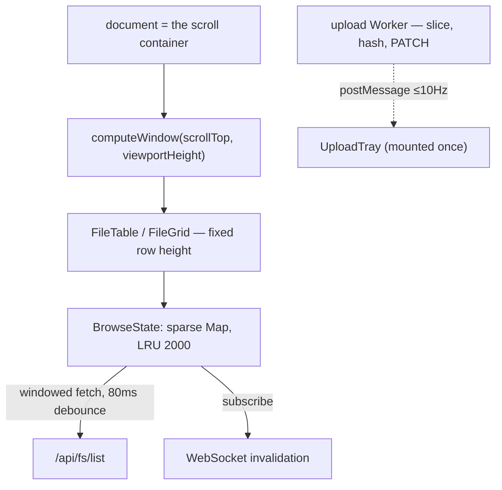

# Frontend: SPA, Virtual Scroll, i18n - Spec Proposal

| Item       | Detail                           |
|------------|----------------------------------|
| Author     | heavycaffeiner(Dong Hyun Kim)    |
| Created    | 2026-08-03                       |
| Status     | Implemented                      |
| Reviewers  |                                  |

---

## 1. Summary

`web/` is a SvelteKit 2 / Svelte 5 SPA built with `adapter-static` and
embedded into the server binary via `rust-embed`. It must stay smooth on a
100k-row directory, ship under a gated byte budget, and work in Korean and
English.

## 2. Background & Motivation

The server is one Rust binary; running a second SSR runtime beside it buys
nothing. So the frontend is a static SPA the binary serves itself.

Three constraints shape everything else: a directory can hold 100k rows, the
initial bundle is budgeted at 150 KB gzip, and a shared folder means another
process can change the tree at any moment.

## 3. Goals & Non-Goals

### 3.1 Goals

- [x] 100k rows scrollable with no measurable frame drops.
- [x] Initial JS under 150 KB gzip, public share page under 60 KB marginal —
      both CI-gated against real build output.
- [x] Korean and English, complete and gate-checked.
- [x] The virtualized grid usable by keyboard and screen reader.

### 3.2 Non-Goals

- [ ] A hand-built design system. It was built, and deleted: a token
      generator, a state-layer class and ~30 primitives were each
      re-implementations that drifted from the MD3 spec at their own pace.
      `m3-svelte` supplies them now. `@material/web` stays rejected for
      web-component interop friction.
- [ ] A high-contrast theme. `prefers-contrast: more` changes nothing.
- [ ] Optimistic UI. In a shared folder a `412` is common enough that undoing
      an optimistic change would be the normal case.
- [ ] Component-render, Playwright, `axe-core` and Lighthouse tests. None
      exist; the frame-drop target is manual on purpose (§5-2).

## 4. Technical Design

### 4.1 Architecture Overview

### 4.2 Data Model Changes

None server-side. Client state is Svelte 5 runes classes, no store library.
Upload resume records live in IndexedDB keyed by `(name, size, lastModified)`.

### 4.3 Core Logic — virtual scroll

**The document is the scroll container.** A browser only collapses its
address-bar chrome when the *document* scrolls. The shell used to clip at
`100dvh` with each route scrolling inside its own box, so `window.scrollY`
stayed 0 through thousands of pixels and the address bar never collapsed on a
phone. Deleting the inner scroller moved the problem to the call site, not the
algorithm — `computeWindow` still takes "how far scrolled" and "how tall the
visible area is"; only their sources changed:

- `documentScrollTop` uses `getBoundingClientRect().top + window.scrollY`, not
  `offsetTop` — the latter is relative to the nearest positioned ancestor and
  would break silently the day something upstream becomes `position: relative`.
- `effectiveViewportHeight` prefers `visualViewport.height`; `innerHeight`
  lags or never updates on some engines while the address bar animates.

Consequences, all forced by that choice: nav bar, rail, docked drawer and FAB
are `position: fixed`, because `sticky` pins to a containing block that is
still exactly one viewport tall and would scroll away. Their space is reserved
explicitly, with one shared formula
`calc(var(--sc-nav-bar-height) + env(safe-area-inset-bottom, 0px))`, and the
variable is in the framework's own unit so a font-size change moves the bar
and its reservation together. `contain: strict` became `contain: content` —
`strict` needs a definite size, which these elements no longer have.

Windowing itself: fixed row height (measuring variable heights does not scale
to 100k), spacer sized from the directory's **total** count so the scrollbar
tells the truth from the first render, keyed `{#each}` for node reuse, 80 ms
debounce on scroll-driven fetches, 150 ms idle threshold before thumbnails.

**Browser scroll-height ceilings** are real: Chrome ≈33.5M px, Firefox
≈17.8M px. Past 15M px the spacer is capped and scroll position is remapped to
row index through a linear scale factor. At 48 px rows that starts around
310k rows.

### 4.4 Core Logic — state

- Rows are addressed by **absolute index** in the server's sorted listing and
  fetched in windows, not as a growing infinite-scroll prefix. The cache is
  capped at 2000 rows by LRU, with selected rows exempt — which is what makes
  "selection survives scrolling away and back" true.
- **Selection is kept by name**, resolved through a `name → index` map, so a
  refresh cannot relocate a selection onto a different file.
- `open()` re-subscribes the directory to live invalidation on every call and
  always tears the previous subscription down first, so a directory the user
  left cannot keep triggering refreshes.

### 4.5 Core Logic — upload worker

Slicing and hashing on the main thread would jank the scrolled table, so every
byte-pushing step is in a Worker. Concurrency is **4 in-flight chunks
globally**, not per file, so one large file still gets parallelism. Progress
is throttled to 10 Hz before `postMessage`; posting per chunk would stall the
main thread with the flood.

Retry backs off 1/2/4/8/8 s over five attempts. A `413` halves the chunk size
and re-plans the remaining bytes rather than aborting — the size is nominally
fixed, but a misconfigured intermediary can still produce one. Resume reads
the true offset from `HEAD /api/uploads/<id>`.

`UploadTray` is mounted once, outside any route, so it survives navigation.

### 4.6 Core Logic — styling

Tokens come from the framework at build time; `app.css` is the entire
stylesheet. The palette is a static table generated once by hand from seed
`#3F6C4F`. Every role is emitted as `light-dark(...)`, so the theme toggle is
one `color-scheme` declaration rather than a second copy of the table.

Two wiring details worth stating because getting them wrong is silent:

- `.m3-layer` ships **only** as a JS module that pulls its own stylesheet in
  alongside the ripple listeners. Without that one import every control
  renders correctly and has no hover, focus or press feedback at all.
- That stylesheet gives `.m3-layer` a `::before` hitbox with pointer events
  on. Correct for the leaf controls it ships; wrong on a container, where it
  paints over static children and eats their clicks. It disabled the folder
  tree's twisty and shrank the file list's 48 px checkbox targets to 18 px.
  `pointer-events: none` is applied to exactly those four.

The 4 px grid is enforced by a real stylelint plugin over px literals, not by
convention, and runs before `vite build`.

### 4.7 Core Logic — i18n

Two catalogues of the same keys, both statically imported, selected by a
persisted locale. **A call site names a key, never its own text.** The
source-string-as-key variant was built and removed: it makes `t()` a
substitution table over one hard-coded language, so a Korean copy edit
silently orphans its English and the source language can never be swapped.

The server never sends prose for a screen — a refusal travels as a stable
code plus a `reason_key` and its parameters, and one module turns that into a
sentence. Strings crossing a thread boundary are keys too, marked `/* i18n */`
at the literal so the extractor can see them.

`i18n-check.mjs` gates it: a key missing from either catalogue, a catalogue
entry no call site uses, disagreeing `{placeholder}` sets, or a `t()` argument
that is not a dotted key.

Sizes use one vocabulary everywhere — KB/MB/GB, each 1024 of the one below —
because that is the same definition every size *input* uses. "5 MB" typed into
a field is exactly the 5 MB that gets printed back.

## 5. API Design

### 5-1. New / Modified

Routes, and what each costs:

| Route | Note |
|---|---|
| `/b/[...path]` | main browser; initial bundle |
| `/s/[token]` | public share link — **separate lightweight bundle**. The root layout is minimal on purpose; nav, upload and admin code live in the `(app)` layout, which this route never imports |
| `/settings/*`, `/admin/*` | dynamic `import()` **per tab**, not per section — three settings sections fetch on mount, so a flat scroll fired three API calls on anyone opening the page to change the theme |
| `/edit/[...path]` | CodeMirror behind its own dynamic import |

Admin tabs cap at five: the framework positions its indicator with
`nth-of-type(-n + 5)`, so a sixth renders with no indicator. Another section
means regrouping, not appending.

Splitting the share-link page out is not only a size win — it keeps
admin/auth/upload code out of what an unauthenticated visitor ever fetches.
Server-side `require_admin` remains the real access control; the route split
is UX.

### 5-2. Error Handling

| Case | Behaviour |
|---|---|
| `413` on a chunk | halve chunk size, re-plan, continue |
| network error / 5xx | 5 attempts, 1/2/4/8/8 s, then give up |
| `412` on rename/delete | surfaced; no optimistic state to roll back |
| watcher fails to start | degrade to lazy revalidation, not an error |
| bundle over budget | CI job fails, printing which budget and by how much |
| SvelteKit output shape changes | the size gate exits 1 naming what it looked for — a gate that silently measures nothing is worse than none |

Frame drops are **not** gated: it needs a real browser trace, and a shared
runner's throughput varies enough that a timing threshold would go red on
noise. A gate everyone re-runs until it passes is worse than an honest manual
target.

## 6. Implementation Plan

### 6-1. Milestones

| Phase | Task | Duration | Owner |
|---|---|---|---|
| Phase 1 | SPA shell, routing, route-level splitting | done | heavycaffeiner |
| Phase 2 | Virtual scroll, `BrowseState`, live invalidation | done | heavycaffeiner |
| Phase 3 | Upload worker, resume, `UploadTray` | done | heavycaffeiner |
| Phase 4 | m3-svelte migration, 4 px stylelint gate | done | heavycaffeiner |
| Phase 5 | i18n catalogues + gate; a11y wiring | done | heavycaffeiner |

### 6-2. Dependencies

- SvelteKit 2, Svelte 5 (runes), `adapter-static`, Vite.
- `m3-svelte` (+ its own peer dependency, which nothing here imports directly
  but which the install requires), CodeMirror 6 (dynamic import only).
- `vitest`, `stylelint`; `rust-embed` on the server side.

## 7. Accessibility

Not a section the template asks for, and here because §3.1 makes it a goal.

- File list is `role="grid"` with `aria-multiselectable`, **roving tabindex**:
  the whole grid is one tab stop, arrow keys move a `focusedIndex`, and
  `aria-activedescendant` follows it. Real per-row DOM focus cannot work when
  most rows are not mounted.
- Keyboard: `↑↓` move, `Shift+↑↓` extend, `Space` toggles, `Ctrl/Cmd+A` all,
  `Enter` opens, `F2` renames, `Delete` deletes, `/` focuses search. There is
  no keyboard copy/paste of files.
- Touch targets are 48×48 via a `::before` hit-area expansion, so the visual
  control can shrink in compact density while the tappable area does not.
- A tab group's `aria-label` goes on a `role="radiogroup"` wrapper, never on
  the framework's `Tabs`: it spreads extra attributes onto **every** radio it
  renders, so one label made a screen reader announce three radios all called
  "Settings sections".
- `Button` carries `pressed`/`aria-pressed`, because a filled-vs-tonal variant
  swap conveys "selected" to sighted users only.
- `UploadTray` owns its own live regions rather than borrowing a per-route
  Snackbar, which would go silent on navigation: `polite` for started/done,
  `assertive` naming the file for a failure. Per-chunk progress is never
  announced or the region would out-talk itself.
- Contrast comes from the palette by construction; nothing automates checking
  it.

## 8. References

- `web/src/lib/virtual/windowing.ts`, `web/src/lib/state/browse.svelte.ts`
- `web/src/lib/upload/worker.ts`, `web/src/lib/i18n/`
- `web/tools/{stylelint-four-px.cjs, check-bundle-size.mjs, i18n-check.mjs}`
- `../stowcloud-8-http-and-api.md` (the routes this consumes),
  `../stowcloud-9-upload.md` (the protocol the worker speaks),
  `../stowcloud-16-frontend-client.md` (what the Go port changes in
  `web/src/lib/api`, and what it does not)
