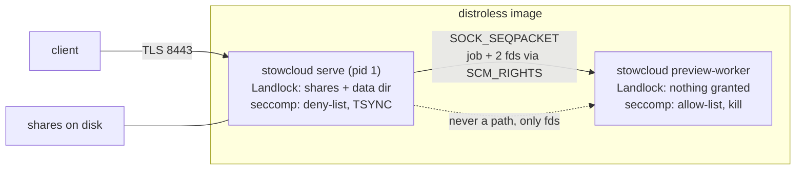

# Motivation, plan shape, and findings - Spec Proposal

| Item       | Detail                           |
|------------|----------------------------------|
| Author     | heavycaffeiner(Dong Hyun Kim)    |
| Created    | 2026-08-12                       |
| Status     | **Draft**                        |
| Reviewers  |                                  |

---

## 1. Summary

Replace the Rust backend (99,614 lines across 16 crates) with a Go
implementation, cut over in one step rather than migrated subsystem by
subsystem. The Go tree lives beside `crates/` until the cutover commit removes
the Rust one. The REST API and the on-disk schema are redesigned; the protocols
set outside this repository (RFC 4918 WebDAV, the Nextcloud sync clients, SMB)
keep their wire behaviour because they are not ours to change.

This document carries the program-level part: why, what the port keeps and what
it cannot, the shape of the plan, and the fourteen defects a read of the current
tree turned up. Every other document in this directory is one phase of it.

## 2. Background & Motivation

### 2.1 What exists today

| Measure | Value |
|---|---|
| Rust source | 99,614 lines, 16 crates, 248 files |
| Largest crates | `sc-server` 26,606, `sc-http` 17,543, `sc-compat-nc` 10,825 |
| Test functions | 1,455 |
| Locked dependencies | 376 packages |
| Release profile | `lto = "thin"`, `panic = "abort"`, `strip = true` |
| Ship target | `x86_64-unknown-linux-musl`, static, distroless, about 30 MB |

Every subsystem was specified in this directory, in proposals written from what
was built. Those proposals were the functional requirement for this rewrite and
have been retired: they specified Rust code this plan deletes, so leaving them
beside these documents would give a reader two specifications with nothing
marking which one is wrong. What they carried that is still true is restated
here where it decides something, and git history holds the originals.

### 2.2 The five principles, and what they owe to the language

Everything the product does follows from five positions. They are restated here
in full rather than cited, because this directory has to be enough on its own:

1. **The filesystem is the only source of truth.** The database is a cache,
   deletable and rebuildable. Nothing may treat "not in the database" as "the
   file does not exist", which is exactly where database-of-record designs
   fail. The exception is stated rather than implied: accounts, grants and
   share links are not reconstructible from the tree and must be backed up.
2. **A path is a kernel handle, not a string.** Every access resolves through a
   share root's directory descriptor. String concatenation followed by a prefix
   check is TOCTOU-prone and forbidden.
3. **A shared folder is not ours.** No sidecar litter, ownership and
   permissions preserved, external changes reflected. Other services are
   assumed to be writing the same directory at the same time, always.
4. **The compat layer does not invade the core.** Not one conditional, no
   vendor-prefixed field, no vendor-only table in any core package. It must be
   removable in its entirety by a build flag, and that is enforced by a gate
   rather than by intentions.
5. **The default is the restrictive one.** No user homes, no symlinks followed,
   SMB off, uploaded content never rendered inline.

They are not language-neutral. Principle 2 is implemented as direct `openat2`
calls in `crates/sc-vfs/src/backend/linux.rs`, and the security model of the
whole product rests on it. The syscalls actually in use:

| Syscall | Where | Why it cannot be dropped |
|---|---|---|
| `openat2` with `RESOLVE_BENEATH`/`IN_ROOT`/`NO_MAGICLINKS`/`NO_XDEV` | every path resolution | removes TOCTOU by construction |
| `statx` | `stat_path`, `file_stat` | btime, which `fstat` does not carry |
| `renameat2` with `RENAME_NOREPLACE` | `rename` | atomic no-clobber publish |
| `copy_file_range` | `file_copy_range` | reflink on btrfs and XFS, no userspace round trip |
| `fstatfs` | `statfs_space` | per-share free space |
| `close_range` | the preview jail | closes every inherited descriptor at once |
| `landlock_*` | process and jail | filesystem sandbox |
| `seccomp` | process and jail | syscall allow-list and deny-list |
| `inotify` | `sc-watch` | external-change invalidation |

Go reaches all of these through `golang.org/x/sys/unix` with no cgo. The
syscall contract is therefore not the thing a Go port loses.

### 2.3 The recorded decision this reverses

The architecture proposal recorded the backend choice as "Rust: memory safety
plus direct syscall control", chosen over "a GC'd runtime, where the syscall
contract is someone else's". This section is what replaces that row, which is
why it is here rather than left as a correction to make later: the reasoning
that reverses a recorded decision belongs where the new decision is recorded.

What actually changed is three things, and the syscall contract is not one of
them:

1. **`fork` without `exec` stops being available.** The Go runtime is
   multi-threaded before `main` runs, so the preview jail's current shape (a
   forked child of the server that never execs) cannot be reproduced.
   [`stowcloud-4-jail-and-hardening.md`](stowcloud-4-jail-and-hardening.md)
   gives the replacement, which the current jail's own module documentation
   already calls "a strictly better shape for production".
2. **Deterministic teardown stops being available.** No `Drop`, so every
   descriptor, lock and temporary file needs an explicit close on every path
   including the error paths. D1 and D11 in
   [`stowcloud-1-defensive-standard.md`](stowcloud-1-defensive-standard.md)
   make that a lint rather than a habit.
3. **Zeroing a secret stops being reliable.** A garbage collector may copy a
   value before anything zeroes it, and a `string` is immutable so it can never
   be zeroed at all. D12 records the mitigation that is actually available and
   the residual risk that remains, rather than claiming `zeroize` has an
   equivalent.

Against those, three things are gained: one toolchain instead of a Rust
toolchain plus a musl cross-linker, a direct dependency set an order of
magnitude smaller (§6-2), and a build that cannot embed a stale frontend.

### 2.4 Why the fixes are folded into the port

The decision is to fold the §4.3 findings into the port rather than fix them
first in Rust. That is only safe if they are written down before the port
starts, because otherwise "fixed during the port" and "lost during the port"
look identical from the outside. §4.3 is that list.

They were found by reading, not by running. Three of them (F1, F2, F3) are in
the process sandbox and none would show up in a test, because the tests that
exist assert what the sandbox does when it works, not what the process does when
the sandbox is absent.

### 2.5 The stances these documents inherit

The five principles are the headline, and underneath them sit a set of
positions that decide the close calls. They were settled while the Rust tree was
built and they are carried over whole. They are not restated in each phase
document as slogans; each one is applied where it decides something, and named
here so that a reader can tell an inherited position from a new opinion.

Where the Go port makes one harder to keep, the document that owns it says so
rather than dropping it quietly.

| # | Stance |
|---|---|
| S1 | **By construction, not by validation.** Normalise-then-check-then-open is TOCTOU-prone by shape: between the check and the open, a component can become a symlink. Every published escape in that class comes from treating a path as a string that is validated once and trusted afterwards. `.` and `..` are rejected, never normalised, because normalising is what creates the bypass. There is no window because there is no second step. |
| S2 | **Existence is never revealed, including by timing.** A path outside a grant is 404 on every surface, never 403. A search must not leak through response time either, and an unknown account costs exactly what a known one costs. |
| S3 | **A downgrade is loud.** A security control the runtime refused is reported, never silently skipped. F2 is this stance being stated and not implemented. |
| S4 | **Refuse at setup, not mid-work.** A share on a filesystem that cannot support the design is refused at registration rather than discovered later. A capability that does not exist is not advertised, because the client then fails in the middle of someone's work instead of at configuration time. |
| S5 | **Measured, not asserted.** A design that only works on generous hardware has not been validated. Numbers come from a benchmark, and a claim with no measurement behind it is written as unmeasured. Twice in this codebase's history, measuring produced an answer that invalidated a design already written down. |
| S6 | **The neighbours' access survives us.** No sidecar litter, ownership and permissions preserved, no `chown -R` on a mounted volume ever. The failure mode being avoided is a media server or a backup script losing access to files it could read a moment earlier. |
| S7 | **The server does not decide how a client renders.** A refusal travels as a code plus parameters and the browser owns the wording and the reader's language. A listing entry carries no MIME type, because a guessed type invites a client to render what it should download. |
| S8 | **Isolation is a process boundary.** A thread shares the address space, so memory corruption in a decoder is full process compromise. Memory-safe decoders and resource limits still leave logic bugs, crashes and infinite loops, so the boundary has to be a process. This survives the language change intact: pure Go decoders do not remove the reason, because memory safety was never the reason. |
| S9 | **Access to content is a capability, not a cookie.** The app origin never returns user-content bytes. |
| S10 | **A security parameter is chosen against the whole budget.** The question was never "how strong a KDF" but "how few times must it run", and 48 MiB was chosen over 64 because the cost is multiplied by the concurrency cap. A per-hash setting that lets four concurrent logins exhaust the container is not stronger in practice. |
| S11 | **Fail closed on a security control, fail open on the user's own data.** These pull in opposite directions and the split is deliberate: hardening that cannot be applied is a refusal to start, and a cache-size guard stays off by default, because an instance that stops accepting writes because a cache grew is worse than one that uses more disk than expected. |
| S12 | **A correct refusal is normal operation.** Returning a spec-correct 413 so a client drives its own auto-adjust is not an error path. Not enforcing a limit does not make middleboxes disappear; it means we are not the one rejecting. |
| S13 | **The security boundary is sometimes the performance win.** Walking through the share's own directory handles avoids the whole-path re-resolution a path-based walker pays per entry. The two are not always a trade. |
| S14 | **The lie is never used.** Where server-side ways exist to paper over a client-side defect and each of them is a lie about the data, none is used, and the evidence is recorded instead. |
| S15 | **A non-goal carries the reasoning that made it one**, in the document for the subsystem it belongs to, because a non-goal without a reason gets re-proposed every six months. |
| S16 | **A comment states its own reason.** No document citations, no ticket ids: a reader with only the file in front of them has to be able to use it. The proposal carries the long-form argument and the code stands alone. |
| S17 | **A claim that cannot be executed is a comment.** The jail's probe mechanism exists because a security property that no test exercises is a sentence in a document. |

Three of these are worth reading together, because the Go port strains them in
a way the Rust tree did not:

- **S8 with the jail.** The forked worker is gone and the process boundary is
  not. [`4`](stowcloud-4-jail-and-hardening.md) replaces the mechanism and
  keeps the property, and it costs more memory per worker to do so.
- **S5 with everything.** More of this port is unmeasured than the Rust tree's
  documents are, because the code does not exist yet. Every phase document
  marks its unverified premises in the sentence that depends on them, and
  [`17`](stowcloud-17-parity-and-cutover.md) is the only phase allowed to state
  a number.
- **S16 with this directory.** These documents describe code that does not exist,
  so they invert the directory's house rule. That inversion ends at cutover,
  and [`17`](stowcloud-17-parity-and-cutover.md) §4.4 step 6 is where.

## 3. Goals & Non-Goals

### 3.1 Goals

- [ ] A Go backend serving every surface the Rust binary serves: the REST API,
      WebDAV Class 2, the Nextcloud-compatible mounts, resumable upload,
      search, previews, SMB orchestration and OIDC login.
- [ ] The four Linux guarantees kept and provable in Go: `openat2`-resolved
      paths, a process Landlock sandbox, a process seccomp filter, and a
      decoder jail with no filesystem and no network.
- [ ] The decoder jail moved to an `exec`'d `stowcloud preview-worker`
      subcommand, replacing the `fork`-without-`exec` pool.
- [ ] Hardening turned from best-effort-and-logged into a declared policy with
      a `required` mode that refuses to start when the kernel cannot deliver it.
- [ ] Every finding in §4.3 closed, each with a test that fails without the fix.
- [ ] One defensive-coding standard applied across the tree and enforced by
      lints in `scripts/verify.sh`, not by review.
- [ ] `CGO_ENABLED=0`, **one** statically linked binary with five subcommands,
      in a distroless image no larger than today's.
- [ ] The repository's recorded stack decision brought back in line with the
      shipped one, and this directory left as the only specification a reader
      needs.

### 3.2 Non-Goals

- [ ] Feature growth. Every non-goal recorded in an existing proposal stays a
      non-goal: content indexing and OCR, video thumbnails, a high-contrast
      theme, versioning, comments, tags, groupware, federation, office-suite
      integration, activity streams, external storage mounts, workflows.
- [ ] Windows or macOS as a deployment target.
- [ ] Removing `crates/` before the cutover commit.
- [ ] A UI redesign. `web/` keeps its components, its design system and its
      routes; only the API client layer is rewritten.
- [ ] Replacing Samba. The SMB sidecar and the `smb.conf` generation contract
      are unchanged in behaviour.
- [ ] Any performance claim that has not been measured on the Linux runtime.
      [`stowcloud-17`](stowcloud-17-parity-and-cutover.md) is where measurement
      happens; nothing before it may assert parity.
- [ ] Changing the Nextcloud compatibility boundary. It stays sync, browse,
      share, preview.
- [ ] Fixing any finding in Rust first. That was considered and rejected; see
      §2.4.

## 4. Technical Design

### 4.1 Architecture Overview

#### 4.1.1 Repository layout during the port

```
crates/           the Rust implementation, untouched, deleted at cutover
go/               the Go implementation; layout in stowcloud-2 §4.1
web/              unchanged except web/src/lib/api
```

#### 4.1.2 Process topology



One binary, two roles. The worker is never told a path: it receives an input
descriptor and an output descriptor over `SCM_RIGHTS`, so a path-traversal bug
in a decoder has nothing to traverse. That property is unchanged from today;
only the way the worker comes into existence changes.

#### 4.1.3 How the plan is divided

```
front matter    0 motivation and findings    1 defensive standard
Phase 0         2 gate and toolchain
Phase 1         3 vfs and paths              4 jail and hardening
Phase 2         5 store and schema
Phase 3         6 auth and acl
Phase 4         7 core domain
Phase 5         8 http and api
Phase 6-9       9 upload   10 webdav   11 search   12 preview
Phase 10-12    13 compat  14 smb and oidc  15 deployment  16 frontend client
Phase 13       17 parity and cutover
```

The findings group into four kinds, and the grouping decides where each closes:

```
sandbox integrity      F1  F2  F3            Phase 1
unbounded or silent    F4  F7  F9  F10       a type or a lint, everywhere
ambient or implicit    F5  F6                a signature change
structural or gate     F8  F11 F12 F13 F14   a gate or a deletion
```

### 4.2 Technology mapping

What replaces what, program-wide. The per-phase documents carry the detail; this
is the table a reader wants once.

| Area | Rust today | Go |
|---|---|---|
| HTTP server | `axum`, `tower`, `tower-http`, `hyper` | stdlib `net/http` plus explicit wrapping |
| HTTP client (OIDC only) | `hyper`, `hyper-util`, `hyper-rustls`, `tower-service`, `async-trait` | stdlib `net/http` |
| TLS, server and client | `rustls`, `tokio-rustls`, `webpki-roots` | stdlib `crypto/tls`; trust anchors as in [`14`](stowcloud-14-smb-and-oidc.md) §4.4.2 |
| Certificate generation | `rcgen` | stdlib `crypto/x509` |
| Async runtime | `tokio` | goroutines, `context`, `x/sync/errgroup` |
| Parallel walk | `rayon`, `crossbeam-deque`, `crossbeam-channel` | a bounded goroutine pool, channels |
| Syscalls | `rustix`, `libc`, `landlock`, `inotify` | `x/sys/unix` |
| SQLite | `rusqlite` (bundled C), `r2d2`, `r2d2_sqlite` | `modernc.org/sqlite` under `database/sql` |
| XML | `quick-xml` (pinned for two advisories) | stdlib `encoding/xml`, bounded by the scanner |
| JSON | `serde_json` | stdlib `encoding/json` |
| Worker wire format | `postcard` | a fixed layout over `encoding/binary` |
| zstd | `zstd`, `ruzstd` | `klauspost/compress/zstd` |
| zip | `zip` | stdlib `archive/zip` |
| Image decoding | `image` | stdlib `image/*` plus `x/image` |
| Password hashing | `argon2`, `password-hash` | `x/crypto/argon2` |
| AEAD at rest | `chacha20poly1305` | `x/crypto/chacha20poly1305` |
| NT hash | `md4` | `x/crypto/md4` |
| TOTP | `totp-rs` | stdlib `crypto/hmac` and `crypto/sha1` |
| JWS RS256 and ES256 | `ring` | stdlib `crypto/rsa`, `crypto/ecdsa` |
| Digests | `blake3`, `sha2`, `crc32c` | a pure-Go BLAKE3 (client-facing, see [`9`](stowcloud-9-upload.md) §4.3.3), stdlib `crypto/sha256`, stdlib `hash/crc32` |
| Constant-time compare | `subtle` | stdlib `crypto/subtle` |
| Randomness | `getrandom` | stdlib `crypto/rand` |
| Secrets | `secrecy`, `zeroize` | D12's `Secret`, with the residual risk recorded there |
| Embedded assets | `rust-embed` | stdlib `embed` |
| Config | `toml`, `clap` | `BurntSushi/toml`, stdlib `flag` |
| Logging | `tracing`, `tracing-subscriber` | stdlib `log/slog` |
| Errors | `thiserror`, `anyhow` | stdlib `errors`, typed sentinels |
| Data structures | `smallvec`, `compact_str`, `dashmap`, `lru`, `indexmap`, `parking_lot` | stdlib `sync`, `container/list`, plain maps and slices |
| Watch | `notify`, `inotify` | `x/sys/unix` directly |
| Normalisation | `unicode-normalization` | `x/text/unicode/norm` |
| Property tests | `proptest` | stdlib `testing/quick` and native fuzzing |
| Supply chain | `cargo-deny`, `cargo-auditable` | `govulncheck`, stdlib build info |

### 4.3 The findings

#### F1. The process seccomp filter does not check the ABI

`crates/sc-server/src/hardening.rs:155`

The filter's first instruction loads offset 0 of `struct seccomp_data`, the
syscall number, and compares it against a hardcoded `x86_64` list. Offset 4,
`arch`, is never read.

A syscall number is only meaningful together with the ABI that issued it. A task
running under a different ABI presents different numbers for the same calls, so
a filter that matches numbers without pinning the arch is matching numbers that
mean something else. On `x86_64` this includes the x32 ABI, which reports the
same `AUDIT_ARCH_X86_64` with the x32 bit set on the number.

The preview jail's filter, in the same repository, does check the arch, does
reject the x32 range, and does take its numbers from `libc::SYS_*`. Its module
documentation names all three as improvements over this one.

**Closed by** D4. **Test**: assemble the filter and assert the first four
instructions are the arch load, the arch compare, the number load and the x32
rejection, in that order.

#### F2. Hardening is best-effort with no way to require it

`crates/sc-server/src/lib.rs:358`

```rust
let h = hardening::apply(&restrict);
tracing::info!(landlock = ?h.landlock, seccomp = ?h.seccomp, "process self-restriction applied (best-effort)");
```

The result is logged and dropped. Every failure path inside `apply` warns and
returns `Unavailable`, and the caller has no branch on it. There is no
configuration key that makes either mandatory.

A deployment whose kernel or container runtime silently refuses Landlock,
seccomp, or both starts identically to one where both are enforced.
The product's security posture is layers, none load-bearing alone: `openat2`
resolution, a non-root uid with all capabilities dropped and a read-only
rootfs, Landlock, seccomp, the decoder jail, the separate content origin. This
is the layer that can be absent without anyone finding out.

**Closed by** D3. **Test**: a startup test with the kernel probe faulted, under
`hardening = "required"`, asserting a refusal to start and the reason on stderr.

#### F3. No process seccomp filter at all on aarch64

`crates/sc-server/src/hardening.rs:125`

```rust
#[cfg(not(target_arch = "x86_64"))]
const DENIED_SYSCALLS: &[u32] = &[];
```

An empty list short-circuits to `Unavailable` with a warning. `Dockerfile`
builds and `docker.yml` publishes `linux/arm64`, so a published image runs with
no process-level syscall filter, and the only signal is one warning line.

**Closed by** D4, which requires a verified mapping per architecture and refuses
to start under `required` where there is none.

#### F4. A directory is materialised before it is filtered

`crates/sc-vfs/src/backend/linux.rs:644`

`dir_read_entries` iterates into a `Vec<DirEntry>` and returns the whole thing.
Every caller, including the ones that want the first page of a listing and the
ones that want a single name, gets the entire directory allocated first.

The resource target this plan is held to is a deliberately modest one: a 32 GB
system disk and a 12 TB share array, with roughly 18 GB of the former available
to spend after the OS, the container runtime, the image and headroom for WAL,
temporary files and upgrades. Of that, the metadata database targets 4 GB and
the thumbnail cache 2 GB by default. One directory with several million entries
is bounded by available memory and nothing else, and the product's premise is
that other programs write these directories, so its size is not ours to assume.

**Closed by** D5 and the streaming signature in
[`3`](stowcloud-3-vfs-and-paths.md) §4.3.3.

#### F5. Read paths hold a writable descriptor

`crates/sc-vfs/src/backend/linux.rs:258`

`open_read` attempts `O_RDWR` first and falls back to `O_RDONLY` only on
`EACCES` or `EPERM`. The recorded reason is real: `sc-upload` finalizes an
upload by reading through the handle it created, and a `pread` against a
write-only descriptor is `EBADF`.

The cost is that privilege on a descriptor is decided by the file's mode rather
than by what the caller intends. Every plain read of a mode-644 file owned by
the server's uid holds a handle that can write.

**Closed by** the explicit intent argument in
[`3`](stowcloud-3-vfs-and-paths.md) §4.3.4.

#### F6. A thread-local decides what a directory read returns

`crates/sc-vfs/src/backend/linux.rs:637`

`INCLUDE_RESERVED` is a `thread_local!` `Cell<bool>` consulted inside
`dir_read_entries` to decide whether control files are filtered out. Two trusted
callers set it.

Ambient state deciding a security-relevant answer is a defect on its own terms:
the call site does not say what it is asking for, and a new caller inherits
whatever the thread was last used for. It is also unportable in the specific
sense that matters, because goroutines migrate between threads.

**Closed by** D2 and the explicit `ReservedPolicy` argument in
[`3`](stowcloud-3-vfs-and-paths.md) §5-1.

#### F7. Three metadata writes fail in silence

`crates/sc-vfs/src/backend/linux.rs:317`, `:330`, `:337`

```rust
let _ = fs::fchmod(&fd, m);
let _ = fs::chmodat(&parent_fd, leaf_nfc.as_str(), m, AtFlags::empty());
let _ = fs::chownat(&parent_fd, leaf_nfc.as_str(), Some(owner), Some(group), ...);
```

The premise of the product is principle 3: the folder is not ours and other
services are reading it. A file created with the wrong mode, or a directory
whose configured ownership was not applied, is exactly the failure that makes
Jellyfin or a backup script stop seeing files, and it produces no error, no log
line and no failed request.

This is not the only instance of the class in the tree; it is the one in the
layer where it costs the most.

**Closed by** D1 and the durable-write helper in
[`3`](stowcloud-3-vfs-and-paths.md) §4.3.5.

#### F8. Two files carry thirteen per cent of the tree

`crates/sc-http/src/routes.rs` (9,012 lines),
`crates/sc-server/src/bridge.rs` (3,953 lines)

12,965 of 99,614 lines in two files. Neither has a seam a reader can navigate
by, which is the operative problem rather than the count.

**Closed by** D19 and the package split in
[`8`](stowcloud-8-http-and-api.md) §4.1.

#### F9. Panic density against `panic = "abort"`

Workspace-wide: 3,404 `.unwrap()`, 358 `.expect(`, 40 `panic!(`.

The release profile sets `panic = "abort"`, so any of these reachable from a
request is a process kill rather than a failed request. The count includes test
code and nothing separates the two, so it cannot be driven down or even
measured meaningfully as it stands.

**Closed by** D7.

#### F10. `now_ns` unwraps the clock

`crates/sc-upload/src/engine.rs:37`

```rust
std::time::SystemTime::now().duration_since(std::time::UNIX_EPOCH).unwrap()
```

A clock behind the epoch aborts the process. Reachable on a machine whose RTC
has not been set, which is an ordinary state after a dead battery, and the
upload engine is on the request path.

**Closed by** D8.

#### F11. The file ETag cannot see a same-nanosecond rewrite

`crates/sc-upload/src/engine.rs:46`

```rust
format!("{:x}-{:x}", stat.mtime_ns as u64, stat.size)
```

A rewrite landing in the same nanosecond with the same length is invisible to
`If-Match`, so the conflict check the product advertises passes and the edit is
lost. Unlikely, and likeliest in the case principle 3 says to expect: another
program rewriting a file in place.

**Closed by** [`7`](stowcloud-7-core-domain.md) §4.3.2.

#### F12. A configuration mode that is not implemented

`crates/sc-watch/src/lib.rs:119`

The configuration accepts `fanotify`, warns, and does something else. An
operator who set it believes they have whole-mount watching and has
per-directory watching, with the difference invisible except in a startup log.

**Closed by** deletion. [`3`](stowcloud-3-vfs-and-paths.md) §3.2 removes the
value from the config enum until something implements it.

#### F13. Principle 4 is held by a text search

`scripts/verify.sh:140`

The compat isolation rule is one of the five principles, and this grep plus the
`--no-default-features` build are what enforce it. The grep reads text, so a
constant defined elsewhere, a string built from parts, or a field named without
the vendor prefix all pass it while doing exactly what it exists to prevent.

**Closed by** the import-graph gate in [`13`](stowcloud-13-compat-nc.md) §4.2.

#### F14. The Korean-text gate passes unconditionally on the development host

`scripts/verify.sh:158`

`grep -P` on the Windows development box does not interpret `\x{...}` as a
UTF-8 code point, so the pattern matches nothing and the gate reports PASS
whatever the tree contains. Only the Linux CI job actually checks it, which
means the gate is absent exactly where a developer would want it.

**Closed by** D15, which makes the rule structural: the wire error type takes a
`MessageKey`, not a `string`, so a sentence cannot be put on the wire in any
language.

### 4.4 What is deliberately not carried over

- **The portable filesystem backend, entirely.** Keeping it "so the tree builds
  on Windows" contradicts Windows being a non-target and, more to the point, is
  what hid two real bugs: `sync_dir` returned `EBADF` on every write because
  `fsync` on an `O_PATH` descriptor fails, and `create_excl` opened write-only
  so every upload finalize's digest read failed. Each broke the only platform
  that ships, and each was invisible on the development host precisely because a
  second implementation was standing in for the real one. What dropping it costs
  is stated in [`2`](stowcloud-2-gate-and-toolchain.md) §4.3.3.
- **The `mimalloc` global allocator.** It exists for musl's allocator, and Go
  does not use libc's. The measurement note in `main.rs` stops applying.
- **`rust-embed` and the `embed-ui` feature**, with its `cargo clean -p sc-http`
  hazard. Go's `embed` reads `web/build` with a real dependency edge, so a stale
  frontend cannot be embedded silently.
- **The musl cross-compilation apparatus**: `scripts/musl-env.sh`,
  `tools/zigcc-musl.ps1`, the `VERIFY_REQUIRE_MUSL` skip path, and the second
  clippy run under the musl target.

## 5. API Design

### 5-1. New / Modified

No API. Every surface is specified in the phase document that owns it, and the
program-level contract is only this: the REST envelope and route shapes are
kept except for the five changes in [`8`](stowcloud-8-http-and-api.md) §4.4, and
the compatibility mounts are not touched at all.

### 5-2. Error Handling

The program-level error kinds, each mapped to a status by the single mapper in
[`8`](stowcloud-8-http-and-api.md) §4.3.2:

| Kind | Meaning |
|---|---|
| `ErrNotFound` | the object does not exist, or the caller may not know that it does |
| `ErrDenied` | ACL refusal where the caller may know the target exists |
| `ErrConflict` | lost-update, ETag mismatch, `RENAME_NOREPLACE` collision |
| `ErrInvalid` | failed a trust-boundary validation, with the boundary named |
| `ErrTooLarge` | a D5 limit refused it, with the limit named |
| `ErrSymlinkDenied` | `ELOOP` under the share's symlink policy |
| `ErrCrossDevice` | `EXDEV` under `RESOLVE_NO_XDEV` |
| `ErrNoSpace` | `ENOSPC`, or the configured free-space floor |
| `ErrWorkerDied` | the preview worker was killed, including by its own filter |
| `ErrHardeningRefused` | startup only, under `hardening = "required"` |
| `ErrSchemaAhead` | the database was written by a newer binary |

## 6. Implementation Plan

### 6-1. Milestones

Sizes are relative, not calendar estimates: **S** is a focused sitting, **M** is
a subsystem with its tests, **L** is a subsystem whose behaviour is only proven
against a real client or a real kernel, **XL** is one of the two surfaces that
carry a third of the tree. What matters for scheduling is the dependency
column.

| Phase | Task | Document | Size | Depends on |
|---|---|---|---|---|
| 0 | module, lint set, gate, the four assumptions | [2](stowcloud-2-gate-and-toolchain.md) | S | none |
| 1 | vfs, paths, jail, hardening | [3](stowcloud-3-vfs-and-paths.md), [4](stowcloud-4-jail-and-hardening.md) | L | 0 |
| 2 | cache.db, state.db, migrations | [5](stowcloud-5-store-and-schema.md) | M | 0 |
| 3 | auth, acl | [6](stowcloud-6-auth-and-acl.md) | L | 2 |
| 4 | the core domain | [7](stowcloud-7-core-domain.md) | L | 1, 2, 3 |
| 5 | http, middleware, REST | [8](stowcloud-8-http-and-api.md) | XL | 4 |
| 6 | upload | [9](stowcloud-9-upload.md) | M | 4 |
| 7 | webdav | [10](stowcloud-10-webdav.md) | L | 4, 5 |
| 8 | search | [11](stowcloud-11-search.md) | L | 1, 2 |
| 9 | preview and the worker | [12](stowcloud-12-preview.md) | M | 1 |
| 10 | compat | [13](stowcloud-13-compat-nc.md) | XL | 5, 6, 7, 9 |
| 11 | smb, oidc, and the operational surface: the filesystem gate, the syscall probe, health reasons, the image | [14](stowcloud-14-smb-and-oidc.md), [15](stowcloud-15-deployment.md) | M | 1, 3, 5 |
| 12 | frontend API client | [16](stowcloud-16-frontend-client.md) | M | 5 |
| 13 | parity, measurement, cutover | [17](stowcloud-17-parity-and-cutover.md) | L | all |

Phases 6, 7, 8 and 9 are independent of each other and can be taken in any
order once their dependencies are met. Phase 10 needs all four. Phase 13 is the
only phase that may claim a performance or footprint number.

Each phase ends green on the full gate, including `-race`, closes the findings
assigned to it, and leaves no `TODO` for a later phase to find.

| Phase | Findings it closes |
|---|---|
| 0 | F12, F14, and the lints behind F1 to F11 |
| 1 | F1, F2, F3, F4, F5, F6, F7 |
| 4 | F11 |
| 5 | F8, F9 |
| 10 | F13 |

F10 is a Phase 0 lint whose first users appear in Phase 2.

### 6-2. Dependencies

**Toolchain.** Go 1.24 or newer as a floor, `CGO_ENABLED=0`, `GOOS=linux`,
`GOARCH=amd64` and `arm64`. No cross-linker and no C toolchain.

**Direct modules**, and why each is not the standard library:

| Module | Replaces | Why it is unavoidable |
|---|---|---|
| `golang.org/x/sys/unix` | `rustix`, `libc`, `landlock`, `inotify` | the syscalls in §2.2 have no stdlib wrapper |
| `golang.org/x/crypto` | `argon2`, `chacha20poly1305`, `md4` | Argon2id, XChaCha20-Poly1305 and MD4 are not in the stdlib |
| `golang.org/x/image` | part of `image` | BMP, TIFF and WebP decoders |
| `golang.org/x/text` | `unicode-normalization` | NFC and NFD candidate spellings |
| `golang.org/x/sync` | `rayon`, `crossbeam` | `errgroup` and `semaphore` |
| `modernc.org/sqlite` | `rusqlite`, `r2d2` | pure-Go SQLite; the alternative is cgo, which costs the static build |
| `github.com/klauspost/compress` | `zstd`, `ruzstd` | zstd |
| `github.com/BurntSushi/toml` | `toml` | no stdlib TOML |
| a pure-Go BLAKE3 | `blake3` | a client-facing TUS checksum algorithm, so it cannot be swapped for a stdlib hash |

Everything else the Rust tree carries is standard library in Go, per §4.2.

**Assumptions settled at Phase 0** rather than assumed here:
[`2`](stowcloud-2-gate-and-toolchain.md) §4.4 lists four, and each one's answer
is written back into the document that depends on it.

**Non-code dependencies.** The Samba sidecar image, the distroless base and the
GitHub Actions runners are unchanged. Phase 13 additionally needs `litmus`, a
real desktop sync client, a real mobile client, and a Rocky guest with enough
disk for a representative tree.

## 7. References

**These documents cite code, and each other, and nothing else.** A reader
implementing a phase needs this directory and the repository's source tree, not a
second set of proposals: everything the Rust-era documents carried that is
still true has been folded in here, and everything they carried that describes
deleted code stops being true at cutover. Where one of them was the only record
of an incident or a measurement, the incident or the measurement is restated
where it decides something, not pointed at.

- [`../README.md`](../README.md): the index, and the contradiction ledger recording
  five places where an earlier draft of this plan was wrong.
- `crates/sc-server/src/hardening.rs`, `crates/sc-vfs/src/backend/linux.rs`,
  `crates/sc-upload/src/engine.rs`, `crates/sc-watch/src/lib.rs`,
  `scripts/verify.sh`: the code every finding is read from.
- `crates/sc-preview/src/worker/jailed/seccomp.rs`: the filter that already
  does what F1 and F3 ask for.
