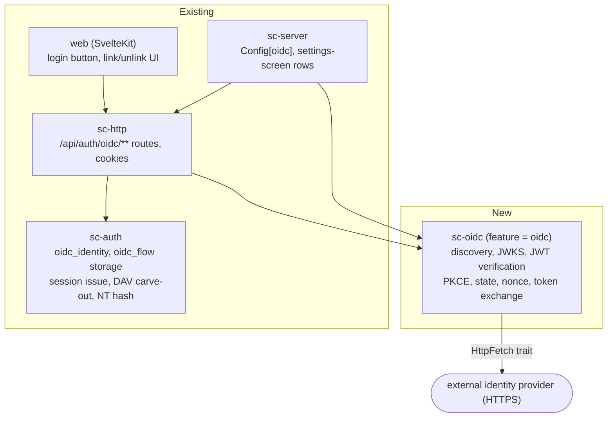

# OIDC Login - Spec Proposal

| Item       | Detail                           |
|------------|----------------------------------|
| Author     | Seonguk Moon                     |
| Created    | 2026-08-01                       |
| Status     | Implemented                      |

---

## 1. Summary

Let people sign in to the web UI through a **single OIDC provider** configured by an administrator. The server runs the Authorization Code + PKCE flow as a confidential client, verifies the ID token's signature against the provider's JWKS, and issues a session **only when that identity is already linked to an existing local account**.

The provider never creates accounts (no JIT provisioning). OIDC is **one more way to authenticate** on top of the existing `sc-auth` account model; authority (`user.role`, ACL grants) still lives in the local database.

## 2. Background & Motivation

### 2.1 Where we are today

`proposals/stowcloud-10-auth.md` defines exactly three ways to authenticate today.

| Method | Implemented in | Used by |
|---|---|---|
| Account password (Argon2id) | `sc-auth::login` | Web, WebDAV Basic |
| App password (160-bit, SHA-256) | `sc-auth::app_password` | WebDAV, compat clients |
| TOTP (RFC 6238) | `sc-auth::totp` | Second factor |

In all three, **the credential begins and ends inside this server.** An organisation that already runs an identity provider (Keycloak, Authentik, Entra ID, Google Workspace, …) still has to give this deployment its own separate password.

### 2.2 What that costs

1. **Account lifecycle is duplicated.** Disabling a departing employee at the identity provider leaves this server's account password working. An administrator has to remember to turn it off separately with `PATCH /api/admin/users/{id}`.
2. **MFA policy cannot be enforced organisation-wide.** TOTP in `sc-auth` is opt-in per account. Even when the provider already requires a hardware key or conditional access, this server has no way to know that.
3. **It is one more password.** `proposals/stowcloud-10-auth.md` sets a 10-character minimum with no composition rules and shows a strength meter, but none of that changes the fact that the user has one more secret to remember.

### 2.3 Why this shape, now

`proposals/stowcloud-10-auth.md` states this product's access model: **a new account can see nothing**, and shares only become visible once an administrator creates a grant — deny by default. "Anyone with an account at the provider is logged in" (JIT) points the opposite way: logins would succeed and produce accounts that can see nothing, one per identity in the provider's tenant.

So this proposal is **link-only**. SSO starts working for an account the moment its owner attaches their own provider identity to it.

## 3. Goals & Non-Goals

### 3.1 Goals

- [x] Web UI login through a single administrator-configured OIDC provider.
- [x] The server runs Authorization Code + PKCE (S256) as a confidential client.
- [x] The ID token's signature is verified against the provider's JWKS, and `iss`, `aud`, `azp`, `exp`, `iat` and `nonce` are all checked per §4.3.3.
- [x] The callback is confirmed to come from **the same browser that started the flow** (the flow-binding cookie in §4.3.1). `state` alone does not stop login-CSRF.
- [x] A session is issued **only when a link from `(issuer, subject)` to a `UserId` already exists**.
- [x] A signed-in user can **link or unlink** SSO on their own account from the settings screen. **Both directions require re-entering the password** (§4.3.2). A live session alone must not be enough to add a permanent credential.
- [x] An administrator can **inspect and remove** any account's link, and can **link manually** by entering a `subject` directly.
- [x] A linked account **cannot use its account password for WebDAV Basic** — an app password is required. That refusal must happen **after** the password is verified (§4.3.5); refusing before verification would be an account-enumeration oracle.
- [x] A linked account **cannot use its account password for SMB.** This is not an authentication-time check but a change at **NT hash derivation/publication time**: linking must actually delete the existing hash and republish the passdb (§4.3.6).
- [x] The whole OIDC feature sits behind **a cargo feature**, so a `--no-default-features` build drops the TLS and HTTP-client dependencies entirely.
- [x] Every test in `sc-oidc` passes **with no network**.

### 3.2 Non-Goals

- [ ] **Multiple providers.** The schema keys on `issuer`, but the one-identity-per-account rule (§4.2) means multi-provider needs a migration. This document does not promise one.
- [ ] **JIT provisioning.** Deliberately excluded, for the reason in §2.3.
- [ ] **Mapping group or role claims to authority.** `user.role` stays the only truth.
- [ ] **Automatic matching on `email` or `preferred_username`.** Explicitly refused. `email` is mutable at the provider and `email_verified` is not always trustworthy. Linking is always on `sub`, the immutable identifier.
- [ ] **RP-initiated, back-channel, or front-channel logout.**
- [ ] **Storing refresh tokens or syncing provider sessions.** Tokens are used once, at login, and discarded.
- [ ] **SAML, LDAP, dynamic client registration.**
- [ ] **OIDC login for compat and WebDAV clients.** File protocols use app passwords.
- [ ] **Fixing the TOTP bit in `session.amr`.** A pre-existing drift recorded in §4.3.7: this work records the OIDC bit correctly and leaves the existing bug alone.

## 4. Technical Design

### 4.1 Architecture Overview

#### 4.1.1 Crate placement

The first line of `proposals/stowcloud-10-auth.md` defines `sc-auth` as **protocol-agnostic** and puts Login Flow v2 in an adapter above it (`sc-compat-nc`). OIDC follows the same rule.



`sc-oidc` is a separate crate for **dependency isolation**. A TLS stack and an outbound HTTP client do not exist in this workspace today (§4.1.2). Putting them in `sc-auth` would link TLS into CLI paths like `sc-server admin smb-sync`.

**Feature placement, stated explicitly.** `sc-server`'s `oidc` feature is **on by default**, and so is `sc-oidc`'s `net` feature (the real rustls implementation). If either were off by default, clippy would never compile that code and it would rot silently. Everything drops out only under `--no-default-features`.

#### 4.1.2 Outbound HTTPS

**This workspace has neither an HTTP client nor a TLS stack.** Confirmed by reading `Cargo.lock`.

| Crate | Present? | Note |
|---|---|---|
| `hyper` 1.11.0, `hyper-util` 0.1.20 | **yes** | axum 0.8's **server**-side dependency |
| `url`, `form_urlencoded`, `idna` | **yes** | pulled in by `totp-rs` for `otpauth://` URLs |
| `rustls`, `tokio-rustls`, `hyper-rustls`, `native-tls`, `openssl` | **no** | |
| `ring`, `aws-lc-rs`, `webpki` | **no** | |
| `reqwest`, `ureq`, `async-trait` | **no** | |
| `jsonwebtoken`, `rsa`, `p256`, `ecdsa` | **no** | |

The Authorization Code flow only works if **the server POSTs directly to the provider's token endpoint**. That back channel is the only way a code becomes a token, so outbound HTTPS is unavoidable.

**Choice: `hyper-util` client-legacy + `hyper-rustls` + `rustls` (ring provider) + `webpki-roots`.**

- `hyper` and `hyper-util` are already in the tree, so the client is a feature flag away. `reqwest` does the same job and grows the tree considerably more.
- **Use `hyper-rustls`.** The draft proposed wiring `tokio-rustls` directly, which means hand-writing the glue between `hyper-util`'s connector and rustls (SNI, server-name verification, ALPN). That is exactly the code where a mistake is a security bug, and a vetted crate already exists.
- Pin rustls's crypto provider to **`ring`**. The default `aws-lc-rs` needs cmake and a C toolchain, which would likely break the musl cross-check.

**Second reason for `ring`: ID token signature verification needs no further crate.** `ring::signature::RsaPublicKeyComponents` (RS256) and `UnparsedPublicKey<ECDSA_P256_SHA256_FIXED>` (ES256) verify JWS directly.

Alternatives rejected:

| Alternative | Problem |
|---|---|
| the `rsa` crate | **RUSTSEC-2023-0071** (Marvin attack) is unfixed. `deny.toml`'s `[advisories] ignore` is empty and explicitly refuses blanket downgrades. Signature *verification* is a public-key operation and unaffected in practice, but cargo-deny and `cargo audit` do not distinguish call sites |
| `jsonwebtoken` | uses `ring` underneath. No net gain over using `ring` directly |
| Skipping signature verification and trusting TLS (permitted for the code flow by OIDC Core §3.1.3.7 item 6) | allowed by the spec, not adopted. It rests the entire defence on token-endpoint TLS, and since `ring` is in the tree anyway it saves nothing |

> **Correction to the draft (1).** The draft raised "`ring` uses `license-file` instead of an
> SPDX `license`, so cargo-deny denies it" to **a gate on this whole proposal**. **That is not
> true.** `~/.cargo/registry/.../ring-0.17.14/Cargo.toml:160` says
> `license = "Apache-2.0 AND ISC"`, and both are on `deny.toml`'s allow list (`:46`, `:50`).
> No `[[licenses.clarify]]` is needed. The draft's supporting claim about "ISC, MIT and
> OpenSSL-family" licences was wrong too: ring's LICENSE contains no OpenSSL licence.
>
> **The real licence problem was `webpki-roots`.** Both 1.0.9 and 0.26.11 declare
> **`CDLA-Permissive-2.0`** in their crates.io metadata, and that value is **not** on
> `deny.toml`'s allow list. (Pinning to 0.26 does not turn it into MPL-2.0; 0.26.11 is
> CDLA-Permissive-2.0 as well. Checked directly.)
>
> **Resolution:** add `"CDLA-Permissive-2.0"` to `deny.toml`'s allow list with a comment
> explaining why. CDLA-Permissive-2.0 is a permissive dataset licence with no copyleft
> obligation and combines with AGPL. That one line is a visible part of this change and is not
> slipped in quietly. If touching the policy file were unacceptable, the alternative is
> `rustls-native-certs` (Apache-2.0 OR ISC OR MIT) reading the runtime CA store — but
> compiled-in roots do not depend on whether the image ships a certificate bundle, which is
> more deterministic, so `webpki-roots` wins.

#### 4.1.3 Test strategy, without a network

CI runners have no identity provider. `sc-oidc` puts every outbound call behind a trait.

```rust
/// Every outbound request `sc-oidc` makes goes through this. The real
/// implementation is rustls-backed; every test in this crate uses an
/// in-process fake, so `cargo test` never opens a socket. This is the only
/// reason the OIDC flow is testable on a runner that has no identity
/// provider.
///
/// `#[async_trait]` rather than a native `async fn` in trait: the production
/// impl and the test fake are swapped at runtime through `Arc<dyn HttpFetch>`,
/// and a native async fn in a trait is not object safe on this workspace's
/// 1.88 MSRV.
#[async_trait]
pub trait HttpFetch: Send + Sync {
    async fn get(&self, url: &str) -> Result<Vec<u8>, FetchError>;
    async fn post_form(&self, url: &str, form: &[(&str, &str)], basic: Option<(&str, &str)>)
        -> Result<Vec<u8>, FetchError>;
}
```

The test fake returns a fixed discovery document, JWKS and token response, and signs ID tokens with a key pair the test itself holds. The real rustls path is exercised only by `#[ignore]`d manual integration tests, and **this proposal does not claim that path is proven in CI.**

### 4.2 Data Model Changes

Two tables are added to `<data>/auth.db`. No existing table changes.

```sql
-- The link between a local account and a provider identity.
CREATE TABLE oidc_identity (
  issuer     TEXT    NOT NULL,       -- the ID token's `iss`; must equal the configured issuer exactly
  subject    TEXT    NOT NULL,       -- the ID token's `sub`; immutable and unique within the provider
  user       INTEGER NOT NULL REFERENCES user(id) ON DELETE CASCADE,
  linked_ns  INTEGER NOT NULL,
  last_login_ns INTEGER,             -- display only; never an authentication condition
  PRIMARY KEY (issuer, subject)
);
-- One identity per account. If two subjects pointed at one account, "which one do I remove
-- to cut off access" would have no answer. Having `issuer` in the primary key does not open
-- multi-provider without a migration (this index has to go first); the only thing it buys is
-- moving a row to a different issuer without a schema change.
CREATE UNIQUE INDEX oidc_identity_user ON oidc_identity(user);
```

```sql
-- An authorization-code flow in progress. Same nature as login_challenge: a server-side,
-- single-use record (`proposals/stowcloud-10-auth.md`).
CREATE TABLE oidc_flow (
  state_hash    BLOB PRIMARY KEY,    -- sha256(state); the plaintext state is never stored
  binding_hash  BLOB NOT NULL,       -- sha256(flow cookie value). §4.3.1. Without this column
                                     -- `state` does not stop login-CSRF
  nonce_hash    BLOB NOT NULL,       -- sha256(nonce); compared against the ID token's nonce claim
  code_verifier TEXT NOT NULL,       -- PKCE; see the note below
  mode          INTEGER NOT NULL,    -- 0 = login, 1 = link
  link_user     INTEGER,             -- NOT NULL only when mode = 1
  return_to     TEXT,                -- validated same-origin path; NULL means the per-mode default
  created_ns    INTEGER NOT NULL,
  expires_ns    INTEGER NOT NULL     -- created + 10 minutes
);
CREATE INDEX oidc_flow_expiry ON oidc_flow(expires_ns);
```

**Why `code_verifier` is stored in the clear.** A PKCE verifier has to be presented to the provider verbatim, so it cannot be hashed. The exposure window is ten minutes, the record is single-use, and the verifier alone cannot exchange a code — that needs the `code` and the `client_secret` as well.

**Cleanup.** Rows with `expires_ns < now` are deleted opportunistically on each callback, and again by the same periodic job that prunes sessions.

### 4.3 Core Logic

#### 4.3.1 The login flow and browser binding

```mermaid
sequenceDiagram
    participant B as browser
    participant S as sc-server
    participant I as provider

    B->>S: GET /api/auth/oidc/start?returnTo=/b/docs
    Note over S: generate state, nonce, code_verifier, binding<br/>(256-bit CSPRNG each)<br/>store sha256(state), sha256(binding) in oidc_flow, TTL 10 min
    S-->>B: 302 -> provider authorize URL<br/>Set-Cookie: __Host-sc_oidc=<binding>; Max-Age=600
    B->>I: user authenticates (and the provider's MFA policy applies)
    I-->>B: 302 -> /api/auth/oidc/callback?code&state
    B->>S: GET /api/auth/oidc/callback?code&state<br/>Cookie: __Host-sc_oidc=<binding>
    Note over S: 1. per-IP rate gate<br/>2. look up state, delete immediately (single use)<br/>3. constant-time compare the binding cookie against<br/>   binding_hash; missing or different means refuse<br/>4. check expiry
    S->>I: POST token_endpoint (code, code_verifier, client_secret)
    I-->>S: { id_token, ... }
    Note over S: 5. verify the ID token (§4.3.3)<br/>6. look up oidc_identity by (iss, sub)<br/>7. check the account is not disabled
    S-->>B: 302 -> return_to<br/>Set-Cookie: __Host-sc_sid=...<br/>Set-Cookie: __Host-sc_oidc=; Max-Age=0
```

> **Correction to the draft (2).** The draft said "what stops login-CSRF here is `state`: the
> server issues it, the server stores it, and it is single-use." All three are true and all
> three are **insufficient.** The draft's `oidc_flow` held nothing identifying the browser that
> started the flow, and `/start` does not even require a session. So this worked:
>
> 1. The attacker calls `/api/auth/oidc/start`. The server creates a genuine `oidc_flow` row.
> 2. The attacker authenticates at the provider **as themselves** and captures the callback URL
>    (`?code=...&state=...`) without consuming it.
> 3. The attacker gets the victim's browser to issue that URL as a top-level GET (a link, a
>    redirect, a meta refresh). The callback required no cookie and no header.
> 4. The server finds the flow, exchanges the code, matches the nonce (it is the attacker's own
>    flow record) and **plants a session cookie for the attacker's account in the victim's
>    browser.**
>
> The victim is now signed in as the attacker without knowing it, and everything they upload
> lands in the attacker's account. RFC 9700 requires binding `state` to the user agent; that
> binding step is exactly what the draft omitted.
>
> **Resolution:** `/start` sets a `__Host-sc_oidc` flow cookie (43-character base64url,
> `Path=/; Secure; HttpOnly; SameSite=Lax; Max-Age=600`) and stores its `sha256` in
> `oidc_flow.binding_hash`. The callback proceeds only when the cookie is present and matches
> under a constant-time comparison; otherwise `oidc.bad_state`. The cookie is expired
> immediately on success and on failure alike.
> **All `state` does is stop the attacker from choosing the state value; what stops the
> attacker delivering a legitimate state to someone else's browser is this cookie.**

> **Correction to the draft (3).** The draft said "exempt `/api/auth/oidc/callback` from the
> `csrf` middleware." **Unnecessary and dangerous.** `STATE_CHANGING` in
> `crates/sc-http/src/middleware.rs:446` holds four methods (POST/PUT/PATCH/DELETE), and `:466`
> checks only when the request is one of them. A GET callback already passes. Introducing an
> exemption list would, if implemented as an `/api/auth/oidc/` prefix match, silently exempt
> `POST /api/auth/oidc/link/start` too — and §5-1 **requires** `Sc-Csrf` and `Origin` on that
> route. That is a real regression manufactured by an unnecessary change.
> **The middleware is not touched.**

**The exact shape of the token exchange.** The draft's pseudocode omitted `grant_type` and `redirect_uri`. OIDC Core's token-endpoint rules require the token request to repeat **the identical `redirect_uri`** when the authorization request carried one. Omit it and every conforming provider refuses.

```
POST {token_endpoint}
Authorization: Basic base64(client_id ":" client_secret)      // client_secret_basic
Content-Type: application/x-www-form-urlencoded

grant_type=authorization_code
&code={code}
&redirect_uri={byte-for-byte identical to the authorization request}
&code_verifier={PKCE verifier}
```

- **Client authentication defaults to `client_secret_basic`.** If discovery's `token_endpoint_auth_methods_supported` lacks it and offers only `client_secret_post`, fall back to that. No other method is supported.
- **`scope` always contains `openid`.** Without it there is no ID token.

**`redirect_uri` is pinned by configuration, not inferred.** The draft said "`compat_canonical_url` or `app_hosts`", but the existing resolution logic (`config.rs:424-455`) accepts HTTP, does not fully parse URLs, and is ambiguous when `app_hosts` has zero or more than one entry. A redirect URI has to match the value registered at the provider **exactly**, so it cannot be left to inference. **`oidc.redirect_uri` is a new explicit configuration key; if it is empty or does not start with `https://`, OIDC is not enabled** (everything else keeps working), and the reason is logged at startup.

**Why the entry point is a top-level navigation, not `fetch()`.** The login screen's button does `window.location.href = '/api/auth/oidc/start'`. A 302 received over XHR does not navigate the browser to the provider.

**Middleware wiring.** Without the OIDC routes in `is_public_path` (`middleware.rs:362-377`), `/config`, `/start` and `/callback` all answer `401`. But when that function returns `true` the `auth` middleware skips session parsing entirely (`:383-392`), so the link-mode callback would not see the session it needs. Therefore:

- `/api/auth/oidc/config` and `/api/auth/oidc/start` go into `is_public_path`.
- `/api/auth/oidc/callback` is treated as **optionally authenticated**: no cookie means pass through (login mode); a cookie means validate it and inject a `Principal` (link mode). A cookie that is present but invalid is treated as "no session" rather than `401` — link mode is refused anyway at step 2 of §4.3.2.
- `POST /api/auth/oidc/link/start`, `DELETE /api/auth/oidc/link` and the three admin routes are not public. They require authentication as usual.

**Why a `__Host-` cookie survives this cross-site redirect.** `SameSite=Lax` permits top-level GET navigations. Both setting the cookie on the callback response and sending it on subsequent same-origin requests are within what Lax allows. As `proposals/stowcloud-10-auth.md` records, **without HTTPS the cookie is silently dropped.**

#### 4.3.2 The link flow

Same code as the login flow, started with `mode = 1` and `link_user = <the current session's user>`.

```
POST /api/auth/oidc/link/start      (session required, Sc-Csrf and Origin required)
  body: { "password": "...", "returnTo": "/settings/security" }
  -> 200 { "authorize_url": "https://idp/..." } + Set-Cookie: __Host-sc_oidc=...
  -> 401 auth.invalid_credentials
```

> **Correction to the draft (4).** The draft required only a session and a CSRF token to link,
> and asked for a password **only on unlink.** **That is backwards.** Linking **adds a permanent
> login credential** to an account. Someone with brief access to an unlocked device could
> attach their own provider identity, and the victim would keep being reachable even after
> changing their password and revoking every session. `proposals/stowcloud-10-auth.md`:609-619` re-asks for the
> password when TOTP is turned **on as well as off** for exactly this reason: in that
> document's words, a live session alone must not be enough to change a security control.
>
> **Resolution:** `/link/start` takes and verifies the password. Verification finishes **before**
> the flow record is created, and the fact of re-authentication is not recorded in the flow (the
> flow is already bound to the session and the binding cookie). Administrator-side manual
> linking remains the recovery path.

> **Revised from the draft.** The draft had `/link/start` return 409 when the account already
> had an identity, which makes the callback branch in §4.3.2 **permanently unreachable dead
> code** — and a check at start time is inherently TOCTOU anyway.
> **Link state is not checked at `/link/start`.** It verifies the password, starts the flow, and
> leaves every "can this be linked" decision to `link_oidc_identity`'s return value in the
> callback.

In the callback, `mode = 1` does the following.

1. The binding-cookie check of §4.3.1 must pass **first** (identical to login mode).
2. **Confirm the current request's session cookie still belongs to `link_user`.** Different or absent means `oidc.link_session_changed`. This stops an identity landing on the wrong account when a logout or account switch happened between starting the flow and returning from the provider.
3. Branch on `link_oidc_identity(link_user, iss, sub)`:
   - `Ok(())`: inserted. Do the NT-hash work of §4.3.6 **in the same transaction**.
   - the same subject is already on this account: idempotent success.
   - `SubjectTaken`: this subject is on another account. `oidc.subject_already_linked`.
   - `AlreadyLinked`: this account already has a different subject. `oidc.already_linked`.
4. Write the `auth.oidc_linked` audit event and notify the user.

**The link flow never issues a new session.** It is an operation on top of an already authenticated one.

**Both success and failure return to `return_to`** (the settings screen by default). The draft had these inverted, sending success to `/b/` and failure to the settings screen.

**Unlink.** `DELETE /api/auth/oidc/link` requires the password again. Same logic as `proposals/stowcloud-10-auth.md` re-asking on TOTP disable, and the plaintext is also needed to re-derive the NT hash in §4.3.6.

> **On "an SSO-only account cannot unlink because nobody knows its password".** Checking the
> facts: `sc_auth::create_user` **always** requires a password (`users.rs:19-22`, with a minimum
> length check) and `user.pw_hash` is `NOT NULL`. An account without a password cannot exist.
> What remains is "the owner does not know the value", and the answer to that is the
> administrator route `DELETE /api/admin/users/{id}/oidc`. No separate OIDC re-authentication
> mode is built. Instead §5-1 states that when an administrator creates an account intended for
> SSO, the initial password must be handed to its owner.

#### 4.3.3 ID token verification

Order matters. Cheap checks first, signature verification after them.

```
1. Parse the JWS structure. Is alg on the allow list (RS256, ES256)?
   -> "none" and HS* (symmetric) are refused explicitly. That is the textbook alg-confusion
      attack.
2. Does the header carry a kid? If not, hard refusal.
   -> No "there is only one key, use it" fallback. That fallback is how alg-confusion variants
      get in.
3. Look the kid up in the JWKS cache. On a miss, re-fetch (with the cooldown of §4.3.4).
4. Does the selected JWK's kty match the header alg?
   RS256 -> kty="RSA",  ES256 -> kty="EC" with crv="P-256".
   If use/key_ops are present, do they permit verification?
   -> ring would fail to parse anyway, but this check belongs in our specification, not in a
      dependency's parser.
5. Verify the signature (ring).
6. iss == the configured issuer   (exact equality, not a prefix comparison)
7. aud contains client_id  (a string or an array, both accepted)
8a. If aud is an array with two or more entries, azp must be present and == client_id
8b. If azp is present at all, it must == client_id, regardless of how many aud entries there are
9. exp > now - leeway,  iat < now + leeway,  and if nbf is present, nbf < now + leeway
   leeway = 60 seconds (fixed; not a configuration key)
10. nonce is present and sha256(nonce) == the stored nonce_hash  (subtle::ConstantTimeEq)
11. sub is a non-empty string
```

> **Why 8b exists.** The draft had only 8a. OIDC Core §3.1.3.7 splits this into two separate
> obligations: item 5 says "if aud is plural, azp must be present", and item 6 says "**if azp is
> present**, it must equal client_id" — with no cardinality condition. Implementing only 8a lets
> a token with `aud = "our_client"` and `azp = "other_client"` through. 8b is the check that
> stops a token minted for a different client of the same provider being replayed here.

**No claim other than `sub` is used for authentication.** `email`, `name` and `preferred_username` are neither read nor stored.

#### 4.3.4 Discovery and the JWKS cache

**Lazy fetch, not at startup.** Calling the provider at boot means the server does not come up at all when the provider is down.

| Item | Policy |
|---|---|
| discovery (`{issuer}/.well-known/openid-configuration`) | fetched on first need, cached one hour on success |
| JWKS | fetched from discovery's `jwks_uri`, cached one hour |
| unknown `kid` | re-fetch immediately. Cooldown of five minutes **per `kid`**, plus a global ceiling |
| **known `kid`, signature fails** | allow the same re-fetch **once** and retry verification once. Providers do replace key material while keeping the `kid`, and without this every login fails for the hour it takes the cache to expire |
| fetch failure | only OIDC login fails, with `oidc.provider_unavailable`. Every other server function is unaffected |
| response bodies | size-capped, so a malicious or malfunctioning provider cannot exhaust memory |

> **Why the cooldown is per-`kid`.** A global cooldown lets one forged `kid` consume the
> five-minute window; a genuine key rotation arriving a second later would then go unnoticed for
> five minutes and every login would fail meanwhile. A small LRU of recently missed `kid`s, each
> with its own cooldown, avoids that.

**Issuer verification.** If the discovery document's `issuer` field differs from the configured issuer, the whole document is refused. This is both an OIDC Discovery requirement and basic forgery defence.

> **Correction to the draft (5).** The draft checked that "the endpoints discovery advertises
> are on **the same host** as the configured issuer" and made `DiscoveryError::HostMismatch` a
> hard failure. **That would make Google Workspace — named as a target in §2.1 — never work.**
> Google's actual discovery document reads:
>
> ```
> issuer                   https://accounts.google.com
> authorization_endpoint   https://accounts.google.com/o/oauth2/v2/auth
> token_endpoint           https://oauth2.googleapis.com/token
> jwks_uri                 https://www.googleapis.com/oauth2/v3/certs
> ```
>
> Three of the four are on different hosts. Large providers routinely put the token endpoint and
> JWKS on separate hosts, and the Discovery spec does not require otherwise.
>
> **Resolution:** drop the same-host rule and replace it with something that actually stops SSRF.
> (1) Require `https://` on every endpoint URL.
> (2) Refuse when a resolved address is loopback, an RFC 1918 private range, or link-local —
>     unless `oidc.allow_private_endpoints = true` (self-hosted Keycloak on the same network is
>     a real deployment).
> (3) Keep the check that the discovery document's own `issuer` field matches. That is the check
>     the spec requires, and the draft had it right.
> `DiscoveryError::HostMismatch` becomes `DiscoveryError::PrivateAddress`.

#### 4.3.5 Interaction with the existing authentication paths

| Situation | Behaviour | Rationale |
|---|---|---|
| linked account + web password login | **allowed by default**; blockable with `oidc.local_password_login = "deny"` | see below. The block applies **after** the password verifies |
| linked account + WebDAV Basic (account password) | **refused**, `BasicResult::AppPasswordRequired` — but **after** the password verifies | see "timing oracle" below |
| linked account + WebDAV Basic (app password) | allowed | |
| linked account + SMB | not possible with the account password. **Requires the separate work in §4.3.6** | not the same path as TOTP |
| linked account with TOTP also on | independent. Password login demands TOTP; OIDC login does not | the second factor was already enforced by the provider |
| OIDC login for a `disabled = 1` account | refused | |
| unlinked subject | `oidc.not_linked` | no JIT |

**Where to put the check so it is not a timing oracle.**

The existing `totp_enabled` check in `crates/sc-auth/src/basic.rs:34-40` returns right after the user lookup, **before the rate gate and before Argon2**. Adding `oidc_linked` next to it would make "wrong password + linked account" finish measurably faster than "wrong password + ordinary account", which is an oracle for which accounts use SSO. That runs directly counter to `proposals/stowcloud-10-auth.md`:655-677`, which runs a real Argon2 even for accounts that do not exist in order to flatten timing.

So **the OIDC refusal happens after the credential verifies.** The order is: rate gate, password verification, then `AppPasswordRequired` if `oidc_linked`. Wrong credentials answer with the same code in similar time whether or not the account is linked.

The existing `totp_enabled` check **is not moved.** It is the same class of pre-existing defect, but moving it changes observable behaviour for TOTP accounts and is a separate change; folding it in would make "add OIDC" alter something unrelated. It is left as its own issue. The consequence is that the two checks sit at different points, and a code comment says so.

**Why `oidc.local_password_login` defaults to `allow`, and what that costs.**

`deny` is the stricter setting. Under `allow`, someone who knows the local password can bypass the provider's MFA and reach the web UI. The default is still `allow` because of recovery: if the provider is down or the client is misconfigured, `deny` locks out everyone including the administrator. `proposals/stowcloud-10-auth.md` has consistently refused states of that kind (§7.1 "no account lockout", §11 "cannot reach zero active administrators").

> **Important interaction with the settings screen.** At boot, `sc-server` applies administrator
> overrides from `settings.db` on top of `config.toml`
> (`Config::apply_settings_overrides`, `config.rs:556`). So making
> `oidc.local_password_login` editable in the settings screen means that after setting it to
> `deny` and then having OIDC break, editing `config.toml` would not help — the override wins
> again on every boot and **recovery becomes impossible.** That is precisely the state the
> paragraph above argues must not exist.
>
> **Resolution:** `oidc.local_password_login` and `oidc.client_secret_file` are **read-only in
> the settings screen, with the reason shown**. Those two change only through `config.toml`, so
> the way in and the way out are the same. The rest (`enabled`, `issuer`, `client_id`,
> `display_name`, `allow_private_endpoints`, `ca_bundle_file`) are editable, all
> restart-required.

#### 4.3.6 SMB, and where the draft was wrong

> **Correction to the draft (6).** The draft said SMB "reuses **the same code path** as the TOTP
> carve-out." **There is no path to reuse.**
>
> The DAV carve-out is an authentication-time check (`basic.rs:36-40`), so `|| oidc_linked` is
> the whole change. **SMB is not like that.** SMB authentication is done by smbd against the
> published `smbpasswd` and never goes through `sc-auth`. The way the TOTP carve-out works is by
> *not deriving the NT hash in the first place*, and that check exists only at the two points
> that hold the plaintext:
>
> - `crates/sc-auth/src/users.rs:44` (account creation): derives unconditionally.
> - `crates/sc-auth/src/nt_ops.rs:69-76` (opportunistic backfill): skips when `totp_enabled || smb_opt_out`.
>
> **At the moment of linking there is no plaintext password in hand**, so neither point is
> reached. Adding `oidc_linked` there only prevents *future* derivation. And since `create_user`
> **always** derives an NT hash at account creation (verified), an account linked later already
> has a live NT hash and a published `smbpasswd` entry, and **still logs in to SMB with the
> account password.** The bypass the Goals promised to close would have stayed wide open.

**What linking must actually do.** In the same transaction as `link_oidc_identity`:

1. **Delete** the `user_smb_secret` row whose `source` is `NtSource::AccountPassword`. Leave a `NtSource::Dedicated` row alone — that is a credential the user separated deliberately.
2. Call `smb_sync.mark_dirty(user)` so the passdb is actually regenerated. Skip this and the database is clean while the published `smbpasswd` still carries the entry, leaving SMB open.
3. Add `oidc_linked` to the conditions in `users.rs` and `nt_ops.rs` to prevent future derivation.

**On unlink.** The NT hash is **not restored automatically.** `DELETE /api/auth/oidc/link` takes the password, so it can re-derive on the spot, and it does. `DELETE /api/admin/users/{id}/oidc` receives no plaintext and therefore **cannot**. In that case the response and the audit event state that SMB access for this account stays broken until the password is changed or a dedicated SMB password is set. It is not left silently broken.

**There is already a precedent to follow.** `crates/sc-auth/src/totp.rs:105-116` does exactly this when TOTP is enabled: it reads `user_smb_secret`'s `source` and deletes the row unless it is `NT_SOURCE_DEDICATED`. Linking does the same thing in the same kind of transaction.

**A separate policy key, with exactly one variant: `block`.**

The draft wanted to reuse `smb.totp_policy`. That field's name and its documentation (`sc-smb/src/lib.rs:39-41`, `proposals/stowcloud-10-auth.md`) are TOTP-specific, so an administrator who set `block` because of TOTP would end up blocking SSO users too without knowing why. Hence a separate `oidc.smb_policy`.

> **Why there is no `require_separate`.** The draft offered it, as TOTP does. When this was
> written there was **no way to use that value**: the only route that changed an account's own
> SMB settings, `POST /api/auth/smb`, took just `{ opt_out: bool, enabled: bool }`, the UI was
> two toggles, and no user-facing API created a `NtSource::Dedicated` row at all.
>
> **Resolution:** `oidc.smb_policy` has one value, `block`. Building an API for dedicated SMB
> passwords was separate work and a Non-Goal here.
>
> **Corrected by `stowcloud-17-audit-gaps.md` §4.3.1.** That API exists now
> (`POST`/`DELETE /api/auth/smb/password`), so `block` narrows to its precise meaning: **the
> account password is not an SMB credential for a linked account.** A linked account that sets a
> separate password reaches SMB with it, which is what this code already assumed anyway, since
> the link leaves a `Dedicated` row alone and skips re-derivation when one exists. The sentence
> that used to sit here, "a linked account cannot use SMB", was the proposal being pessimistic
> ahead of its own code. A user-initiated unlink now replaces that separate password with one
> derived from the password it re-confirms, and says so before it does; the administrator unlink
> holds no plaintext and is unchanged.

**What happens to sessions on unlink.** `validate_session` (`session.rs:67-100`) looks only at the account's `disabled` flag and expiry — not at identities, not at `amr`. So deleting the identity row alone would leave **already-issued OIDC sessions alive.** This proposal does not leave that. Unlink, in the same transaction, **deletes every session of that user with `amr & AMR_OIDC != 0` and bumps `generation`.** Only then is "removing the link removes access" true.

#### 4.3.7 An honest record about `session.amr`

`proposals/stowcloud-10-auth.md` describes `amr` as a `pw | totp | recovery` bitmask. **The code does not do that.** `create_session` always writes the literal `1` (`session.rs:61`), and a TOTP-gated login calls the same function (`routes.rs:431`), so it ends up as `1` too. The TOTP bit is never set anywhere.

This proposal does the following.

- Add an `amr: u32` parameter to `create_session`; existing call sites pass `AMR_PASSWORD`, preserving **exactly today's behaviour**.
- Name the bits as constants: `AMR_PASSWORD = 1`, `AMR_TOTP = 2`, `AMR_RECOVERY = 4`, `AMR_OIDC = 8`.
- OIDC login records `AMR_OIDC`. Unlink selects sessions by that bit (§4.3.6).
- **The existing TOTP-bit bug is not fixed.** That changes what the session list displays, which is a separate change; folding it in would make an "add OIDC" commit alter unrelated behaviour.

**`amr` does not reach the screen today.** `list_sessions` reads it (`session.rs:139-156`) but the HTTP route drops the field (`routes.rs:834-859`) and `web/src/lib/api/types.ts` has no counterpart. Recording `amr` correctly therefore does not by itself make OIDC sessions distinguishable in the connected-sessions list. This proposal uses `amr` **to select sessions at unlink time** and promises nothing about display. Showing the authentication method in the session list is separate work.

The call sites are two in production (`routes.rs:383`, `:431`) and **seven in tests** (`sc-auth/src/tests.rs:487,517,518,693`, `sc-http/src/routes.rs:5508,5509,6501`). `verify.sh` runs `clippy --all-targets` for both the host and musl targets, so the test code has to change in the same commit.

## 5. API Design

### 5-1. New / Modified

#### New, unauthenticated

```
GET /api/auth/oidc/config
  -> 200 { "enabled": true, "display_name": "Company account" }
```

The login screen has to read this before it holds any credential in order to decide whether to draw the button. All it exposes is whether SSO is on and what to write on the button. The issuer URL and `client_id` are not exported. It is not folded into `GET /api/setup` because `proposals/stowcloud-10-auth.md` pins that response to a bare boolean and nothing more.

```
GET /api/auth/oidc/start[?returnTo=/b/docs]
  -> 302 Location: {authorization_endpoint}?...
        Set-Cookie: __Host-sc_oidc=<binding>; Path=/; Secure; HttpOnly; SameSite=Lax; Max-Age=600
  -> 404 oidc.disabled
  -> 429 rate.limited (+ Retry-After)
  -> 503 oidc.provider_unavailable
```

**Validating `returnTo`.** Beyond the rules in the login screen's `safeReturnTo` (`web/src/routes/login/+page.svelte:35-40`), the server implementation **must reject control characters explicitly.** That helper is client-side TypeScript with no CR/LF check, and the server puts this value into a `Location` header. Relying on `HeaderValue::from_str` failing is not acceptable, because the existing pattern at `routes.rs:406-408` **silently drops** a header that fails to parse — here that would be a 302 with no `Location`. The rule: starts with `/`, does not start with `//` or `/\`, and every byte is in `0x20..=0x7E`. On failure it falls back to the default silently rather than erroring. Both implementations share test vectors.

```
GET /api/auth/oidc/callback?code=...&state=...
  -> 302 Location: {return_to}, Set-Cookie: __Host-sc_sid=...
  -> 302 Location: /login?oidc_error=<code>       (login mode, failure)
  -> 302 Location: /settings/security?oidc_error=<code>   (link mode, failure)
  -> 429 rate.limited
```

**Why failures redirect instead of returning JSON.** A person arrives at this URL in a browser. Rendering a JSON error body shows them a white page of JSON. Provider-side errors (`?error=access_denied`) take the same path.

#### New, session required

```
POST /api/auth/oidc/link/start        (Sc-Csrf and Origin required)
  body: { "returnTo": "/settings/security" }    // optional
  -> 200 { "authorize_url": "..." } + Set-Cookie: __Host-sc_oidc=...
  -> 404 oidc.disabled
  -> 503 oidc.provider_unavailable
  (an already-linked account does not get a 409 here; that decision is made in the callback. §4.3.2)

DELETE /api/auth/oidc/link             (Sc-Csrf and Origin required)
  body: { "password": "..." }
  -> 204
  -> 401 auth.invalid_credentials
  -> 404 oidc.not_linked
```

One field is added to the response of `GET /api/auth/session` (`SessionInfoWire`).

```jsonc
{
  "oidc": { "linked": true, "subject_hint": "a1b2...f9", "linked_ns": "1754000000000000000" }
}
```

`subject_hint` is a prefix and suffix, not the full `sub`.

**`linked_ns` is a decimal string.** Every existing nanosecond field in this API goes out as a string (`routes.rs:848-855`). Nanoseconds exceed `2^53`, where JavaScript's `number` loses precision. Emitting only the new field as a number would put two rules on the same screen. The same applies to `linked_ns` on the admin route.

#### New, administrator

```
GET    /api/admin/users/{id}/oidc   -> 200 { "linked": true, "issuer": "...", "subject": "...", "linked_ns": 0 }
PUT    /api/admin/users/{id}/oidc   body: { "subject": "..." }  -> 204
DELETE /api/admin/users/{id}/oidc   -> 204 { "smb_nt_restored": false, "note": "..." }
```

`PUT` does not contradict "no JIT" because **it does not create an account**. An administrator explicitly attaches an identity to an account that already exists.

**Operational note.** Even when an administrator creates an account meant purely for SSO, `create_user` demands a password. That initial password must be handed to the owner. Otherwise the owner cannot call `DELETE /api/auth/oidc/link` themselves and unlinking is only possible through the admin route (§4.3.2).

Under `proposals/stowcloud-10-auth.md`, the three admin routes are below `/api/admin` and are therefore **unreachable with an app password.** `DELETE /api/auth/oidc/link` and `POST /api/auth/oidc/link/start` manage one's own credentials, so they are added to §5.2's app-password refusal list too.

#### Modified, `sc-auth` function signatures

```rust
/// Creates a session row and returns the plaintext token (shown once).
///
/// `amr` records **how** the caller authenticated, as the bitmask
/// `proposals/stowcloud-10-auth.md` section 3.2 describes. It used to be the literal `1` for
/// every session regardless of method; making it a parameter is what lets an
/// OIDC-issued session be told apart from a password one in the
/// connected-sessions list.
///
/// The pre-existing call sites pass `AMR_PASSWORD`, preserving today's
/// behaviour exactly, including the fact that a TOTP-gated login still does
/// not set `AMR_TOTP`. That is a separate pre-existing bug this change
/// deliberately does not fix.
pub fn create_session(&self, u: UserId, ip: IpAddr, ua: &str, amr: u32)
    -> Result<SessionToken>;

/// Resolves an IdP identity to a local account. `Ok(None)` means "no such
/// link": the caller answers `oidc.not_linked` and **must not** create an
/// account (no JIT provisioning).
///
/// Deliberately does not check `user.disabled`. The caller does that, so
/// that "linked but disabled" and "not linked" stay distinguishable in the
/// audit log while remaining identical on the wire.
pub fn find_oidc_identity(&self, issuer: &str, subject: &str)
    -> Result<Option<UserId>>;

/// Links `subject` to `u` and, in the same transaction, removes the SMB NT
/// hash derived from the account password and marks the passdb dirty. That
/// second half is not optional: without it the account password remains a
/// working SMB login, which is the bypass linking is supposed to close.
/// A `NtSource::Dedicated` secret is left alone.
pub fn link_oidc_identity(&self, u: UserId, issuer: &str, subject: &str)
    -> Result<(), OidcLinkError>;

/// Unlinks and, when `pw` is `Some`, re-derives the NT hash from it. An
/// admin unlink passes `None` and therefore cannot restore SMB access; the
/// caller must say so to the operator rather than leave it silently broken.
pub fn unlink_oidc_identity(&self, u: UserId, pw: Option<&SecretString>)
    -> Result<bool>;

/// True when `u` has an OIDC identity. Read at DAV Basic auth time, next to
/// the existing `totp_enabled` check.
pub fn oidc_linked(&self, u: UserId) -> Result<bool>;
```

Pseudocode, the heart of the callback:

```
fn oidc_callback(query, headers, ip):
    if !cfg.oidc.enabled:                     return redirect_err(LOGIN, "oidc.disabled")
    if ip_gate.check(ip) is Some(retry):      return 429 + Retry-After

    // state is required on success responses and error responses alike. If the authorization
    // request carried a state, the provider echoes it on an error redirect too. Handling the
    // error before the state check would make (a) "every callback is state-protected" false
    // and (b) leave the flow record unconsumed and replayable. The draft did exactly that.
    let state = query.state?                            // missing -> "oidc.bad_request"
    let flow  = db.take_oidc_flow(sha256(state))?       // lookup and delete in one transaction; None -> "oidc.bad_state"
    let mode  = flow.mode                               // decides where later errors land

    // Browser binding. This is the login-CSRF defence. It applies on the error path too.
    let binding = cookie(headers, "__Host-sc_oidc")     // missing -> "oidc.bad_state"
    if !ct_eq(sha256(binding), flow.binding_hash):      return redirect_err(mode, "oidc.bad_state")
    if flow.expires_ns < now():                         return redirect_err(mode, "oidc.expired")

    // Only after consuming the flow and confirming the binding do we look at what the provider
    // sent. Exactly one of code and error is accepted; both or neither is a bad request.
    match (query.code, query.error):
        (Some(_), Some(_)) | (None, None) => return redirect_err(mode, "oidc.bad_request")
        (None, Some(e))                   => return redirect_err(mode, map_idp_error(e))
        (Some(code), None)                => {}         // fall through

    let disco  = oidc.discovery().await?                // failure -> "oidc.provider_unavailable"
    let tokens = oidc.exchange_code(disco, code, flow.code_verifier).await?   // includes grant_type/redirect_uri
    let claims = oidc.verify_id_token(tokens.id_token, flow.nonce_hash).await?   // 4.3.3

    if flow.mode == LINK:
        if session_user_of(headers) != Some(flow.link_user):
            return redirect_err(LINK, "oidc.link_session_changed")
        match auth.link_oidc_identity(flow.link_user, claims.iss, claims.sub):
            Ok(())            => audit("auth.oidc_linked")
            Err(SubjectTaken) => return redirect_err(LINK, "oidc.subject_already_linked")
            Err(AlreadyLinked)=> return redirect_err(LINK, "oidc.already_linked")
        return redirect(flow.return_to ?? "/settings/security") + clear_flow_cookie()

    // LOGIN mode
    let uid = auth.find_oidc_identity(claims.iss, claims.sub)?
        else { audit("auth.login_failed", detail="oidc_not_linked");
               return redirect_err(LOGIN, "oidc.not_linked") }
    if auth.user_row(uid)?.disabled:
        audit("auth.login_failed", detail="disabled")
        return redirect_err(LOGIN, "oidc.not_linked")   // same code; does not leak whether the account exists

    let token = auth.create_session(uid, ip, ua, AMR_OIDC)?
    auth.touch_oidc_last_login(uid)
    audit(uid, "auth.login", detail="oidc")
    return redirect(flow.return_to ?? "/b/") + set_session_cookie(token) + clear_flow_cookie()
```

### 5-2. Error Handling

> The draft crammed every status code into one table, but many of those conditions arise
> **only in the callback**, and per §5-1 the callback never returns JSON. That produced a
> contradiction where the same `oidc.not_linked` was a 403 in the table and a 302 in the
> pseudocode. The tables are split by transport instead.

**Table A. Carried by HTTP status code** (the JSON routes: `/config`, `/start`, `/link/start`, `DELETE /link`, the three admin routes)

| Status | Code | Route |
|---|---|---|
| 401 | `auth.invalid_credentials` | `POST /link/start`, `DELETE /link`: password re-check failed |
| 404 | `oidc.disabled` | `/start`, `/link/start` |
| 404 | `oidc.not_linked` | `DELETE /link`, admin `DELETE` |
| 409 | `oidc.subject_already_linked` | admin `PUT` |
| 409 | `oidc.already_linked` | admin `PUT` |
| 422 | `oidc.invalid_subject` | admin `PUT`, e.g. an empty string |
| 429 | `rate.limited` | `/start` (+ `Retry-After`) |
| 500 | `internal` | all |
| 503 | `oidc.provider_unavailable` | `/start`, `/link/start` |

**Table B. Carried on a 302 as `?oidc_error=`** (callback only)

| Code | Condition | Lands on |
|---|---|---|
| `oidc.disabled` | OIDC turned off mid-flow | `/login` |
| `oidc.bad_request` | `code` or `state` missing | `/login` |
| `oidc.bad_state` | unknown or already-consumed `state`, **or a missing/mismatched binding cookie** | `/login` |
| `oidc.expired` | past the 10-minute TTL | `/login` |
| `oidc.not_linked` | unlinked `sub`, or linked but the account is disabled (**same code**) | `/login` |
| `oidc.provider_unavailable` | discovery, JWKS or token endpoint failed, or verification was impossible | `/login` |
| `oidc.access_denied` | the provider returned `?error=access_denied` | `/login` |
| `oidc.link_session_changed` | the session changed during the link flow | `/settings/security` |
| `oidc.subject_already_linked` | this `sub` is attached to another account | `/settings/security` |
| `oidc.already_linked` | this account already has a different `sub` | `/settings/security` |

`429` is the only status code the callback answers with. The rate gate trips before a flow even starts, so there is no safe landing place to send the browser back to.

**Why "not linked" and "disabled account" share a code.** Same principle as the account-enumeration defence in `proposals/stowcloud-10-auth.md` The two cases are distinguished in the audit log by a different `detail`.

**Errors `sc-oidc` raises (not HTTP).**

| Error | Condition |
|---|---|
| `FetchError::{Transport, Status(u16), TooLarge}` | outbound failure, response body over the cap |
| `DiscoveryError::IssuerMismatch` | the document's `issuer` differs from configuration |
| `DiscoveryError::PrivateAddress` | an endpoint resolved to a private/loopback/link-local address (§4.3.4) |
| `DiscoveryError::InsecureScheme` | not `https://` |
| `JwtError::{UnsupportedAlg, MissingKid, UnknownKid, KeyTypeMismatch, BadSignature, Expired, IssuerMismatch, AudienceMismatch, AzpMismatch, NonceMismatch, MissingSub}` | the individual steps of §4.3.3 |

## 6. Implementation Plan

### 6-1. Milestones

| Phase | Task | Estimated Duration |
|---|---|---|
| Phase 1 | **Dependency spike.** Add `hyper-util` (client-legacy), `hyper-rustls`, `rustls` (ring provider), `webpki-roots` and `async-trait` to an `sc-oidc` skeleton. The `HttpFetch` trait and its rustls implementation. Add `CDLA-Permissive-2.0` to `deny.toml` with a justifying comment. **Deliverables: the actual number of crates added, read out of `cargo tree`; the musl cross-check passing; confirmation that everything drops out under `--no-default-features`; the measured release-binary size increase.** Measured, not estimated | 1.5 days |
| Phase 2 | **`sc-oidc` protocol core.** Discovery + cache + private-address refusal, JWKS + per-`kid` cooldown, JWS verification (all eleven steps of §4.3.3), PKCE/state/nonce/binding generation, token exchange. Entirely tested against a fake `HttpFetch`. **Required cases: alg=none, alg=HS256, no kid, kty/alg mismatch, expired, aud mismatch, single aud with a wrong azp, nonce mismatch, kid rotation, state reuse, binding mismatch** | 2.5 days |
| Phase 3 | **`sc-auth` storage and policy.** The `oidc_identity`/`oidc_flow` migration, link/unlink/find/take-flow, parameterising `amr` on `create_session` (including the seven test call sites), the DAV carve-out in `basic.rs` (**placed after verification**), **the NT-hash deletion + `mark_dirty` + re-derivation + AMR_OIDC session revocation of §4.3.6**, and the `local_password_login = "deny"` web-login refusal (applied after the password verifies) | 2.5 days |
| Phase 4 | **`sc-http` and `sc-server` wiring.** **All eight routes** (`/config`, `/start`, `/callback`, `POST /link/start`, `DELETE /link`, admin `GET`/`PUT`/`DELETE`), the `is_public_path` additions and the callback's optional session authentication, the binding cookie, server-side `returnTo` validation (control characters included), the app-password refusal list, the `[oidc]` section of `Config`, the settings-screen rows (per the classification in §6-4), and `SessionInfoWire.oidc`. **The CSRF middleware is not touched** | 2.5 days |
| Phase 5 | **Web UI.** The SSO button on the login screen, link/unlink in settings, the admin screen, and `oidc_error` message mapping. i18n keys in both en and ko | 1.5 days |
| Phase 6 | **Documentation.** A new `proposals/stowcloud-10-auth.md` (with a login-CSRF row added to the threat-model table), the feature inventory, and in `proposals/stowcloud-13-deployment.md` the provider-registration/redirect-URI/`client_secret_file` procedure plus the `oidc.local_password_login` trade-off and the SMB recovery procedure | 0.5 days |

### 6-2. Dependencies

| Crate | Purpose | Licence | Status |
|---|---|---|---|
| `hyper`, `hyper-util` (client-legacy) | HTTP client | MIT | **already in the tree.** Only a feature is added |
| `hyper-rustls` | rustls connector | Apache-2.0 OR ISC OR MIT | allowed. Replaces hand-written TLS glue |
| `rustls` (ring provider) | TLS | Apache-2.0 OR ISC OR MIT | allowed |
| `ring` | RS256/ES256 verification | **Apache-2.0 AND ISC** | **allowed; confirmed.** The draft treating this as a gate was an error |
| `webpki-roots` | built-in root CAs | **CDLA-Permissive-2.0** | **not on the allow list. Needs one line in `deny.toml`** |
| `async-trait` | object-safe `HttpFetch` | MIT OR Apache-2.0 | new. Missing from the draft's count of four |
| `base64`, `serde_json`, `sha2`, `subtle`, `getrandom` | parsing, hashing, constant-time comparison, CSPRNG | | **already workspace dependencies** |
| `url` | URL parsing and assembly | MIT OR Apache-2.0 | **the draft was wrong.** It is not in `[workspace.dependencies]`; it is only transitive via `totp-rs` (`Cargo.lock:3102`). It has to be promoted to a workspace dependency |

That is six new **direct** dependencies: `hyper-rustls`, `rustls`, `ring`, `webpki-roots`, `async-trait` and `url`. Measuring the transitive set is a Phase 1 deliverable.

**A practical note on RSA keys for tests.** `ring` **verifies** signatures with an RSA public key but **cannot generate** a key pair; it only parses PKCS#8. So the fake-provider tests in Phase 2 cannot mint an RS256 key pair at runtime. **Commit deterministic test fixtures (PKCS#8 DER)** and comment that they are test-only and used in no deployment. Same for ES256.

### 6-3. An honest account of CI

**This proposal does not make CI green and does not claim to.** When the work started, `master` (7f9efec) was already red for reasons unrelated to it.

| Workflow | State | Cause |
|---|---|---|
| `verify` | red | `sc-server/src/diagnostics.rs` calls `MetaStore::writes_blocked`/`set_writes_blocked`, which do not exist (E0599). An `only_used_in_recursion` clippy error in `sc-core`. 8 of 12 sections failing |
| `verify` (windows job) | red | the zig shim path in `.cargo/config.toml` is hardcoded to a local developer absolute path that does not exist on a GitHub runner |
| `supply-chain` | red | two quick-xml 0.37.5 advisories, `atomic-polyfill`/`instant` unmaintained, `lru` unsound, and workspace path dependencies counted as wildcards |

Only the compilation errors are fixed on this branch, **as a separate commit**, because without them the OIDC code cannot build at all; anything beyond that is out of this PR's scope. The rest is left as separate work.

Local verification is: `cargo build`, `cargo test`, `cargo clippy --all-targets -- -D warnings`, and the musl cross-check (this development machine has no musl-gcc, so it goes through a zig 0.13 shim; neither Rocky 9 nor EPEL 9 packages musl).

**Not overstating the existing gates.** The draft inflated what is actually checked. In reality:

- The musl target gets `cargo check` and clippy only (`verify.sh:37-57`). **No build, no test.**
- The `--no-default-features` build is `sc-server` alone, not the whole workspace (`verify.sh:95-98`).
- Frontend CI runs `npm run build` and the bundle-size check only (`verify.yml:88-108`). **Neither `npm run test` nor `npm run check` (svelte-check) is in CI.** `web/package.json`'s `build` invokes `lint:css`, `lint:i18n` and `vite build`.

So the web-side unit tests and type checks have to be run **locally, by hand**; CI will not catch them.

### 6-4. Settings-screen field classification

`sc-server` has three settings-related tests (`settings_bridge.rs:909`, `:967`, `:985`), and the draft considered only one of them.

| Key | Editable in UI | Restart | Reason it is read-only |
|---|:---:|:---:|---|
| `oidc.enabled` | yes | yes | |
| `oidc.issuer` | yes | yes | |
| `oidc.client_id` | yes | yes | |
| `oidc.redirect_uri` | yes | yes | must match the value registered at the provider exactly. Empty or not `https://` means OIDC stays off |
| `oidc.scopes` | yes | yes | `openid` is always included |
| `oidc.display_name` | yes | yes | |
| `oidc.allow_private_endpoints` | yes | yes | |
| `oidc.smb_policy` | yes | yes | |
| `oidc.client_secret_file` | **no** | yes | the path to a secret is not changed from this screen. `config.toml` only |
| `oidc.local_password_login` | **no** | yes | setting this to `deny` from the screen would have `apply_settings_overrides` overwrite `config.toml` on every boot, making recovery impossible (§4.3.5) |
| `oidc.ca_bundle_file` | **no** | yes | same reason as above |

Note: modelling `[oidc]` as `Option<OidcConfig>` makes it `None` in `Config::default()`, so `config_leaf_keys` meets a JSON `null` and extracts exactly one key (`"oidc"`). Model it like `smb` instead: **a plain struct with `#[serde(default)]` and an `enabled: bool`.**

## 7. References

### Inside this repository

- `proposals/stowcloud-10-auth.md`: §2.4 (SMB NT hash), §3.1–3.3 (cookies and CSRF), §4.2–4.4 (DAV verification, the TOTP carve-out), §5.2 (app-password refusal list), §6.3–6.4 (challenges, password re-check), §7.1–7.2 (rate gate, enumeration defence), §8.1 (what unauthenticated endpoints may expose), §9 (audit), §10 (schema), §11 (roles), §12 (the grant model)
- `crates/sc-auth/src/session.rs:45-65`: `create_session`, the literal `1` for `amr`
- `crates/sc-auth/src/basic.rs:36-40`: the DAV Basic TOTP carve-out, where `oidc_linked` goes
- `crates/sc-auth/src/users.rs:19-46`: why `create_user` always demands a password and always derives an NT hash
- `crates/sc-auth/src/nt_ops.rs:63-84`: the opportunistic NT backfill and its gate
- `crates/sc-http/src/middleware.rs:446,466`: `STATE_CHANGING`, and why CSRF never touches GET
- `crates/sc-http/src/routes.rs:403-408`: `set_session_cookie`, and the pattern that silently drops an unparseable header
- `crates/sc-server/src/config.rs:556`: `apply_settings_overrides`, and why an override beats `config.toml`
- `crates/sc-server/src/settings_bridge.rs:909,967,985`: the three settings-screen tests
- `web/src/routes/login/+page.svelte:35-40`: `safeReturnTo`
- `deny.toml:42-59`: the licence allow list. `:32-39`: the empty advisories ignore list

### External specifications

- OpenID Connect Core 1.0, §3.1 (Authorization Code Flow), §3.1.3.7 (ID token validation, especially the split between items 5 and 6), §15.5.2 (nonce): https://openid.net/specs/openid-connect-core-1_0.html
- OpenID Connect Discovery 1.0: https://openid.net/specs/openid-connect-discovery-1_0.html
- RFC 7636, PKCE: https://www.rfc-editor.org/rfc/rfc7636
- RFC 9700, OAuth 2.0 Security Best Current Practice. **The basis for binding `state` to the user agent**: https://www.rfc-editor.org/rfc/rfc9700
- RFC 7515, 7517, 7518: JWS, JWK, JWA
- RUSTSEC-2023-0071, the `rsa` Marvin attack: https://rustsec.org/advisories/RUSTSEC-2023-0071
