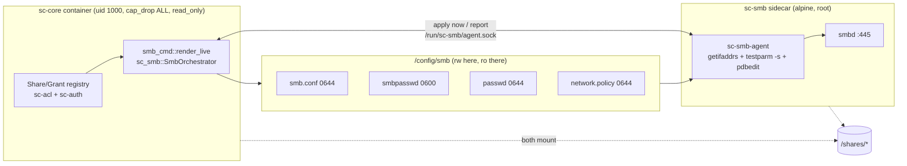

# SMB Access - Spec Proposal

| Item       | Detail                           |
|------------|----------------------------------|
| Author     | heavycaffeiner(Dong Hyun Kim)    |
| Created    | 2026-08-03                       |
| Status     | Implemented                      |
| Reviewers  |                                  |

---

## 1. Summary

Expose the same shares, to the same accounts, over SMB3 — without putting a
root-privileged `smbd` inside this server's address space. `sc-core` projects
its Share/Grant registry into four files (`smb.conf`, `smbpasswd`, `passwd`,
`network.policy`) in a shared directory; a Samba sidecar watches that
directory, expands the network scope, validates each candidate, and reloads
`smbd`.

Authentication is the account password: NTLM needs `MD4(UTF-16LE(password))`,
so an NT hash is derived alongside the Argon2 hash at every moment the
plaintext is held. That trade is accepted **only** because SMB answers on the
networks this machine is attached to and nowhere else, by an enforced control
rather than by convention.

## 2. Background & Motivation

### 2.1 Where we are today

The web UI, WebDAV and the compat layer all reach the same tree through
`sc-vfs`. SMB is the one access path a file server is still expected to have
and this deployment did not: a desktop that maps a drive letter, a TV that
browses a media share, a scanner that writes to a folder — none of them speak
WebDAV.

### 2.2 Why a sidecar rather than an all-in-one image

`smbd` binds port 445 and therefore starts as root. The whole point of the
core image is that it never runs as root at all (`user: "1000:1000"`,
`cap_drop: ALL`, `read_only`, distroless). Putting `smbd` in the same
container would give that root process the same address space as the code
handling untrusted HTTP.

Splitting them means the only thing crossing the boundary is four files on a
volume the sidecar mounts read-only. `sc-core` never invokes a Samba binary,
and `sc-smb` never sees a plaintext password or an NT hash.

### 2.3 What the shared account password costs

Recorded because it is a real cost, not a free win.

| scenario | separate SMB password | shared account password |
|---|---|---|
| DB leaked alone | safe | safe — AEAD ciphertext only |
| DB + master key leaked | only SMB exposed; Argon2 still protects the account | account password crackable at MD4 speed |
| pass-the-hash | SMB only | SMB, and web/WebDAV after a successful crack |

MD4 is not memory-hard. The scenario already assumes the attacker holds both
the database and the master key, at which point session tokens, share links
and TOTP seeds are gone too — so the marginal loss is "a password reused
elsewhere". The mitigation that makes this acceptable is §4.6's link-scoped
bind, not the hash choice.

## 3. Goals & Non-Goals

### 3.1 Goals

- [x] SMB3 access to every registered share, authenticated per account.
- [x] `valid users` / `read list` / `write list` derived from the same
      Share/Grant registry the HTTP layer uses — one source of truth.
- [x] No plaintext and no NT hash ever crosses into the sidecar.
- [x] SMB confined to the networks the machine is attached to, by what the
      sidecar binds, not by documentation.
- [x] A permission change in the web UI reaches `smbd` without an operator
      running anything.
- [x] Permissions SMB cannot express are reported, never silently widened.
- [x] The same contract on bare metal, with no Docker: the same
      `sc-smb-agent` binary, under systemd or OpenRC instead of supervising
      smbd itself.

### 3.2 Non-Goals

- [ ] Active Directory membership (`security = ADS` + winbind). Strictly
      better where available — the NT-hash trade disappears entirely — but it
      is a different deployment model, not an increment on this one.
- [ ] Per-operation SMB permissions. Samba's `write list` is one flag for
      five separate grants; see §4.5.
- [ ] Exposing SMB to the internet. `smb.allow_public_bind` exists as an
      escape hatch and raises a permanent warning; it is not a supported mode.
- [ ] Printer sharing, NetBIOS name service, SMB1/2 — all switched off.

## 4. Technical Design

### 4.1 Architecture Overview



Two properties this shape buys, both load-bearing:

1. **`smbd`'s root privilege is outside our process.** The sidecar's only
   input is a directory it mounts read-only.
2. **A bad render cannot take SMB down.** Every candidate is validated with
   `testparm -s` before it reaches `smbd`; a rejected one leaves the previous
   config running.

### 4.2 Data Model Changes

`user_smb_secret` — one row per account holding the NT hash, sealed with the
master key (AEAD, AAD = the account's row id).

| column | meaning |
|---|---|
| `user` | account row id, FK to `user` |
| `nt_hash_ct` | AEAD ciphertext of `MD4(UTF-16LE(password))` |
| `key_ver` | master-key generation, for rotation |

A dedicated table, not a column on `user`, so the access type does not
implement `Serialize` and cannot leak into an API response. `user` also
carries `smb_enabled` (default 1) and `smb_opt_out`.

### 4.3 Core Logic — the projection

`project_registry_shares` folds the registry into Samba's vocabulary:

- **One `[section]` per distinct grant root**, not per share. A grant on a
  subdirectory is precisely what Samba cannot express otherwise: `smb.conf`
  has no per-path ACL, so a subpath grant becomes its own share rooted there.
- A user lands in `write list` when their effective permissions at that root
  include any mutating bit (WRITE, CREATE, DELETE, RENAME, MOVE), and in
  `read list` otherwise. Everyone named in either is also in `valid users`.
- Accounts that cannot use SMB at all — `disabled`, `smb_opt_out`, no
  `smb_enabled` — are omitted entirely rather than listed and refused at
  connect time. `smb.conf` is also documentation of who has access.

### 4.4 Core Logic — the uid contract

Both rendered files carry **`smb.service_uid + <account row id>`** for a given
account: unique per account, identical between the two files. Both properties
are load-bearing, and each was learned by breaking it:

- **They must match each other.** Samba resolves an `smbpasswd` line to a Unix
  account through this uid. `pdbedit -i` imports *nothing* when it names no
  passwd entry — exit 0, no error, no log line, an empty passdb, every login
  answered `NT_STATUS_NO_SUCH_USER`.
- **They must be unique per account.** `pdbedit -i` matches by uid, not by
  name, so several names on one uid all import as whichever name `getpwuid`
  answers with — one entry, for all of them.

The gid stays shared (`smb.service_gid`): that is what the group ACE on a 0775
share root is checked against. Uniqueness costs nothing elsewhere, because
`force user`/`force group = scsvc` decides what a connection actually writes
as — a second account's uploads still land `scsvc:scsvc`.

**Share roots must be 0775, not 0755.** Under `force user`, Samba runs its own
NT ACL check with the *authenticated* user's SID, which is not the owner's, so
it falls through to the group ACE. At 0755 every create fails
`NT_STATUS_ACCESS_DENIED` while reads, listings and authentication all still
work — which makes it look like a bug in `sc-core`.

### 4.5 Core Logic — what Samba cannot express

Two grant shapes are wider over SMB than in the registry. Neither is fixable
in `smb.conf`, so both are **reported per grant** — an audit event and a list
on the admin settings screen — rather than applied silently.

| shape | what SMB does | reported as |
|---|---|---|
| WRITE without DELETE (or any subset of the five mutating bits) | `write list` grants all five | `smb.write_list_grants_more` |
| a deny below a share root | share exports the whole tree; the deny does not apply | `smb.deny_below_root_ignored` |

Not a refusal: both are legitimate web-side configurations, and disabling SMB
for the whole deployment because one grant is finer than SMB's vocabulary
would be the worse answer. But an admin who wrote a restriction is entitled to
know SMB is not honouring it.

Two further differences are inherent and documented rather than reported:
SHARE and DOWNLOAD have no SMB counterpart, and an SMB delete is a real
unlink — Samba's `recycle` module is not enabled, so a share with trash on in
the web UI still deletes permanently over SMB.

### 4.6 Core Logic: link-scoped access

Revised by `design/stowcloud-1-smb-link-scoped-access.md`, which supersedes the
fixed private-CIDR list this section previously specified. Four layers, because
this is the premise the whole NT-hash trade rests on.

1. **A closed baseline from `sc-core`.** It renders `interfaces = lo` and
   `hosts allow = 127.0.0.0/8 ::1/128`, because it sits in its own network
   namespace and cannot see the devices `smbd` will bind. Nothing expands them,
   SMB answers on loopback.
2. **Expansion where `smbd` runs.** The sidecar (and the bare-metal agent) reads
   the host's own UP interfaces and rewrites those two lines: the device into
   `interfaces`, the well-known private range enclosing its address into
   `hosts allow`. A network the machine is attached to needs no configuration;
   a globally routable address contributes nothing unless
   `smb.allow_public_bind` is set, which also raises a permanent admin-UI banner
   plus an audit event.
3. **Defense in depth in the generated config**: `bind interfaces only`,
   `interfaces`, `hosts allow`, `hosts deny = 0.0.0.0/0`.
4. **Startup self-diagnosis** of the actually-listening sockets.

### 4.7 Core Logic — propagation

`smbd` authorises against the last file this server wrote, and **nothing
rewrites it on a timer, at startup, or on any schedule.** Anything that
narrows access therefore has to raise the signal itself, or it narrows
nothing.

| change | raised by |
|---|---|
| password, OIDC link/unlink, TOTP on/off, SMB toggles | `sc-auth`, via `PassdbSink` |
| account disabled / re-enabled / deleted | `sc-auth` |
| group created / deleted / member added / removed | `sc-auth` |
| grant created / updated / deleted | admin routes |
| share created / updated / deleted | admin routes |

The signal only sets a flag; a publisher thread coalesces a burst into one
render 250 ms later, so five accounts changed by one admin action cost one
render, not five. A failed render logs loudly and leaves the previous file in
place rather than failing the request that triggered it.

`App::arm_passdb_publisher` arms that thread only when `smb.enabled` was true
**at startup**, which is why turning SMB on reports `restart_required`.
Between enabling it and that restart, `sc-server smb-sync` is the only thing
that publishes.

## 5. API Design

### 5-1. New / Modified

**`PATCH /api/admin/server-settings/smb`** — admin only.

```jsonc
// request
{ "enabled": true, "workgroup": "WORKGROUP", "service_user": "scsvc",
  "allow_public_bind": false, "totp_policy": "require_separate",
  "service_uid": 1000, "service_gid": 1000 }
// response
{ "applied_live": false, "restart_required": true }
```

The render runs against a **candidate** config and only a success commits the
override and the live config. Persisting first would leave `smb.enabled = true`
durably recorded with nothing rendered — an instance that reports SMB on and
serves nothing, and which answers the next identical request `applied_live`
because by then the config already agrees with it.

**`GET /api/admin/server-settings`** — gains `smb_overgrants`, §4.5's list.
`key` is a catalogue key and `detail` its placeholders; the server never sends
the sentence.

```jsonc
{ "smb_public_bind_warning": false,
  "smb_overgrants": [
    { "share": "photos", "user": "bob",
      "key": "smb.write_list_grants_more", "detail": ["delete","rename","move"] }
  ] }
```

**`sc-server smb-sync`** — the operator's "publish now". Opens its own
short-lived `AuthService`, renders explicitly, installs no sink. The only
thing that publishes before the arming restart, and the answer whenever the
running server's own signal has not fired.

**`AuthService::export_smbpasswd(base_uid: u32) -> Result<String>`**

```rust
/// Renders an smbpasswd(5) file for every account with `smb_enabled` and a
/// decryptable NT hash. Field 2 is `base_uid + <account row id>` — see §4.4
/// for why it must match the passwd entry and be unique per account.
/// LM hash is always disabled (32 'X's); NTLMv2 only.
```

**`AclEngine::denies_below(user, share, root) -> Vec<String>`** — subpaths
strictly below `root` where a grant denies that user something the root
allows. Phrased as an ACL question, not an SMB one: a depth-varying decision
inside one tree is exactly what any flat-ACL exporter cannot carry.

### 5-2. Error Handling

| Condition | Surfaced as |
|---|---|
| an invalid share name or server name | 422, `SmbConfigRefused` |
| `config_dir` unwritable | 422; previous files left in place |
| `testparm -s` rejects the candidate | sidecar keeps the running config, error to the admin UI |
| `pdbedit -i` imported nobody | sidecar warns per name; SMB stays up for everyone else |
| an account's NT hash will not decrypt | that account is skipped with a warning; the rest still export |
| a share names an account that does not exist | no passwd entry, no smbpasswd line; Samba refuses it at connect |
| TOTP account under `require_separate` | account-derived hash deleted; dedicated SMB password required |

Two of these are warnings rather than refusals on purpose. An undecryptable
NT hash was once treated as fatal and took production down over a single
stale row; one bad passdb entry must not take SMB down for everyone else.

## 6. Implementation Plan

### 6-1. Milestones

| Phase | Task | Duration | Owner |
|---|---|---|---|
| Phase 1 | `sc-smb`: config rendering, scope baseline, `write_all` | done | heavycaffeiner |
| Phase 2 | `sc-auth`: NT-hash derivation, sealing, `export_smbpasswd` | done | heavycaffeiner |
| Phase 3 | Registry projection + `sc-server smb-sync` | done | heavycaffeiner |
| Phase 4 | Sidecar image, entrypoint, fail2ban, healthcheck | done | heavycaffeiner |
| Phase 5 | Bare-metal agent + 3-distro test suite | done | heavycaffeiner |
| Phase 6 | Live propagation, over-grant reporting, admin UI | done | heavycaffeiner |
| Phase 7 | `sc-smb-agent` replaces both shell agents; control socket | done | heavycaffeiner |

Phase 7 closed three failures the file-drop-only shape allowed. The scope
detection shelled out to `ip addr show` with the error swallowed, so an image
without `ip` served loopback and said nothing. A reload was used where the
`interfaces` line had changed, which smbd cannot apply without rebinding.
And a share, a grant or a group membership changed nothing at all until a
settings-screen save or an `smb-sync`, because no write path rendered.

### 6-2. Dependencies

- **Samba** ≥ 4.20 in the sidecar (`smbd`, `testparm`, `pdbedit`,
  `smbcontrol`), plus `fail2ban` and `inotify-tools`. Alpine base.
- **Kernel**: Landlock and seccomp for the core container's self-restriction;
  the SMB config directory must be inside the Landlock allow-list or every
  in-process render fails `EACCES`.
- No new Rust dependency. `sc-smb` renders text and touches no Samba binary.

## 7. References

- `proposals/stowcloud-13-deployment.md` — the operational contract this specifies
- `stowcloud-10-auth.md` — NT-hash derivation, and what a linked identity
  does to it
- `stowcloud-12-architecture.md` — where the LAN-only premise sits among
  the five principles
- `crates/sc-smb/`, `crates/sc-server/src/smb_cmd.rs`, `deploy/smb/`
- `scripts/smb-native-test.sh` — the bare-metal agent's 3-distro suite
- [smbpasswd(5)](https://www.samba.org/samba/docs/current/man-html/smbpasswd.5.html),
  [smb.conf(5)](https://www.samba.org/samba/docs/current/man-html/smb.conf.5.html)
