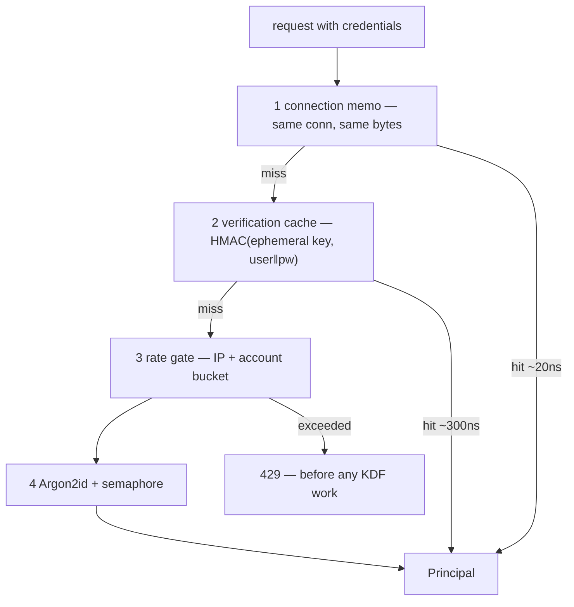

# Authentication and Access Control - Spec Proposal

| Item       | Detail                           |
|------------|----------------------------------|
| Author     | heavycaffeiner(Dong Hyun Kim)    |
| Created    | 2026-08-03                       |
| Status     | Implemented                      |
| Reviewers  |                                  |

---

## 1. Summary

`sc-auth` owns accounts, sessions, app passwords, TOTP, the audit log, and the
grant model everything else authorises against. Argon2id protects stored
passwords; a three-tier verification path keeps that affordable on protocols
that re-authenticate every request.

## 2. Background & Motivation

### 2.1 The constraint that shapes everything

Argon2id at 48 MiB takes ~80 ms. That is correct for a login form and
impossible for WebDAV, where a sync client sends hundreds of requests a minute
and each carries the same Basic credential. Running the KDF per request would
make the server slower than the disk it fronts and turn a normal sync into a
self-inflicted denial of service.

So the design is not "how strong a KDF" but "how few times must it run".

### 2.2 Why 48 MiB rather than 64

The memory cost is multiplied by the concurrency cap, and the product has to
fit the container's budget: 48 MiB × 4 concurrent = 192 MiB peak. A stronger
per-hash setting that lets four concurrent logins exhaust the container is not
stronger in practice.

## 3. Goals & Non-Goals

### 3.1 Goals

- [x] Password storage that survives a database leak.
- [x] Per-request authentication cheap enough for WebDAV.
- [x] No account-existence oracle on any surface.
- [x] Second-factor enforcement that no protocol path can bypass.
- [x] Revocation that actually revokes — including over SMB.

### 3.2 Non-Goals

- [ ] JIT provisioning from an identity provider. The provider authenticates;
      it never creates accounts. Authority stays in the local database.
- [ ] A password-strength meter as a gate. Length minimum plus a breach-style
      denylist, not composition rules.
- [ ] Storing the SMB password separately from the account password. That
      trade is examined in `stowcloud-1-smb.md`; it is accepted only because
      SMB is confined to private networks.

## 4. Technical Design

### 4.1 Architecture Overview



The rate gate sits **before** Argon2 deliberately: a flood must be rejected
without paying for it.

### 4.2 Data Model Changes

Accounts, groups and memberships; sessions; app passwords; TOTP secrets and
recovery codes; the SMB NT secret in its own table; the audit log. Grants live
in their own database — a grant is not reconstructible from the filesystem, so
losing it silently locks users out rather than costing a recompute.

Parameters travel *with* each password hash as a PHC string, so raising the
default needs no migration: a login rehashes with the current parameters right
after verification succeeds.

### 4.3 Core Logic — the three tiers

- **Connection memo.** Keyed on a hash of the raw `Authorization` bytes plus a
  snapshot of a global generation counter, attached to connection state. It
  dies with the connection, which is what makes it safe.
- **Verification cache.** An HMAC under an ephemeral per-process key, so the
  cache never holds anything that survives a restart or means anything if
  dumped.
- **Generation counter.** Any change that should invalidate credentials bumps
  it, and every tier compares against it with one atomic load. O(1) global
  invalidation rather than hunting entries.

### 4.4 Core Logic — sessions and CSRF

The session cookie is `__Host-` prefixed: `Secure`, `Path=/`, no `Domain`,
`HttpOnly`, `SameSite=Lax`.

CSRF applies to **cookie-authenticated state-changing requests only**. A
Bearer token requires a header a cross-site form cannot set, so requiring a
second token there would be ceremony. The CSRF value is derived, not stored —
an HMAC over the session token under a per-process key — so there is no second
table to keep in sync and no way for the two to drift. Both the header and the
`Origin` must satisfy the check.

### 4.5 Core Logic — app passwords and scope

A high-entropy token stored as a plain SHA-256 digest: unlike a user-chosen
password it has no guessable structure, so a memory-hard KDF would buy nothing
and cost the per-request budget §2.1 is about.

A token may be scoped by permission mask and by share. The scope gate runs
after auth and before the handler, so a restricted token cannot reach a
resource its scope excludes even if the handler forgets to ask.

### 4.6 Core Logic — second factor

TOTP with recovery codes. Enabling *or* disabling requires re-confirming the
password: without that, a stolen session could remove the second factor, which
is exactly the thing the second factor exists to survive.

The interaction with per-request protocols is non-negotiable and is the reason
SMB and Basic-auth paths carry an explicit policy: a protocol with no slot for
a second factor must not become a way around it. For SMB that means a TOTP
account's account-derived credential is deleted and a dedicated one required,
or SMB is refused for that account entirely.

### 4.7 Core Logic — enumeration and brute force

`auth.invalid_credentials` is returned identically whether or not the account
exists — same code, same message, and the same work done, because a timing
difference is an oracle just as a different status is. A hash of a random
secret nobody holds is verified against when the account is absent, so the
timing matches.

Rate limiting is dual: per IP and per account. Per-IP alone lets a botnet
spread across addresses; per-account alone lets one address sweep every
account.

### 4.8 Core Logic — single sign-on

Link-only: the provider proves an identity, and a session is issued **only**
when that identity is already linked to a local account. The provider never
creates accounts, and authority — role, grants — stays local.

Linking has consequences the rest of the system must honour, and this is where
revocation gets interesting: a linked account's password stops working for
SMB, which means deleting the stored NT hash rather than merely declining to
derive a new one. An admin-side unlink cannot restore it, because the admin
has no plaintext; only the user's own unlink, which re-confirms their
password, can.

Every path that changes what the published SMB credential file should contain
raises a republish signal — see `stowcloud-1-smb.md` §4.7 for the full table.
Without that, revoking access in the web UI revokes nothing over SMB.

## 5. API Design

### 5-1. New / Modified

```
POST /api/setup                   one-time token → the first administrator
POST /api/auth/login              → session cookie, or a TOTP challenge
POST /api/auth/login/totp         → session cookie
GET  /api/auth/session            identity, roots, CSRF token
POST /api/auth/password           self-service change
POST /api/auth/totp/{setup,enroll,disable}
GET|POST|DELETE /api/auth/app-passwords[/{id}]
GET|DELETE /api/auth/sessions[/{id}]
GET  /api/auth/oidc/{config,start,callback}
```

**First-run bootstrap**: a 256-bit token printed once and written to the data
directory at mode 0600, expiring in 15 minutes. The authoritative "is setup
closed?" is *"does an account exist?"*, read from the database every time —
not a flag. A flag in memory would reopen admin creation on restart, and a
marker row is a second copy of a fact the account table already states, which
a restore can put out of step.

### 5-2. Error Handling

| Condition | Result |
|---|---|
| bad password, or no such account | `401 auth.invalid_credentials`, identical either way |
| second factor required | `200` with a challenge — a flow step, not an error |
| rate limit reached | `429` with `Retry-After`, before any KDF work |
| setup already complete | `410` — the route is gone for good |
| setup token expired | `403`; a restart reissues while no account exists |
| app-password scope excludes the target | denied at the gate, before the handler |

## 6. Implementation Plan

### 6-1. Milestones

| Phase | Task | Duration | Owner |
|---|---|---|---|
| Phase 1 | Argon2id, concurrency cap, PHC rehash-on-login | done | heavycaffeiner |
| Phase 2 | Sessions, derived CSRF, cookie hardening | done | heavycaffeiner |
| Phase 3 | Three-tier verification, generation counter | done | heavycaffeiner |
| Phase 4 | App passwords + scope gate | done | heavycaffeiner |
| Phase 5 | TOTP, recovery codes, reconfirmation | done | heavycaffeiner |
| Phase 6 | Audit log, roles, grants | done | heavycaffeiner |
| Phase 7 | OIDC link-only sign-on | done | heavycaffeiner |

### 6-2. Dependencies

- `argon2`, `hmac`/`sha2`, `subtle` for constant-time comparison,
  `secrecy` so plaintext is not copied around casually, `totp-rs`,
  `jsonwebtoken` for ID-token verification.

## 7. References

- `crates/sc-auth/`, `crates/sc-oidc/`, `crates/sc-server/src/setup.rs`
- `stowcloud-0-oidc-login.md` (the sign-on flow in full),
  `stowcloud-1-smb.md` (the NT-hash trade and republish table),
  `stowcloud-9-api.md` (where the middleware runs these checks)
