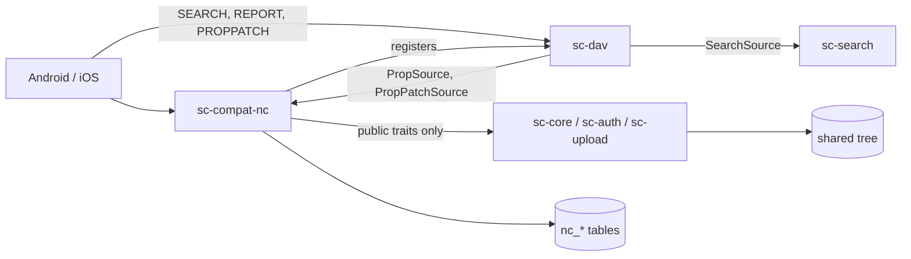

# Mobile-Client Compatibility Completion - Spec Proposal

| Item       | Detail                           |
|------------|----------------------------------|
| Author     | heavycaffeiner(Dong Hyun Kim)    |
| Created    | 2026-08-10                       |
| Status     | **Implemented**                  |
| Reviewers  |                                  |

---

## 1. Summary

`sc-compat-nc` already carries the Android and iOS clients through setup,
browse, sync, upload, share and preview. Four screens those apps ship still
cannot work against this server: search, the photo timeline, favourites and
deleted files. This proposal specifies the server work that makes them
function, plus the account-lifecycle endpoints a phone needs in order to log
out without leaving a live credential behind.

Scope is file management. Collaboration features stay non-goals, and the
capability document keeps saying so.

## 2. Background & Motivation

### 2.1 How the gap got here

`stowcloud-8-compat.md` was written from the desktop client's request set plus
whatever the mobile setup flow exercised on a real handset. Everything past
setup was reached by reading app sources, and only the parts that setup
touched were reached at all. The result works for the flow that was tested and
stops at the edge of it.

The two client libraries are closed sets. `nextcloud/android-library` and
`nextcloud/NextcloudKit` between them contain every request either app can
issue. Enumerating that set is what turns "complete compatibility" into a
checkable claim.

### 2.2 What an audit of both libraries found

Six defects, in descending order of how badly they mislead a user.

**1. `undelete` is advertised and there is no trashbin.**
`capabilities.rs` emits `files.undelete = true` and a top-level
`undelete = true`. `dav_paths::parse` has no `trashbin` arm, so
`PROPFIND /remote.php/dav/trashbin/{user}/trash` falls through `h_remote` to a
bare 404. Both apps put a "Deleted files" entry in the navigation drawer on
the strength of that capability. The menu exists and every tap on it fails.

**2. `oc:favorite` is read-only and always zero.**
`props.rs` reads the flag from `nc_favorite`, and nothing writes that table.
Android sends `PROPPATCH oc:favorite` on `{dav}/files/{user}{path}`; iOS sends
the same. `oc:` is not in `sc-dav`'s protected `LIVE_PROPS`, so the write
lands in the dead-property store via `Meta::set_prop`, returns `200`, and the
next PROPFIND still reports `0`. The star fills in and then reverts.

**3. Search never issues a request.**
`SearchRemoteOperation.run()` sends `OPTIONS {base}/remote.php/dav` and returns
failure unless the `Allow` header contains `SEARCH`:

```kotlin
// SearchRemoteOperation.kt
val optionsStatus = client.executeMethod(optionsMethod)
if (!optionsMethod.isAllowed("SEARCH")) {
    client.exhaustResponse(optionsMethod.getResponseBodyAsStream())
    return RemoteOperationResult(false, optionsStatus, optionsMethod.responseHeaders)
}
```

`sc_dav::ALLOW` is `OPTIONS, GET, HEAD, PUT, DELETE, PROPFIND, PROPPATCH,
MKCOL, COPY, MOVE, LOCK, UNLOCK`. The app never sends a search at all, so the
search box returns nothing and reports no error. `sc_dav::route` answers 405
for `SEARCH` and `REPORT`, which is the honest status for a method with no
handler, and is also why the `Allow` header must not name them before one
exists.

**4. The photo timeline is a search.**
Both apps build their media grid as a `d:basicsearch` over
`getcontenttype like image/%` or `video/%`, ordered by `d:getlastmodified`
descending, with `d:limit/d:nresults` for paging. iOS pages it by an mtime
window (`d:lt`/`d:gt` on a date pair). Same blocker as 3.

**5. Logout does not revoke.**
Both apps call `DELETE /ocs/v2.php/core/apppassword` when the user removes the
account. The OCS dispatcher has no arm for it, so the request lands in the
catch-all and answers OCS `998`. The app password issued by Login Flow v2 stays
valid for the life of the server.

**6. Media streaming falls back to a full download.**
`/ocs/v2.php/apps/dav/api/v1/direct` is in `stubs::NOT_FOUND_PATHS`. Android's
`StreamMediaFileOperation` uses it to hand a URL to an external player, and
iOS uses the same route. Without it, playing a video means downloading it
whole first.

### 2.3 The two features the apps use that this server cannot address by name

`/ocs/v2.php/cloud/users/{userId}` is unimplemented, so neither app can turn a
sharee's login name into a display name. `/index.php/core/wipe/check` is
unimplemented, so a revoked credential on a lost phone leaves the local copies
of files on that phone untouched.

### 2.4 Push, and why it is not here

The user-visible question "why do I not get notifications" has a settled
answer. Neither `nextcloud/android-library` nor `NextcloudKit` contains a
single reference to `notify_push`, `push/ws` or a websocket; a GitHub code
search for either term across `nextcloud/android` and `nextcloud/ios` returns
zero hits, while `nextcloud/desktop` returns fourteen
(`src/libsync/pushnotifications.cpp` and its capability plumbing). The
websocket channel is a desktop-client feature.

The mobile path is different and closed. Both apps register a device at
`/ocs/v2.php/apps/notifications/api/v2/push` and the server relays through a
push proxy whose address it advertises back to the client, which then reaches
FCM or APNS. The sender credential for the shipped apps belongs to Nextcloud
GmbH, so no third-party proxy can deliver to them. Implementing either half
would move no bytes to a phone.

## 3. Goals & Non-Goals

### 3.1 Goals

- [ ] DAV `SEARCH` and `REPORT`, so file search, recently-modified, gallery,
      file-id lookup and favourites listing work in both apps.
- [ ] `oc:favorite` becomes a writable live property, per user.
- [ ] A trashbin collection over the per-share trash the core already has.
- [ ] Account lifecycle: app-password revocation on logout, other-user
      lookup, remote-wipe check.
- [ ] A signed direct-download URL for media streaming.
- [ ] The unified-search OCS provider, backed by the same engine as `SEARCH`.
- [ ] Not one line of vendor vocabulary in any core crate. Both CI gates from
      `stowcloud-8-compat.md` stay green.
- [ ] Every capability key keeps matching what is actually served. `undelete`
      becomes true *because* there is a trashbin, not before.

### 3.2 Non-Goals

**Versioning.** The premise of this project is that the folder on disk is the
storage. A version history is a second copy of every edited file, kept
somewhere the user did not put it. `files.versioning` stays `false` and the
apps keep hiding the menu.

**Push, in both halves.** Section 2.4. `notify_push` stays absent from
capabilities and the `notifications.push` array stays empty.

**Collaboration and app surfaces.** Comments, system tags, activity, Talk,
groupware, federation, end-to-end encryption, direct editing, richdocuments,
templates, dashboard widgets, recommendations, groupfolders, terms of service,
governance labels, the assistant, hovercards and user status. Each stays
`false` or absent in capabilities according to whether the client reads the
key's value or its presence.

**File locking.** `files.locking` is `false`, `nc:lock` is `0`, and both apps
hide the lock menu. The advertisement and the behaviour already agree, so
there is nothing to fix and nothing to gain.

**Avatars.** `/index.php/avatar/{user}/{size}` keeps answering a routed 404.
There is no avatar store, both apps fall back to drawn initials, and the
existing handler already avoids the two failure modes that matter (an HTML
body reaching an image decoder, and a `304` that iOS treats as an error).

## 4. Technical Design

### 4.1 Architecture Overview



Three new seams, all of them protocol-neutral and all of them pointing the
same way dependencies already point.

1. **`SearchSource`** in `sc-dav`. RFC 5323 `SEARCH` is a DAV method, so its
   XML parsing belongs in the DAV crate. The crate parses `d:basicsearch` into
   a neutral request struct and asks a registered source to answer it.
   `sc-server` implements that source over `sc-search`.
2. **`ReportSource`** in `sc-dav`, keyed on the report body's root element
   name. `oc:filter-files` is vendor vocabulary, so `sc-dav` never parses it;
   it hands the body to whichever source claimed that element name, and
   `sc-compat-nc` registers for it.
3. **`PropPatchSource`** in `sc-dav`, the mirror of the existing `PropSource`.
   A source claims a `(namespace, name)` pair and handles its write, so the
   property never reaches the dead-property store. `sc-compat-nc` claims
   `{http://owncloud.org/ns}favorite`.

The trashbin needs no new seam. It is a `/remote.php/...` URL shape, so it is
parsed by `dav_paths::parse` and served by `sc-compat-nc` against
`Core::trash_list` / `trash_restore` / `trash_purge`, which are already public.

### 4.2 Data Model Changes

**No new tables.** `nc_favorite` already exists and already has the shape the
write path needs (`(user, fileid)`); today nothing inserts into it.

**One port signature changes.** `AuthPort::verify_basic` returns a
`Principal`, which carries no credential identity, so a handler cannot say
"revoke the credential this request arrived on". It gains a credential id:

```rust
/// Identifies the credential a request authenticated with, so a handler can
/// revoke exactly that one. `None` for a browser session, which is revoked
/// through its own path and never through the app-password API.
pub struct Principal {
    pub user: UserId,
    pub login_name: String,
    pub display_name: String,
    pub credential_id: Option<u32>,
}
```

`AuthPort` gains one method:

```rust
/// Revoke one app password belonging to `user`. Idempotent: revoking an
/// already-revoked or non-existent credential is `Ok(())`, so a client that
/// retries its logout does not see an error it cannot act on.
fn revoke_app_password(&self, user: UserId, credential: u32) -> PortResult<()>;
```

**Trash entry ids are derived, not stored.** See 4.3.4.

### 4.3 Core Logic

#### 4.3.0 The isolation test, applied to the new work

The question from `stowcloud-8-compat.md` §4.3, asked again for every item
here.

| Feature | Would it exist without the compat layer? | Lives in |
|---|---|---|
| filename / mtime / mime / size filtered walk | yes, the native search already is one | `sc-search` |
| RFC 5323 `SEARCH` method and `d:basicsearch` parsing | yes, it is a DAV method | `sc-dav` |
| `REPORT` dispatch by root element name | yes, it is a DAV method | `sc-dav` |
| a settable live property hook | yes, DAV has live properties by definition | `sc-dav` |
| per-share trash, restore, purge | yes, the web UI already has all three | `sc-core` |
| signed single-file URL on the content origin | yes, previews already mint them | `sc-core` / `sc-preview` |
| app-password revocation | yes | `sc-auth` |
| `oc:filter-files` body parsing | no | compat |
| `d:basicsearch` to `SearchRequest` field mapping quirks | no | compat where vendor-specific |
| the flat `trashbin/{user}/trash` URL layout and `nc:trashbin-*` props | no | compat |
| the unified-search OCS envelope and entry shape | no | compat |

#### 4.3.1 `SEARCH`: what the clients actually send

The union of both clients' query bodies is small and fixed. Everything below
is a `d:searchrequest` / `d:basicsearch` sent to `/remote.php/dav`.

| Client intent | `d:where` shape | Maps to |
|---|---|---|
| filename search | `d:like` on `d:displayname`, literal `%term%` | substring matcher |
| favourites | `d:eq` on `oc:favorite`, literal `yes` (Android) or `1` | `nc_favorite` lookup, no walk |
| recently modified | `d:gt` on `d:getlastmodified` | mtime lower bound |
| photos | `d:like` on `d:getcontenttype`, literal `image/%` | mime prefix |
| gallery | `d:or` of two `d:like` on `d:getcontenttype`, `image/%` and `video/%` | mime prefixes |
| by file id | `d:eq` on `oc:fileid` | direct `sc-meta` lookup, no walk |
| date window | `d:and` of `d:lt` and `d:gt` on `d:getlastmodified` | mtime range |
| folders only | `d:and` with `d:is-collection` | kind filter |

Plus, outside `d:where`:

- `d:from/d:scope/d:href` is `/files/{userId}` and `d:depth` is `infinity`.
- `d:orderby` is `d:getlastmodified` `d:descending`, sometimes with
  `d:displayname` as a tiebreak.
- `d:limit/d:nresults` caps the result count.
- `d:select/d:prop` is the same property set as a folder PROPFIND, so the
  response is an ordinary `207` multistatus and the existing `PropSource`
  answers it unchanged.

The neutral request `sc-dav` builds from that:

```rust
/// A parsed RFC 5323 basic search, stripped of protocol shape. Every field is
/// a filter; a `None` field constrains nothing. `sc-dav` never interprets
/// these, it only fills them in and hands them to the registered source.
pub struct SearchRequest {
    /// Vpath prefix the search is confined to, already resolved from
    /// `d:from/d:scope/d:href` and rejected if it named someone else's tree.
    pub scope: String,
    /// Substring of the entry name, case-insensitive, from `d:like` on
    /// `d:displayname` with the surrounding `%` stripped.
    pub name_contains: Option<String>,
    /// Media type prefixes from `d:like` on `d:getcontenttype`, e.g.
    /// `["image/", "video/"]`. Matched by extension; we never sniff content.
    pub mime_prefixes: Vec<String>,
    /// Inclusive mtime bounds in nanoseconds since the epoch.
    pub mtime_from_ns: Option<i128>,
    pub mtime_to_ns: Option<i128>,
    /// `Some(true)` restricts to directories, `Some(false)` to files.
    pub is_collection: Option<bool>,
    /// Exact file id, from `d:eq` on the vendor id property. When set, the
    /// source answers by lookup and performs no walk.
    pub file_id: Option<FileId>,
    /// Only entries the user has marked. Answered from the compat table, not
    /// from the walk.
    pub favourites_only: bool,
    /// `d:limit/d:nresults`, clamped to the server ceiling.
    pub limit: u32,
    /// The only ordering either client asks for.
    pub newest_first: bool,
}
```

`sc-search`'s `Matcher` already carries `needle` with a substring `MatchMode`,
`kinds`, `exts`, `size_range`, `mtime_range` and `scope`, and `WalkBudget`
already carries `max_results`, `max_entries`, `max_depth` and a time budget.
The mapping is field to field. `mime_prefixes` becomes an extension set
through the same media-type table `PreviewPort::can_preview` uses, because the
walker matches names and never opens files.

**Scope is a security boundary, not a hint.** `d:href` arrives as a
client-supplied string. It resolves to the caller's own virtual root or the
request is refused with `400`. A scope naming another account's tree is never
narrowed, corrected or silently reinterpreted, because a silent reinterpretation
is how a search endpoint becomes a cross-account read.

**Truncation is invisible on the wire.** The walk is budgeted, so a result set
may be short. The protocol has no field for "there was more", so a truncated
answer is indistinguishable from a complete one to the client. The budget is
therefore set from the same configuration as the native search, and the
truncation reason is logged server-side.

#### 4.3.2 `Allow` must be composed, not constant

`ALLOW` becomes a value on `DavService`, built at construction from the base
method set plus one entry per registered source. A build with `--no-default-features`
registers no search source, advertises no `SEARCH`, and answers 405 for it.
Advertising a method whose handler was compiled out is the same defect class as
advertising a capability we do not have, and the stripped-build CI gate would
not catch it, because the string would live in `sc-dav` rather than in the
compat crate.

#### 4.3.3 `REPORT` and `oc:filter-files`

iOS lists favourites with `REPORT` on `/remote.php/dav/files/{user}`:

```xml
<oc:filter-files xmlns:d="DAV:" xmlns:oc="http://owncloud.org/ns" xmlns:nc="http://nextcloud.org/ns">
  <d:prop>...the ordinary property set...</d:prop>
  <d:filter-rules><oc:favorite>1</oc:favorite></d:filter-rules>
</oc:filter-files>
```

`sc-dav` reads only the root element name off the body with its existing
hardened parser and dispatches to the source registered for it.
`sc-compat-nc` parses the rest and answers with the same
`SearchRequest { favourites_only: true, .. }` path as the `SEARCH` favourites
query, so there is one implementation and two entry points. An unclaimed root
element is `403 Forbidden` with a `DAV:supported-report` precondition, which is
what RFC 3253 specifies for an unsupported report.

#### 4.3.4 The trashbin over a per-share trash

The core's trash is per share, stored at `<share>/.sctrash/{uuid}-{base64url(orig_path)}`,
and **off by default**: `TrashMode::Off` is the per-share default and an admin
turns it on per share. The compat protocol has exactly one flat trash
collection per user. The mapping:

- **Listing.** `PROPFIND /remote.php/dav/trashbin/{user}/trash` with
  `Depth: 0` or `1` returns the union of `Core::trash_list(user, share)` over
  every share the caller can reach that has trash enabled. iOS sends the same
  URL with a trailing slash; both forms resolve to the same collection.
- **Entry naming.** An entry's URL segment is `{share_id}.{core_id}`. The core
  id is a `Uuid::simple` (32 lowercase hex) followed by `-` and a base64url
  body, so a `.` separator is unambiguous and needs no escaping. The encoding
  is derived, so there is no alias table to grow or sweep. It is not a
  capability: every operation re-resolves the share id and re-runs the ACL
  check, and an id naming a share the caller cannot reach is `404`, never
  `403`, matching the existing existence rule.
- **Restore.** `MOVE` from the entry to
  `Destination: /remote.php/dav/trashbin/{user}/restore/{anything}` calls
  `Core::trash_restore`. The destination leaf is ignored: the core restores to
  the path recorded in the entry name, recreating missing ancestors, which is
  what the user means by "put it back". A `Destination` outside the `restore/`
  collection is `400`.
- **Purge one.** `DELETE` on the entry calls `trash_purge(user, share, Some(id))`.
- **Empty all.** `DELETE` on `/remote.php/dav/trashbin/{user}/trash` itself
  calls `trash_purge(user, share, None)` for every reachable share with trash
  on. A partial failure answers `500` and says which shares were emptied,
  rather than reporting success for a job half done.
- **Empty is not missing.** When no reachable share has trash enabled the
  collection still exists and answers an empty `207`. A `404` there makes the
  app render an error for a state that is normal.

Properties on a trash entry, beyond the standard `DAV:` live set:

| Property | Value |
|---|---|
| `nc:trashbin-filename` | leaf of the original path |
| `nc:trashbin-original-location` | original share-relative path, no leading slash |
| `nc:trashbin-deletion-time` | `TrashEntry::deleted_at_ns` in whole seconds |
| `oc:id`, `oc:fileid` | the entry's own id, so the client has a stable key |
| `oc:permissions` | must contain `D`, or the app hides purge and restore |
| `nc:has-preview` | `false`; the trash preview endpoint is a non-goal |

`nc:trashbin-deletion-time` carries the time of the delete, taken from the
inode change time the move itself set, not the file's mtime. That distinction
is already made in `sc-core::trash` and must survive the mapping.

Once this exists, `files.undelete` and the top-level `undelete` are true for
the first time.

#### 4.3.5 `oc:favorite` as a settable live property

`PropPatchSource` is claimed for `{http://owncloud.org/ns}favorite`. A `d:set`
with text `1` inserts into `nc_favorite`, `0` deletes, and a `d:remove` of the
property is an unfavourite, which is how Android unstars.

One hazard carries over from PROPFIND: the core allocates file ids lazily, and
`nc_favorite` is keyed on one. `sc-dav`'s PROPPATCH path currently answers
`200` with a warning when `entry.id` is `None`, because Office aborts a save on
anything else and resends the value next time. That is right for a dead
property and wrong here: nothing resends a favourite. The source must
materialise an id before writing, and answer `500` if it cannot, so the client
sees the failure instead of a star that quietly does not stick.

Writing a favourite requires `WRITE` on the node, which is what `sc-dav`'s
PROPPATCH already enforces. Reads stay per user, as `props.rs` already tests.

#### 4.3.6 The direct download URL

`POST /ocs/v2.php/apps/dav/api/v1/direct` with a `fileId` form field returns
`{ "url": "..." }`. `/apps/dav/api/v1/direct` comes out of
`stubs::NOT_FOUND_PATHS`.

The URL is a signed, expiring URL on the content origin, minted by the same
mechanism as preview URLs (`stowcloud-6-preview-sharing.md`). Four rules,
because this hands out a URL that carries no `Authorization` header:

1. It names one file id, resolved and ACL-checked at issue time under the
   requesting principal.
2. It expires in minutes, not the reference's eight hours. The client uses it
   immediately, by handing it to a player process.
3. It is `GET`-only and grants read alone.
4. It is served from the content origin, so a signed URL can never reach an
   app-origin route.

A file id the caller cannot read is `404` inside the OCS envelope, never `403`.

#### 4.3.7 Logout, other users, remote wipe

**`DELETE /ocs/v2.php/core/apppassword`** revokes the credential the request
arrived on and answers `200` inside an OCS envelope, which is the only status
Android treats as success. A session-authenticated request has no credential
id and answers `403`: this endpoint exists to revoke app passwords, and letting
it act on something else would be a logout that silently did nothing.

**`GET /ocs/v2.php/cloud/users/{userId}`** returns the `/cloud/user` shape for
another account. This is an account-name oracle, so it is gated exactly the
way `ShareesApi` is: the default scope is accounts sharing a group with the
caller, and anything outside that scope is `404`, not `403`. The response omits
quota, which is nobody else's business.

**`POST /index.php/core/wipe/check`** takes the app password as a form field
and answers `{"wipe": true}` when that credential has been marked for wipe, and
`{"wipe": false}` otherwise. The client treats any non-200 as "no wipe", so the
absence of this route is safe, which is why it is last. `POST /index.php/core/wipe/success`
retires the credential once the app reports it has erased its local copies.
Marking a credential for wipe is an action in the existing app-password
management UI, not a new subsystem.

#### 4.3.8 Unified search

`GET /ocs/v2.php/search/providers` returns one provider,
`{ "id": "files", "name": "Files", "order": 0 }`. `GET /ocs/v2.php/search/providers/files/search?term=&limit=&cursor=`
returns `{ "name", "isPaginated", "entries", "cursor" }` where each entry is
`{ "thumbnailUrl", "title", "subline", "resourceUrl", "icon", "rounded", "attributes" }`
and `attributes` carries `fileId` and `path`. Both apps read `attributes.path`
in preference to parsing `resourceUrl`, so it is always populated.

This is an OCS wrapper over the same `SearchRequest` path as 4.3.1, with
`name_contains` set from `term`. It ships last because the DAV `SEARCH` route
already gives both apps a working file search; this one drives the separate
unified-search screen.

## 5. API Design

### 5-1. New / Modified

**DAV methods**, on the existing `/remote.php/dav` mount:

```
SEARCH   /remote.php/dav                        RFC 5323 basic search
REPORT   /remote.php/dav/files/{user}           oc:filter-files (favourites)
PROPPATCH /remote.php/dav/files/{user}/**       oc:favorite becomes settable
OPTIONS  /remote.php/dav                        Allow gains SEARCH, REPORT
```

**Trashbin**, new in `dav_paths::parse`:

```
PROPFIND /remote.php/dav/trashbin/{user}/trash          list, Depth 0 or 1
PROPFIND /remote.php/dav/trashbin/{user}/trash/{entry}  one entry
DELETE   /remote.php/dav/trashbin/{user}/trash          empty every reachable trash
DELETE   /remote.php/dav/trashbin/{user}/trash/{entry}  purge one
MOVE     /remote.php/dav/trashbin/{user}/trash/{entry}  restore
         Destination: /remote.php/dav/trashbin/{user}/restore/{name}
```

**OCS**:

```
DELETE /ocs/v2.php/core/apppassword                       revoke this credential
GET    /ocs/v2.php/cloud/users/{userId}                   another account, group-scoped
POST   /ocs/v2.php/apps/dav/api/v1/direct                 fileId -> signed URL
GET    /ocs/v2.php/search/providers                       one provider: files
GET    /ocs/v2.php/search/providers/files/search          term, limit, cursor
```

**Non-OCS**:

```
POST /index.php/core/wipe/check      token -> {"wipe": bool}
POST /index.php/core/wipe/success    token -> 200, retires the credential
```

**New `sc-dav` traits**, all protocol-neutral:

```rust
/// Answers an RFC 5323 SEARCH. Registered with `DavService::add_search_source`;
/// registering one is also what puts `SEARCH` in the `Allow` header, so a build
/// without a source advertises nothing it cannot serve.
pub trait SearchSource: Send + Sync {
    /// Entries matching `req`, already ACL-filtered for `user`, each paired
    /// with its vpath so the caller can render an href. Ordering is the
    /// source's to decide; `req.newest_first` is a request, not a guarantee.
    fn search(&self, user: UserId, req: &SearchRequest)
        -> Result<Vec<(String, Entry)>, DavError>;
}

/// Answers one REPORT, selected by the root element name of the request body.
/// `sc-dav` reads that name and nothing else, so a report whose body is vendor
/// vocabulary can be served without the DAV crate learning that vocabulary.
pub trait ReportSource: Send + Sync {
    /// `(namespace, local-name)` of the report root this source claims.
    fn report_name(&self) -> (&'static str, &'static str);

    fn handle(&self, user: UserId, vpath: &str, body: &[u8])
        -> Result<Response, DavError>;
}

/// Handles the write side of a live property, so it never reaches the
/// dead-property store. The mirror of `PropSource`.
pub trait PropPatchSource: Send + Sync {
    /// `(namespace, local-name)` pairs this source claims.
    fn claims(&self) -> &[(&'static str, &'static str)];

    /// `value` is `None` for a `d:remove`. Returning `Err` fails the whole
    /// PROPPATCH, which RFC 4918 requires to be atomic.
    fn set(&self, user: UserId, share: ShareId, id: FileId,
           ns: &str, name: &str, value: Option<&str>) -> Result<(), DavError>;
}
```

### 5-2. Error Handling

| Status | Where | Description |
|---|---|---|
| 207 | SEARCH, REPORT, trashbin PROPFIND | multistatus, including an empty one |
| 400 | SEARCH | scope names a tree that is not the caller's own |
| 400 | SEARCH | body is not a `d:basicsearch` we can express |
| 400 | trashbin MOVE | `Destination` is outside the `restore/` collection |
| 403 | REPORT | root element claimed by no source, with `DAV:supported-report` |
| 403 | `DELETE /core/apppassword` | request authenticated with a session, not an app password |
| 404 | trashbin entry | unknown, or in a share the caller cannot reach |
| 404 | `/cloud/users/{id}` | outside the caller's group scope, or no such account |
| 404 | `/apps/dav/api/v1/direct` | file id the caller cannot read |
| 405 | SEARCH, REPORT | no source registered, i.e. a stripped build |
| 413 | SEARCH | request body over the DAV body limit |
| 500 | PROPPATCH `oc:favorite` | no file id could be materialised |
| 500 | empty trashbin | one or more shares failed to purge |

OCS routes carry their status inside a `200` as the protocol requires, and DAV
routes keep their real status codes. Both rules are unchanged from
`stowcloud-8-compat.md` §5-2.

## 6. Implementation Plan

### 6-1. Milestones

Each phase leaves the tree shippable and one client screen more complete than
it found it.

| Phase | Task | Estimated Duration | Owner |
|---|---|---|---|
| Phase 1 | `SearchSource`, `d:basicsearch` parsing, composed `Allow`, `sc-search` binding. Delivers: file search, recently modified, photos, gallery, file-id lookup on both apps | 4 d | heavycaffeiner |
| Phase 2 | `PropPatchSource`, `oc:favorite` writes, `ReportSource` and `oc:filter-files`. Delivers: the star works, and the Favourites screen fills | 2 d | heavycaffeiner |
| Phase 3 | Trashbin collection, `nc:trashbin-*` properties, restore, purge, empty. Delivers: Deleted files. `undelete` becomes an honest capability | 3 d | heavycaffeiner |
| Phase 4 | `DELETE /core/apppassword` with the `AuthPort` change, `/cloud/users/{id}`, wipe check and success | 2 d | heavycaffeiner |
| Phase 5 | Signed direct-download URL, `nc:metadata-files-live-photo` PROPPATCH | 1 d | heavycaffeiner |
| Phase 6 | Unified-search OCS provider | 1 d | heavycaffeiner |

Verification runs per phase, not at the end. Android on a real handset is the
gate for every phase; iOS is source-derived and stays marked unverified until
a device runs it, which is the rule `stowcloud-8-compat.md` §4.5 exists to
enforce.

### 6-2. Dependencies

- **No new third-party crate.** Every piece is existing `sc-dav` XML parsing,
  existing `sc-search` matching and walking, existing `sc-core` trash and
  existing `sc-auth` credentials.
- **One core-crate API change**, in `sc-auth`: a credential id on the
  authenticated principal and a revoke call. Nothing about it is compat
  vocabulary, so the isolation grep stays clean.
- **Three new `sc-dav` traits**, which are seams rather than features and
  compile to nothing when no source registers.
- **An Android device** for per-phase verification. No iOS device is
  available, so every iOS-specific claim in this document is derived from
  `NextcloudKit` source and is unverified.

## 7. Known limitations

- **Search results can be silently short.** The walk is time- and
  entry-budgeted and the protocol has no field for truncation, so an
  incomplete answer looks exactly like a complete one to the client.
- **Search matches names, not content.** `d:like` on `d:displayname` is
  honoured; there is no full-text search behind any of these endpoints.
- **Only one ordering is implemented.** `d:orderby` on `d:getlastmodified` is
  honoured and every other ordering is ignored rather than rejected, because
  refusing an order the client cannot avoid sending would fail the whole query.
- **The trashbin is empty on a default install.** Per-share trash is off by
  default. An empty Deleted files screen is the correct answer, not a fault.
- **The trash cannot say who deleted a file**, only when. The core records no
  actor, and inventing one would be worse than the gap.
- **Live-photo pairing is metadata only.** The property round-trips, but
  nothing on this server understands the relationship between the two files.
- **iOS is unverified end to end.** Section 6-2.
- **The unchanged non-goals stay unchanged**: no versions, comments, tags,
  activity, push, encryption, federation or office integration.

## 8. References

- `crates/sc-compat-nc/`, `crates/sc-dav/`, `crates/sc-search/`,
  `crates/sc-core/src/trash.rs`, `scripts/verify.sh`
- `stowcloud-8-compat.md` (the isolation contract this extends),
  `stowcloud-4-webdav.md` (the DAV layer the new methods join),
  `stowcloud-5-search.md` (the walk, the budget and the estimator),
  `stowcloud-6-preview-sharing.md` (the content origin and signed URLs),
  `stowcloud-10-auth.md` (app passwords and revocation),
  `stowcloud-2-core-vfs.md` (per-share trash)
- Client sources the request set was enumerated from:
  `nextcloud/android-library` (`library/src/main/java/com/owncloud/android/lib/resources/`
  and `com/nextcloud/android/lib/resources/`), `nextcloud/NextcloudKit`
  (`Sources/NextcloudKit/`)
