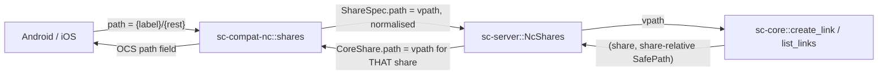

# Share API Correctness - Spec Proposal

| Item       | Detail                           |
|------------|----------------------------------|
| Author     | heavycaffeiner(Dong Hyun Kim)    |
| Created    | 2026-08-10                       |
| Status     | **Implemented**                  |
| Reviewers  |                                  |

---

## 1. Summary

The compat share API does not work. Every path a client sends is prefixed with
a grant label it already contains, so a share created from a phone either fails
with a misleading 404 or, in one narrow case, mints a public link on a file the
user did not select. Two further mappings are wrong in the same way, and the
capability document claims a group-sharing feature that does not exist.

This proposal fixes the path vocabulary in both directions, makes the
advertised capabilities match what is served, and pins both with tests. User
and group shares stay out of scope.

## 2. Background & Motivation

### 2.1 There are two path vocabularies and they were mixed up

`sc-core` addresses everything by **vpath**: `{label}/{rest}`, where the first
segment names a grant-projected root. `Core::resolve_want` splits on exactly
that boundary:

```rust
// crates/sc-core/src/resolve.rs
let trimmed = vpath.trim_start_matches('/');
let mut parts = trimmed.splitn(2, '/');
let label = parts.next().unwrap_or("");
let rest  = parts.next().unwrap_or("");
```

The native web API passes its `path` straight through
(`bridge.rs::share_link_create` calls `create_link(user, &req.path, &spec)`),
and the workspace's own end-to-end test spells it out:

```rust
// crates/sc-server/tests/wiring.rs
.create_link(uid, &format!("/{label}/hello.txt"), &sc_core::LinkSpec::default())
```

A compat client uses the same vocabulary without knowing it. The compat files
root is synthesised from `NcCore::root_entries`, whose children **are the
labels** (`h_files_root`), so a file the app shows at
`/remote.php/dav/files/alice/photos/summer/a.jpg` has the remote path
`/photos/summer/a.jpg`, in which `photos` is a label. That is already a vpath.

`NcShares` prefixes it again:

```rust
// crates/sc-server/src/nc.rs
fn home(&self, user: UserId) -> PortResult<(ShareId, String)> {
    self.core.roots(user).into_iter().next()      // the FIRST root, always
        .map(|r| (r.share, r.label)).ok_or(PortError::NotFound)
}

fn vpath(&self, user: UserId, path: &str) -> PortResult<String> {
    let (_, label) = self.home(user)?;
    let rest = path.trim_start_matches('/');
    Ok(format!("/{label}/{rest}"))                 // label prepended to a path
}                                                  // that already has one
```

### 2.2 What that produces

**S1. Share creation targets the wrong path.**
`POST .../shares?path=/photos/summer` becomes
`create_link(user, "/{first_label}/photos/summer")`.

- When the target is under any root other than the first, or when the first
  root has no `photos/summer` inside it, `resolve_want` fails and the OCS layer
  renders `PortError::NotFound` as **404 "Wrong share ID, share does not
  exist"** on a request that carried no share id. Every share attempt from a
  phone fails, with an error message about the wrong thing.
- When the first root *does* contain a same-named subtree, the link is minted
  on that file instead. The creator's own access still bounds it
  (`create_link` refuses `!r.perms.contains(spec.perms)`), so this is not a
  privilege escalation, but it publishes a file the user did not select. That
  is the worst outcome in this document.

**S2. The response hides S1.**
`to_core_share` reports `path` as `"/" + link.path`, and `link.path` is
share-relative with the label already stripped. So a create that resolved to
`/{first_label}/photos/summer` answers `"path": "/photos/summer"`, exactly what
the client asked for. The request looks like it succeeded and the returned
metadata looks correct while the link points elsewhere.

**S3. A folder path from Android is rejected outright.**
`OCFile.getRemotePath()` appends a separator for folders
(`OCFile.java:313-316`), so Android shares a folder as `/photos/summer/`. After
S1's prefixing that reaches `SafePath::parse("photos/summer/")`, whose
`split('/')` yields a trailing empty component and
`validate_existing_component` rejects it with `"empty path component"`. Sharing
a folder from Android cannot succeed at all.

**S4. Listing a file's shares is broken the same way.**
`GET .../shares?path=…&reshares=…&subfiles=…` is what both apps call on every
file detail screen. `NcShares::list` sends `filter.path` through the same
`vpath`, so it resolves the wrong node and returns the wrong links, or fails.

**S5. Every link outside the first root is described wrongly.**
`to_core_share` stats the link through `self.vpath(user, &rel)`, i.e. under the
first root's label regardless of which share the link belongs to. For a link in
any other share the stat misses, so `kind_is_dir` is `false` for folders and
the `file_id` fallback degrades to `0`. The native side already does this
correctly: `bridge.rs::http_link` uses `vpath_for(user, l.share, &l.path)`.

### 2.3 The capability document overstates sharing

`capabilities.rs` emits `files_sharing.group_sharing = true` and
`files_sharing.group.enabled = true`, while `NcShares::create` refuses both
`shareType` 0 and 1:

```rust
fn grants_unavailable() -> PortError {
    PortError::Invalid("this server supports public link shares only".into())
}
```

`sc-acl` grants are administrator-owned and have no per-user CRUD anywhere in
the workspace, so the refusal is correct. The advertisement is not.

In practice the user-sharing UI is dead rather than error-producing, because
the sharee autocomplete never returns a candidate to select:
`NcConfig::default()` sets `sharee_lookup: ShareeLookup::SameGroup`, and
`NcShares::find_grantees` returns an empty list for `SameGroup` because
`sc-auth` has no group table. Widening it to `All` would open the account
enumeration oracle that setting exists to close.

### 2.4 What is left after the fix

Public link sharing, which is the feature this server actually has:
create, list, show, update, delete, password, expiry, note, label, upload
permission and hide-download. All of it already exists in `sc-compat-nc`
and is already covered by unit tests; it is reached through a mapping that
is wrong at both ends.

## 3. Goals & Non-Goals

### 3.1 Goals

- [ ] One path vocabulary. A client's `path` is a vpath and is used as one,
      normalised for the trailing separator Android appends to folders.
- [ ] The reverse mapping names the link's own share, not the first root.
- [ ] `GET .../shares?path=` resolves the node the client meant, and
      `subfiles=true` answers what it asks for.
- [ ] Capabilities stop claiming group sharing.
- [ ] Golden tests pinning the vocabulary in both directions, so the next
      change to either side fails the build instead of the phone.

### 3.2 Non-Goals

**User and group shares.** Building them means giving the administrator-owned
`sc-acl` grant model a per-user CRUD surface, which reaches the ACL engine, the
web UI and the SMB projection. That is its own proposal, not a correctness fix.
`shareType` 0 and 1 keep answering a 400, with a message rewritten for the
person reading it.

**Federation, email shares, Talk passwords, circles, rooms.** Already refused
by `share_type_to_kind` and already advertised `false`.

**Resharing.** `files_sharing.resharing` is `false` and a link is a delegation
of the creator's own access, so the `reshares` parameter stays ignored.

**"Shared with you".** A grant somebody else configured already appears as a
label in the caller's files root, which is the honest presentation.
`shared_with_me=true` keeps answering an empty list rather than describing
grants the user cannot edit or revoke as if they were shares.

## 4. Technical Design

### 4.1 Architecture Overview

No new components. One adapter is corrected and one port contract is written
down.



The defect is that the two arrows through `NcShares` currently apply a
transform on the way in and a different, non-inverse one on the way out. The
fix makes the inbound arrow the identity and the outbound arrow the true
inverse.

### 4.2 Data Model Changes

No schema change. Two port contracts gain the documentation whose absence
allowed the mismatch:

```rust
/// Path of the node being shared, as a **vpath**: `{label}/{rest}`, no
/// leading and no trailing separator. Already normalised by the compat
/// layer, which is where client spelling quirks are handled. The host
/// adapter passes it to `sc-core` unchanged and must not re-prefix it.
pub struct ShareSpec { pub path: String, /* ... */ }

/// Vpath of the shared node with a single leading separator, resolved
/// against the share this link actually belongs to. This is the value the
/// client sees as `path` and `file_target`, and it must name the same node
/// in the client's own file tree.
pub struct CoreShare { pub path: String, /* ... */ }
```

**No migration.** A link row stores `(share, share-relative SafePath)` and
stays valid. A link minted through the broken path points at the wrong node
today and will keep pointing there; after the fix its reported `path` describes
where it really points, so it becomes visible and deletable instead of
disguised. Operators who have used the compat share API should review existing
links once.

### 4.3 Core Logic

#### 4.3.1 Inbound: the client's path is already a vpath

Normalisation lives in `sc-compat-nc::shares`, because "Android appends a
separator to folder paths" is a client quirk and that crate is where client
quirks are recorded.

```rust
/// A client's `path` parameter, normalised into a `ShareSpec` vpath.
///
/// Android sends a folder as `/photos/summer/` (`OCFile.getRemotePath()`
/// appends the separator for collections) and a file as `/photos/a.jpg`.
/// A trailing separator reaches `SafePath::parse` as an empty component and
/// is rejected, so it is stripped here rather than at four call sites.
///
/// The empty result is the files root itself, which is a synthesised
/// collection of grant labels and not a directory, so it cannot be shared.
fn normalise_client_path(raw: &str) -> Result<String, OcsError> {
    let p = raw.trim_matches('/');
    if p.is_empty() {
        return Err(OcsError::not_found("Please specify a file or folder path"));
    }
    Ok(p.to_string())
}
```

Applied in `ShareRequest::to_spec` and to `ShareFilter::path`.

`NcShares::vpath` and `NcShares::home` are deleted. `create` passes
`format!("/{}", spec.path)` to `Core::create_link`, and `list` does the same
for the filter.

#### 4.3.2 Outbound: name the link's own share

`NcShares` gains the helper the native bridge already has:

```rust
/// The vpath a link's target has in `user`'s own tree.
///
/// A grant may be rooted at a subpath inside its share, and a link's stored
/// path is relative to the *share* root, not the grant root. So the grant's
/// subpath is stripped off the front before the label is prefixed; prefixing
/// without stripping doubles it. `bridge.rs::vpath_for` already does exactly
/// this for the web UI, and this is that function, reused rather than
/// re-derived.
///
/// Two grants can project one share under different labels; the first whose
/// subpath actually prefixes `path` is picked, so both surfaces name the same
/// node the same way. A link whose share the user can no longer reach has no
/// label, and the link is reported with its share-relative path so it stays
/// listable and deletable rather than vanishing from a listing that is
/// supposed to let the owner clean it up.
fn vpath_for(&self, user: UserId, share: ShareId, path: &SafePath) -> Option<String>;
```

`to_core_share` uses it for `CoreShare::path` and for the `stat_entry` that
fills `kind_is_dir` and the `file_id` fallback. That closes S5: a folder link
in a second share reports `item_type: "folder"` and a real file id.

#### 4.3.3 `subfiles`

`subfiles=true` on a folder asks which files *inside* it are shared, which both
apps use to badge children in a listing. With 4.3.2 in place each link has a
vpath, so the filter is a prefix test:

```
subfiles=true   -> keep links whose vpath starts with `{folder vpath}/`
subfiles=false  -> keep links whose vpath equals the folder's vpath
```

The prefix test compares whole path components, never raw strings, so
`/photos/summerhouse` is not a child of `/photos/summer`.

`reshares` stays parsed and ignored, matching `files_sharing.resharing = false`.

#### 4.3.4 Capability corrections

| Key | Now | After | Why |
|---|---|---|---|
| `files_sharing.group_sharing` | `true` | `false` | No group model exists |
| `files_sharing.group.enabled` | `true` | `false` | Same |
| `files_sharing.group.expire_date.enabled` | `true` | `false` | No group shares to expire |
| `files_sharing.user.expire_date.enabled` | `true` | `false` | No user shares to expire |

`files_sharing.sharee` stays: it carries `minSearchStringLength`, which is what
stops a client typing ahead below our floor, and `query_lookup_default: false`,
which is a real denial.

**This is a truthfulness fix, not a behaviour fix, and the difference matters.**
Neither client's share UI is gated on `group_sharing`. Android's capability
model has no field for it at all (`OCCapability.kt` carries
`filesSharingApiEnabled`, `filesSharingPublicEnabled`, `filesSharingResharing`,
the federation pair and the public sub-block, and nothing for group sharing).
iOS decodes it as `let groupsharing: Bool?` and does not surface it on the
flattened capability object it hands the app. So after this change the people
picker is still drawn and still finds nobody. There is no capability key that
removes it. Section 7 records that as a limitation rather than pretending
otherwise.

The refusal message changes from `"this server supports public link shares
only"`, which is written for an administrator reading a log, to text a person
sees in a dialog.

#### 4.3.5 What must not change

`format_share` is correct and stays untouched. Its field types were derived
from the reference and are pinned by tests: `id` is a string, `mail_send` and
`hide_download` are ints, `can_edit`/`can_delete`/`has_preview` are booleans,
`password` is `null` or `"redacted"` and never the real value, `expiration` is
`Y-m-d H:i:s` with no `T` and no zone, `parent` is `null`, and `show` wraps its
single share in a list. Android parses all of it as XML through
`ShareXMLParser` (its share operations send no `format` parameter, and
`OcsFormat::negotiate` correctly defaults to XML), so field order and type are
load-bearing.

`attributes` stays ignored. NextcloudKit documents it as "only valid for user
and group shares, not for public link shares"
(`NextcloudKit+Share.swift:299`), so dropping it on the only share type this
server supports is correct rather than lossy.

## 5. API Design

### 5-1. New / Modified

No route is added or removed. The five share routes and the sharee route keep
their current shapes:

```
GET    /ocs/v{1,2}.php/apps/files_sharing/api/v1/shares          path, reshares, subfiles, shared_with_me
POST   /ocs/v{1,2}.php/apps/files_sharing/api/v1/shares          path, shareType, shareWith, permissions,
                                                                 publicUpload, password, expireDate, note, label
GET    /ocs/v{1,2}.php/apps/files_sharing/api/v1/shares/{id}
PUT    /ocs/v{1,2}.php/apps/files_sharing/api/v1/shares/{id}     permissions, password, expireDate, note,
                                                                 label, hideDownload
DELETE /ocs/v{1,2}.php/apps/files_sharing/api/v1/shares/{id}
GET    /ocs/v{1,2}.php/apps/files_sharing/api/v1/sharees         search, itemType, page, perPage
```

What changes is the meaning of two fields.

| Field | Direction | Before | After |
|---|---|---|---|
| `path` request parameter | in | first grant label prepended | used as the vpath it already is, trailing separator stripped |
| `path`, `file_target` response fields | out | share-relative, label stripped | vpath of the link's own share |

Signature changes, all inside `sc-server`:

```rust
// removed: both were the wrong transform
impl NcShares {
    fn home(&self, user: UserId) -> PortResult<(ShareId, String)>;
    fn vpath(&self, user: UserId, path: &str) -> PortResult<String>;
}

// added: the true inverse, mirroring bridge.rs::vpath_for
impl NcShares {
    fn vpath_for(&self, user: UserId, share: ShareId, path: &SafePath) -> Option<String>;
}
```

```rust
// sc-compat-nc::shares, applied in `to_spec` and to the list filter
fn normalise_client_path(raw: &str) -> Result<String, OcsError>;
```

### 5-2. Error Handling

OCS carries its status inside a `200`; the codes below are the envelope's.

| Code | Case | Note |
|---|---|---|
| 400 | `shareType` 0 or 1 | message rewritten for a person |
| 400 | `shareType` 2, 4, 6-10, 12, 13, 15 | unchanged |
| 400 | unknown permission bits | unchanged |
| 400 | `expireDate` not `YYYY-MM-DD` | unchanged |
| 400 | update with no recognised parameter | unchanged |
| 403 | the caller's grant lacks `SHARE` on the target | from `create_link`'s check |
| 404 | `path` missing, empty, or the files root itself | the root is synthesised, not a directory |
| 404 | `path` names no reachable node | the honest answer, now reached for the right path |
| 404 | share id unknown or owned by somebody else | `get_link` refuses by `NotFound`, never `403` |
| 409 | expiry in the past | from `create_link` |

The 404 on an unreachable path keeps its existing "cannot list it, cannot know
it exists" property. What changes is that it now describes the path the client
actually named.

## 6. Implementation Plan

### 6-1. Milestones

| Phase | Task | Estimated Duration | Owner |
|---|---|---|---|
| Phase 1 | `normalise_client_path` in `sc-compat-nc`, applied to `to_spec` and the list filter; `ShareSpec::path` contract documented; unit tests for the trailing separator, the bare root and a nested path | 0.5 d | heavycaffeiner |
| Phase 2 | Delete `NcShares::home`/`vpath`, add `vpath_for`, correct `create`, `list` and `to_core_share`; `CoreShare::path` contract documented | 1 d | heavycaffeiner |
| Phase 3 | `subfiles` prefix filter, component-wise | 0.5 d | heavycaffeiner |
| Phase 4 | Capability corrections and the rewritten refusal message | 0.5 d | heavycaffeiner |
| Phase 5 | Round-trip tests: a link created at a client path is listed at the same client path and resolves to that node over DAV; a second-root link reports `item_type: "folder"` and a real file id; a multi-root fixture proves the first-root assumption is gone | 1 d | heavycaffeiner |

Phase 5 is not optional polish. Every defect in section 2.2 survived because
the two mappings were never checked against each other, and S2 in particular
made the wrong answer look right. A test that creates through the OCS API and
then reads back through the DAV tree is the one that would have caught it.

Android on a real handset verifies each phase: share a file, share a folder,
open the file detail screen, edit the link, delete it. iOS stays source-derived
and unverified, as `stowcloud-8-compat.md` §4.5 requires.

### 6-2. Dependencies

- No new third-party crate.
- No `sc-core`, `sc-acl` or `sc-auth` change. Every call this needs is already
  public, and `bridge.rs` already demonstrates the correct usage.
- No change to `sc-compat-nc::shares::format_share`, so the wire shape the
  existing tests pin is untouched.
- An Android device for verification.

## 7. Known limitations

- **The people picker cannot be hidden.** No capability key gates it in either
  app, so it stays visible and finds nobody. A user who opens it sees an empty
  result rather than an explanation.
- **Sharee search returns nothing under the default configuration**, by design:
  `SameGroup` cannot be honoured without a group table, and widening it to
  `All` would make a three-character query enumerate accounts.
- **A share is bounded by its creator's access and re-checked on update**, so a
  grant revoked after a link was minted cannot be re-widened. That is existing
  `sc-core` behaviour and this proposal does not extend it.
- **One share projected under two labels reports the first.** Both the web UI
  and the compat layer pick the same one, so they agree, but a user who reaches
  a file through the second label sees a share path spelled with the first.
- **Links created before this fix keep pointing where they point.** Their
  reported path becomes truthful, which is what makes them findable; nothing
  moves them.
- **`shared_with_me` stays empty** and **`reshares` stays ignored**, matching
  the advertised capabilities.
- **iOS is unverified end to end.**

## 8. References

- `crates/sc-server/src/nc.rs` (`NcShares`), `crates/sc-server/src/bridge.rs`
  (`http_link`, `vpath_for`, `share_link_create`),
  `crates/sc-compat-nc/src/shares.rs`, `crates/sc-compat-nc/src/capabilities.rs`,
  `crates/sc-core/src/links.rs`, `crates/sc-core/src/resolve.rs`,
  `crates/sc-vfs/src/safe_path.rs`, `crates/sc-server/tests/wiring.rs`
- `stowcloud-8-compat.md` (the isolation contract and the advertise-nothing-you-
  lack rule), `stowcloud-6-preview-sharing.md` (share links in the core),
  `stowcloud-2-core-vfs.md` (vpath, labels and ACL evaluation),
  `stowcloud-14-compat-mobile.md` (the rest of the mobile surface)
- Client sources the wire expectations were read from: `nextcloud/android-library`
  (`resources/shares/`, `resources/status/OCCapability.kt`), `nextcloud/android`
  (`datamodel/OCFile.java`), `nextcloud/NextcloudKit`
  (`NextcloudKit+Share.swift`, `NextcloudKit+Capabilities.swift`)
