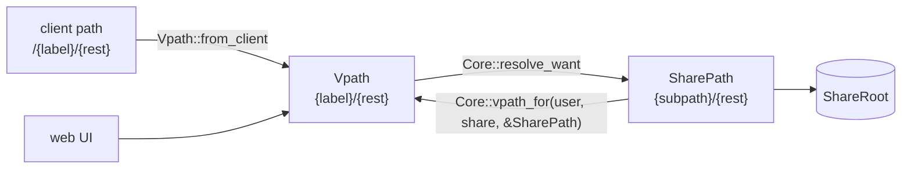

# Correctness Sweep: Path Vocabularies, Swallowed Metadata Writes, Folder Sizes - Spec Proposal

| Item       | Detail                           |
|------------|----------------------------------|
| Author     | heavycaffeiner(Dong Hyun Kim)    |
| Created    | 2026-08-10                       |
| Status     | **Implemented**                  |
| Reviewers  |                                  |

---

## 1. Summary

An audit of the built code found three defect families, each with one cause and
several instances. Three path vocabularies exist in this workspace, only one of
them is written down, and every place a path crosses the host-adapter boundary
gets the conversion wrong in the same way. Three metadata writes on paths that
have already committed to disk discard their error without logging it, and two
of those losses are invisible until a client stops syncing. And no folder the
mobile apps show has a correct size: the top-level ones report zero, a grant
root reports its own directory inode's size, and the rest are correct only for
as long as the aggregate cache happens to be.

None of this is a missing feature. All of it is code that runs, returns
success, and is wrong.

## 2. Background & Motivation

### 2.1 The audit

`cargo check --workspace --all-targets` is clean: no warnings, no dead code, no
`TODO`, no `unimplemented!`. Both existing CI gates pass. Everything below was
found by reading, which is the point: these are defects that no tool this
repository runs can see, because each one is a correct-looking call with the
wrong argument.

### 2.2 Family A: three path vocabularies, one name

The workspace addresses files three different ways.

| # | Vocabulary | Shape | Produced by | Consumed by |
|---|---|---|---|---|
| 1 | **client path** | `/{label}/{rest}` | the app, off its own file tree | the compat mount |
| 2 | **vpath** | `{label}/{rest}` | the web UI, `sc-dav`'s mount | `Core::resolve_want` |
| 3 | **share path** | `{grant subpath}/{rest}` | `Resolved::path`, `ShareLink::path`, `MetaStore::resolve_path` | `ShareRoot`, `AclEngine::evaluate` |

(1) and (2) differ only by a leading separator. (3) is a different thing
entirely: it is relative to the **share** root, and a grant may be rooted at a
subpath inside that share, so converting (3) to (2) means *stripping* the
grant's subpath and *prefixing* its label.

`Core::resolve_want` makes both halves explicit:

```rust
// crates/sc-core/src/resolve.rs
let label = parts.next().unwrap_or("");          // vpath: first segment is the label
let rest  = parts.next().unwrap_or("");
let root_entry = roots.iter().find(|r| r.label == label)...;
let mut full = root_entry.subpath.clone();       // share path: the grant's subpath
for comp in rest_path.components() {             // plus the rest
    full = full.join(comp.as_str(), max_depth)?;
}
```

Every one of the three is `String` or `SafePath`. Nothing in the type system
distinguishes them, and every conversion is an ad-hoc `format!`.

**The correct conversion exists, once**, in the native bridge:

```rust
// crates/sc-server/src/bridge.rs::vpath_for   (share path -> vpath)
for r in self.core.roots(user) {
    if r.share != share || !r.subpath.is_prefix_of(path) { continue; }
    let skip = r.subpath.components().len();
    let rest: Vec<&str> = path.components()[skip..].iter().map(|c| c.as_str()).collect();
    return if rest.is_empty() { format!("/{}", r.label) }
           else { format!("/{}/{}", r.label, rest.join("/")) };
}
```

Every other conversion in the compat host adapter is wrong.

#### A1. Share creation prefixes a label onto a path that already has one

```rust
// crates/sc-server/src/nc.rs::NcShares
fn vpath(&self, user: UserId, path: &str) -> PortResult<String> {
    let (_, label) = self.home(user)?;             // the FIRST root, always
    let rest = path.trim_start_matches('/');
    Ok(format!("/{label}/{rest}"))                 // (1) treated as (3)
}
```

Covered in full by `stowcloud-15-sharing.md`, listed here because it is the
same cause and the fix is the same function.

#### A2. The path-addressed preview resolves one level too deep

```rust
// crates/sc-compat-nc/src/preview.rs::PreviewApi::redirect
(None, Some(p)) => self.core.home_root(user).ok()
    .map(|root| (root, p.trim_start_matches('/').to_string())),
```

The `(share, path)` pair produced here is handed to
`PreviewPort::signed_thumb_url`, whose host implementation prefixes the
share's label:

```rust
// crates/sc-server/src/nc.rs::NcPreview::signed_thumb_url
let label = self.core.roots(user).into_iter().find(|r| r.share == share).map(|r| r.label)...;
let vpath = if rest.is_empty() { label } else { format!("{label}/{rest}") };
```

So a client path `/photos/a.jpg`, in which `photos` is already a label, becomes
`{first_label}/photos/a.jpg`. This is the endpoint behind
`/index.php/apps/files/api/v1/thumbnail/{x}/{y}/{path}`, which the Android
client uses whenever it holds a remote path rather than a file id. Every such
thumbnail resolves to a path that almost never exists, so it 404s.

#### A3. The id-addressed preview breaks on any grant rooted at a subpath

```rust
// crates/sc-server/src/nc.rs::NcCore
fn locate(&self, _user: UserId, id: FileId) -> PortResult<(ShareId, String)> {
    self.meta.resolve_path(id).map_err(port_io)?.ok_or(PortError::NotFound)
}
```

`MetaStore::resolve_path` returns a **share path** (3). `signed_thumb_url`
prefixes the label without stripping the grant subpath, and `resolve_want` then
prepends that subpath a second time, so the effective target is
`{subpath}/{subpath}/{rest}`.

With every grant rooted at its share root, subpath is empty and this is
invisible. Point one grant at a subdirectory and every thumbnail in that grant
stops resolving. This is the hot path for both mobile clients: the Android
photo grid and the iOS media browser are entirely thumbnails.

**This is not a permission hole, and the distinction is worth stating.** The
computed path is always *deeper inside* the grant than the intended one, never
outside it, and `signed_thumb_url` still runs `Core::stat_entry`, which is a
full ACL evaluation. The failure is a wrong or missing thumbnail, never
somebody else's file.

#### A4. Three port methods carry the same defect and have no callers yet

`CorePort::resolve`, `CorePort::list` and `CorePort::stat_entry` all route
through `NcCore::vpath(user, share, path)`, which is A3's conversion. Nothing
in `sc-compat-nc` calls any of them today. They are a loaded trap for the next
feature that wants to read a path: `stowcloud-14-compat-mobile.md` proposes a
trashbin, a `SEARCH` handler and a favourites report, and all three want
exactly these methods.

`cargo check` cannot warn about them, because a trait method is always "used".

#### A5. The reverse conversion drops the subpath and names the wrong share

`NcShares::to_core_share` reports a link's path as `"/" + link.path`, a raw
share path with no label and no subpath handling, and stats it under the first
root's label. Covered by `stowcloud-15-sharing.md` §2.2 S5.

### 2.3 Family B: metadata writes that fail in silence

Three call sites discard the result of a metadata write. Each one runs *after*
the filesystem operation has committed, so failing the caller is not an option,
but none of them logs and none has a fallback.

```rust
// crates/sc-core/src/ops.rs:347   (rename)
let _ = self.meta.rename_node(id, parent_id, new_name);
// crates/sc-core/src/ops.rs:886   (move)
let _ = self.meta.rename_node(id, parent_id, d.path.name().unwrap_or(""));
// crates/sc-core/src/aggregate.rs:122   (every write, via mark_dirty)
let _ = self.meta.mark_dirty_chain(share, &chain);
```

**B1 and B2, the `rename_node` pair.** A failure leaves the `node` row's
`(parent_id, name)` describing where the file used to be. `resolve_path(id)`
then answers the old path, and that is what `NcCore::locate` feeds the preview
pipeline and what `CorePort::aggregate` uses to turn an id back into a path. A
thumbnail for a renamed file resolves to a path that no longer exists.

**B3, `mark_dirty_chain`.** A failure leaves cached directory aggregates
looking fresh after a write that changed them. A sync client polls a directory
ETag, sees the value it already has, and concludes nothing changed. The change
is never fetched. That is a silent sync loss, and it is precisely the failure
the stable-id and directory-ETag design exists to prevent.

`mark_dirty`'s doc comment says "best-effort ... stops early rather than
failing the caller's operation", which is the right call. Best-effort and
silent are not the same thing, and the global rule in this workspace is that an
error on a write path is surfaced, never swallowed.

**B3 already has its fallback written, two functions below.**
`Aggregate::bump_share_gen` is an O(1) whole-share invalidation that makes
every cached aggregate in the share read as stale without naming a path;
`sc-watch` calls it when its own dirty queue overflows. A failed
`mark_dirty_chain` is exactly that situation.

### 2.4 Family C: no folder the apps show has a correct size

#### What the apps do with `oc:size`

Both clients take a folder's size from `oc:size` and nothing else. Android
decides per entry on the mime type:

```java
// app/src/main/java/com/owncloud/android/utils/FileStorageUtils.java:334-338
if (MimeType.DIRECTORY.equalsIgnoreCase(remote.getMimeType())) {
    file.setFileLength(remote.getSize());        // <- oc:size
} else {
    file.setFileLength(remote.getLength());      // <- d:getcontentlength
}
```

`RemoteFile.size` is `WebdavEntry.size` (`RemoteFile.kt:94`), which is
populated from `oc:size` alone (`WebdavEntry.kt:251-254`), and it is
initialised to `0`. iOS is the same shape without the branch: it sets
`file.directory = true` and `contentType = "httpd/unix-directory"` for a
collection and then reads `oc:size` for every entry
(`NKDataFileXML.swift:386-387, 414-415`).

So `oc:size` is the folder size, on both platforms, everywhere a folder is
listed.

Android's parse has a hazard worth recording next to the value:

```kotlin
// WebdavEntry.kt:251-254
prop = propSet[EXTENDED_PROPERTY_NAME_SIZE, ocNamespace]
if (prop != null) {
    size = (prop.value as String).toLong()
}
```

There is no `catch` here, unlike `nc:creation_time`. An **absent** property is
handled (`prop == null`, size stays `0`); an **empty** `<oc:size/>` is a
Kotlin cast on a null and fails the whole folder listing, not one property.
Omitting is safe, emitting empty is not.

#### C1. Every top-level folder reports zero

The files root is hand-assembled rather than served through the property
source, and its per-root rows carry six properties:

```rust
// crates/sc-server/src/nc.rs::files_root_propfind_xml
let child_known: Vec<(&'static str, &'static str, String)> = vec![
    (NS_DAV, "resourcetype", resourcetype),
    (NS_DAV, "displayname", ...),
    (NS_DAV, "getetag",     ...),
    (NS_OC,  "permissions", ...),
    (NS_OC,  "id",          ...),
    (NS_OC,  "fileid",      ...),
];
```

There is no `oc:size`, so it lands in the `404 Not Found` propstat and the
client leaves `size` at its initialised `0`. This is the **first listing a
client performs after enrolment** and it is the screen that lists every folder
the user has. All of them show 0 B.

The block immediately above these rows documents at length why
`quota-used-bytes` and `quota-available-bytes` are deliberately `-2` on the
root collection. Nothing anywhere explains the size omission, and unlike free
space, a total of recursive sizes is a well-defined number. This reads as an
oversight, not a decision.

#### C2. A grant root reports its own directory inode's size

For every other listing the property source answers:

```rust
// crates/sc-compat-nc/src/props.rs
let size = if is_dir {
    self.aggregate.recursive_size(ctx.share, file_id).unwrap_or(e.size)
} else { e.size };
```

`recursive_size` takes a **file id**, and the host resolves that id back to a
path before it can ask the core anything:

```rust
// crates/sc-server/src/nc.rs::NcCore::aggregate
let (_, path) = self.meta.resolve_path(id)?.ok_or(PortError::NotFound)?;
let sp = SafePath::parse(&path, root.policy().max_depth)?;
self.core.aggregate(share, &sp)
```

A grant root has no `node` row. Its id is `share_root_pseudo_id(share)`, a
synthetic value in a reserved bit range invented precisely because
`ensure_fileid_chain` cannot allocate a row for a share's physical root. So
`resolve_path` misses, `recursive_size` returns `None`, and `unwrap_or(e.size)`
substitutes `e.size`, which for a directory is the value `stat` reports for the
directory inode itself. On ext4 and xfs that is 4096.

A folder containing a terabyte reports 4 KB, which is worse than reporting
nothing: it is a plausible number, so nobody reads it as an error.

The round trip is the reason this breaks, and it is family A again in a third
disguise. `Core::aggregate` **takes a path**, not an id, and allocates the id
itself. The id detour exists only because `PropCtx::path` is a vpath while
`Core::aggregate` wants a share path, and nothing in the types said so.

#### C3. Nested folders are correct only while the cache is

Everything below a grant root does resolve an id and does get a real recursive
rollup. That rollup is `meta.dir_etag(share, dir_id)` when the cached entry is
current for the share generation, and a walk otherwise. Family B3's swallowed
`mark_dirty_chain` is exactly the failure that leaves a stale entry looking
current, so the same defect that loses a sync also freezes a folder size at its
previous value. C3 has no fix of its own; it is fixed by B3.

## 3. Goals & Non-Goals

### 3.1 Goals

- [ ] The three path vocabularies become three types, so a conversion that is
      currently a `format!` becomes a call that either exists or does not
      compile.
- [ ] A2, A3 and A4 fixed; A1 and A5 are `stowcloud-15-sharing.md`'s and are
      re-expressed in the new types rather than fixed twice.
- [ ] One conversion implementation, reused. `bridge.rs::vpath_for` stops being
      the only correct copy and becomes the only copy.
- [ ] B1, B2 and B3 log with enough context to diagnose, and B3 falls back to
      whole-share invalidation rather than losing the change.
- [ ] Every folder both apps list reports its real recursive size, including
      the top-level ones and the grant roots. Where a size cannot be
      determined, the property is omitted rather than filled with a number
      that is wrong but plausible.
- [ ] Tests that fail on a grant rooted at a subpath, which is the deployment
      shape that makes A3 visible and which no current test uses.

### 3.2 Non-Goals

**Rewriting `SafePath`.** It is the kernel-handle-shaped type the whole VFS
rests on and it is not the problem. The problem is that a `SafePath` alone does
not say which root it is relative to.

**Changing the wire format of anything.** No client-visible field changes
except by becoming correct.

**A general path-type refactor across every crate.** The types go where the
confusion is: the `sc-core` public surface that returns share paths, and the
host adapters that convert. `sc-vfs` keeps taking a bare `SafePath`, because
below a `ShareRoot` there is only one vocabulary and no ambiguity to remove.

**Making `mark_dirty` fallible to its callers.** The write has committed; the
caller cannot undo it and has nothing useful to do with the error. Logging plus
the whole-share fallback is the whole fix.

**A persisted size column.** The reference server keeps a size per node in its
database and can answer instantly. This server's database is a cache of a
filesystem other programs also write, so a stored size is a second source of
truth that goes wrong silently. The recursive aggregate plus its invalidation
is the existing answer and this proposal does not replace it.

## 4. Technical Design

### 4.1 Architecture Overview



Two conversions, each with one implementation. Today there are five
implementations of the second one, four of which drop the subpath.

### 4.2 Data Model Changes

No schema change. Two newtypes, both in `sc-core` because that is the crate
that owns the distinction:

```rust
/// A path in the caller's own virtual tree: `{label}/{rest}`, where `label`
/// names a grant-projected root. This is what the web UI, the DAV mount and
/// the compat mount all send, and the only thing `Core::resolve_want` accepts.
///
/// Constructed from a client string through `from_client`, which strips the
/// leading and trailing separators clients disagree about. It is deliberately
/// NOT constructible from a `SharePath` by prefixing, because doing that
/// correctly needs a user and a share, which is what `Core::vpath_for` is for.
pub struct Vpath(String);

/// A path relative to a share's own root, which is what everything below
/// `ShareRoot` speaks and what `Resolved::path`, `ShareLink::path` and
/// `MetaStore::resolve_path` return. It already contains the grant's subpath,
/// so prefixing a label onto it without stripping that subpath doubles it.
pub struct SharePath(SafePath);
```

The point is not the wrapper. The point is that `format!("{label}/{}", p)`
stops compiling when `p` is a `SharePath`, and the only way to get a `Vpath`
out of one is the function that handles the subpath.

Affected public signatures, all mechanical:

| Item | Before | After |
|---|---|---|
| `Resolved::path` | `SafePath` | `SharePath` |
| `ShareLink::path` | `SafePath` | `SharePath` |
| `Core::resolve_want`, `resolve`, `resolve_for_upload` | `&str` | `&Vpath` |
| `Core::create_link`, `list_links` | `&str` / `Option<&str>` | `&Vpath` / `Option<&Vpath>` |
| `CorePort::{resolve,list,stat_entry}` | `(share, user, &str)` | `(user, &Vpath)` |
| `PreviewPort::signed_thumb_url` | `(user, share, &str, ..)` | `(user, &Vpath, ..)` |
| `CorePort::locate` | `-> (ShareId, String)` | `-> (ShareId, SharePath)` |

`CorePort::{resolve,list,stat_entry}` losing their `ShareId` parameter is the
substance of the A4 fix, not cosmetics: the share is not an input, it is what
resolution decides. `UploadEngine::create` already learned this and says so in
its own doc comment; these three never did.

### 4.3 Core Logic

#### 4.3.1 The two conversions

```rust
impl Vpath {
    /// Normalise a client-supplied path into a vpath.
    ///
    /// Clients disagree about separators: Android appends one to a folder
    /// (`OCFile.getRemotePath()`), iOS does not, and the OCS share API is
    /// called with and without a leading one. A trailing separator reaches
    /// `SafePath::parse` as an empty component and is rejected there, so it
    /// is stripped once, here, rather than at every call site.
    ///
    /// The empty result is the caller's files root, which is a synthesised
    /// collection of grant labels rather than a directory, so it is an error
    /// and not a path.
    pub fn from_client(raw: &str) -> Result<Self, CoreError>;
}

impl Core {
    /// The vpath a share path has in `user`'s own tree: the grant's subpath
    /// stripped off the front, its label prefixed on.
    ///
    /// `None` when no grant the user holds projects that share path, which is
    /// the honest answer for a link whose grant was revoked. Callers that must
    /// still render the row (a listing whose whole purpose is to let the owner
    /// delete it) fall back to the share path; callers that would use it to
    /// address a file must treat `None` as not-found.
    pub fn vpath_for(&self, user: UserId, share: ShareId, path: &SharePath) -> Option<Vpath>;
}
```

`vpath_for` is `bridge.rs`'s implementation moved into `sc-core`, unchanged in
behaviour. `bridge.rs` then calls it instead of holding its own copy.

#### 4.3.2 A2: the path-addressed preview

`PreviewApi::redirect` currently produces a `(ShareId, String)` for both
branches, which forced the path branch to invent a share. After 4.2 the two
branches produce different things and the type says so:

```
fileId  ->  core.locate(user, id)          -> (ShareId, SharePath)
            core.vpath_for(user, share, &share_path)  -> Vpath
file    ->  Vpath::from_client(p)                     -> Vpath
```

Both arrive at a `Vpath`, and `signed_thumb_url` takes one. `home_root` is no
longer called from this file, because the share is not something this endpoint
gets to choose.

#### 4.3.3 A3 and A4: `NcCore`

`NcCore::vpath(user, share, path)` is deleted. `NcCore::locate` returns a
`SharePath` and keeps its `_user` parameter unused, which is now visibly
correct rather than suspicious: id-to-path is a metadata lookup, and the ACL
check belongs at the point the resulting path is used, which is
`Core::stat_entry`. That check already happens and is not being moved.

`CorePort::{resolve,list,stat_entry}` are re-implemented against `Vpath`
straight through to `Core`, so the next caller gets a correct one instead of
finding a broken one and copying its shape.

#### 4.3.4 B1 and B2: a failed `rename_node`

```rust
if let Err(e) = self.meta.rename_node(id, parent_id, new_name) {
    // The file moved on disk and the row still names where it was, so
    // `resolve_path` will answer the old path until something re-derives it.
    // Nothing here can undo the rename, so the row is left stale and said so
    // out loud rather than dropped.
    tracing::warn!(error = %e, fileid = id.get(), new_name,
                   "metadata rename failed; the node row now names a stale path");
}
```

#### 4.3.5 B3: a failed `mark_dirty_chain`

```rust
if let Err(e) = self.meta.mark_dirty_chain(share, &chain) {
    // Leaving this alone would let every cached aggregate in the chain keep
    // reading as fresh, and a sync client that polls a directory ETag would
    // conclude nothing changed. Falling back to the whole-share bump costs a
    // recompute for directories that did not change and loses nothing.
    tracing::warn!(error = %e, share = share.get(),
                   "dirty-marking failed; invalidating the whole share instead");
    self.bump_share_gen(share);
}
```

The fallback is deliberately the blunt instrument. A stale ETag costs a user
their data appearing to sync; an unnecessary recompute costs a directory walk.

#### 4.3.6 C1 and C2: folder sizes

**The id detour goes away.** `DirSize::recursive_size` stops taking a file id
and takes the resolved share path instead:

```rust
pub trait DirSize: Send + Sync {
    /// Recursive byte total of a directory subtree.
    ///
    /// Takes the path rather than a file id because `Core::aggregate` takes a
    /// path and allocates the id itself, and because a share's own root has
    /// no `node` row to have an id: it is reachable by path and by nothing
    /// else. `None` means the total could not be determined, and the caller
    /// must omit the property rather than substitute a number.
    fn recursive_size(&self, share: ShareId, path: &SharePath) -> Option<u64>;
}
```

The property source already has the path it needs. `NcPropBridge::emit`
resolves `ctx.path` through `Core::resolve` to materialise a file id; the same
`Resolved` carries `resolved.path`, which is the share path this wants. One
resolve feeds both, and `NcCore::aggregate`'s id-to-path lookup is deleted
outright.

That fixes C2 by construction: `Core::aggregate` calls `ensure_fileid_chain`
itself, which returns the `FileId(0)` sentinel for a share root **by design**
and caches the root's aggregate under it, which is exactly the case
`meta.resolve_path` could never serve.

**`oc:size` on the files root.** `files_root_propfind_xml` gains an `oc:size`
per root row, from `Core::aggregate(r.share, &r.subpath)`. A grant's subpath is
already the share path of that grant's root, so no conversion is involved.
`NcCore::root_entries` currently returns `(label, Entry)` and drops `r.share`
and `r.subpath`; it has to carry both through.

The root collection's own row reports the sum over **distinct `(share,
subpath)` pairs**, not over labels. Two grants can project one subtree under
two labels, and summing per label would count it twice.

This is not `quota-used-bytes`, which stays `-2` for the documented reason: a
collection with no single storage behind it has no honest free-space figure.
A total of recursive sizes has no such problem.

**Never substitute.** `unwrap_or(e.size)` goes away everywhere. When the
aggregate is unavailable the property is omitted, because an absent `oc:size`
leaves Android at its initialised `0` while an empty `<oc:size/>` is an
uncaught cast in its parser that fails the entire folder listing
(`WebdavEntry.kt:251-254`, no `catch`). This is the same emit-a-number-or-
nothing rule `props.rs` already applies to `nc:creation_time`, applied to the
one other numeric property that was exempt from it.

**On cost.** A recursive aggregate is a walk on first computation and a cache
read afterwards. Adding it to the files root is not a new cost class: the
compat layer already computes one for **every directory child of every folder
listing** through this same property source, and the files root has one row per
grant. The native web listing does not compute them at all
(`Core::aggregate` in `sc-http` is reached only from
`estimate_entry_count`, which seeds an archive job's progress bar), so this
cost is compat-only and is already being paid one level down.

#### 4.3.7 What the types do not fix

A `Vpath` still does not prove the label exists or that the caller may read it.
`Core::resolve_want` remains the only thing that decides either, and every path
in this proposal still goes through it. The newtypes remove one class of
mistake, the one where a correct-looking string is the wrong string. They are
not an authorisation mechanism and must not be read as one.

## 5. API Design

### 5-1. New / Modified

No HTTP route changes. Two new types and one relocated function, given in 4.2
and 4.3.1; the signature table in 4.2 lists what moves with them. Three further
signatures change for family C:

```rust
// takes the path the core actually addresses by, so a share root works
fn DirSize::recursive_size(&self, share: ShareId, path: &SharePath) -> Option<u64>;

// carries the share and subpath it currently drops, so the files-root rows
// can ask for an aggregate
fn NcCore::root_entries(&self, user: UserId) -> Vec<(String, ShareId, SharePath, Entry)>;

// was `(share, id)`. The id-to-path lookup inside the host implementation is
// what goes away; it is the step that cannot serve a share root.
fn CorePort::aggregate(&self, share: ShareId, path: &SharePath) -> PortResult<Aggregate>;
```

`DirSize` stays a separate trait from `CorePort` for the reason its doc comment
already gives: it lets the property source be unit-tested without standing up a
whole core.

The behavioural changes a client can observe:

| Endpoint | Before | After |
|---|---|---|
| `GET /index.php/apps/files/api/v1/thumbnail/{x}/{y}/{path}` | 404 for every path | the thumbnail |
| `GET /index.php/core/preview?fileId=` | 404 on a subpath-rooted grant | the thumbnail |
| `PROPFIND /remote.php/dav/files/{user}/` | no `oc:size` on any row, so every top-level folder reads 0 B | the recursive size |
| `PROPFIND` on a grant root | `oc:size` is the directory inode's size, usually 4096 | the recursive size |

### 5-2. Error Handling

| Case | Result | Note |
|---|---|---|
| `Vpath::from_client("")` or `"/"` | `CoreError::InvalidPath` | the files root is synthesised, not a directory |
| `Vpath::from_client` with a trailing separator | accepted, stripped | Android sends this for every folder |
| `vpath_for` finds no projecting grant | `None` | not-found for addressing, share path for display |
| preview: file id resolves to an unreachable share | 404 | unchanged; `roots(user)` already filters |
| preview: path resolves but the caller cannot read it | 404 | unchanged; `Core::stat_entry` decides |
| `rename_node` fails | operation still succeeds, warning logged | the rename already committed |
| `mark_dirty_chain` fails | operation still succeeds, warning logged, whole share invalidated | correctness preserved at the cost of a recompute |
| a directory's aggregate cannot be computed | `oc:size` omitted from the propstat | never an empty element, never a substituted number |

## 6. Implementation Plan

### 6-1. Milestones

| Phase | Task | Estimated Duration | Owner |
|---|---|---|---|
| Phase 1 | `Vpath` and `SharePath` in `sc-core`; `Vpath::from_client`; `Core::vpath_for` moved in from `bridge.rs`; `bridge.rs` switched to it | 1 d | heavycaffeiner |
| Phase 2 | Thread the types through `Resolved`, `ShareLink`, `resolve_want`, `create_link`, `list_links`. Mechanical, compiler-guided | 1 d | heavycaffeiner |
| Phase 3 | Port signatures and host adapters: `CorePort::{resolve,list,stat_entry,locate}`, `PreviewPort::signed_thumb_url`, `NcCore`, `NcPreview`, `PreviewApi`. Fixes A2, A3, A4 | 1 d | heavycaffeiner |
| Phase 4 | `NcShares` re-expressed in the new types, which is `stowcloud-15-sharing.md` Phases 1 and 2 done once instead of twice | 0.5 d | heavycaffeiner |
| Phase 5 | B1, B2, B3: logging and the `bump_share_gen` fallback | 0.5 d | heavycaffeiner |
| Phase 6 | C1 and C2: `DirSize::recursive_size` by path, `NcCore::aggregate`'s id lookup deleted, `oc:size` on the files-root rows, `root_entries` carrying share and subpath, every `unwrap_or(e.size)` removed | 1 d | heavycaffeiner |
| Phase 7 | Tests: a subpath-rooted grant fixture, thumbnail by path and by id through it, a rename whose metadata write fails, a write whose dirty-marking fails, `oc:size` on a files-root row and on a grant root, and an assertion that no numeric property is ever emitted empty | 1.5 d | heavycaffeiner |

Phase 4 is why this proposal is worth doing before
`stowcloud-15-sharing.md` rather than after: the share fix and the preview fix
are the same conversion, and doing them separately means writing it twice and
getting a second chance to write it differently.

Phase 7 carries the same weight as Phase 6 of proposal 15. Every A-family
defect survived because no test fixture uses a grant rooted at a subpath, every
B-family defect survived because nothing ever asserts on what happens when a
metadata write fails, and C1 survived because `files_root_propfind_xml` is
tested for the properties it emits and never for the ones it does not.

`props.rs` already owns a test named
`no_numeric_property_is_ever_emitted_empty`, with `oc:checksums` as its one
documented exception. Phase 7 extends the same assertion to the hand-assembled
files-root response, which that test cannot currently see.

### 6-2. Dependencies

- **No new third-party crate.** The newtypes are `String` and `SafePath`
  wrappers and the conversion already exists in the tree.
- **No schema change**, so no migration and no data at risk.
- **Compiler-guided.** Phases 2 and 3 are exactly the errors the new types
  produce; the work is finished when it compiles, which is the property the
  whole design is bought for.
- **A subpath-rooted grant fixture**, which the test suite does not currently
  have and which Phase 6 adds.
- Interacts with `stowcloud-15-sharing.md`: that proposal's Phases 1 and 2 are
  absorbed here. Its Phases 3 to 5 (`subfiles`, capabilities, round-trip tests)
  are unaffected and still stand on their own.

## 7. Known limitations

- **The newtypes prove shape, not existence and not permission.** A `Vpath`
  that names no label and a `Vpath` the caller may not read are both perfectly
  well-typed; `Core::resolve_want` is still the only thing that decides either.
- **`SharePath` does not record which share it belongs to.** Carrying the
  `ShareId` inside it would be stronger, but every producer already returns the
  pair and pairing them in the type would churn more surface than it protects.
- **B1 and B2 leave a stale row after logging.** A repair pass that re-derives
  a node row from the filesystem is a different piece of work; this proposal
  makes the failure visible, not self-healing.
- **B3's fallback over-invalidates.** A failed dirty-marking costs the whole
  share a recompute. That is the intended trade against a silently missed sync.
- **A cold files root is a walk per grant.** The first listing after a restart
  computes each root's aggregate before it can answer. Subsequent ones are
  cache reads, and `sc-watch` keeps them warm, but a very large tree makes that
  first PROPFIND slow. The alternative, answering from the cache only and
  omitting the property otherwise, trades a slow first listing for folders that
  show 0 B until something else warms them, which is the bug this fixes.
- **A folder's size can be briefly stale, and that is by design.** The
  aggregate is invalidated by `mark_dirty` and by `sc-watch`, so a change made
  by another program on the same disk shows up when the watcher notices it, not
  instantly. Reporting a slightly old total is the accepted cost of the
  database being a cache rather than the source of truth.
- **The files-root total counts a subtree once even if two grants project
  it.** That is deliberate, but it does mean the root total is not the sum of
  the rows shown beneath it when such a duplicate exists.
- **The audit was a reading pass, not a proof.** It covered the compat layer,
  the host adapters and the `sc-core` write paths. `sc-dav`, `sc-upload`,
  `sc-search` and `sc-auth` were swept mechanically and read only where a
  vocabulary or a swallowed write showed up, so absence of findings there is
  weaker evidence than the findings above.

## 8. References

- `crates/sc-core/src/resolve.rs` (`resolve_want`, the two vocabularies made
  explicit), `crates/sc-core/src/aggregate.rs` (`mark_dirty`,
  `bump_share_gen`), `crates/sc-core/src/ops.rs` (`rename`, `move`),
  `crates/sc-core/src/links.rs` (`ShareLink::path`),
  `crates/sc-server/src/bridge.rs` (`vpath_for`, the one correct conversion),
  `crates/sc-server/src/nc.rs` (`NcCore`, `NcShares`, `NcPreview`),
  `crates/sc-compat-nc/src/preview.rs`, `crates/sc-compat-nc/src/ports.rs`,
  `crates/sc-compat-nc/src/props.rs` (the `oc:size` branch, `DirSize`, and the
  `no_numeric_property_is_ever_emitted_empty` rule),
  `crates/sc-server/src/nc.rs` (`files_root_propfind_xml`, `root_entries`,
  `share_root_pseudo_id`)
- Client sources the folder-size behaviour was read from: `nextcloud/android`
  (`utils/FileStorageUtils.java::fillOCFile`), `nextcloud/android-library`
  (`common/network/WebdavEntry.kt`, `resources/files/model/RemoteFile.kt`),
  `nextcloud/NextcloudKit` (`Models/NKDataFileXML.swift`)
- `stowcloud-15-sharing.md` (the share half of family A, in detail),
  `stowcloud-2-core-vfs.md` (`SafePath`, labels, the virtual root),
  `stowcloud-6-preview-sharing.md` (signed URLs and the content origin),
  `stowcloud-14-compat-mobile.md` (the features that will call the port methods
  in A4)
