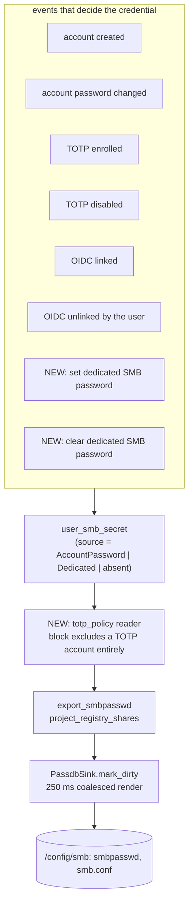

# Audit Gaps - Spec Proposal

| Item       | Detail                           |
|------------|----------------------------------|
| Author     | heavycaffeiner(Dong Hyun Kim)    |
| Created    | 2026-08-11                       |
| Status     | **Implemented**                  |
| Reviewers  |                                  |

---

## 1. Summary

Auditing proposals 0 through 13 against the code found seven places where a
shipped proposal promises something the code does not do. All seven are
closed here. The first two are the same subsystem and are the reason this
document exists at all: SMB's default setting locks a user out with no
recovery path, and the policy that governs it has no reader.

Nothing here is a new feature. Every item is either a promise made and not
kept, or a gate specified and never wired.

One rule ties the SMB work together and is what a user actually sees:
**the web UI password and the SMB password are the same password**, unless
the user deliberately separates them, and every path back from a separated
state returns them to being the same. Turning off TOTP and unlinking SSO
both do that, both say so before they do it, and neither is allowed to
differ from the other.

## 2. Background & Motivation

### 2.1 What the audit found

| # | Promised in | Reality |
|---|---|---|
| 1 | `stowcloud-1-smb.md` §5-2: "TOTP account under `require_separate`: dedicated SMB password required" | No route in this product creates a `NtSource::Dedicated` secret. The only caller is a unit test |
| 2 | `stowcloud-1-smb.md` §5-1: `smb.totp_policy` is `require_separate` or `block` | `AuthConfig::smb_totp_policy` is written by `smb_cmd.rs` and **read by nothing**. Both values behave identically |
| 3 | `stowcloud-3-frontend.md` §6-2 lists `vitest` | `verify.yml`'s node jobs run `npm ci`, `npm run build` and the bundle-size check. The unit tests never execute |
| 4 | `stowcloud-7-upload.md` §5-1 declares TUS 1.0.0 | `Tus-Resumable` is written onto responses and never read off a request |
| 5 | `stowcloud-6-preview-sharing.md` §3.1: "Archive listing" | `sc_preview::list_archive` is complete and tested, and no route or screen calls it |
| 6 | `stowcloud-13-deployment.md` §4.3: "tmpfs allowed with a warning" | `FsType::Tmpfs` exists as an enum value with no behaviour attached |
| 7 | `stowcloud-16-correctness-sweep.md` §3.1: "Every folder both apps list reports its real recursive size" | The compat clients get it as `oc:size` and this product's own web UI has no folder size at all. `DetailsPanel.svelte` skips the size row for a directory outright |

### 2.2 Why the SMB pair is urgent and the rest is not

`smb.totp_policy` defaults to `require_separate`. An account that enrols in
TOTP therefore has its account-derived NT hash deleted (`totp.rs`), and the
policy says it should now use a separate SMB password instead. There is no
way to set one. The account cannot reach SMB again except by disabling TOTP.

The second half compounds it: because nothing reads the policy, an
administrator who sets `block` deliberately gets the same behaviour as one
who left the default. The setting is visible in the admin UI, persists, and
changes nothing.

Items 3 through 6 are each a small quantity of missing wiring around code
that already works.

Item 7 is larger than the four above it and smaller than the SMB pair. The
recursive size exists, is cached, is served to the phone apps, and the only
client that cannot see it is the one this product ships, so a user asking
"why is the disk full" has to mount the share over WebDAV to find out. What
makes it more than wiring is that reaching the number from a route means
adding a method to a trait, and exposing it at all narrows a cost guarantee
`stowcloud-2-core-vfs.md` calls its key design decision. §4.3.6 is where
both are argued.

### 2.3 What the audit also found, and is being answered by documentation

pdf.js preview, a breached-password denylist, a `cargo-fuzz` target, archive
extraction, a 6-hour metadata rescan, a squashfs read-only gate and a
protocol conformance suite in CI were all specified and none is built. Each
was reviewed and each stays unbuilt; the proposals that named them have been
corrected to say so and to record why. They are out of scope here.

## 3. Goals & Non-Goals

### 3.1 Goals

- [ ] A signed-in user can set and clear an SMB-only password, so
      `smb.totp_policy = require_separate` becomes a setting a user can
      actually satisfy.
- [ ] `smb.totp_policy` gets a reader, so `block` and `require_separate`
      stop being the same setting.
- [ ] Turning TOTP off, and unlinking SSO, both restore the account password
      as the SMB password, using the plaintext each flow already collects,
      whichever credential the account was holding.
- [ ] Every screen that reaches one of those two states says, in the reader's
      language and before the user commits, that SMB will go back to the
      account password. A credential the user set is never replaced in
      silence.
- [ ] The frontend unit tests run in CI.
- [ ] A TUS request that omits or misstates `Tus-Resumable` is refused as
      the specification requires.
- [ ] The archive listing that already exists becomes reachable from the API
      and from the file viewer.
- [ ] A share on tmpfs says so at startup and on the admin screen.
- [ ] The web UI can show a folder's recursive size, on demand, without
      making browsing pay for it and without reporting bytes the caller is
      not allowed to know about.

### 3.2 Non-Goals

- [ ] ~~`svelte-check` in CI.~~ **Reversed while implementing this proposal;
      it is a blocking gate now.** The original reasoning was that its first
      run is likely to be red for reasons unrelated to this work, and a gate
      that lands red teaches people to ignore gates. What that argument missed
      is what the absence costs: `vite build` strips types with esbuild without
      checking them, so with `svelte-check` out of CI **nothing anywhere reads
      the types in `web/`**. This proposal's own Phases 1, 5 and 6 changed
      eight Svelte components and four TypeScript modules, most of them adding
      new types, and every one of those changes shipped unchecked. A gate that
      lands red once and gets fixed is cheaper than a type system nobody runs.
      §4.3.8 records how it was added.
- [ ] Extracting an archive. `stowcloud-6-preview-sharing.md` §3.2 records
      the reasoning; listing is what this wires up.
- [ ] More than one dedicated SMB password per account. `user_smb_secret` is
      keyed on `user` and stays that way.
- [ ] An administrator setting somebody else's SMB password. An admin holds
      no plaintext, exactly as in `stowcloud-0-oidc-login.md` §4.3.6's
      admin-unlink case, and inventing one here would mean an administrator
      knowing a credential the user types into Explorer.
- [ ] Changing the default of `smb.totp_policy`. Once it has a reader and a
      way to be satisfied, `require_separate` is the correct default and
      keeps working for every deployment that never touched it.
- [ ] Recovering an SMB credential for an OIDC-linked account on
      administrator unlink. That case has no plaintext either and stays as
      `stowcloud-0-oidc-login.md` §4.3.6 leaves it.
- [ ] A recursive size on a listing row. §4.3.6 is the whole argument: it
      would make opening a directory of a thousand folders start a thousand
      tree walks, which is precisely the cost `stowcloud-2-core-vfs.md` §4.7
      isolates to the DAV and compat paths on purpose.
- [ ] Sorting a listing by folder size, for the same reason. A sort needs
      the number for every row before it can order them.
- [ ] A disk-usage map, a treemap, or anything that walks a whole share to
      draw a picture. One folder at a time, when asked.

## 4. Technical Design

### 4.1 Architecture Overview

The SMB items change a subsystem's shape. The folder size does not change
one but narrows a claim another proposal makes about cost isolation
(§4.3.6), and it is the only item that adds a method to a trait crossing a
crate boundary. Everything else is a call site onto code that already exists
and is already tested.

Two sentences in other proposals become false and are corrected in the same
commits that make them so: `stowcloud-0-oidc-login.md` §4.3.6's "a linked
account cannot use SMB" (§4.3.1) and `stowcloud-2-core-vfs.md` §4.7's
"a web-only deployment can have this table empty" (§4.3.6).



The publish path below `user_smb_secret` is unchanged. Every new write goes
through the same `mark_dirty` signal `stowcloud-1-smb.md` §4.7 specifies, so
a credential change reaches `smbd` on the same 250 ms coalesced render as
every other change.

### 4.2 Data Model Changes

**No schema change.** `user_smb_secret.source` already carries the two
values (`0 = AccountPassword`, `1 = Dedicated`) and `sc-auth`'s internal
`store_nt_from_plaintext(conn, user, pw, source)` already writes either.
What is missing is a public method and a route that reach them.

### 4.3 Core Logic

#### 4.3.1 The credential state machine, complete

An account holds exactly one of three states. This table is the whole
contract; every row that is not marked NEW is current behaviour restated so
the two halves can be read together.

| Event | Resulting row | |
|---|---|---|
| account created | AccountPassword | |
| account password changed | AccountPassword re-derived; a Dedicated row is left alone | |
| TOTP enrolled | AccountPassword deleted; a Dedicated row is left alone | |
| TOTP disabled | AccountPassword derived from the reconfirmed plaintext, **replacing a Dedicated row if one exists** | NEW |
| OIDC linked | AccountPassword deleted; a Dedicated row is left alone | |
| OIDC unlinked by the user | AccountPassword derived from the reconfirmed plaintext, **replacing a Dedicated row if one exists** | NEW |
| OIDC unlinked by an administrator | unchanged: no plaintext reaches that route, so no row is restored and the response says the account has no SMB credential until its owner acts | |
| set dedicated password | Dedicated, replacing whatever was there | NEW |
| clear dedicated password | AccountPassword derived from the reconfirmed plaintext if the account is eligible, otherwise no row | NEW |

**Eligibility to hold an AccountPassword row** is unchanged:
`!totp_enabled && !oidc_linked && !smb_opt_out`.

**Eligibility to hold a Dedicated row** is every account, including one that
is TOTP-enrolled and one that is OIDC-linked. That is the point of the
credential: it is the SMB access path for accounts whose account password is
no longer an SMB credential. Holding one and having it *published* are
separate questions; §4.3.3's policy decides the second.

**This makes one sentence in another proposal false, and that sentence has
to change in the same commit.** `stowcloud-0-oidc-login.md` §4.3.6 resolves
`oidc.smb_policy` to a single value with "A linked account cannot use SMB",
and says so explicitly because no dedicated-password API existed when it was
written. It does now. `oidc.smb_policy = block` narrows to its precise
meaning: **the account password is not an SMB credential for a linked
account.** A linked account that sets a separate password reaches SMB with
it, which is what the code already assumes anyway, since `oidc.rs` leaves a
Dedicated row alone at link time and skips re-derivation when one exists.
The proposal was ahead of its own code in the pessimistic direction; this
brings the two together.

**Two rows change an existing flow, and both are deliberately destructive.**
TOTP disable and user-initiated OIDC unlink are the exact undo of the two
events that delete an account-derived hash, so each restores the state that
preceded it. A user who set a separate SMB password only because TOTP or SSO
forced them to would otherwise be left holding it with no signal that it is
now optional.

They behave identically on purpose. Both re-confirm the account password,
both hold that plaintext at the moment they mutate, and both leave the
account in the same place: SMB wants the account password again. A user who
has been through one of them should not have to learn a second rule for the
other.

Because they destroy a credential the user chose, neither is silent. §4.3.2
specifies what is said and where.

**The administrator unlink stays as it is.** `DELETE /api/admin/users/{id}/oidc`
receives no plaintext, so it cannot derive anything, and inventing a path
would mean an administrator knowing a password its owner types into
Explorer. That route keeps reporting that SMB access stays broken until the
account's owner changes their password or sets a dedicated one, exactly as
`stowcloud-0-oidc-login.md` §4.3.6 specifies.

#### 4.3.2 What the user is told, and where

Four flows change an account's SMB credential. Two do it as a side effect of
something else the user came to do (turn off TOTP, unlink SSO) and two are
the user choosing directly (set a separate password, clear it). All four say
the same thing in the same words, because they are the same fact: **SMB and
the web UI use one password unless you deliberately separate them.**

The server never sends the sentence. It reports the state and the browser
renders it, per the rule `scripts/verify.sh`'s no-Korean-in-server-code gate
enforces. The whole wire vocabulary is four fields: `smb_credential` and
`smb_unavailable_reason` on the session, and one boolean from each of the
two flows that replace a credential as a side effect.

**The standing state line**, on the SMB settings section, always visible.

`smb_credential` reports **what actually works over SMB right now**, not
which row exists. The server folds §4.3.3's policy in before answering,
because the two can disagree: a TOTP-enrolled account under `block` holds a
Dedicated row that is never exported, and a line reading "SMB uses a
separate password you set" would be a lie the user cannot discover except by
failing to connect.

| `smb_credential` | What it says |
|---|---|
| `"account"` | SMB uses your account password. Changing it changes both |
| `"dedicated"` | SMB uses a separate password you set. Your account password does not work over SMB |
| `"none"` | SMB does not work for this account, plus `smb_unavailable_reason` |

`smb_unavailable_reason` accompanies `"none"` and is one of:

| `smb_unavailable_reason` | Cause |
|---|---|
| `"not_set"` | no credential is held. An SSO-linked or TOTP-enrolled account that has not set a separate password lands here, and the line says setting one is what fixes it |
| `"totp_blocked"` | TOTP is on and the deployment's policy is `block`, so no credential of any kind is exported. Setting a separate password would not help, and the line says so |
| `"opted_out"` | the account's own SMB opt-out toggle |

An SSO link is deliberately **not** its own reason. A linked account may hold
and use a dedicated password; what the link removes is the account password
as an SMB credential, which is `"not_set"` until the user sets one. §4.3.1's
eligibility rule and this table are the same statement read from two sides.

**`"opted_out"` covers two switches and `"not_set"` two situations, and the
screen splits both.** The wire vocabulary above is what the server reports; the
sentence is chosen in the browser from `smb_opt_out`, `smb_enabled`,
`totp_enabled` and `oidc.linked`, which the session already carries. They are
split because the way back differs each time, which is the only thing a person
reading the line needs:

| What is actually true | What the line has to say |
|---|---|
| `smb_enabled` off | the credential is still stored and merely withheld from the published file, so the switch works immediately |
| `smb_opt_out` on | the credential was erased; turning it off restores nothing by itself, and the hash comes back on the next successful password sign-in |
| TOTP or an SSO link, no dedicated row | signing in will not help, because backfill stays suppressed; a separate password is the only way in |
| eligible, no row yet | signing in again is enough |

Merging the first two would put "this account is not storing SMB credentials"
on a screen whose account *is* storing one, and merging the last two would tell
a TOTP user that signing in again fixes something it cannot fix.

**Before the user commits**, on the three confirmation dialogs. Each is shown
only when it applies, so nobody reads a warning about a credential they do
not hold:

| Dialog | Extra line, when a Dedicated row exists |
|---|---|
| turn off TOTP | your separate SMB password will be removed and SMB will go back to your account password |
| unlink SSO | same sentence |
| clear the separate SMB password | SMB will go back to your account password, or, when the account is not eligible, that SMB access ends here |

**After it happens**, from the response. `smb_password_replaced` on TOTP
disable and on OIDC unlink, and `reverted_to_account_password` on the clear
route, each select a confirmation the tray announces. `UploadTray`'s live
regions are not borrowed for this; the settings screen owns its own, for the
reason `stowcloud-3-frontend.md` §7 gives about a per-route Snackbar going
silent on navigation.

Both catalogues get every key, with matching placeholders, or
`i18n-check.mjs` fails the build.

#### 4.3.3 Giving `smb.totp_policy` a reader

The policy answers one question: **may a TOTP-enrolled account reach SMB at
all?**

| Value | Meaning | Effect |
|---|---|---|
| `require_separate` (default) | yes, with a credential that is not the account password | a Dedicated row is exported normally |
| `block` | no | a TOTP-enrolled account is excluded from the passdb and from `smb.conf`, whatever row it holds |

Two sites enforce it, and both must, for the reason
`stowcloud-1-smb.md` §4.3 gives: `smb.conf` is also documentation of who has
access, so an account that cannot log in must not be listed as if it could.

1. `AuthService::export_smbpasswd` skips the account, alongside its existing
   `smb_enabled` and decryptability filters.
2. `project_registry_shares` omits it from `valid users`, `read list` and
   `write list`, alongside its existing `disabled` / `smb_opt_out` /
   `smb_enabled` exclusions.

`block` is not retroactive to stored rows. It changes what is published, not
what is held, so flipping it back to `require_separate` restores access
without the user setting anything again.

#### 4.3.4 `Tus-Resumable`

TUS 1.0.0 requires the header on every request except `OPTIONS`, and
requires `412` with a `Tus-Version` response header when the version is not
supported. The current code writes the header onto responses and reads
nothing.

- Missing header on `POST`, `HEAD`, `PATCH` or `DELETE` under
  `/api/uploads`: `412`.
- Present but not `1.0.0`: `412`, with `Tus-Version: 1.0.0` so the client
  learns what is supported.
- `OPTIONS`: unchanged, answered without the header.

This is a refusal that did not exist before, so it can break a client that
was getting away with omitting it. Our own worker
(`web/src/lib/upload/transport.ts`) already sends `Tus-Resumable: 1.0.0` on
all four methods, verified at each call site. `/dav-uploads` is a different
protocol and is untouched.

#### 4.3.5 Archive listing

`sc_preview::list_archive<R: Read + Seek>` is complete, enforces every limit
in `stowcloud-6-preview-sharing.md` §4.6, and runs `SafePath::parse` over
every entry name. What it lacks is a caller.

Two pieces connect it:

- **A seekable adapter.** `sc-vfs`'s `FileHandle` offers `read_at(buf, off)`
  and nothing else, on purpose: nothing above it holds a file cursor. The
  route needs `std::io::Read + std::io::Seek`, so a small adapter holds an
  offset beside the handle and translates. It is a route-local type, not a
  new `sc-vfs` capability, because the cursor belongs to the reader and not
  to the file.
- **A route.** ACL `READ` on the path, resolved through the same virtual
  root as every other read, so an unlistable path is `404` exactly as it is
  everywhere else.

Limits come from the existing archive settings the admin screen already
edits, so a deployment tunes listing and streamed download together.

The viewer gains a fourth body kind beside `image`, `text` and `none`. It
lists entry name, size and kind. Nothing in it is clickable: opening an
entry means extraction, which is a non-goal.

An archive over 4 GiB gets no listing (§5-1), which the viewer renders as the
same "cannot preview" card `too-large-text` already uses, with its own reason
line.

#### 4.3.6 Folder size in the web UI

The number already exists. `Core::aggregate` returns
`Aggregate { file_count, dir_count, total_bytes }`, `sc-http` already holds
that type and already calls it (`estimate_entry_count` seeds archive-job
progress with it), and the compat layer serves it as `oc:size`.
`stowcloud-16-correctness-sweep.md` Phase 6 is repairing it for the phone
apps. Only the native UI has no path to it.

**It does not go on a listing row, and that is the load-bearing decision.**
`stowcloud-2-core-vfs.md` §4.7 makes the aggregate table a DAV and compat
cost specifically so a web-only deployment can leave it empty and lose
nothing. A size column would invert that: opening a directory of a thousand
subfolders would start a thousand tree walks and populate the whole table,
turning an O(1) listing into an O(subtree) one. The isolation exists to
prevent exactly this, so the number is fetched **per folder, when the user
asks for it**, the way every file manager's folder-properties dialog works.

**Where it appears.** The details panel, which already draws a size row for
a file and skips it for a directory. For a directory it draws the row with
an action instead of a number; pressing it fetches, and the row becomes the
size plus the file and folder counts. Nothing fetches on selection alone,
because arrowing down a list would then walk one tree per keypress.

**What it costs.** A warm folder is a single row read from `diretag`. A cold
one is the aggregate walk, O(depth × fan-out) under the existing
single-flight guard, so ten users asking about the same folder pay for one
walk. On cold rotational storage that walk is minutes, which is the same
walk a sync client's first PROPFIND already pays;
`stowcloud-11-footprint.md` §4.4 is where that number lives. The request is
therefore not something the screen blocks on: the row shows progress, the
user can navigate away, and the answer is cached when they come back.

Concurrency is capped by a small semaphore, sized like search's tier caps
and for the same reason: an uncapped endpoint that starts a tree walk per
request is a way to make the server walk the whole disk. Over the cap the
answer is `429` with `Retry-After`, immediately, never a server-side queue.

**What it must not report.** The walk descends the real tree, not the
caller's view, so a folder containing a subtree the caller is denied would
report a byte count covering data they cannot read.

**What leaks here is the size, not the existence.** `Core::list` does not
drop a denied child from a listing; it builds every entry and attaches
`acl.effective`, so the child is already on screen with no READ permission.
The caller can therefore already see that something is there. What they
cannot see is how big it is, and an unfiltered recursive size hands them
exactly that. So the refusal is not an application of the 404-not-403 rule,
which is about paths that are hidden entirely; it is narrower, and it is the
only part that needs closing.

`AclEngine::denies_below(user, share, root)` already answers "which subpaths
below this root deny this user something the root allows". It was built for
SMB over-grant reporting, it is exposed on `sc_core::Core`, and it answers
the question here unchanged. When it returns anything, the size is refused
and the row says the folder contains areas this account cannot see, rather
than quietly reporting a number that is too large.

Refusing rather than filtering is deliberate: a per-user recursive size
would need a per-user walk, which throws away the aggregate cache's whole
reason for existing, and it would have to be recomputed on every grant
change instead of on every write.

**One piece of plumbing this needs.** `denies_below` is on the concrete
`sc_core::Core` and `sc-http` holds `Arc<dyn CoreApi>`. `sc-server`'s
`smb_cmd.rs` reaches it directly because it has the concrete type; the route
does not. Adding it to the `CoreApi` trait and to `bridge.rs`'s
implementation is a small but real addition, and it is the only place in
this proposal where a new method crosses a crate boundary.

**Consequence to record.** A web-only deployment's `diretag` table is no
longer necessarily empty. It fills only with folders a user explicitly
asked about, never by browsing, so the isolation claim in
`stowcloud-2-core-vfs.md` §4.7 needs its wording narrowed from "empty" to
"populated only on request" as part of this phase.

#### 4.3.7 The tmpfs warning

`detect_fs_type` already classifies every share at startup and
`FsProbe.rejected` already carries the overlayfs refusal. tmpfs needs the
same treatment one step down: not refused, but said out loud, because a
share whose contents vanish on reboot is a configuration mistake far more
often than a deliberate choice.

Two surfaces, matching how `smb_public_bind_warning` already works:

- A startup line from `diagnostics::print`, next to the SELinux and
  openat2 lines.
- A `SettingsSnapshot` field the admin screen renders as a persistent
  banner naming the shares.

The server sends a catalogue key and the share names, never a sentence, per
the rule `scripts/verify.sh`'s no-Korean-in-server-code gate enforces from
the other side.

#### 4.3.8 Frontend unit tests in CI

`verify.yml` has two node jobs and both run `npm ci`, `npm run build` and
`npm run check:bundle-size`. `npm run test` (`vitest run`) is added to both,
before the build, so a failing unit test is reported as a failing unit test
rather than as whatever the build does next.

`npm run check` (`svelte-kit sync && svelte-check`) is added beside it, also
blocking, reversing §3.2's non-goal. Both run before `npm run build` so a
failing unit test is reported as a failing unit test and a type error as a type
error, rather than as whatever the build does next.

`vite build` is not a type check. esbuild strips the annotations out of
`<script lang="ts">` without reading them, so a prop whose type does not match,
a port trait whose two implementations have drifted, or a narrowing that does
not hold all compile and ship. The Svelte compiler catches template syntax, an
unresolvable import and an undefined reference, and nothing beyond that.

**Neither gate has ever run.** Both were made blocking without being run once,
because the workstation this was built on has no node. §6-2 asked for the
opposite order, and it is not what happened: the first CI run is the first
execution of both. If either lands red, the honest fix is the failing test or
the real type error, not removing the gate.

## 5. API Design

### 5-1. New / Modified

#### New: the dedicated SMB password

```
POST /api/auth/smb/password        session + Sc-Csrf + Origin
  { "current_password": "...", "smb_password": "..." }
  -> 200 { "smb_toggles_cleared": true | false }
  -> 401 auth.invalid_credentials      current_password wrong
  -> 422 auth.weak_password            smb_password under the length floor,
                                       detail.min_length

DELETE /api/auth/smb/password      session + Sc-Csrf + Origin
  { "current_password": "..." }
  -> 200 { "reverted_to_account_password": true | false }
  -> 401 auth.invalid_credentials
  -> 404 fs.not_found                  no dedicated password is set
```

Two corrections to the draft this section carried.

`auth.weak_password`, not `setup.weak_password`. Both exist and both carry
`detail.min_length`; the first is the one `POST /api/auth/password` already
answers with, and this is a self-service auth route, not a first-run one.

`200` with a body rather than `204`, because of `smb_opt_out`. §4.3.1 said
every account may hold a dedicated row, while `set_smb_settings` documents the
opt-out as refusing to hold any NT hash of any source, and
`export_smbpasswd` does not filter on it: an opted-out account that set a
separate password would have had it published anyway. Setting an SMB-only
password is an unambiguous request to reach SMB with it, so the route clears
both of the account's own SMB toggles in the same transaction and says so.
Refusing instead would be a dead end the screen has no way out of, and leaving
the toggles alone would either store a credential that never works
(`smb_enabled` off) or publish one against a standing instruction not to hold
it.

`current_password` is the account password, re-confirmed for the same reason
TOTP enable, TOTP disable and OIDC link and unlink all re-confirm it: a live
session alone must not be enough to add or remove a permanent credential.
`stowcloud-10-auth.md` §4.6 states the rule; this is one more instance of
it, not a new one.

`smb_password` reuses `AuthConfig::min_password_len` (10). It is typed into
Explorer and Finder like any other password and there is no reason for a
second floor.

`reverted_to_account_password` reports whether the clear left the account
with an SMB credential at all. It is `false` for an account that is
TOTP-enrolled, OIDC-linked or opted out, which is the case where clearing
the dedicated password means losing SMB access, and the screen has to be
able to say so before the user commits.

#### Modified: the SMB settings read

```jsonc
GET /api/auth/session
{ "smb_credential": "account" | "dedicated" | "none",
  // present only with "none"
  "smb_unavailable_reason": "not_set" | "totp_blocked" | "opted_out" }
```

So the settings screen can state which password SMB currently wants without
a second request. It reports what works, computed against §4.3.3's policy
per §4.3.2, and never any part of a credential.

#### Modified: the two flows that restore the account password

```
POST   /api/auth/totp/disable
  -> 200 { "smb_password_replaced": true | false }     was 204

DELETE /api/auth/oidc/link
  -> 200 { "smb_password_replaced": true | false }     was 204
```

Identical field, identical meaning: a Dedicated row existed and has been
replaced by one derived from the password this request just re-confirmed.
`false` covers both "there was nothing to replace" and "the account is
opted out of SMB", which the standing state line already distinguishes, so
the response does not need to.

`unlink_oidc_identity` already returns `OidcUnlink { smb_nt_restored,
oidc_sessions_revoked }` and the route currently discards it for a `204`.
The work is to drop the `source == NT_SOURCE_DEDICATED` guard on
re-derivation, add the second flag, and stop throwing the payload away.
Session revocation on unlink is untouched.

#### New: archive listing

```
GET /api/fs/archive/list?path=/photos/trip.zip
  -> 200 { "entries": [ { "name": "...", "size": 1234, "kind": "file" } ] }
  -> 404 fs.not_found        unlistable path, or not an archive
  -> 422 fs.invalid_name     an entry name failed SafePath::parse, or a
                             limit was exceeded; detail.reason names which
```

**No `truncated`.** The draft carried one, and there is nothing for it to
report: `sc_preview::list_archive` refuses a whole archive that breaks a limit
rather than handing back the part it had validated ("a half-validated listing
is not a safe thing to hand back to a caller"), which is the `422` above. A
field that can never be `true` is a branch the screen would carry for nothing.

Limits are `ArchiveLimits::default()`. §4.3.5's "the existing archive settings
the admin screen already edits" overstated what exists: `[archive]` is
`max_concurrent` and nothing else, and no deployment knob for the entry-count,
depth or ratio caps has ever been reachable.

**One limit is added: 4 GiB.** Past it the route refuses and the viewer offers
no preview rather than a spinner. This is not a memory bound, since the listing
reads the central directory and never an entry's bytes. It is a latency one:
the central directory sits at the *end* of a zip, so listing one starts with a
seek there, and on a cold rotational share that seek is what the panel waits
on. The screen enforces the same ceiling so the request is not made at all; the
server enforces it so a direct API call cannot skip it.

#### New: folder size

```
GET /api/fs/size?path=/photos/2024
  -> 200 { "bytes": 4823194112, "files": 12043 }
  -> 403 acl.denied      the folder contains a subtree this account is
                         denied; detail.reason = "denies_below"
  -> 404 fs.not_found    unlistable path, or not a directory
  -> 429 rate.limited    the concurrent-walk cap, with Retry-After
```

One folder, no recursion into the answer: `files` is the total below this
path, not a tree.

**No `dirs`.** The draft carried one, and `sc-meta` does not have the number:
its aggregate is a single recursive count and `rcount` counts files only. The
compat bridge already records that reporting a fabricated split would be worse
than reporting zero, and a folder holding twenty subfolders showing "0 folders"
on screen is the shape that would take. `sc_core::Aggregate` would need a
schema column and a migration invalidating every cached row to answer it, which
is not what a properties row is worth.

It carries `Cache-Control: no-store`. The caching that makes a second call
cheap is `diretag`, server-side and invalidated by the write path, and an
HTTP cache on top of it would serve a number the server already knows is
stale. "Cached" in §4.3.6 means that table and never the browser.

It is deliberately not folded into `GET /api/fs/stat`, which every selection
already calls and which must stay free of any walk.

The `403` is a refusal to answer, not a permission error on the folder
itself, which is why it carries a reason the screen can turn into a sentence
rather than the generic denial text.

A path the caller cannot list is `404`, and so is a file that is not a zip.
The two are the same answer on purpose: distinguishing them tells a caller
what a file it cannot read contains.

#### New: `sc-auth` surface

```rust
/// Replaces this account's SMB credential with one derived from
/// `smb_pw`, marking it `NtSource::Dedicated`. `account_pw` is verified
/// first and the call fails without touching anything if it is wrong.
///
/// Callable for any account, including one that is TOTP enrolled or OIDC
/// linked: this credential exists precisely for accounts whose account
/// password is no longer an SMB credential. An account holding `smb_opt_out`
/// gets both of its own SMB toggles cleared in the same transaction, and
/// `opt_out_cleared` says so. Raises the passdb republish signal and bumps
/// `generation`.
pub async fn set_dedicated_smb_password(
    &self, u: UserId, account_pw: &SecretString, smb_pw: &SecretString,
) -> Result<SmbPasswordSet, SmbPasswordError>;

/// Deletes the `NtSource::Dedicated` row and, when the account is eligible
/// to hold one, derives an `NtSource::AccountPassword` row from
/// `account_pw` in the same transaction. The plaintext is in hand here,
/// which is the only reason this can restore anything at all.
///
/// Returns whether the account came out of this holding an SMB credential.
/// `false` means TOTP, an OIDC link or an opt-out blocks the account-derived
/// one, so the account now has no SMB access.
pub async fn clear_dedicated_smb_password(
    &self, u: UserId, account_pw: &SecretString,
) -> Result<bool, SmbPasswordError>;
```

Both mirror `totp_disable`'s shape: verify, mutate in one transaction,
republish, bump `generation`.

`SmbPasswordError` rather than `anyhow`, for the reason `ChangePasswordError`
already exists: the HTTP layer answers `401`, `422` and `404` for three of its
variants and must not reach that decision by string-matching a message.

`smb.totp_policy` has one more piece than §4.3.3 describes. It lives on
`AuthService` as a live value seeded from `AuthConfig`, not as the immutable
config field, because the admin settings screen changes it without a restart
(`smb_cmd::render_live`). Both enforcement sites read it from there, and the
settings patch pushes the new value in before it re-renders Samba's files.

### 5-2. Error Handling

| Status | Condition |
|---|---|
| 200 | dedicated password cleared, TOTP disabled, or SSO unlinked, each carrying whether an account-derived credential replaced what was there; dedicated password set, carrying whether the account's own SMB toggles were cleared with it |
| 401 | the re-confirmed password was wrong, on any of the four routes, with the same body and timing as every other credential refusal |
| 403 | a folder size requested on a folder with a deny grant below it, carrying `detail.reason = "denies_below"` |
| 404 | clear requested when no dedicated password is set; archive listing on an unlistable path or a file that is not an archive; a folder size on an unlistable path or on a file |
| 412 | a TUS request with a missing or unsupported `Tus-Resumable`, carrying `Tus-Version: 1.0.0` |
| 422 | `smb_password` under the length floor; an archive whose entry names or limits fail validation |
| 429 | the concurrent folder-size walk cap, answered immediately with `Retry-After` and never queued |

Non-HTTP failures:

| Condition | Result |
|---|---|
| `block` policy and a TOTP-enrolled account | excluded from `smbpasswd` and from `smb.conf`, not listed and refused at connect |
| a share on tmpfs | registered, plus a startup line and an admin-screen banner |
| the passdb republish signal fires while `smb.enabled` was false at startup | unchanged: the flag is set, no publisher is armed, and `sc-server smb-sync` remains the answer until a restart |

## 6. Implementation Plan

### 6-1. Milestones

Each phase is independent and touches a different subsystem. The one
ordering constraint is that Phase 1 and Phase 2 are the two halves of the
SMB defect, and `require_separate` is not worth enforcing until it can be
satisfied.

| Phase | Task | Estimated Duration | Owner |
|---|---|---|---|
| Phase 1 | `sc-auth`: `set_dedicated_smb_password`, `clear_dedicated_smb_password`, and the replacement rule on both TOTP disable and user OIDC unlink; the two new routes plus the two changed responses; `smb_credential` on the session; §4.3.2's state line, three dialogs and confirmations, in both i18n catalogues | 2.5 days | heavycaffeiner |
| Phase 2 | `smb.totp_policy` reader at `export_smbpasswd` and `project_registry_shares`, with a test per value proving the two now differ | 0.5 day | heavycaffeiner |
| Phase 3 | `npm run test` in both `verify.yml` node jobs | 0.5 hour | heavycaffeiner |
| Phase 4 | `Tus-Resumable` validation on the four TUS methods | 0.5 day | heavycaffeiner |
| Phase 5 | Archive listing: the seekable adapter, `GET /api/fs/archive/list`, the fourth viewer body kind, both i18n catalogues | 1 day | heavycaffeiner |
| Phase 6 | Folder size: `denies_below` onto `CoreApi` and `bridge.rs`, `GET /api/fs/size`, the refusal, the concurrency cap, the details-panel row and its progress state, both i18n catalogues, and narrowing `stowcloud-2-core-vfs.md` §4.7's "empty table" wording | 1.5 days | heavycaffeiner |
| Phase 7 | tmpfs: the startup line and the `SettingsSnapshot` banner | 0.5 day | heavycaffeiner |

### 6-2. Dependencies

- **No new third-party dependency, in either the workspace or `web/`.**
  Every piece calls code that is already written: NT hash derivation and
  sealing, `list_archive`, `Core::aggregate`, `AclEngine::denies_below`,
  `detect_fs_type`, `PassdbSink`. Two of them are not yet reachable from
  where they are needed, and that is the actual work: `store_nt_from_plaintext`
  is `pub(crate)` in `sc-auth` and needs the two public wrappers in §5-1,
  and `denies_below` is absent from `CoreApi` (§4.3.6).
- Phase 3 depends on `npm run test` passing today. It has never run in CI
  and cannot be checked from this development host, which has no node. It
  must be run once locally, or in a throwaway CI branch, before the gate is
  made blocking.
- Phases 1, 5 and 6 all add user-facing strings, so all three are gated by
  `i18n-check.mjs`: every key in `en.json` and `ko.json` both, with matching
  placeholders.
- Phase 2 changes what `smb.conf` contains, so its tests belong beside the
  existing projection tests rather than in a new file.
- Phases 1 and 6 each change a claim in another proposal rather than
  fulfilling one, so each carries its documentation edit in the same commit:
  `stowcloud-0-oidc-login.md` §4.3.6 for Phase 1 and
  `stowcloud-2-core-vfs.md` §4.7 for Phase 6. A guarantee that is no longer
  absolute and still documented as absolute is worse than either state.

## 7. References

- `stowcloud-1-smb.md` §4.3 (the projection and who it omits), §4.7 (the
  republish table this hangs off), §5-2 (the `require_separate` row this
  makes true)
- `stowcloud-0-oidc-login.md` §4.3.6 (why `oidc.smb_policy` has one value,
  the sentence that says no route creates a `Dedicated` secret, and the
  split between user unlink and administrator unlink this keeps), §6-3
  (the record of what CI does and does not run)
- `stowcloud-10-auth.md` §4.6 (password reconfirmation for credential
  changes)
- `stowcloud-6-preview-sharing.md` §3.2, §4.6 (archive listing's limits, and
  why extraction is excluded)
- `stowcloud-7-upload.md` §5-1 (the TUS surface), §7 (the two upload gaps
  that remain open after this)
- `stowcloud-13-deployment.md` §4.3 (the filesystem gate this completes)
- `stowcloud-2-core-vfs.md` §4.7 (the aggregate ETag, its write and read
  paths, and the cost-isolation claim §4.3.6 narrows), §4.5 (`denies_below`
  as an ACL question rather than an SMB one)
- `stowcloud-16-correctness-sweep.md` §4.3.6 and Phase 6 (the same recursive
  size, repaired on the compat side; this is the native half of it)
- `stowcloud-11-footprint.md` §4.4 (what a cold walk costs on rotational
  storage, which is what the folder-size row's progress state exists for)
- `stowcloud-3-frontend.md` §6-2 (`vitest`, listed as a dependency since
  Phase 5 of that proposal)
- `crates/sc-auth/src/{nt_ops,totp,users,oidc}.rs`,
  `crates/sc-preview/src/archive.rs`, `crates/sc-server/src/diagnostics.rs`,
  `crates/sc-http/src/{routes,settings_api}.rs`,
  `web/src/lib/upload/transport.ts`, `.github/workflows/verify.yml`
- [TUS 1.0.0](https://tus.io/protocols/resumable-upload), the
  `Tus-Resumable` and `Tus-Version` header rules
