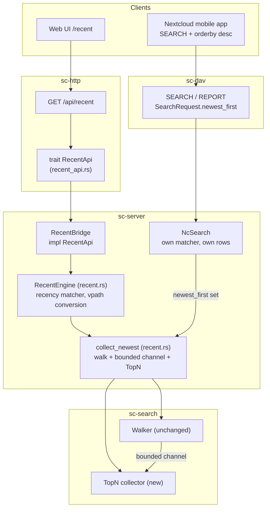

# Recent Files: a recency query, one collector, two surfaces - Spec Proposal

| Item       | Detail                           |
|------------|----------------------------------|
| Author     | heavycaffeiner(Dong Hyun Kim)    |
| Created    | 2026-08-11                       |
| Status     | **Implemented**                  |
| Reviewers  |                                  |

---

## 1. Summary

A recency query answers one question: "which files under the roots I can read
were written most recently?" This proposal adds that query natively as
`GET /api/recent`, adds a **Recent Files** destination to the web UI next to
Trash, and fixes the compat layer's existing ordered `SEARCH`, which accepts the
same question today and answers it wrong.

The shared piece is small and deliberately so: a bounded top-N collector in
`sc-search`, plus one helper in `sc-server` that runs a walk through it. The
native recency query and the compat ordered search each keep their own matcher
and their own row rendering; what they share is only how an ordered, limited
result is collected. That is the part that is broken today, because the walk
truncates in traversal order rather than in mtime order, and a recency list
truncated in traversal order is not a recency list.

## 2. Background & Motivation

### 2.1 There is no recent view anywhere in the product

`grep -ri recent` over `crates/*/src` and `web/src` returns nothing that means
this feature. The web UI's fixed destinations are Files, Trash, optionally Admin,
and Settings (`web/src/routes/(app)/+layout.svelte`, `navItems`). A user who
uploaded a file from a phone this morning and wants it on the desktop has to
remember which folder it landed in.

### 2.2 The native search API cannot express the query

`GET /api/search` refuses an empty term before it does anything else:

```rust
// crates/sc-http/src/routes.rs
if q.q.trim().is_empty() {
    return Json(serde_json::json!({ "hits": [], "completeness": { "state": "full" } })).into_response();
}
```

The backing type already carries the field a recency query needs
(`search_api::SearchQuery::mtime_after_ns`), but the wire struct never fills it:
`SearchQuery` on the HTTP boundary parses exactly `q`, `scope` and `kind`. So the
filter exists, is unreachable, and the endpoint that would reach it short-circuits
on the one query shape that has no term.

### 2.3 The compat layer accepts the query and answers it wrong

This is the substantive defect, and it is why this is not a pure feature addition.

`sc-dav` already parses the whole recency request. `SearchRequest` carries
`mtime_from_ns`, `mtime_to_ns`, `limit` and `newest_first`, and `xml.rs` maps
`d:gt` on `d:getlastmodified` plus `d:orderby ... d:descending` onto them. The
mobile clients' recent view is exactly that request. `NcSearch` then translates
it faithfully:

```rust
// crates/sc-server/src/nc_search.rs
let cap = if req.limit == 0 { MAX_RESULTS } else { req.limit.min(MAX_RESULTS) };
let budget = sc_search::WalkBudget::new(self.limits.walk_deadline(tier))
    .max_results(cap)
    .max_depth(u16::MAX);
...
sort_rows(&mut rows, req.newest_first);
truncate(&mut rows, cap);
```

`max_results(cap)` is handed to the walker, and the walker enforces it by
stopping:

```rust
// crates/sc-search/src/walker.rs
let n = self.results.fetch_add(1, Ordering::Relaxed);
if n >= self.budget.max_results {
    self.stop_with(TruncReason::MaxResults);
    return;
}
```

The walk therefore ends after the first `cap` matches **in the order the stat
phase happens to reach them**, which is inode order on rotational storage and
readdir order otherwise. Neither has anything to do with mtime. Only then are
those `cap` rows sorted newest-first. A client asking
for the 30 newest files gets 30 arbitrary files that happen to be newer than the
cutoff, sorted. On any share with more than `cap` files modified inside the
window, the answer is wrong, and it is wrong silently: the protocol has no field
for "there was more", and `nc_search.rs` says so in its own comment.

The same shape ends the deadline case: a walk that runs out of time stops where
it stopped, so the newest file on the disk may never have been visited.

What a fix can promise is narrower than "the newest N on disk", and 4.3.5 says
exactly how much narrower. The defect that goes away is the one that matters:
today the answer can be wrong while reporting `Full`, and after the fix a
complete walk really does return the newest N, while an incomplete one says so.

### 2.4 Why not an activity feed

The obvious alternative is an event journal: a table that records every upload,
edit and delete with an actor and a timestamp, which is what the reference
server's Activity app is. It is rejected, and the rejection is already recorded in
the code.

- Principle 1 says the filesystem is the only source of truth and the database is
  a cache that can be deleted and rebuilt. An event journal cannot be rebuilt
  from the filesystem: the events are gone. Deleting `meta.db` would silently
  empty a view users trust.
- Principle 3 says a shared folder is not ours. SMB clients, rsync, and whatever
  else writes the same directory never pass through our write paths, so a journal
  fed from our handlers is incomplete by construction, and incomplete in a way
  the user cannot see.
- `crates/sc-compat-nc/src/stubs.rs` already answers `/apps/activity/api/v2/activity`
  with a deliberate 404, and `capabilities.rs` deliberately omits the `activity`
  key entirely, with a long comment explaining that both mobile clients gate the
  whole feature on the key's presence. Introducing a journal now would reopen a
  decision that was made carefully and documented in the code.

An mtime-ordered listing has none of these problems. It is derived from the
filesystem, so it is correct for every writer, and it survives losing the cache.

## 3. Goals & Non-Goals

### 3.1 Goals

- [ ] Add a recency query that returns the newest N files by mtime across every
      root the caller can read.
- [ ] Fix the traversal-order truncation so an ordered, limited query returns
      the newest rows of what the walk reached rather than the first rows it
      found, and reports which of the two it is.
- [ ] Expose the query natively as `GET /api/recent`, with the existing search
      rate limit, concurrency tiers and honest truncation reporting.
- [ ] Route the compat layer's ordered `SEARCH` through the same collector, so
      the phone apps' recent view becomes correct with no new endpoint and no
      new capability.
- [ ] Return paths the client can navigate to directly, converted through
      `Core::vpath_for` rather than by prefixing a label onto a share path.
- [ ] Add a **Recent Files** destination to the web UI next to Trash, with its
      own route, nav entry, English and Korean strings, and mock-mode support.

### 3.2 Non-Goals

- [ ] **No activity or audit feed.** No actor, no verb, no per-event history. The
      reasons are in 2.4, and `activity` stays absent from capabilities.
- [ ] **No schema change and no recency index.** `sc-meta`'s `node` table has an
      `mtime_ns` column, but rows are allocated lazily and only for files
      something needed a stable id for, so it is a cache with arbitrary holes,
      not an index. Answering a recency query from it would return a subset and
      call it complete.
- [ ] **No push updates.** The tab does not subscribe to WebSocket invalidation.
      The hot-set watcher is capped at `hot_set_max` directories and only watches
      what is subscribed or recently touched, so a "everything, everywhere"
      subscription is not a thing it can serve. The tab loads on mount and on an
      explicit refresh.
- [ ] **No directories in the result.** A directory's mtime changes whenever any
      child is created or removed, so including directories makes the list
      mostly folders. Files only.
- [ ] **No preview from the recent list.** `PreviewDialog` takes a full `Entry`
      (etag, perms, id), which a walk hit does not carry; opening one would cost
      a `stat` round trip per row plus the dialog's prev/next/download/edit
      contract. A row click navigates to the containing folder, which is what a
      search result click already does.
- [ ] **The walk's stat phase is not restructured.** `Walker::walk` collects
      every name-matching entry into one `pending` vector across the whole BFS
      and then stats them sequentially on one thread. That shape is what bounds
      how much of a large corpus a recency query can actually see (4.3.5).
      Streaming or parallelising the stat phase would change the walk for every
      caller, including search, and belongs in its own proposal.
- [ ] **`GET /api/search`'s own path vocabulary is not fixed here.**
      `bridge.rs::to_search_hit` pairs a share label with a share path, which is
      wrong for any grant rooted at a subpath. It is recorded here because the
      new endpoint must not copy it; fixing search is separate work.

## 4. Technical Design

### 4.1 Architecture Overview

Two callers over one collector. Nothing new is invented at the edges: the native
surface gets a port trait shaped exactly like `SearchApi`, and the compat surface
keeps the `SearchSource` it already implements.

The shared unit is `collect_newest`, a helper that takes roots, a matcher, a
budget and a limit, and returns the newest `limit` hits plus the walk's
completeness. It is deliberately not "the recency query": the compat search
builds its own matcher out of a name substring, media-type extensions, an
`is_collection` filter and both mtime bounds, and pushing it through a
recency-shaped engine would silently impose files-only and a 30-day cutoff on
searches that asked for neither.



What changes per crate:

| Crate | Change |
|---|---|
| `sc-search` | new `TopN` collector; `Walker` untouched |
| `sc-server` | new `recent` module holding `collect_newest` and `RecentEngine`; `NcSearch` collects the ordered case through `collect_newest`; `RecentBridge` implements the new port |
| `sc-http` | new `recent_api.rs` port trait, new `GET /api/recent` route |
| `sc-compat-nc` | none. No new vocabulary crosses the isolation boundary |
| `sc-dav`, `sc-meta`, `sc-core`, `sc-vfs`, `sc-acl` | none |
| `web` | new `/recent` route, nav entry, i18n keys, client method, mock |

### 4.2 Data Model Changes

No change. No new table, no new column, no new index, no migration.

`meta.db` is not read or written by this feature. A recency answer is derived
entirely from `statx` results produced by the walk, which is what makes it
correct for files written by SMB or by anything else sharing the directory, and
what makes it survive deleting the cache.

### 4.3 Core Logic

#### 4.3.1 What "recent" means

**Recency is `mtime`, and nothing else.** A file is in the result if its
modification time is at or after the cutoff. The consequences are stated here
rather than discovered later:

- A file uploaded through TUS or WebDAV becomes recent, because the bytes were
  written now.
- A file edited in place becomes recent.
- A file **renamed or moved does not** become recent. A rename changes `ctime`,
  not `mtime`. This is deliberate: `ctime` also moves for a `chmod` or an owner
  change, so a `ctime` ordering would surface files nobody touched.
- A file **copied with its timestamps preserved does not** become recent, and one
  copied without them does. This follows whatever the copying tool did, which is
  the only answer that is consistent for a directory other services also write.
- A **deleted** file is not in the result. Trash is `<share>/.sctrash`, and
  `walker.rs` already skips reserved names (`is_reserved_name(".sctrash")`), so
  trashed files leave the recency list the moment they are trashed.
- A directory is never in the result (3.2).

`btime` is not used. It is only available through `statx` on some filesystems,
and "recently created" is a strictly smaller question than the one being asked.

#### 4.3.2 The top-N collector

The core of the fix is one data structure. `TopN` is a bounded min-heap
keyed on `(mtime_ns, path)`, capacity `limit`:

- `offer(hit)`: if the heap holds fewer than `limit` entries, push. Otherwise
  compare against the heap's minimum; push and pop the minimum only if the new
  hit is strictly newer. Cost is `O(log limit)`, memory is exactly `limit` hits.
- `into_sorted_vec()`: drains newest-first.

A hit with no `mtime_ns` cannot be placed in the order, so `offer` drops it.
`Hit::mtime_ns` is `None` whenever the walk's stat phase did not run, and the
stat phase runs only when `Matcher::needs_stat()` is true, which only a size or
mtime filter makes true. Every caller of the collector therefore has to
guarantee the stat phase runs; 4.3.3 and 4.3.4 each say how.

The tie-break on `path` matters. Two files written in the same nanosecond,
or two files whose filesystem only records whole seconds, would otherwise order
differently between two identical requests, and the list would visibly reshuffle
on refresh. `(mtime_ns descending, path ascending)` is a total order, so repeated
requests over an unchanged tree return the identical sequence.

#### 4.3.3 Running the walk

The recency engine does the following, in this order. Step 5 is `collect_newest`,
the piece the compat path shares; everything else is specific to this query.

1. **Resolve the scope.** If the caller supplied one, `Core::resolve` it and
   propagate the error; an unresolvable or unreadable scope is refused, never
   widened to "everything". If none, take every root from `Core::roots(user)`
   that carries `Perms::READ`.
2. **Build the matcher.** `Matcher::match_all()` with
   `.mtime_range(since_ns, i128::MAX)` and `.kinds(KindFilter::FILES_ONLY)`.
   The mtime bound makes `Matcher::needs_stat()` true, so the stat phase runs
   and every hit carries a real `mtime_ns` and `size`.

   Hidden files are **included**. `Matcher::new` defaults `include_hidden` to
   `true` and neither `SearchBridge::matcher_for` nor `NcSearch` overrides it,
   so excluding them here would make the recency list the one surface in the
   product that hides a dotfile the browse view shows.
3. **Pick the budget.** Fold the storage class of the roots in play with
   `sc_http::search_limits::fold_tier` and take the deadline from the shared
   `SearchConcurrency`, exactly as both existing search paths do. An operator's
   `[search]` setting therefore governs this surface too.
4. **Set `max_results` to `u32::MAX`.** This is the point of the change: the walk
   must see every candidate it can, because the newest file may be the last one
   visited. The walk is still bounded, by `deadline` and by `max_entries`
   (5,000,000 `getdents64` entries by default), which are the two limits that
   bound work rather than results.
5. **Drain through a bounded channel.** `crossbeam_channel::bounded(4096)`, with a
   consumer thread that pulls hits into the `TopN`. `Walker::emit` uses a
   blocking `send` on a `&Sender<Hit>`, so a full channel applies backpressure
   instead of allocating; an unbounded one would hold every matching file at
   once now that `max_results` no longer stops the walk. The caller runs `walk`,
   drops the sender, then joins the consumer. There is no deadlock risk: the
   consumer only receives and the walk only sends.

   This bounds the channel, not the walk. The larger allocation is the walker's
   own `pending` vector, and 4.3.5 says what that costs.
6. **Convert paths.** Each hit's share-relative path goes through
   `SharePath::parse` and then `Core::vpath_for(user, share, &sp)`, which strips
   the grant's subpath and prefixes the label. A hit whose vpath cannot be built
   is dropped rather than guessed at, and a path outside every grant the caller
   holds cannot produce one.
7. **Report truncation honestly.** `Completeness::Full`, or `Truncated` with the
   reason, entries seen and elapsed time, in the same JSON shape
   `completeness_json` already emits for search. `MaxResults` can no longer be
   the reason; `Deadline` and `MaxEntries` can.

ACL filtering is the walk's own `acl` closure (`Core::can_read` per directory),
unchanged. Nothing in the engine can widen it. The granularity is the same as
`GET /api/search`'s: the closure gates descent into a directory and the
reporting of the directory itself, so a file is reachable exactly when its
containing directory is, and there is no per-file recheck after the walk.

#### 4.3.4 The compat path

`NcSearch::search` keeps every branch it has: a file-id comparison is still a
lookup, a favourites query is still a table read, an unscoped name search is
still the plain walk. It builds its own matcher exactly as it does today. One
thing changes, in the walking branch only, and it keys off a protocol field that
already exists:

> When `req.newest_first` is set, the budget takes `max_results(u32::MAX)` and
> `cap` goes to `collect_newest` as a top-N bound instead.

This is not shape-sniffing for a "recent" request. `newest_first` means the
client asked for an ordering, and the only correct way to truncate an ordered
query is to keep the top of the order.

`max_results` has to be set explicitly, not just left off: `WalkBudget::new`
defaults it to 1000, so dropping the current `.max_results(cap)` without
replacing it would swap a cap of `cap` for a cap of 1000 and keep the defect.
The `MAX_RESULTS` ceiling of 500 on `cap` itself is unchanged; it bounds the
response, which is what it was for.

The other two branches are untouched, and for a reason worth stating rather than
leaving to inference: neither walks. The file-id branch returns one row, and the
favourites branch reads a table and sorts rows it already holds in memory, so
`sort_rows` then `truncate` is already a correct ordered truncation there. The
defect only exists where a limit is handed to the walker.

One precondition falls out of 4.3.2. `TopN` orders on `Hit::mtime_ns`, and the
walk only produces one when `Matcher::needs_stat()` is true, which for this
matcher means an mtime or size filter was set. A client is free to send
`d:orderby` with no `d:getlastmodified` bound at all, and today that works,
because `sort_rows` orders the `Entry` values `NcSearch::row` gets back from
`Core::stat_entry`, not the walk's hits. Feeding those unstat'd hits to `TopN`
would drop every one of them and answer an empty 207.

So the ordered branch adds the bound the ordering implies: when `newest_first`
is set and the request carried neither mtime bound, the matcher gets
`.mtime_range(i128::MIN, i128::MAX)`. `post_matches` accepts everything in that
range, so nothing is filtered out, and `needs_stat()` becomes true, so every hit
arrives with the mtime the ordering is defined on.

Nothing else on the compat surface moves. No new route, no new OCS endpoint, no
capability flip: `search_supports_creation_time`, `search_supports_upload_time`
and `search_supports_last_activity` stay `false`, because they advertise vendor
time properties this server still does not implement. The recency query uses
`d:getlastmodified`, which is a plain `DAV:` property and needs no advertisement.

#### 4.3.5 Cost, and what bounds it

A recency query has to stat every file under the caller's roots, because a name
cannot tell you when it was written. That is the same order of work as an
existing search with a size or mtime filter, and it runs under the same deadline
and the same per-tier concurrency cap. Two limits keep it from being a denial of
service against the disk:

- the per-user rate limit `check_search_rate` already applies (30 per minute),
- the per-tier concurrency budget already applies, and a request that cannot get
  a permit is refused with `429` and a `Retry-After` derived from the tier's walk
  deadline, exactly like search.

**What the answer actually promises.** `Walker::walk` collects every
name-matching entry into a single `pending` vector across the whole BFS, and
stats them afterwards, sequentially, on one thread, checking the deadline before
each stat. A match-all matcher makes that "every non-reserved file under the
roots". Two consequences follow, and neither is hidden by this design:

- **Memory.** `pending` holds one entry per candidate, each carrying a `SafePath`
  and a name, and it is bounded only by `max_entries` (5,000,000). The `TopN` is
  `limit` hits and the channel is 4096, so both are noise next to it. This is the
  walker's existing shape, unchanged, and restructuring it is a non-goal (3.2).
- **Coverage.** On a corpus where the stat phase cannot finish inside the walk
  deadline, the result is the newest `limit` of the files that *were* stat'd,
  which on rotational storage is inode order and otherwise readdir order. It is
  not "the newest `limit` on disk".

So the honest contract is: **a `Full` answer is the newest N under the caller's
roots; a `truncated` answer is the newest N of what the budget reached, and says
so, with the entry count.** That is a real improvement over 2.3, where an answer
that is not the newest N is reported as complete, and where the sample is capped
at the client's own limit rather than at the budget. It is not a promise that a
12 TB share can be ordered by mtime inside three seconds, and nothing in the UI
should imply that it can.

## 5. API Design

### 5-1. New / Modified

#### `GET /api/recent` (new)

Query parameters, all optional:

| Name | Type | Default | Bounds |
|---|---|---|---|
| `limit` | integer | 100 | clamped to 1..=500 |
| `since_days` | integer | 30 | clamped to 1..=365 |
| `scope` | vpath (`{label}/{rest}`) | every readable root | must resolve and be readable |

`limit` and `since_days` are clamped rather than rejected, following
`unified_search.rs`'s `clamp(1, MAX_LIMIT)`. `scope` is validated and refused,
because a scope is a security boundary: silently widening one is how a scoped
endpoint becomes an unscoped read.

`200 OK`:

```json
{
  "hits": [
    {
      "vpath": "Photos/2026/08/IMG_0042.jpg",
      "share": "Photos",
      "name": "IMG_0042.jpg",
      "size": 3348211,
      "mtime_ns": "1786531200000000000"
    }
  ],
  "completeness": { "state": "truncated", "reason": "Deadline", "seen": 812345, "elapsed_ms": 3001 }
}
```

- `vpath` is directly navigable: `/b/{vpath}`. This is the field search's
  `{share, path}` pair should have been, and the reason the engine converts
  through `Core::vpath_for` (4.3.3 step 6).
- `mtime_ns` is a decimal string, matching `Entry.mtime_ns` and every other
  nanosecond value on this API. It is never null: the mtime filter guarantees the
  stat ran.
- `completeness` is byte-identical in shape to the search endpoint's, produced by
  the same `completeness_json`.
- There is no `score` and no `is_dir`. Ranking is not meaningful for an mtime
  ordering, and the result contains no directories.

#### `sc-http` port trait (new file, `crates/sc-http/src/recent_api.rs`)

Shaped after `search_api.rs`, and separate for the same reason: `sc-http` must
not depend on `sc-search`.

```rust
/// A recency query. `since_ns` and `limit` are already clamped by the caller.
#[derive(Clone, Debug)]
pub struct RecentQuery {
    /// Restrict to this virtual path and below. `None` means every readable root.
    pub scope: Option<String>,
    /// Inclusive lower bound on mtime, nanoseconds since the epoch.
    pub since_ns: i128,
    /// How many rows to keep. This is a top-N bound, not a walk stop condition.
    pub limit: u32,
}

#[derive(Clone, Debug, PartialEq)]
pub struct RecentHit {
    /// Navigable virtual path, `{label}/{rest}`, no leading slash.
    pub vpath: String,
    /// Label of the share `vpath` starts with, so a client can group by root
    /// without re-parsing the path.
    pub share: String,
    pub name: String,
    pub size: u64,
    /// Never `None`: the mtime filter forces the stat phase.
    pub mtime_ns: i128,
}

pub trait RecentApi: Send + Sync {
    /// Which concurrency budget this query runs under. Resolves roots, never
    /// walks; safe to call before acquiring a permit.
    fn recent_tier(&self, user: UserId, q: &RecentQuery) -> SearchTier;

    /// The newest `q.limit` files the walk reached, newest first, ties broken
    /// by path ascending. The completeness says whether "reached" was
    /// everything; see 4.3.5.
    /// **Blocking**: callers on the async path must `spawn_blocking`.
    fn recent(&self, user: UserId, q: &RecentQuery)
        -> Result<(Vec<RecentHit>, SearchCompleteness), CoreError>;
}

/// Empty and complete for every query, for builds and tests with no walker.
pub struct UnimplementedRecent;
```

#### `sc-search` collector (new, `crates/sc-search/src/topn.rs`)

```rust
/// The newest `cap` hits seen, by `(mtime_ns descending, path ascending)`.
///
/// Holds at most `cap` hits regardless of how many are offered, which is what
/// lets a recency walk run to its deadline instead of stopping at the first
/// `cap` matches it happens to find.
pub struct TopN { /* cap + BinaryHeap keyed on (Reverse(mtime_ns), path) */ }

impl TopN {
    pub fn new(cap: usize) -> Self;

    /// Keep `hit` if it is newer than the oldest kept hit, or if there is room.
    /// A hit with no `mtime_ns` is dropped: it cannot be placed in the order.
    pub fn offer(&mut self, hit: Hit);

    /// Newest first. Consumes the collector.
    pub fn into_sorted_vec(self) -> Vec<Hit>;
}
```

#### The shared collector (new, `crates/sc-server/src/recent.rs`)

The only thing the two surfaces share. It knows nothing about recency: the
caller brings the matcher, so the compat search keeps its own and the recency
engine builds one.

```rust
/// Walk `roots` with `matcher` and return the newest `limit` hits it reached,
/// newest first, ties broken by path ascending, plus the walk's completeness.
///
/// The caller must have set a size or mtime filter on `matcher`, because
/// `TopN` orders on `Hit::mtime_ns` and only those make the walk stat.
/// `budget` should carry `max_results(u32::MAX)`: the point of collecting is
/// that the walk is bounded by time and entries rather than by result count.
pub fn collect_newest(
    walker: &sc_search::Walker,
    roots: &[(Arc<ShareRoot>, SafePath)],
    matcher: &sc_search::Matcher,
    acl: &(dyn Fn(ShareId, &SafePath) -> bool + Sync),
    budget: &sc_search::WalkBudget,
    limit: u32,
) -> (Vec<sc_search::Hit>, sc_search::Completeness)
```

Body, in pseudocode:

```
(tx, rx) = bounded(4096)
consumer = thread::spawn(move || { let mut top = TopN::new(limit)
                                   for hit in rx { top.offer(hit) }
                                   top.into_sorted_vec() })
completeness = walker.walk(roots, matcher, acl, budget, &tx)
drop(tx)
return (consumer.join(), completeness)
```

And `RecentEngine::recent`, which is the recency-specific half:

```
resolve roots (scope-checked, READ-filtered)     -> if empty, return ([], Full)
matcher = match_all + mtime_range(since_ns, MAX) + FILES_ONLY
tier    = fold_tier(storage class of each root)
budget  = WalkBudget::new(walk_deadline(tier)).max_results(u32::MAX).max_depth(u16::MAX)
(hits, completeness) = collect_newest(&walker, &roots, &matcher, &acl, &budget, limit)
hits = hits.filter_map(|h| vpath_for(user, h.share, parse(h.path)).map(|v| RecentHit { .. }))
return (hits, completeness)
```

#### `NcSearch::search` (modified)

Three changes in the walking branch, all from 4.3.4, and all conditional on
`req.newest_first`: the matcher gains `mtime_range(i128::MIN, i128::MAX)` when
the request carried no mtime bound, the budget takes `max_results(u32::MAX)`
rather than `max_results(cap)`, and `cap` goes to `collect_newest`. The
signature, the scope refusal, the file-id and favourites branches, and the
response rendering are all unchanged, so a client that does not order its search
sees no difference at all.

#### Web client and UI (modified / new)

```ts
// web/src/lib/api/types.ts
export interface RecentHit {
  /** Navigable virtual path, `{label}/{rest}`. */
  vpath: string
  share: string
  name: string
  size: number
  /** Nanoseconds as a string, same rule as `Entry.mtime_ns`. */
  mtime_ns: string
}

/** New. The web has no completeness type today: the search UI adds a `done`
 *  listener and discards the payload, so truncation has never reached a
 *  screen. This tab is the first thing that has to show it. */
export type RecentCompleteness =
  | { state: 'full' }
  | { state: 'truncated'; reason: string; seen: number; elapsed_ms: number }

// web/src/lib/api/http.ts
async function recentList(opts?: { limit?: number; sinceDays?: number; scope?: string })
  : Promise<{ hits: RecentHit[]; completeness: RecentCompleteness }>
```

- `web/src/routes/(app)/recent/+page.svelte` (new). A flat list, no
  virtualization, for the same reason the trash page has none: the row count is
  capped server-side at 500. Each row shows the name, the parent path, the size
  via `formatBytes`, and the time via `formatDateNs`. A row click runs
  `goto('/b/' + parentOf(hit.vpath))`. Loading, empty, error and truncated states
  mirror the trash page; the truncated state says how many entries were seen
  rather than pretending the list is complete.
- `web/src/routes/(app)/+layout.svelte` (modified). One entry inserted before
  Trash, and one line in `activeNav`:

  ```ts
  { id: 'recent', label: t('nav.recent'), icon: icons.recent, href: '/recent' },
  ...
  if (p.startsWith('/recent')) return 'recent'
  ```

  This takes the bar to five items for an administrator (Files, Recent, Trash,
  Admin, Settings), which is the top of MD3's 3-5 range for a bottom bar and the
  reason no further fixed destination can be added without a rethink.
- `web/src/lib/icons.ts` (modified): one `history`-family icon from the existing
  `@ktibow/iconset-material-symbols` dependency, exported as `icons.recent`.
- `web/src/lib/i18n/en.json` and `ko.json` (modified): `nav.recent` and the
  `recent.*` strings, in both files, alphabetically placed. `npm run lint:i18n`
  fails on any key present in one file and absent from the other.
- `web/src/lib/api/mock.ts` (modified): `recentList` over the seeded tree, so
  mock mode renders the tab.

Accessibility, since the tab is new UI: rows are focusable controls in a list,
reachable and activatable by keyboard, each with an accessible name that includes
the file name and its folder, since the name alone repeats across folders; the
truncation notice is text, not a colour or an icon on its own.

### 5-2. Error Handling

| Status Code | Code | Description |
|-------------|------|-------------|
| 200 | | Success, including an empty result and including a truncated one |
| 401 | `auth.required` | No session, no bearer token |
| 403 | `acl.denied` | `scope` resolves to something the caller cannot read |
| 404 | `fs.not_found` | `scope` does not resolve to a path in the caller's roots |
| 429 | `rate.limited` | Per-user search rate limit, or no permit in the tier's concurrency budget. Carries `Retry-After` |
| 500 | `internal` | Walk failed. No `detail`, correlation through `Sc-Trace` |

Notes:

- An out-of-range `limit` or `since_days` is clamped, not rejected. A
  non-numeric one is a `400` from the query extractor, as everywhere else.
- A truncated walk is `200`, never an error. The truncation is in the body, and
  the UI shows it.
- On the compat surface the errors are unchanged: `DavError::BadRequest` for a
  scope naming another account, and truncation stays logged rather than
  signalled, because RFC 5323 has nowhere to put it.

## 6. Implementation Plan

### 6-1. Milestones

Phases run in this order, and each one is a complete, testable change that leaves
the tree releasable. A developer picking up any phase needs 4.3 and 5-1 of this
document and nothing else.

| Phase   | Task                     | Estimated Duration | Owner  |
|---------|--------------------------|--------------------|--------|
| Phase 1 | `sc-search`: the `TopN` collector. Pure data structure, no I/O, no walker change. Tests: capacity is never exceeded; the newest `cap` of a shuffled input survive; equal mtimes order by path; a hit with no mtime is dropped. | 0.5 day | heavycaffeiner |
| Phase 2 | `sc-server`: the `recent` module. `collect_newest` (bounded channel, consumer thread, joined result), then `RecentEngine` on top of it: scope resolution and refusal, root and ACL filtering, matcher and budget construction, `vpath_for` conversion, completeness. Tests: a scope naming an unreadable root is refused; the newest N are returned when total matches exceed N; a grant rooted at a subpath yields a navigable vpath; a walk cut short reports `truncated` with a non-zero `seen`. | 1.5 days | heavycaffeiner |
| Phase 3 | `sc-http`: `recent_api.rs`, `UnimplementedRecent`, the `GET /api/recent` route with clamping, rate limit, tier permit and `spawn_blocking`; `sc-server` binds `RecentBridge`. Tests: clamping bounds; 401 without a principal; 429 shape and `Retry-After`; truncated body shape. | 1 day | heavycaffeiner |
| Phase 4 | Compat: `NcSearch`'s walking branch collects through `collect_newest` when `newest_first` is set, and forces an unbounded mtime range when the request carried none. No route, capability or vocabulary change. Tests: an ordered, limited search over more matches than the limit returns the newest, not the first found; an ordered search with no date bound still returns rows rather than an empty 207; an unordered search is byte-identical to today. | 0.5 day | heavycaffeiner |
| Phase 5 | Web UI: `/recent` route, nav entry and `activeNav`, icon, `recentList` client method and types, `en.json`/`ko.json` strings, mock support. Tests: the page renders rows, empty, error and truncated states; the nav marks Recent active on `/recent`. | 1.5 days | heavycaffeiner |

Phase 4 depends on Phase 2 for `collect_newest`, but not on Phase 3, so the
compat fix can ship before the native endpoint if that is convenient. Phase 5
depends on Phase 3.

### 6-2. Dependencies

- **No new crate and no new npm package.** Everything used already exists in the
  workspace: `crossbeam-channel` (bounded channels), `std::collections::BinaryHeap`,
  `@ktibow/iconset-material-symbols` (the icon), `m3-svelte` (the list).
- **`sc-search`, `sc-server`, `sc-http` and `web`** are the only things touched,
  which is the same list §4.1 gives. `sc-core`, `sc-dav`, `sc-meta`, `sc-vfs`
  and `sc-acl` are read from and not modified; `sc-compat-nc` is deliberately
  untouched, so the CI isolation gate and the feature-stripped build are
  unaffected.
- **`scripts/verify.sh`** decides releasability, and it checks the working tree
  while CI checks `HEAD`: every file in each phase must be staged before the
  verification run is meaningful.
- **`npm run lint:i18n`, `npm run check:design` and `check:bundle-size`** gate
  Phase 5. They need Node, which is not installed on the Windows development
  box, so Phase 5's gates only run in CI or in the Linux VM. `verify.sh` reports
  PASS locally without having run them; that is not evidence they passed.

## 7. References

Everything below is in this repository. Line references are to the state of the
tree on 2026-08-11.

- `docs/proposals/stowcloud-12-architecture.md`: the five principles, in
  particular 1 (the filesystem is the only source of truth) and 3 (a shared
  folder is not ours), which are what rule out an activity journal.
- `docs/proposals/stowcloud-5-search.md`: the parallel walk, the budgets and the
  honest-truncation contract this feature reuses.
- `docs/proposals/stowcloud-16-correctness-sweep.md`: the three path
  vocabularies. `RecentHit.vpath` exists because of Family A.
- `docs/proposals/stowcloud-14-compat-mobile.md`: what the phone apps ask for,
  and the account lifecycle around it.
- `crates/sc-search/src/walker.rs`: `WalkBudget`, `Completeness`, and `emit`'s
  `max_results` stop, which is the defect in 2.3.
- `crates/sc-search/src/matcher.rs`: `mtime_range`, `kinds`, `needs_stat`.
- `crates/sc-server/src/nc_search.rs`: `NcSearch::search`, the branch structure
  Phase 4 extends.
- `crates/sc-dav/src/search.rs` and `crates/sc-dav/src/xml.rs`:
  `SearchRequest::newest_first`, `mtime_from_ns`, `limit`, and the
  `d:orderby`/`d:getlastmodified` parsing that already accepts the query.
- `crates/sc-compat-nc/src/stubs.rs` and `capabilities.rs`: the deliberate 404 on
  the activity endpoint and the deliberate absence of the `activity` capability.
- `crates/sc-http/src/search_api.rs`, `search_limits.rs`, `error.rs`,
  `routes.rs::search`: the port-trait pattern, the tier budgets, the error
  envelope, and the empty-term short circuit in 2.2.
- `web/src/routes/(app)/+layout.svelte`: `navItems`, `activeNav`, and the MD3
  3-5 destination budget.
- `web/src/routes/(app)/trash/+page.svelte`: the sibling destination this one is
  modelled on, including its reasoning for not virtualizing.
- RFC 5323, `DAV:basicsearch`: the ordering and limit elements the compat client
  sends. <https://www.rfc-editor.org/rfc/rfc5323>
