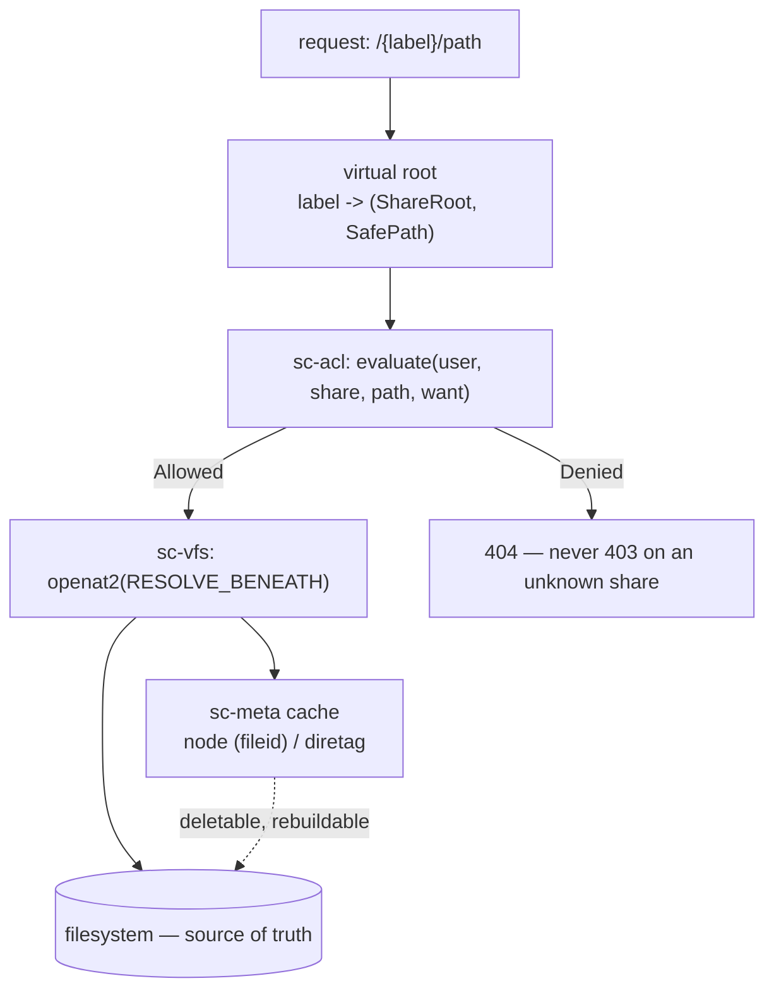

# Core: Safe Filesystem Access, ACL, Directory ETag - Spec Proposal

| Item       | Detail                           |
|------------|----------------------------------|
| Author     | heavycaffeiner(Dong Hyun Kim)    |
| Created    | 2026-08-03                       |
| Status     | Implemented                      |
| Reviewers  |                                  |

---

## 1. Summary

The domain layer every protocol sits on: `sc-vfs` reaches the filesystem
through kernel handles so a path can never be reinterpreted between check and
use, `sc-acl` decides who may do what, and `sc-meta` caches the two things the
filesystem cannot answer cheaply — stable file ids and recursive directory
ETags.

Two invariants hold the design together: **the filesystem is the only source
of truth** (the cache is deletable and rebuildable), and **a path is a kernel
handle, not a string**.

## 2. Background & Motivation

### 2.1 The class of bug this exists to remove

Normalize a path, prefix-check it against a root, then open it — the standard
shape, and TOCTOU-prone by construction. Between the check and the `open`, a
component can become a symlink. Every published escape in this class comes
from treating a path as a string that is validated once and trusted after.

`openat2(RESOLVE_BENEATH)` moves the check into the kernel, into the same
syscall as the open. There is no window because there is no second step.

### 2.2 Why a cache exists at all, given principle 1

Two things a POSIX filesystem will not tell you:

- **A stable id for a file across renames.** Sync clients key their entire
  local journal on it.
- **Whether anything under this directory changed.** The sync algorithm is
  "if a directory's ETag is unchanged, skip its subtree". Without it every
  sync is a full crawl and the client is unusable on a real tree.

Both are caches, and both are reconstructible by walking the tree — which is
what makes them compatible with principle 1. Accounts, grants and share links
are *not*, so they live in their own databases and must be backed up.

## 3. Goals & Non-Goals

### 3.1 Goals

- [x] No API above `sc-vfs` ever sees a host-absolute path or a raw fd.
- [x] Path traversal impossible by construction, not by validation.
- [x] Permission decisions that carry their own reason, for the UI and audit.
- [x] A user sees only what they were granted — the existence of anything
      else is never revealed.
- [x] Recursive directory ETags cheap enough that a root PROPFIND after a
      one-file change costs milliseconds on a million-file tree.
- [x] Coexistence: no sidecar litter, ownership and permissions preserved,
      external changes reflected.

### 3.2 Non-Goals

- [ ] Windows/macOS as deployment targets. The portable backend exists so the
      server runs on a dev box; it has weaker symlink handling, no
      cross-mount detection and no reflink copy.
- [ ] Path normalization. `.` and `..` are **rejected**, never normalized —
      normalizing is what creates the bypass.
- [ ] Rewriting on-disk filenames to a Unicode normal form. It would break
      external index databases reading the same tree.
- [ ] Blocking visually-confusable filenames. Mixed-script names are normal;
      a hard block's false-positive cost is too high, so it is a UI badge.

## 4. Technical Design

### 4.1 Architecture Overview



The label → `(ShareRoot, SafePath)` translation happens in exactly one place,
at the request entry point. That single site is what makes path-hiding a
property of the system rather than a rule each handler must remember.

### 4.2 Data Model Changes

`sc-meta` (disposable cache):

| table | key | holds |
|---|---|---|
| `node` | `(share, dev, ino, btime_ns)` unique | allocated `fileid` |
| `diretag` | `(share, fileid)` | `etag`, `rsize`, `rcount`, `gen`, `valid` |

`acl.db` (real state, must be backed up): grants, as §4.4's `Grant`.
`shares.db`: per-share identity and policy overrides, so an admin-UI rename
survives a restart without rewriting `config.toml`.

**Why `btime_ns` is in the identity key.** `dev`/`ino` alone are not enough on
a backend that cannot distinguish two directories — and `btime_ns` alone is
not either, since two directories can share a creation tick or report none.
This was load-bearing in practice: the portable backend once returned a
hardcoded `(0, 0)` for `dev_ino`, and a share root and one of its own
subdirectories reported the same fileid over WebDAV. A sync client keys its
journal on that id, so to the client two different resources *were* the same
file. The fix reads real volume-serial + file-index identity.

### 4.3 Core Logic — handles and syscalls

Two FD roles, split by type because `O_PATH` **cannot read**: `getdents64` on
one fails `EBADF`.

| Role | Flags | Used for |
|---|---|---|
| Anchor (`ShareRoot.dirfd`) | `O_PATH\|O_DIRECTORY\|O_CLOEXEC` | `openat2` base, `fstatat` |
| Listing (`DirHandle`) | `O_RDONLY\|O_DIRECTORY\|O_CLOEXEC` | `getdents64` |

The anchor is held for the process lifetime, so the share keeps pointing at
its original inode even if the host renames or unmounts the path underneath.
A tree walk opens `O_RDONLY` only for directories it actually lists;
intermediate components need no fd at all, because `openat2` resolves them
inside the kernel.

Resolve flags follow the share's symlink policy — `RESOLVE_NO_MAGICLINKS`
always (blocks escape via `/proc/self/fd/*`), plus `RESOLVE_BENEATH |
RESOLVE_NO_SYMLINKS` (deny), `RESOLVE_IN_ROOT` (clamp to root), or
`RESOLVE_BENEATH` alone (follow).

| Operation | Call |
|---|---|
| Open | `openat2(dirfd, rel, {flags, mode, resolve})` |
| Metadata | `statx(fd, "", AT_EMPTY_PATH, BTIME\|INO\|MNT_ID)` |
| List | raw `getdents64`; `d_type` avoids a stat, `statx` only on `DT_UNKNOWN` |
| Create | `openat2(O_CREAT\|O_EXCL\|O_WRONLY\|O_NOFOLLOW)` — blocks symlink preemption |
| Copy | `copy_file_range` loop — reflink on btrfs/XFS, server-side on NFS |
| Move | `renameat2`; `EXDEV` falls back to copy+unlink |
| Durability | `fdatasync(file)` **and** `fsync(parent)` — a rename needs both |

**Listing cost.** For a 10k-entry directory, `readdir` plus a per-entry
`statx` is 10k syscalls; `d_type` alone is 3–4 total. Views needing size or
mtime stat only what is on screen, via cursor pagination. Size/mtime *sort*
needs the whole set, so only that case goes through the cache.

**Feature detection** is probed once at startup. `openat2` failing `ENOSYS`
means the kernel is too old; failing `EPERM` means seccomp is blocking it —
typically Docker's default profile. The two get distinct startup messages
because the operator action differs. The fallback is a per-component
`openat(O_NOFOLLOW|O_DIRECTORY)` walk: still safe (each step refuses
symlinks, each holds its own dirfd, so escape stays impossible), but syscalls
scale with path length and a mid-walk rename yields a spurious `ENOENT`.
Startup logs the downgrade.

### 4.4 Core Logic — SafePath

Parsing is **reject-first**; anything ambiguous is an error.

| Rejected | Because |
|---|---|
| absolute paths, `.`, `..` | only share-relative paths exist; normalizing creates the bypass |
| empty components (`//`) | parser-disagreement attacks |
| NUL, `\x01-\x1F`, `\x7F` | C-string truncation, terminal escapes |
| a `/` inside a component | encoding bypass (`%2F`) |
| `> 255` bytes per component, `> 4096` total, depth `> max_depth` | `NAME_MAX`, `PATH_MAX`, recursion DoS |
| `:` | NTFS alternate data streams; SMB client interop |
| trailing `.` or space | Windows reinterprets these as a different file |
| `CON PRN AUX NUL COM1-9 LPT1-9` | Windows reserved device names |
| `.sctrash`, `.scpart-`, `.scmeta`, `.scindex` prefixes | our own control files |

That last list is shared by the tree walker, listing, and SMB's `veto files`,
from one definition, so the three cannot drift.

**Unicode**: a lookup tries the given bytes, then NFC, then NFD (macOS SMB
clients write NFD). New names are NFC-normalized **on creation only**.

`SafePath::parse` is covered by a fixed rejection suite
(`crates/sc-vfs/tests/safe_path_rejections.rs`), which asserts the invariant
that anything which parses contains no `..`, no absolute prefix and no NUL.
A `cargo-fuzz` target was considered and dropped: it wants a nightly
toolchain and a corpus, and this workspace is developed on a host that
cannot execute the Linux binaries it builds, so the target would be written
and then never run. A `proptest` case over arbitrary bytes is the cheap
substitute, and it is not written yet.

### 4.5 Core Logic — ACL evaluation

A grant is `(principal, share, subpath, allow, deny, inherit, label)` over
eight permission bits: READ, WRITE, CREATE, DELETE, RENAME, MOVE, SHARE,
DOWNLOAD. MOVE is its own bit rather than source-DELETE plus dest-CREATE.

```
evaluate(user, share, path, want) -> Decision

  principals = {User(user)} ∪ {Group(g) | g ∈ groups(user)}
  candidates = grants where g.share == share
             && (g.inherit ? g.subpath.is_prefix_of(path) : g.subpath == path)
             && g.principal ∈ principals

  for depth in (path.len() .. 0).rev():        # deepest first
      level = candidates at this depth
      if level empty: continue
      if ∃ g : g.deny  ∩ want ≠ ∅ : return Denied(by = g)
      if ∃ g : g.allow ⊇ want     : return Allowed(by = g)
      if ∃ g : g.allow ∩ want ≠ ∅ : want -= g.allow; continue
  return Denied(DefaultDeny)
```

- **Default deny.** No match, no access.
- **Deepest wins.** A READ grant on `/photos` does not block a WRITE grant at
  `/photos/upload`.
- **Same depth: DENY wins.** Predictable, and in the safe direction.
- **Every decision carries its reason**, so the UI can say "denied by group
  `editors`' rule on `/photos/private`" and the audit log records the grant id.

One clarification beyond the pseudocode: if a partial match reduces `want` to
empty, that is a full grant by composition and returns `Allowed` immediately.
This never changes a single-bit outcome — which is the case `effective()`
exercises, one bit at a time.

**Crossed with real filesystem permissions**: `acl_perms & fs_perms(handle)`.
POSIX ACL xattrs would be needed for full accuracy but are too expensive per
request, so they are measured once at share registration via `faccessat2`;
at runtime a mode-bit approximation is used and any real `EACCES` is passed
straight through. Better than reporting permission and then failing anyway.

**Caching** is `(user, share, path, want) → Decision` in an LRU, invalidated
by a global generation counter — any grant or membership change bumps it, and
an entry whose generation does not match is discarded. O(1) full invalidation.

### 4.6 Core Logic — the virtual root

What a user sees as their root is not a directory. It is a projection of their
grant list: one entry per grant whose `allow` includes READ, labelled by
`g.label`, else the subpath's basename, else the share name. Collisions get a
` (2)`, ` (3)` suffix in encounter order.

Grants on `/a/b` and `/a/c` produce two roots, `b` and `c`. **`/a` does not
exist as far as that user can tell.** This projection *is* the path-hiding
mechanism, which is why a share the caller holds no grant on answers **404,
not 403** — a 403 confirms the share exists, which is exactly what the
projection hides.

A new account starts with no grants and sees nothing; there are no user homes.
On first startup against a data directory that already had accounts, each
existing account is granted full access once, preserving pre-grants
behaviour — and the migration never re-runs, so an admin who later revokes
everything stays revoked.

### 4.6a Two name tables, and which one applies where

`SafePath` holds a name to one of two tables.

**Traversal** (`parse`, `join_existing`) refuses what breaks isolation: an
empty component, `.` or `..`, an embedded `/`, a NUL, a component over 255
bytes, and the reserved prefixes naming this server's own control files.

**Creation** (`join`) refuses all of that plus what a Windows or SMB client
could never address: control characters, `:`, a trailing dot or space, and the
reserved device names (`CON`, `PRN`, `AUX`, `NUL`, `COM1-9`, `LPT1-9`).

The rule for choosing is: **the creation table applies to a leaf that does not
exist yet, and to nothing else.**

That is not where it started. Resolution used to parse a virtual path's tail
with `parse` and then re-join every component with `join`, which made the two
tables disagree with each other inside one function: a name that parsed was
then refused. Principle 3 says a shared folder is not ours, so `CON` and `a:b`
arrive on a share whatever this server would have allowed, and the effect was
that no virtual path could name one at all. Not a stat, not a download, not a
rename, not a single-file delete, not a share link. An awkward *ancestor* was
worse still: the folder could not be entered, so nothing under it existed as
far as the API was concerned, and the one repair a person would reach for,
renaming it to something ordinary, was itself unreachable.

Resolution now joins with `join_existing`, and the five sites that mint a name
hold the leaf to the creation table themselves: `mkdir`, a `copy_to`/`move_to`
destination, a text write, and an upload destination. Nothing this server
creates has changed; what changed is that it can now address what other
services put there.

The tree operations (`copy_entries`, `move_entries`, `delete`, a listing, an
archive walk) never resolve a virtual path per entry and take the traversal
table throughout. They used to take the creation table on names `read_dir` had
just handed back, so one `CON` made a whole folder undeletable and the file
itself uncopyable.

Four more sites re-derived an *already-resolved* path the same way, and each
failed differently enough to have hidden the others:

| Site | What it broke |
|---|---|
| `ensure_fileid_chain` | a permanent delete charges quota back through it, so a folder under an awkward name could not be deleted |
| the dirty-marking ancestor walk | stopped part-way and left every directory above one serving a stale aggregate ETag, silently |
| the trash's directory rebuild | a file could be trashed and then never restored to where it came from |
| `sc-search`'s `join_child` | the walk skipped every such file, so it was absent from search results and from the recency query with no reason given |

The rule they all now follow is the same one: a name that came back from
`read_dir`, or a component of a path already resolved, is traversal.

### 4.7 Core Logic — directory aggregate ETag

**A DAV/compat-path cost only.** The native web UI uses per-file ETags,
explicit refresh and WebSocket invalidation, so a web-only deployment's copy of
this table is **populated only on request** and never by browsing. Isolating
the cost this way is the key design decision.

The wording used to say "empty". `GET /api/fs/size`
(`stowcloud-17-audit-gaps.md` §4.3.6) narrowed it: the details panel can ask
for one folder's recursive size, which computes and caches that folder's
aggregate. It is one folder at a time, when a user presses a control, so
opening a directory of a thousand subfolders still costs one `read_dir` and
starts no walk at all. What the claim guarantees is unchanged, which is that
browsing never pays for the aggregate; what it can no longer say is that the
table stays empty.

File ETag is `blake3(dev, ino, size, mtime)[..16]` — content is never hashed,
since reading 10 GB to describe a 10 GB file is not viable. A mtime-preserving
copy could collide in theory, but `ino` changes with it.

*Write path*: a change at `P` marks every ancestor of `P` dirty into an
in-memory set, flushed as one transaction after a 200 ms debounce. A bulk copy
of tens of thousands of files still touches a small ancestor set — batching is
what makes the design work.

*Read path*: return the row if valid and its generation matches the share's;
otherwise recompute under a single-flight guard, children sorted by name
(readdir order is not stable), descending with an explicit stack rather than
recursion. Cost is O(depth × fan-out), not O(subtree).

*Invalidation sources*: our own writes call `mark_dirty` directly after commit
rather than waiting on the watcher, so they are immediately consistent;
inotify events do the same; `IN_Q_OVERFLOW`, a mount reconnect or an admin
action bumps the share generation, invalidating every row at once; lazy
revalidation on the next read catches the rest. There is deliberately no
whole-table periodic sweep on top of those four. A draft specified a 6-hour
one; nothing was left for it to find that the generation bump and the lazy
path do not already cover, and a timer that walks every share on a 12 TB
floor is not a free background task.

*Cold start* is a full tree walk, deliberately unmitigated: a sync client's
first run PROPFINDs the whole tree anyway, so the cost amortizes into work
that was happening regardless.

### 4.8 Core Logic — trash

Per-share and flat: `<share>/.sctrash/{uuid}-{base64url(original path)}`. One
level, not a mirror of the tree — the original parent has nowhere else to
live, so it is folded into the entry name, and restore recovers the full path
from it and recreates missing ancestors before renaming back.

Before that, only the basename was kept, so restoring a file trashed from
`docs/2024/report.pdf` silently put it at the share root — no error, nothing
to indicate it had moved. Entries written in the old format have no recorded
parent and fall back to basename-only restore; that is documented legacy
shape, not a bug.

`TrashMode` is `Off` (default — deletes go straight through, no `.sctrash/` is
ever created) or `ShareLocal`. It is per-share, lives on `SharePolicy`, and
turning it off never deletes an existing `.sctrash/` — it only stops routing
new deletes through it.

## 5. API Design

### 5-1. New / Modified

```rust
/// Anchor for one registered share. The O_PATH fd is held for the process
/// lifetime so the share keeps pointing at its original inode.
pub struct ShareRoot { /* id, dirfd, root_dev, fstype, policy */ }

/// A validated share-relative path. Checked once at construction and
/// immutable after, so nothing downstream re-validates or re-normalizes.
pub struct SafePath(SmallVec<[Component; 8]>);

/// For listing — the returned handle is O_RDONLY and can be read.
fn ShareRoot::open_dir(&self, p: &SafePath) -> Result<DirHandle>;
/// For descending only — an O_PATH anchor, which cannot be listed.
fn ShareRoot::open_dir_anchor(&self, p: &SafePath) -> Result<AnchorFd>;

/// Decision carries the grant that decided it, for the UI and the audit log.
fn AclEngine::evaluate(user, share, path, want: Perms) -> Decision;
/// Per-bit union of `evaluate`, for "what can this user do here".
fn AclEngine::effective(user, share, path) -> Perms;
/// The virtual-root projection — one entry per READ-granted rule.
fn AclEngine::roots(user) -> Vec<RootEntry>;
```

**Invariant**: no `RawFd` and no host-absolute `&Path` ever leaves `sc-vfs`.
Layers above hold `ShareRoot + SafePath`, or a handle.

**`Entry::id` is `Option<FileId>` and a listing never populates it.** Browsing
a directory of a million files must not write a million rows because someone
scrolled. Only `stat_entry` and the compat layer's `ensure_fileid` allocate,
each for a single already-named path. Anything needing a stable id — a share
link, a sync journal — must go through the allocating path; anything that only
displays an entry must not assume `id` is populated.

### 5-2. Error Handling

| Condition | Result |
|---|---|
| path fails `SafePath::parse` | rejected at the boundary, never normalized |
| share exists, caller holds no grant | **404**, never 403 |
| permission denied by a grant | 403 carrying the deciding grant |
| filesystem refuses despite the ACL | the real `EACCES` is passed through |
| `openat2` unavailable (`ENOSYS`/`EPERM`) | per-component fallback + a startup downgrade warning |
| rename across a mount boundary | `EXDEV` → copy+unlink |
| symlink loop / hard-linked directory | blocked by resolve flags; ETag walk also keeps a visited `(dev, ino)` set |

## 6. Implementation Plan

### 6-1. Milestones

| Phase | Task | Duration | Owner |
|---|---|---|---|
| Phase 1 | `sc-vfs`: handles, `SafePath`, syscall mapping, caps probe | done | heavycaffeiner |
| Phase 2 | `sc-acl`: grants, evaluation, cache, virtual root | done | heavycaffeiner |
| Phase 3 | `sc-meta`: fileid allocation, `diretag` write/read paths | done | heavycaffeiner |
| Phase 4 | `sc-core`: domain API, trash, share registry | done | heavycaffeiner |
| Phase 5 | Fuzzing, escape suite, model-based ETag test | done | heavycaffeiner |

### 6-2. Dependencies

- **Linux ≥ 5.6** for `openat2`; `statx` btime, `renameat2`, `copy_file_range`
  and Landlock are probed and degrade individually.
- `rusqlite` (bundled SQLite, WAL), `blake3`, `smallvec`, `compact_str`,
  `dashmap`, `r2d2`.
- `proptest` for property tests; no fuzzing toolchain, per §4.4.

## 7. References

- `crates/sc-vfs/`, `crates/sc-acl/`, `crates/sc-meta/`, `crates/sc-core/`
- [`openat2(2)`](https://man7.org/linux/man-pages/man2/openat2.2.html) —
  `RESOLVE_BENEATH`, `RESOLVE_IN_ROOT`, `RESOLVE_NO_MAGICLINKS`
- [`statx(2)`](https://man7.org/linux/man-pages/man2/statx.2.html) — `STATX_BTIME`
- `stowcloud-10-auth.md` (accounts and groups), `stowcloud-9-api.md` (the
  routes this backs), `stowcloud-13-deployment.md` (filesystem matrix, EXDEV,
  watch backends)
