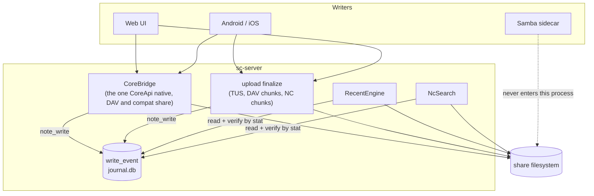

# Recorded activity, the recency query both phone apps cannot ask, and an archive listing that reads the archive - Spec Proposal

| Item       | Detail                           |
|------------|----------------------------------|
| Author     | heavycaffeiner(Dong Hyun Kim)    |
| Created    | 2026-08-11                       |
| Status     | **Implemented**                  |
| Reviewers  |                                  |

---

## 1. Summary

Four items. The first two are one feature seen from three surfaces, the web tab
and the two phone apps; the third is unrelated; the fourth is a defect that is
investigated here and deliberately not fixed.

1. **Recent Files answers the wrong question.** It answers "which files under
   the roots you can read were written most recently", which on this product
   means "what did anyone, including Samba, rsync and a backup job, touch". The
   question a user is asking is "what did *I* upload or change here". Those are
   different questions and only one of them is answerable from `stat` alone.
   This proposal adds a per-account record of the writes this server itself
   performed, and makes both surfaces answer from it.
2. **Neither phone app can even issue the recency query today.** Both send the
   modification bound as a Unix epoch integer or an ISO 8601 string;
   `parse_http_date_ns` accepts only an HTTP-date, and anything else fails the
   whole request with `400`. The Recent screen on Android and on iOS is
   therefore empty, and so is the Android gallery and the iOS media timeline,
   which send the same bound for paging. The date literal is one function and
   the highest-value fix in this document; §2.3 is the second half of the same
   screen on iOS, and needs the parser to stop asserting the opposite of a
   negation.
3. **Listing a 38 MB zip reads from every corner of the 38 MB.** The listing
   itself never reads an entry's content, but `zip 2.4.2` reads every entry's
   *local* header while opening the archive, which is one small read at a
   scattered offset per entry. The fix is to read the metadata region and
   nothing else, and to make that a property the code enforces rather than a
   claim a comment makes.
4. **The folder "synced" tick in the Android app is the client's own defect.**
   It is reported here with the evidence, because every input to it comes from
   us and every one is already true, so the only ways to suppress it are lies.
   Refusing them needs to be on the record.

Item 3 is independent of items 1 and 2 and can ship in either order.

## 2. Background & Motivation

### 2.1 What Recent answers today, and why it is the wrong question here

`stowcloud-18-recent-files.md` shipped `GET /api/recent` and routed the compat
layer's ordered `SEARCH` through the same bounded collector. Both answer by
walking every root the caller can read, `stat`-ing every file, and keeping the
newest N (`crates/sc-server/src/recent.rs`, `RecentEngine::recent`).

That answer is correct for the question it was given. The question is wrong for
this product, for a reason 18 itself wrote down in a different section:
principle 3, "a shared folder is not ours". Every root here is a share that SMB
clients also write. An mtime ordering over such a tree is dominated by writers
the person reading the screen has no relationship with, and it cannot say who
did anything, because `stat` does not record that. A user who wants to find the
document they uploaded from their phone this morning gets a list in which that
document competes with every file a backup job rewrote.

The cost is also real and was disclosed rather than solved
(18 §4.3.5): a recency answer has to `stat` every file under the caller's
roots, sequentially on one thread, under a walk deadline, and on a corpus that
does not fit the deadline the result is "the newest N of whatever the budget
reached", not "the newest N".

### 2.2 The recency query is rejected before it is answered

This is a live defect, not a design disagreement, and it explains the report
that the phone app shows no recent files at all.

Both clients send the recency bound as a `d:literal` under a comparison on
`d:getlastmodified`. `sc-dav` parses that literal with one function:

```rust
// crates/sc-dav/src/search.rs:227
pub(crate) fn parse_http_date_ns(s: &str) -> DavResult<i128> {
    httpdate::parse_http_date(s.trim())
        .map_err(|_| DavError::BadRequest("a date literal is not an HTTP-date".into()))
        ...
}
```

`httpdate::parse_http_date` accepts RFC 1123, RFC 850 and asctime. It accepts
nothing else, and `xml.rs:639-644` propagates the error, so the entire `SEARCH`
becomes a `400`. The comment above the function says both clients send an
HTTP-date. They do not, and have not for some time:

| Client | Screen | Literal it sends | Source |
|---|---|---|---|
| Android | Recent | `1785321600` and `1786531200` (Unix **seconds**), plus `2026-08-04T13:22:05Z` | `OCFileListFragment.getRecentFilesSearchRemoteOperation` sets `startDate`/`endDate` from `System.currentTimeMillis() / 1000L`; `NcSearchMethod.createQuery` writes them with `String.valueOf` and adds a third bound formatted `yyyy-MM-dd'T'HH:mm:ss'Z'` |
| Android | Gallery | `<d:lt>` with `String.valueOf(endDate)`, Unix seconds | `GallerySearchTask` multiplies the same value by `MILLIS_PER_SECOND` when it reads it back, which is what fixes the unit as seconds |
| iOS | Recent | `String(Int(fourteenDaysAgo.timeIntervalSince1970))`, Unix seconds | `iOSClient/Recent/NCRecent.swift` |
| iOS | Media | `2026-08-11T00:00:00+09:00`, format `yyyy-MM-dd'T'HH:mm:ssZZZZZ` | `iOSClient/Media/NCMediaNetwork.swift`, with `mediaPropOrder = "getlastmodified"` |

Nextcloud's own client documentation gives the datetime literal as ISO 8601
(`<d:literal>2021-01-01T17:00:00Z</d:literal>`), so the HTTP-date reading was
never the one the ecosystem uses.

Two consequences follow that are worth stating separately:

- The Android Recent screen sends **three** bounds on `d:getlastmodified` in one
  `d:and`. The parser keeps the last one it sees per direction
  (`mtime_from_ns = Some(...)` overwrites), which happens to be right for that
  body and is wrong in general: a conjunction of lower bounds is their maximum.
- Android's ISO literal is formatted with the device's local time zone and then
  suffixed with a literal `Z`. That is the client's bug. We parse what it wrote;
  guessing the device's offset would be inventing data.

The rest of the path is sound, and was checked rather than assumed: the app
sends `OPTIONS` to `/remote.php/dav` first and gives up silently unless `Allow`
names `SEARCH` (`SearchRemoteOperation.run`); `dav_paths::parse` maps that URL
to `DavTarget::Root`, `dispatch` answers `OPTIONS` before authentication, and
`recompose_allow` adds `SEARCH` because `app.rs:391` registers a search source
whenever the compat layer is built and configured, which it is in any build the
phone apps can log into at all. The `SEARCH` itself reaches `handle_search`. It
is the date literal, and only the date literal, that turns the answer into a
`400`.

### 2.3 The iOS recency query would answer empty even after that

iOS asks for "not a directory" the way the reference server understands it:

```xml
<d:not><d:eq><d:prop><d:getcontenttype/></d:prop>
  <d:literal>httpd/unix-directory</d:literal></d:eq></d:not>
```

`parse_searchrequest` ignores `d:not` (documented at `xml.rs:470`) and folds the
inner comparison into `content_type_prefixes`. `NcSearch::search` then maps that
prefix through `mime_prefix_extensions`, which knows `image`, `video` and
`audio` and nothing else, and:

```rust
// crates/sc-server/src/nc_search.rs:158
if exts.is_empty() {
    return Ok(Vec::new());
}
```

So the query returns an empty `207`. The negation was dropped and the predicate
it negated was then applied as though it had been asserted, which is the exact
opposite of what the client asked.

### 2.4 A dropped conjunct widens the query it was dropped from

The parser flattens the boolean structure of `d:where` and applies every
comparison it finds conjunctively, which `xml.rs:463-476` documents along with
the rule that governs it: "Refusing the queries that do not fit would fail the
whole search box for a shape no client actually sends; answering a superset
would be worse."

That gives a direction, not a prohibition. Applying a disjunct as though it were
a conjunct answers a **narrower** query than was asked, which the module accepts
on purpose. Dropping a conjunct answers a **wider** one, which is the case the
same file calls out for a date bound: "a bound the server silently drops turns
'modified since Tuesday' into 'everything'".

Three drops in the current parser are unconditional, so each lands on the wrong
side of that line whenever the predicate it discarded was a conjunct, which is
where the shipped clients put nearly all of theirs:

- a comparison on a `DAV:` property with no branch falls into `_ => {}`
  (`xml.rs:648`),
- a comparison whose `d:prop` names nothing at all is discarded by
  `let Some(prop) = prop else { continue }` (`xml.rs:616`),
- a `d:not` is ignored rather than inverted (`xml.rs:470`), which in §2.3 does
  worse than drop the predicate: it asserts its opposite.

The justification the module gives for flattening, "the union of both clients'
query bodies is small and fixed, and every member of it maps exactly", is
therefore not true today, and §2.3 is what that costs.

### 2.5 Listing a zip reads the zip

`archive_list` opens the file and hands it to `sc_preview::list_archive`
(`crates/sc-server/src/bridge.rs:954`). That module never reads an entry's
content, and says so. It is still O(entries) random reads over the whole file,
for a reason that is inside the `zip` crate:

```rust
// zip 2.4.2, src/read.rs, central_header_to_zip_file, called once per entry
// while ZipArchive::new builds its index
let data_start = find_data_start(&file, reader)?;
// src/read.rs:362
fn find_data_start(...) { reader.seek(SeekFrom::Start(data.header_start))?; ... }
```

`header_start` is the entry's **local** header, which sits next to its content,
scattered across the entire archive. Opening an N-entry archive therefore reads
a 30-byte block at N scattered offsets, on top of the central directory itself.
The reader underneath is `sc_core::stream::SeekableFile`, whose `Seek` is
arithmetic on a stored position and whose `Read` is one `pread` at that
position, with no buffer: the seek costs nothing and the read that follows it
lands wherever the seek pointed. So each entry costs one `pread` far from the
last one, and the crate's 2-byte and 4-byte field reads over the central
directory are each a syscall of their own.

On a warm page cache this is milliseconds and nobody notices. On the rotational
storage this product is built for, N head movements at roughly 10 ms each is the
reported wait. The archive being 38 MB is not what makes it slow; the entry
count is, and a 38 MB archive of a few thousand files is an ordinary one.

The ceiling that exists today makes this worse rather than better. `bridge.rs:49`
refuses any archive over 4 GiB, and `PreviewDialog.svelte:57` repeats the number
client-side, both explaining that a zip's central directory is at the end of the
file and seeking to it is expensive. The central directory is not the expensive
part; the per-entry local header probe is, and file size does not predict it.

Two smaller things on the same path: `fs_archive_list`
(`crates/sc-http/src/routes.rs:2048`) calls this blocking, seeking, whole-file
operation directly on the async executor rather than through `spawn_blocking`,
and it takes no concurrency permit.

### 2.6 The folder "synced" tick is the client's, and there is no honest server fix

Reported: the Android app shows the synced tick on folders that were never
synced. The mechanism is entirely inside the client.

```kotlin
// nextcloud/android, app/src/main/java/com/owncloud/android/ui/adapter/OCFileListDelegate.kt
private fun OCFile.canCheckFolderDown(): Boolean = mimeType != null &&
    isFolder && !isEncrypted && fileLength != 0L && !etag.isNullOrBlank()

private fun showLocalFileIndicator(file: OCFile, holder: ListViewHolder) {
    var isFolderDown = false
    if (file.canCheckFolderDown()) {
        isFolderDown = storageManager.fileDao.areAllFilesHaveMediaPath(file.fileId, user.accountName)
    }
    ...
    isDown || isFolderDown -> R.drawable.ic_synced
```

```kotlin
// app/src/main/java/com/nextcloud/client/database/dao/FileDao.kt
@Query("""
    SELECT NOT EXISTS (
        SELECT 1 FROM filelist
        WHERE parent = :parentId AND file_owner = :accountName
          AND content_type IS NOT NULL
          AND content_type != 'DIR' AND content_type != 'httpd/unix-directory'
          AND (media_path IS NULL OR TRIM(media_path) = ''))
""")
fun areAllFilesHaveMediaPath(parentId: Long, accountName: String): Boolean
```

`NOT EXISTS` over an empty set is true. A folder whose children have never been
listed on the device has no rows in `filelist`, so "are all of its files
downloaded" answers yes, and the tick appears.

Every input to the guard comes from us, and every one of them is already
truthful. `fileLength` is `oc:size`: `props.rs:287-309` emits the recursive
rollup for a directory and omits the property when the rollup is unavailable,
and `aggregate.rs` sums file sizes only, so an empty folder reports 0 and is
skipped exactly as it would be against Nextcloud. `etag` is the directory ETag.
`mimeType` is `DIR`, which the client derives from `d:resourcetype`.
`isEncrypted` is `nc:is-encrypted`, which we answer `0` and a reference server
with the E2EE app answers `0` for an unencrypted folder, so the client reads the
same value from both.

Which means every way to suppress the tick from a server is a false statement.
Reporting `oc:size` as 0 for every folder breaks the size both apps display and
denies a number we have. Withholding the folder ETag breaks the comparison the
clients use to decide whether a folder needs re-listing, turning a cosmetic
defect into a sync defect. Claiming `nc:is-encrypted` is 1 tells a client the
folder is end-to-end encrypted, which is the most damaging of the three and the
only one that would look clever. None is acceptable, so §4.4 says what happens
instead.

### 2.7 What this changes in proposal 18, and why that is not a reversal of principle 1

18 §2.4 rejected an activity feed, on three grounds. They are answered here one
by one rather than stepped around.

- *"An event journal cannot be rebuilt from the filesystem, and principle 1 says
  the database is a cache that can be deleted and rebuilt."* Correct, and it is
  why the record proposed here does not live in `meta.db` and is not called a
  cache. Principle 1 is about **file state**: names, sizes, times, contents. It
  is not violated by remembering what this program did, because that was never
  file state and the filesystem never held it. The product already stores
  exactly this class of data: favourites (`NcStore`) and share links
  (`links.db`) are user-authored facts no `stat` can reproduce, and deleting
  either loses them. What principle 1 does forbid, and what §4.3.2 keeps, is
  letting the database answer questions about file state. Every row is verified
  against the filesystem before it is shown, and every value on the screen comes
  from `stat`.
- *"Writes through SMB never pass our handlers, so a journal fed from them is
  incomplete by construction."* Also correct, and it is now the point rather
  than the objection. The requirement is precisely to exclude them. `sc-smb`
  orchestrates a Samba sidecar and never routes a byte through this process, so
  "recorded by this server" and "not written over SMB" are the same set. No
  filter is needed, and none can be bypassed.
- *"`stubs.rs` answers `/apps/activity/api/v2/activity` with a deliberate 404 and
  `capabilities.rs` omits the `activity` key."* Unchanged. This is not the
  Activity app, there is no per-event history, no actor shown to anyone but the
  actor, and no capability flips. The compat surface gains no route.

18's §3.2 non-goal "no activity or audit feed" is superseded to the extent
described in §3, and to no greater extent. Its fix survives intact: the `TopN`
collector and `collect_newest` still do exactly what 18 built them for, because
ordered searches that name content still walk (§4.3.5). `collect_newest` changes
address and nothing else (§4.3.4).

## 3. Goals & Non-Goals

### 3.1 Goals

- [ ] Record, per account, the writes this server performs on the caller's
      behalf: uploads, edits, copies, moves and restores.
- [ ] Answer `GET /api/recent` from that record, so the web tab shows "what you
      did here" rather than "what changed on disk".
- [ ] Answer the compat layer's recency `SEARCH` from the same record, so the
      Android and iOS Recent screens show the same list as the web tab.
- [ ] Accept the date literals the clients actually send: HTTP-date, ISO 8601 /
      RFC 3339, and a bare Unix-second integer. Merge repeated bounds as a
      conjunction.
- [ ] Stop widening a query by dropping part of it: a predicate the parser
      cannot apply is refused where dropping it would widen the answer, and
      dropped only where dropping it narrows.
- [ ] Read only an archive's metadata region when listing it, and enforce that
      in code rather than assert it in a comment.
- [ ] Take the archive listing off the async executor.

### 3.2 Non-Goals

- [ ] **No activity feed, no audit log, no per-event history.** One row per
      (account, file), holding the last thing that account did to it. No actor
      is ever shown to anyone but the actor, no `activity` capability, no OCS
      route, and the record is best-effort: a file is written even if the row is
      not, and nothing may treat a missing row as evidence that a write did not
      happen.
- [ ] **No attribution of writes we did not perform.** SMB, rsync and anything
      else sharing the directory stay invisible to this feature. They remain
      fully visible everywhere else: browsing, search, PROPFIND and every mtime
      the product reports are unchanged.
- [ ] **No backfill.** There is no way to reconstruct who wrote what before the
      record existed, so an upgraded install starts empty and fills as people
      work. Any "backfill" would be a guess presented as history.
- [ ] **No fix for the folder tick in §2.6.** See §4.4.
- [ ] **No change to what `d:getlastmodified` means, or to any non-recency
      search.** A search that names content still walks the filesystem and still
      answers from it.
- [ ] **No new dependency, and two removed from the shipped binary.** The `zip`
      crate stays in the tree as a dev-dependency, where an independent
      implementation is worth having, and leaves the request path with `zopfli`
      behind it.
- [ ] **No push updates.** Unchanged from 18 §3.2: the tab loads on mount and on
      refresh.

## 4. Technical Design

### 4.1 Architecture Overview



Per crate:

| Crate | Change |
|---|---|
| `sc-dav` | date literals, conjunction merge, `d:not`, unhandled `DAV:` comparisons, and `SearchTerm::in_disjunction` |
| `sc-server` | new `journal` module; a recording call at every write site (§4.3.1); `RecentEngine` reads the journal; `NcSearch` gains a recency branch; `ARCHIVE_LIST_MAX_BYTES` and its check are deleted |
| `sc-preview` | `list_archive` reads the central directory and nothing else |
| `sc-http` | `/api/recent` response shape; `RecentApi` loses its tier and gains `forget_user`; `fs_archive_list` on a blocking thread |
| `sc-core` | two signatures, both in §4.3.1: `trash_restore` returns the path it restored to, and `OpResult` carries the path a batch item actually created. No schema, no policy, no behaviour change |
| `sc-upload` | `finalize` and `assemble_and_finalize` return the path they published (§4.3.1). No new dependency, no new state |
| `sc-compat-nc` | `vendor_filters` reports the terms it did not read (§4.3.7). No new vocabulary, no new route, nothing crosses the isolation boundary, so the CI isolation gate and the feature-stripped build are unaffected |
| `sc-meta`, `sc-vfs`, `sc-acl` | none |
| `web` | `/recent` copy and types; the client-side archive ceiling removed |

### 4.2 Data Model Changes

One table, in its own database file, `journal.db`, opened in `App::build`
beside the others. The name matches the module and the store, `journal.rs` and
`WriteJournal`, and deliberately not `activity.db`, which would name it after
the reference server's Activity app: the per-event history with actors that
§2.7 and §3.2 refuse, and that an operator finding the file should not think
they have.

```sql
CREATE TABLE IF NOT EXISTS write_event (
  user   INTEGER NOT NULL,
  share  INTEGER NOT NULL,
  path   TEXT    NOT NULL,  -- share-relative, no leading slash
  op     TEXT    NOT NULL,  -- upload | edit | copy | move | restore
  at_ns  INTEGER NOT NULL,  -- nanoseconds since the epoch, i64
  UNIQUE (user, share, path)
);
CREATE INDEX IF NOT EXISTS write_event_by_user ON write_event(user, at_ns DESC);
```

Decisions, and what each is instead of:

- **Not in `meta.db`.** That file is documented as a cache that may be deleted
  and rebuilt, and a startup that rebuilds it must not silently empty a list a
  user trusts. A separate file makes the difference visible in the data
  directory, where an operator can see it.
- **One row per (account, file), not one per event.** The screen shows files,
  not history, so the newest event per file is the whole of what is rendered.
  It also bounds growth without a sweeper: a user who saves the same document
  forty times has one row.
- **`share` plus a share-relative path, not a `FileId`.** File ids here are
  allocated lazily and keyed by (share, parent, name), so they do not survive a
  rename performed outside this process any better than a path does, and a path
  needs no allocation on the write path. A row whose path no longer resolves is
  dropped at read time (§4.3.2), which is also what happens to a row whose file
  was deleted or whose grant was revoked.
- **`op` is stored** because without it a restored file at the top of the list,
  carrying a three-year-old mtime, looks like a bug.
- **No actor beyond `user`, and no reader other than that same user.** There is
  no query in this design that returns another account's rows, so no
  "who changed this file" surface is created. What keeps that true across an
  account's lifetime, given that ids are reused, is in §4.3.3.
- **A store that will not open is not a reason not to start.** Every other
  database in the data directory is load-bearing, so `App::build` fails when one
  of them fails. This one is not: if `journal.db` cannot be opened, the error is
  logged once, the endpoint answers an empty list, and every write path skips
  its recording call. A convenience index that takes the server down with it
  when it is corrupt would contradict the best-effort promise in §3.2 at the one
  moment the promise matters.

### 4.3 Core Logic

#### 4.3.1 What is recorded, and where

Everything that writes on a caller's behalf goes through one of two things.
`CoreBridge` (`crates/sc-server/src/bridge.rs`) implements both
`sc_dav::CoreApi` and `sc_http::core_api::CoreApi`, so it is the single adapter
behind the native routes, WebDAV and the compat surface. `UploadEngine`
publishes an assembled upload itself, in `finalize` and `assemble_and_finalize`,
without passing through the bridge.

The engine lives in `sc-upload`, but every one of its four finalize callers is
in `sc-server`, so the recording call goes to the callers rather than into the
engine. `sc-upload` keeps its dependency list at `sc-vfs` and learns nothing
about accounts or their activity; what it gains is one return value, for the
reason the fourth bullet below gives.

`CoreBridge` already carries a hook of the right shape,
`note_index_change(&self.core, &added, &removed)`, documented as "our own
writes", and the `(ShareId, SafePath)` pairs it is handed by `index_path` are
exactly the key this journal stores. It is a useful map of the write sites and
not a complete one, so the journal is wired to the list below rather than to the
hook. Of the fourteen places the journal records, seven already have the hook
and seven do not; the hook also fires at five places the journal ignores on
purpose (`mkdir` twice, `delete` twice, `create_empty`). The last column says
which is which, so nobody later assumes the two sets are the same.

| Write | `op` | Recorded at | Index hook there today |
|---|---|---|---|
| `write_bytes`, `write_text` (native save, DAV `PUT`) | `edit` when the file existed, `upload` when it did not | `bridge.rs:419`, `bridge.rs:844` | yes |
| `rename` | `move` | `bridge.rs:279`, `bridge.rs:742` | yes |
| `move_entries` (DAV) | `move` | `bridge.rs:322` | yes |
| `copy_entries` (DAV) | `copy` | `bridge.rs:353` | yes |
| `copy_to` (DAV `COPY`) | `copy` | `bridge.rs:366` | yes |
| `move_entries`, `copy_entries` (native batch and job) | `move`, `copy` | `bridge.rs:750`, `bridge.rs:778` | **no** |
| `trash_restore` | `restore` | `bridge.rs:874` | **no** |
| TUS finalize, create-with-upload finalize | `upload` | `bridge.rs:1818`, `bridge.rs:1894` | **no** |
| DAV and NC chunk assembly | `upload` | `dav_uploads.rs:448`, `nc.rs:547` | **no** |
| `mkdir`, `create_empty`, `delete`, `trash_purge` | not recorded | | |

The seven sites with no index hook are a pre-existing gap in the name index:
a native batch copy, a native move, a restore and every upload land in a share
without telling an index that has one, and are picked up only when the watcher's
reconcile pass reaches that directory. It is recorded here because this proposal
read that code, and it is **not** fixed here: the journal does not need the
index and the index does not need the journal.

Recording needs the path a write actually landed at. Most sites already have it,
three do not, and each of those three is one return value away from having it.
None of the three is a behaviour change: every one of them is a function that
already computed the answer and threw it away.

**The DAV batch operations already have it, exactly.** `CoreBridge`'s
`move_entries` and `copy_entries` hardcode `OnConflict::Overwrite`, and their
own comment says what that buys: "this mode is hardcoded `Overwrite`, never
`Rename`, so the destination name never differs from the source's own". So
`dest_under(to_dir, source)` is the destination there, not a guess, and nothing
about that path has to change. `copy_to`, DAV `MOVE`, `rename` and `write_bytes`
name their target outright.

**The native batch operations do not, and cannot be made to by guessing.**
`hapi::CoreApi::copy_entries` and `move_entries` pass the caller's own
`OnConflict` through, so the web UI's "keep both" reaches
`OnConflict::Rename`, where `sc-core` publishes at `unique_name(...)`, a name no
caller can reconstruct. `OnConflict::Skip` is worse for this purpose: it returns
`OpResult { ok: true }` having copied nothing, so recording every `ok` row would
record a copy that did not happen, at a path that belongs to somebody else's
file. `OpResult` therefore gains the path the operation actually created, `None`
when it created nothing, filled by `copy_entries` and `move_entries`.

The journal reads that field on both halves, so the rule for a batch is one
sentence rather than two: record what the operation says it created, and record
nothing when it says it created nothing. `dest_under` keeps its existing job of
feeding the name index on the DAV half, where the paragraph above shows it is
right.

**`trash_restore` does not return where it restored to.** It decides the path
itself, from the original path encoded in the trash entry's name, and answers
`()`. The information looks available from outside, because `TrashEntry` carries
`orig_path`, and that is the trap: `orig_path` is empty for an entry written
before that encoding existed, and those are exactly the entries where
`trash_restore` applies its documented legacy fallback and restores to the share
root. Deriving the path outside the function would agree for new entries and
disagree for old ones, silently, in the direction of naming a file that is not
there. Its signature changes to return the restored `SafePath` instead.

**The finished upload does not say where it landed either.** Three of the four
finalize sites cannot name the file they just published: `SessionStatus`, which
is all `UploadBridge` has, carries the share and the offsets but not the
destination, and the NC port method has only a share and a session id. The
destination is in `SessionSpec::dest` and the engine writes to it, so
`UploadEngine::finalize` and `assemble_and_finalize` return the `SafePath` they
published. That is the whole of the `sc-upload` change: no new dependency, no
new field on a session, nothing about accounts. It also makes the fourth site,
`dav_uploads.rs`, use the same value as the other three instead of the vpath it
happens to have in scope, which is one fewer way for the two to disagree.
`sc_compat_nc::ports::UploadPort` is untouched: `nc.rs` records and keeps
returning `()` upward, so no vocabulary and no new value crosses that boundary.

`edit` against `upload` needs no extra `stat` on either half, which is worth
saying because the obvious implementation adds one. `Core::write_text` refuses
an overwrite without the current etag and refuses a create that carries one, so
on the success path `if_match.is_some()` is exactly "the file already existed".
The DAV half computes that etag itself and the native half is handed it by the
route, so both already hold the answer when the write returns.

Notes that are consequences, not omissions:

- **Deletes are not recorded** because the list shows files and a deleted file
  has nothing to show. Its row goes stale and is dropped on the next read.
- **An upload is `upload` even when it replaced a file.** The distinction the
  labels draw is the one the caller drew: a client that ran an upload gets
  `upload`, and `edit` is for a save over a file that was already there through
  the write path. Relabelling one as the other because of what happened to be at
  the destination would describe the destination, not the action.
- **`create_empty` is not recorded.** It exists for `LOCK` on a path that does
  not exist yet, and a zero-byte placeholder is not something anyone is looking
  for in a recent list. The consequence is that a client which locks and then
  `PUT`s sees its first upload labelled `edit`, because by then the file exists.
  One word, in one flow, and the alternative is a list with empty placeholders
  in it.
- **A directory-level copy or move records the directory**, not the thousands of
  files under it. The files-only reader then shows nothing for it. Recording per
  file would let one operation evict every other row a user has, which destroys
  the only thing the list is for.
- **A file moved by us appears at its destination.** The old row still names the
  old path, fails its `stat`, and is deleted on read.
- **A file moved by SMB drops out.** Its row names a path that no longer exists.
  We do not chase renames we did not perform.
- **Public link uploads are not recorded.** A drop-box upload has no account
  behind it, so there is no row to key. Recording it under the link's owner
  would attribute a stranger's action to them.
- **Best-effort.** The file operation has already succeeded when the row is
  written, so a failure here is logged and swallowed, exactly as
  `note_index_change` does. This is why §3.2 forbids treating the record as an
  audit log.

#### 4.3.2 What "recent" means now, and what still decides the facts

A file is in the answer when a row says this account wrote it and the filesystem
agrees the file is still there and still readable by that account. The row
supplies two things and only two: that it happened, and when. Everything on the
screen (name, size, mtime, the fact that it exists, the fact that it is a file
and not a directory) comes from a `stat` performed while answering the request,
through `Core`, under the same ACL evaluation as every other read.

The read path, per row, in order:

1. `SharePath::parse` the stored path, then `Core::vpath_for(user, share, sp)`.
   A row that no longer projects into a vpath the caller holds is dropped from
   the answer: this is what makes a revoked grant hide rows without any
   revocation bookkeeping, and re-granting shows them again.
2. `Core::stat_entry`. A row whose file is not there is dropped from the answer.
3. Directories are dropped from the answer (§4.3.1).

A row is **deleted** from the table in exactly one case: step 2 answered
`CoreError::NotFound`, meaning the file itself is gone. Every other reason for
dropping a row from an answer leaves the table alone, including step 1. The
distinction is not a nicety, and it decides two cases that would otherwise be
silent data loss: a grant revoked today may be granted again tomorrow, and a
share that fails to mount at boot would erase every account's history on the
first page load. This record cannot be rebuilt from anything (§3.2), so the only
deletion it performs is the one that is certainly correct.

Even that one deletes on a condition, not on a key. A read that finds a file
missing and a write that recreates it can interleave: the reader stats
`report.pdf` while it is briefly gone, the user uploads a new `report.pdf` a
moment later, and a delete keyed on `(user, share, path)` alone would then throw
away the row the upload just wrote. So `forget` carries the `at_ns` the reader
saw and deletes only where it still matches. A row that changed under it is a
row about something that happened after the observation, and the observation
does not get to overrule it.

Bounded work, and worth being exact about rather than called cheap: step 1
touches no filesystem, because `Core::vpath_for` walks the caller's grants and
does prefix arithmetic on the path, but it does rebuild that grant list once per
row, and building it reads the ACL engine under a lock and allocates a label per
grant. So step 1 costs rows times grants of in-memory work, which the 500-row
cap and the handful of grants a real account holds keep small, and which is
worth remembering before anyone raises the cap. Step 2 is one `stat`. In the
ordinary case both run `limit` times; in the worst case, where every row is dead
or outside the scope, they run over the account's whole row set. No walk, no
deadline, no truncation, and therefore no `completeness` field to report (§5-1).
The honest contract that 18 §4.3.5 had to hedge becomes exact:
**the answer is every file you wrote here inside the window, newest first, up to
`limit`.**

What changes on the screen, against 18's rule that recency is mtime and nothing
else:

| Event | Under 18 | Here |
|---|---|---|
| You upload or edit a file | appears | appears |
| You rename or move a file | does not appear, mtime is unchanged | appears, at its new path |
| You copy a file with its timestamps preserved | does not appear | appears |
| You restore a file from the trash | appears only if its mtime happened to be recent | appears, labelled `restore` |
| Somebody writes the same share over SMB | appears | does not appear |
| Another account uploads through this server | appears | does not appear, it is in their list |

#### 4.3.3 Bounds, and what a deleted account or share takes with it

**One limit: 500 rows per account.** The oldest beyond that are deleted, by one
`DELETE` in the same transaction as the upsert, driven by the
`(user, at_ns DESC)` index and matching no rows in the common case. Worst case
is 500 rows per account, a few tens of kilobytes for a household install. There
is no sweeper thread and no scheduled job.

**No age window, deliberately.** The obvious companion to a row cap is "delete
anything older than 90 days", and it is rejected here rather than left out. That
prune compares a stored timestamp against `now`,
and a clock that jumps forward, which is an ordinary event on a small box with a
dead RTC before NTP corrects it, makes `now` minus the window newer than every
row in the table and deletes all of them. The record cannot be rebuilt (§3.2),
so a bound whose failure mode is "lose everything, silently, because of the
clock" buys nothing the row cap does not already buy: the cap is deterministic,
clock-independent, and is what actually bounds the table.

Dropping it costs nothing on the wire either, because `since_days` filters at
read time regardless. And the cap cannot hide a row from a request that could
have shown it: evicting a row means 500 newer ones exist, every one of them is
inside any window that contained the evicted row, and no request may ask for
more than 500. The single exception is worth stating rather than discovering:
if all 500 of those newer rows are dead, the answer is shorter than it could
have been. Dead rows are deleted on read (§4.3.2), so that state does not
persist past the next request.

**The order is total, not just descending.** `(at_ns descending, share
ascending, path ascending)`, for the reason 18 gave for its own tie-break: two
rows can share a timestamp, a database is free to return equal keys in any
order, and a list that reshuffles between two identical requests looks broken.
`ORDER BY at_ns DESC, share, path` costs nothing over the index that is already
there.

**A deleted account or share takes its rows with it, and that is not
housekeeping.** `user.id` and `share_.id` are both `INTEGER PRIMARY KEY` with no
`AUTOINCREMENT`, which in SQLite means the largest id is reused once its row is
gone: delete share 3 and the next share created becomes share 3. A journal keyed
on `(user, share, path)` would then quietly hand the old rows to the new
referent. For a share that is a wrong claim about who wrote a file; for an
account it is worse, because the next person to hold that id would read the
previous holder's private history, which is exactly the thing §4.2 says this
design does not build. So:

- `CoreBridge::delete_share` deletes every row naming that share. It already
  lives in `sc-server`, next to the journal, so this is one statement.
- `admin_delete_user` deletes every row for that account, through a
  `forget_user` on the same port it reads through (§5-1). It is the third line
  in a handler that already calls `auth.delete_user` and `ws.revoke_user`, and
  it joins a rule `sc-auth` already keeps and already tests
  (`delete_user_removes_dependent_rows`).

Retention is a bound on size. This is a bound on meaning, and dropping it would
not show up as a full disk; it would show up as somebody else's file in your
list.

#### 4.3.4 The native surface

`RecentEngine` keeps its scope resolution, its root filtering and its
`vpath_for` conversion, and loses the matcher, the budget, the walker and the
channel. It also loses the `limits` and `storage_cache` fields those needed, and
with them the doc comment saying an operator's `[search]` setting "governs this
surface too", which after this change it does not: that setting still governs
every walk, and this surface no longer walks. No user-facing copy says otherwise,
so nothing outside the code has to change with it.

`TopN` stays in `sc-search` untouched, and `collect_newest` moves from
`recent.rs` to `nc_search.rs`, its only remaining caller. Leaving it behind would
leave a module whose doc calls it "the bounded collector two surfaces share"
holding a collector one surface uses, next to code that no longer walks at all.

A `scope` still resolves and is still refused when it does not, and it now also
filters: a row whose vpath is not inside the resolved scope is not in the
answer. Because that filter and the liveness check both remove rows, the read
takes the account's rows inside the window rather than the first `limit` of
them, and stops once `limit` have survived. The per-account cap makes that
bounded without a second thought: there are never more than 500 to consider.

`GET /api/recent` loses its concurrency permit and its storage tier, which
existed to bound a walk that no longer happens. It keeps `check_search_rate`,
which is the same per-account bucket `GET /api/search` uses and which this
endpoint already shares today, because a cheaper query is not a reason to drop a
rate limit. It keeps `spawn_blocking` too: a SQLite read and
a few hundred `stat` calls are blocking work, and §4.3.8 puts the archive
listing on a blocking thread for exactly the same reason. Losing the walk is
what removes the permit, not what makes the handler async-safe.

#### 4.3.5 The compat surface: which `SEARCH` is a recency request

`NcSearch::search` keeps every branch it has. One is added, and it is selected
by what the request actually constrains, after parsing:

> A request is a **recency request** when it orders by `d:getlastmodified`
> descending, carries at least one bound on `d:getlastmodified`, and constrains
> nothing else: no name substring, no media type, no favourites flag, no file
> id, and no folders-only filter. It is answered from the write journal, for the
> calling account only, limited by `d:nresults` and capped at `MAX_RESULTS`.

`d:from/d:scope/d:href` is honoured exactly as it is on every other branch:
`scope_to_vpath` refuses a scope naming another account before anything is read,
and a resolved scope filters the rows the same way §4.3.4 filters them. Both
clients scope their Recent screen to `/files/{user}`, which is the whole tree,
so this is the empty case in practice and a real filter if either ever narrows
it.

Every other shape is unchanged. A name search walks. A gallery or media query
carries `image/%` and `video/%` and walks, through `collect_newest` exactly as
18 left it. A favourites query reads the favourites table. A file-id query is a
lookup. A folders-only ordered query walks, rather than matching a rule that
would answer it empty from a table that holds no directories. An ordered query
with no date bound at all is not a recency request either, and keeps 18 §4.3.4's
handling: the matcher gets an unbounded mtime range so the walk's stat phase
runs and `TopN` has an mtime to order on.

Checked against the four bodies in §2.2: Android Recent and iOS Recent match the
rule; the Android gallery and the iOS media timeline do not, and keep walking.
iOS Recent matches only because of §4.3.7: its `httpd/unix-directory`
comparison stops being a media type there and becomes the kind filter it always
was. Without that change this rule would never fire for iOS, and the two
surfaces would disagree, which is the thing this proposal exists to prevent.

The journal is read with no lower bound of its own here, which matters enough to
say out loud: the obvious shortcut is to pass the request's `d:getlastmodified`
bound to `WriteJournal::newest` as its `since_ns`, and that would be filtering
the recorded time by a bound the client wrote about the file's modification
time. Two different quantities, one filter, and a wrong answer whenever they
differ, which is exactly the restore case this design already has a label for.
The read applies no lower bound at all; the row cap is what bounds it.

The request's own predicates are then applied to the rows, from the `stat` each
row already needs: the mtime bounds filter on the file's mtime, because that is
the property the client named, and the rows are returned ordered by
`d:getlastmodified` descending, because that is the ordering the client asked
for. The native tab orders by the recorded time instead, since that is what its
own contract promises. The two sets are identical; the two orders differ only
for a file whose mtime was preserved by the operation that recorded it, which is
a restore or a timestamp-preserving copy.

**The cost, stated rather than buried.** A client sending
`d:getlastmodified > X` with no other predicate receives what this account wrote
through this server in that window, which is a subset of the resources matching
the filter it wrote. RFC 5323 has no field in which to declare that, and this
document is the declaration. Three things make it the right trade rather than a
convenient one:

- The only thing that sends this query is a screen labelled Recent, in the two
  clients this compat surface exists to serve, and this is the answer that
  screen is asking for.
- A truthful answer to the literal query is the one described in §2.1: dominated
  by writers unrelated to the person reading it, and expensive to compute.
- The narrowing is uniform and stated, not conditional on a client, a user
  agent, or a header. Every query that constrains nothing but time and resource
  kind gets the same answer, and every query that names any content at all gets
  the filesystem.

#### 4.3.6 Date literals, and bounds that repeat

`parse_search_date_ns` replaces `parse_http_date_ns` and accepts exactly three
forms, in this order:

1. **A bare decimal integer**: Unix seconds. Fixed as seconds by both clients
   (§2.2), so no magnitude heuristic is used and none is needed. An optional
   leading `-` is accepted; anything else is not an integer.
2. **ISO 8601 / RFC 3339**: `YYYY-MM-DDTHH:MM:SS`, with optional fractional
   seconds, and an optional `Z`, `+HH:MM`, `-HH:MM`, `+HHMM` or `-HHMM`. A
   missing offset is read as UTC, which is what the clients that omit it intend
   and also what Android's local-time-plus-`Z` string literally says.
3. **HTTP-date**, unchanged, through `httpdate`.

Anything else remains a `400`, for the reason the current comment already gives.

Repeated bounds in one `d:where` merge as a conjunction: the lower bound is the
maximum of the `d:gt` and `d:gte` literals, the upper bound the minimum of the
`d:lt` and `d:lte` literals. Android's Recent body needs this, since it sends
two lower bounds and one upper one; today the parser keeps whichever it read
last.

`d:gte`/`d:lte` map onto the inclusive comparison the matcher has. `d:gt`/`d:lt`
map onto it as well, which widens the answer by exactly one nanosecond, and is
the one widening §2.4's rule knowingly keeps: a strict bound would need a second
comparison mode through the whole matcher to exclude a file whose mtime lands on
the boundary to the nanosecond, and no client can tell the two apart.

#### 4.3.7 `d:not`, and predicates the parser does not understand

Two changes, both in `parse_searchrequest`, and both following §2.4's direction
rule: never answer a wider query than was asked, and tolerate a narrower one.

**One negation is understood.** `d:eq` on `d:getcontenttype` with the literal
`httpd/unix-directory` is a resource-kind predicate, not a media-type one, so it
stops feeding `content_type_prefixes` in either direction: plain it means
folders only, under a `d:not` it means files only. This is the only negation
either client sends.

**Everything else that cannot be applied is refused, unless dropping it
narrows.** The test is the same everywhere: dropping a predicate that sits
outside any `d:or` widens the answer, so the request becomes a `400` naming what
it could not apply; dropping one inside a `d:or` leaves the remaining disjuncts,
which narrows, so it is dropped as it is today. The parser already keeps the
element stack this needs, and already reads it the same way for `d:orderby`.

Which predicates those are is split across the two crates, because the layering
is: `sc-dav` refuses what it owns, and hands on what it does not.

- **In `sc-dav`**: any other `d:not`, a comparison on a `DAV:` property with no
  branch, and a comparison whose `d:prop` names nothing.
- **In `NcSearch`**: a vendor comparison the compat vocabulary does not read.
  `sc-dav` must not make this call, because it deliberately does not know what
  `oc:favorite` or `oc:fileid` mean, and a crate that cannot tell a claimed
  property from an unclaimed one cannot decide which to refuse. So
  `SearchTerm` gains one field, `in_disjunction: bool`, which is a fact about
  the document rather than about the vocabulary, and `vendor_filters` reports
  the terms it did not read so its caller can refuse the ones that would widen.

That is what keeps iOS's Recent body working: its `<oc:size> = 0` is a disjunct
of the "not a folder" test, so it is dropped, and the files-only predicate beside
it is applied conjunctively, which is narrower than the `d:or` asked for and is
the direction this parser has always erred in.

Checked against every body the shipped clients send: nothing reaches the refusal
branch. `displayname`, `getcontenttype`, `getlastmodified`, `is-collection`,
`oc:favorite` and `oc:fileid` are all handled; `oc:size` is the one unhandled
comparison and it is a disjunct; the property-less `d:like` that
`NcSearchMethod` emits for its remaining search types is unreachable, because
`CONTENT_TYPE_SEARCH` and `RECENTLY_ADDED_SEARCH` have no call site in the app
and `SHARED_FILTER` is answered by `GetSharesRemoteOperation` rather than by a
`SEARCH`; and the `oc:owner-id` comparison in `NcSearchMethod`'s gallery branch
is guarded by `isOlderThan(nextcloud_22)`, which cannot fire against the 31.0.4
this server advertises.

#### 4.3.8 The archive listing reads the directory, not the archive

`list_archive` is restructured around one idea: parsing is a pure function over
bytes, and the only I/O is fetching the metadata region.

```rust
/// Every entry in a ZIP archive's central directory.
///
/// At most three positional reads, all inside the archive's metadata region:
/// the tail window holding the end-of-central-directory record, the Zip64
/// record when it falls outside that window, and the central directory itself.
/// An entry's local header is never read, which is what the per-entry probe
/// used to cost.
pub fn list_archive<R: Read + Seek>(
    reader: R,
    len: u64,
    limits: &ArchiveLimits,
) -> Result<Vec<ArchiveEntry>, PreviewError>;

/// Pure. No I/O, no reader, no file. Given the central directory bytes and the
/// entry count the EOCD declared, produce the listing or reject the archive.
fn parse_central_directory(
    cd: &[u8],
    entries: u32,
    limits: &ArchiveLimits,
) -> Result<Vec<ArchiveEntry>, PreviewError>;
```

The steps:

1. Read the last `min(len, 65_557)` bytes: the 22-byte end-of-central-directory
   record plus the 65535 bytes of archive comment that may follow it.
2. Locate the end-of-central-directory signature by scanning that buffer
   backwards. If the archive is Zip64 (any of the sentinel `0xFFFF` /
   `0xFFFFFFFF` fields), read the Zip64 locator and record, which sit
   immediately before it and are in the same window in every real archive; one
   further positional read covers the case where they are not.
3. Take the central directory's position as `where_it_is_described - cd_size`,
   where the describing record is the Zip64 one when there is a Zip64 one and
   the plain end-of-central-directory record otherwise. That is the position
   the declared `cd_offset` should already hold, and it is the same subtraction
   the `zip` crate makes to recover from data prepended in front of an archive,
   such as a self-extracting stub. A result below zero, or a `cd_size` larger
   than the file, is a rejection rather than a read at a wild offset.
4. Reject when `cd_size > limits.max_central_directory_bytes` (16 MiB). At the
   existing caps of 10,000 entries and a 255-byte name, a listable central
   directory is roughly 3 MiB, so this bounds the work without bounding any
   archive that could have been listed anyway.
5. Read the central directory: one `read_exact` of `cd_size` bytes at that
   position, or a slice of the tail window when it is already inside it.
6. Parse it in memory. Per record: the 46-byte fixed header, then name, extra
   and comment by their declared lengths. Sizes come from the Zip64 extra field
   (id `0x0001`) when the 32-bit fields are `0xFFFFFFFF`. The name is UTF-8 when
   the general-purpose bit 11 is set and CP437 otherwise, decoded through a
   128-entry table for the high half, which is what the `zip` crate does today.
   No archive therefore changes how it renders, including the ones that render
   badly now: a Korean archive written by Windows carries CP949 bytes with the
   UTF-8 flag clear, and reading those as CP437 is mojibake before this change
   and the same mojibake after it. Fixing that is a separate question about
   guessing encodings, and guessing is not something to slip into a refactor.

Every rejection in the current implementation is kept verbatim and applies to
the same fields: entry count, name length, backslash, `SafePath::parse`,
symlink and device-node modes, cumulative uncompressed size, and the per-entry
compression ratio.

The split between the two error kinds is kept as the answers a caller sees
today, which is worth spelling out because the code that produced them is being
replaced. `UnsupportedFormat` means "this is not a zip" and produces a `404`,
and it covers everything the `zip` crate currently fails `ZipArchive::new` with:
no end-of-central-directory record, an inconsistent one, and a central directory
whose records do not parse. `ArchiveRejected` means "this is a zip and it broke
a rule", produces a `422`, and covers the limits and the entry-name table above.
A corrupt archive therefore stays a `404`, as it is today, rather than becoming
a `422` that tells a caller a file they cannot read is an archive.

**Why this is written here rather than upgraded into.** The current `zip` 2.4.2
probes local headers while opening. Upstream removed that from opening, but
`by_index_raw`, the only public API that exposes an entry's size, kind and unix
mode, still resolves the entry's content start and therefore still seeks per
entry, as of 8.6.0. There is no public accessor for central directory metadata
alone. The parser above is roughly 250 lines over a fixed record layout plus a
128-entry table, with no I/O in it, and this codebase already made the same call
in the other direction:
`sc-http`'s `archive_zip` writes zip files by hand, with the crate kept as a
dev-dependency to verify the output independently. `sc-preview` does the same
here: the crate stays in `[dev-dependencies]` to build fixture archives for the
tests, and leaves the shipped binary.

What that is worth, measured rather than assumed: `zip` and `zopfli` leave the
release build, and nothing else does. Its other dependencies stay, because they
are shared: `flate2` with the PNG and TIFF decoders and the response compressor,
`time` with the certificate generator, `indexmap`, `memchr`, `crc32fast`,
`crossbeam-utils`, `thiserror` and `displaydoc` with several. `arbitrary` is
fuzzing-only and is not in a release build now.

**The property, enforced.** Because `parse_central_directory` takes a byte slice,
no listing can read an entry's content or a local header: there is nothing to
read it with. The test suite adds a counting reader that records every offset
and length requested, and asserts that a listing issues at most three reads and
that none of them starts below the central directory. Everything that describes
the directory sits after it, so the tail window is above it too, and the bound
holds for every read rather than for the last one. That is the user-visible
requirement, "read the metadata area only", expressed as an executable check
rather than as a comment.

**What follows for the ceilings.** File size no longer predicts listing cost, so
`ARCHIVE_LIST_MAX_BYTES` and the matching `ARCHIVE_MAX_BYTES` in
`PreviewDialog.svelte` are both removed, together, in the same change. The
metadata budget in step 4 replaces them and is enforced where the cost actually
is. A 40 GB archive of 500 files now lists as fast as a 4 MB one, which is the
correct behaviour and was not available at any file-size threshold.

**The route.** `fs_archive_list` moves onto `spawn_blocking` and keeps its
existing error mapping. No concurrency permit is added: after this change the
handler performs at most three bounded reads and some parsing, which is the same
order of work as `fs_stat`.

### 4.4 The folder tick: what happens instead of a fix

No server change. §2.6 shows the defect is a vacuous `NOT EXISTS` in the
client's own database, over inputs a client reads the same way from us and from
the reference server, and the three available server-side levers are a false
size, a withheld ETag and a false encryption flag. This proposal refuses all
three, and instead:

- an issue is filed against `nextcloud/android` with the analysis in §2.6,
- `docs/` gains a short note under known client behaviour, so the next person
  who sees a tick on an unsynced folder finds the answer instead of looking for
  it in our code.

Stating it plainly: **this item is investigated and not fixed, because every fix
available to a server is a lie about the data.** If it must be suppressed
locally regardless, the decision is the operator's to make explicitly, not one
this proposal will make quietly.

## 5. API Design

### 5-1. New / Modified

#### `GET /api/recent` (modified)

Query parameters keep their names and their defaults: `limit` (default 100,
clamped 1..=500), `since_days` (default 30, now applied to the recorded time),
`scope` (validated and refused, never widened).

The clamps are unchanged too, `1..=500` and `1..=365`. There is no age window in
the store to narrow `since_days` against (§4.3.3), and a year-long question is
answerable, bounded by the row cap exactly as every shorter window is.

```json
{
  "hits": [
    {
      "vpath": "Photos/2026/08/IMG_0042.jpg",
      "share": "Photos",
      "name": "IMG_0042.jpg",
      "size": 3348211,
      "mtime_ns": "1786531200000000000",
      "at_ns": "1786531203114000000",
      "op": "upload"
    }
  ]
}
```

- `at_ns` is when this account performed the write; `mtime_ns` is the file's
  modification time from `stat`. They differ for a restore or a copy that
  preserved timestamps, which is why both are present.
- `op` is one of `upload`, `edit`, `copy`, `move`, `restore`.
- **`completeness` is removed.** There is no walk left to truncate, and a field
  that is always `full` is a field that will one day be believed. The web type
  `RecentCompleteness`, its rendering, and the `recent.partial_result` string go
  with it, in `en.json` and `ko.json` together.

#### `sc-http` port trait (modified, `crates/sc-http/src/recent_api.rs`)

`RecentQuery` is unchanged. `RecentHit` gains `at_ns: i128` and
`op: &'static str`. `RecentApi::recent` returns `Result<Vec<RecentHit>, CoreError>`,
dropping the `SearchCompleteness` half of the tuple, and `recent_tier` is
removed along with the permit it existed to choose. `UnimplementedRecent` keeps
working through the trait's default bodies, as it does today, and `sc-http`
still names neither `sc-search` nor `sc-server`.

The trait gains one write:

```rust
/// Forget everything recorded for this account. Called when the account is
/// deleted, because ids are reused and the next holder of this one must not
/// inherit a history (§4.3.3). Best-effort, like every other write to this
/// store; the default body does nothing.
fn forget_user(&self, _user: UserId) {}
```

It sits on the read port because that is the only seam `sc-http` has into the
store, and `admin_delete_user` is in `sc-http`. The share half needs no port:
`CoreBridge::delete_share` is already in the crate that owns the journal.

#### `sc-server` journal (new, `crates/sc-server/src/journal.rs`)

```rust
/// What this server did, per account, on the caller's behalf. Not an audit
/// log: the file write has already succeeded when a row is written, so a
/// failure here is logged and dropped, and a missing row never means a write
/// did not happen.
pub struct WriteJournal { /* rusqlite Connection behind a Mutex */ }

#[derive(Clone, Copy, Debug, PartialEq, Eq)]
pub enum WriteOp { Upload, Edit, Copy, Move, Restore }

/// One row, as stored. The path is share-relative, which is what the write
/// side already holds (`index_path`, and the three return values §4.3.1 adds)
/// and what the read side turns into a vpath.
#[derive(Clone, Debug)]
pub struct WriteRow {
    pub share: ShareId,
    pub path: String,
    pub op: WriteOp,
    pub at_ns: i64,
}

impl WriteJournal {
    pub fn open(path: &Path) -> anyhow::Result<Self>;

    /// Upsert the newest event for one file, then apply this account's row
    /// cap. Never fails a caller.
    pub fn note(&self, user: UserId, share: ShareId, path: &SafePath, op: WriteOp, at_ns: i64);

    /// The account's rows no older than `since_ns`, ordered by
    /// `(at_ns descending, share ascending, path ascending)`: a total order,
    /// so two identical requests over an unchanged table return the identical
    /// sequence (§4.3.3). Not limited, because the caller drops rows for
    /// scope, liveness and kind and only it can count to `limit`. The row cap
    /// bounds this at 500. Rows are not verified here; only the caller can
    /// resolve one.
    pub fn newest(&self, user: UserId, since_ns: i64) -> Vec<WriteRow>;

    /// Everything this account or this share ever recorded, gone. Called from
    /// account deletion and `delete_share`, because both ids are reused
    /// (§4.3.3).
    pub fn forget_user(&self, user: UserId);
    pub fn forget_share(&self, share: ShareId);

    /// Delete rows whose file the caller proved is gone, and only those, and
    /// only where `at_ns` still matches what the caller read: a row rewritten
    /// since the observation describes something newer than the observation
    /// (§4.3.2). Not called for a revoked grant, an unmounted share or any
    /// other failure that can reverse: this record cannot be rebuilt, so the
    /// only deletion it performs is the one that is certainly correct.
    pub fn forget(&self, user: UserId, rows: &[WriteRow]);
}
```

`at_ns` is `i64` here and `i128` on the wire type above, which is not an
oversight: SQLite's integer is 64-bit, and every nanosecond value on the HTTP
boundary is already `i128` next to `Entry::mtime_ns`. A 64-bit nanosecond epoch
runs out in 2262.

#### Compat `SEARCH` (modified behaviour, no new endpoint)

No route, no capability, no vocabulary change. `search_supports_creation_time`,
`search_supports_upload_time` and `search_supports_last_activity` stay `false`,
and the `activity` capability stays absent. The behavioural changes are §4.3.5,
§4.3.6 and §4.3.7.

Two type changes carry §4.3.7 across the crate boundary without carrying the
vocabulary with it.

`sc_dav::SearchTerm` gains `in_disjunction: bool`. It records where in the
document the comparison sat and says nothing about what it meant, which is the
only kind of fact `sc-dav` is allowed to have about a property it does not own.

`vendor_filters` keeps taking loose tuples rather than `SearchTerm`, because
`sc-compat-nc` does not depend on `sc-dav` and this is not the change that
should make it. The tuple gains the flag and the return gains the unread terms:

```rust
pub fn vendor_filters<'a, I>(terms: I) -> (VendorFilters, Vec<String>)
where
    I: IntoIterator<Item = (&'a str, &'a str, &'a str, bool)>;
```

The `Vec<String>` names the comparisons it did not read and that were not in a
disjunction. `NcSearch` refuses the request when it is non-empty, which is the
same rule `sc-dav` applies to its own properties, decided in the crate that
knows the vocabulary.

#### `sc-preview` (modified)

`list_archive` gains a `len: u64` parameter and `ArchiveLimits` gains
`max_central_directory_bytes: u64` (default 16 MiB). The length is passed rather
than discovered with a seek to the end, because `Core::open_seekable` already
returns the `stat` that produced it, and it keeps doing so after the size
ceiling it used to feed is gone. `ARCHIVE_LIST_MAX_BYTES` in
`crates/sc-server/src/bridge.rs` is deleted, along with the size check that used
it.

#### Web (modified)

- `web/src/lib/api/types.ts`: `RecentHit` gains `at_ns: string` and `op: string`;
  `RecentCompleteness` is deleted.
- `web/src/routes/(app)/recent/+page.svelte`: rows show the recorded time and a
  one-word verb; the truncation notice is deleted; the empty state says that
  nothing has been recorded yet rather than that nothing has changed recently,
  because those are different statements and only the first is true.
- `web/src/lib/i18n/{en,ko}.json`: `recent.op_*` added, `recent.partial_result`
  removed, `recent.nothing_recent` reworded. Both files together, or
  `npm run lint:i18n` fails.
- `web/src/lib/ui/PreviewDialog.svelte`: `ARCHIVE_MAX_BYTES`, the
  `too-large-archive` body and its string are removed.
- `web/src/lib/api/mock.ts`: `recentList` returns rows in the new shape.

Accessibility is unchanged from 18: rows stay focusable controls with an
accessible name carrying the file name and its folder, and the verb is text.

### 5-2. Error Handling

| Status | Code | Description |
|---|---|---|
| 200 | | `GET /api/recent`, including an empty list |
| 401 | `auth.required` | No session, no bearer token |
| 403 | `acl.denied` | `scope` resolves to something the caller cannot read |
| 404 | `fs.not_found` | `scope` does not resolve inside the caller's roots |
| 429 | `rate.limited` | Per-account rate limit, unchanged |
| 400 | | `SEARCH` with an unparseable date literal, or with a predicate outside any `d:or` that the parser cannot apply: an uninvertible `d:not`, an unhandled `DAV:` property, a `d:prop` naming nothing, an unread vendor property. The message names the offending property or element |
| 404 | | `GET /api/fs/archive/list` for a path the caller cannot list, and for a file that is not a zip. Unchanged, and deliberately the same answer |
| 422 | | An archive that breaks a limit, now including the central directory budget |

The `429` for a search tier permit disappears from `GET /api/recent`, because
the permit does.

## 6. Implementation Plan

### 6-1. Milestones

| Phase | Task | Duration | Owner |
|---|---|---|---|
| Phase 1 | `sc-dav`: `parse_search_date_ns` (three forms), conjunction merge of repeated bounds, the one understood negation, `SearchTerm::in_disjunction`, and refusal of any other unapplicable `DAV:` predicate outside a `d:or`. `sc-compat-nc` and `sc-server`: `vendor_filters` reports what it did not read and `NcSearch` refuses an unread vendor conjunct. Tests use the four client bodies from §2.2 verbatim as fixtures, plus one asserting a `400` names what it refused and one asserting a disjunct is still dropped. Ships alone and unblocks Recent on both clients, the Android gallery and the iOS media timeline. | 1.5 days | heavycaffeiner |
| Phase 2 | `sc-preview`: `parse_central_directory`, the tail window, Zip64, the metadata budget, CP437. `sc-server`: drop the size ceiling. `sc-http`: `spawn_blocking`. `web`: drop the client ceiling. Tests: every existing rejection still rejects; a counting reader proves at most three reads and none below the central directory; a Zip64 archive and a prepended-data archive list correctly; an archive whose directory exceeds the budget is a `422`. | 2 days | heavycaffeiner |
| Phase 3 | `sc-core`: `trash_restore` returns the restored path, `OpResult` carries the created path. `sc-upload`: `finalize` and `assemble_and_finalize` return the published path. `sc-server`: `journal.rs`, opened in `App::build`, and a recording call at each site in §4.3.1's table. Tests, one per write surface, each asserting a row appears with the right `op`: native save, DAV `PUT`, TUS upload, create-with-upload, NC chunk assembly, DAV chunk assembly, DAV `COPY`/`MOVE`, native batch copy and move, trash restore. Plus the three the return-value changes exist for: a native copy with "keep both" records the renamed destination and not the name it collided with, a skipped item records nothing while still reporting `ok`, and a restore of a legacy trash entry with no encoded original path records the share root it actually landed in. Plus: `mkdir` and `delete` record nothing, the cap holds at 500 and evicts the oldest, a journal failure does not fail the write it followed, an unopenable `journal.db` does not stop the server, deleting an account leaves it no rows, and deleting a share leaves it none either. | 3 days | heavycaffeiner |
| Phase 4 | `RecentEngine` reads the journal; `/api/recent` loses its permit and its `completeness`; the web page and both i18n files follow. Tests: a row whose file was deleted is absent and is gone from the table afterwards; a row under a revoked grant is absent, is **still in the table**, and comes back when the grant does; a directory row never renders; two identical requests over an unchanged table return the identical sequence, including for rows sharing a timestamp; and a row rewritten between the `stat` and the `forget` survives. | 1.5 days | heavycaffeiner |
| Phase 5 | `NcSearch`: the recency branch and its selection rule. Tests: the Android and iOS Recent bodies return the caller's rows; a gallery body with the same date bound still walks and still returns another account's photos; a name search is byte-identical to today; a folders-only ordered search still walks. | 1 day | heavycaffeiner |

Phase 2 is independent of the rest and may ship first. Phases 4 and 5 both
depend on Phase 3; Phase 5 also depends on Phase 1, since the query it answers
currently never arrives.

### 6-2. Dependencies

- **No new crate, and two leave the binary.** `zip` moves to
  `[dev-dependencies]` in `sc-preview`, where `sc-http` already keeps it, and
  takes `zopfli` with it. Its remaining dependencies are shared with the image
  decoders, the response compressor and the certificate generator and stay.
  `deny.toml` and `THIRD-PARTY-NOTICES.md` are regenerated in Phase 2.
- **`rusqlite`** is already a `sc-server` dependency; the journal adds no
  version or feature to it.
- **`scripts/verify.sh` checks the working tree while CI checks `HEAD`**, so
  every file in a phase must be staged before a verification run means anything.
- **`npm run lint:i18n`, `check:design` and `check:bundle-size`** gate Phases 2
  and 4 and need Node, which is not installed on the Windows development box.
  They run in CI or in the Linux VM only; a local `PASS` is not evidence they
  ran.

## 7. References

Repository, at the state of the tree on 2026-08-11:

- `docs/proposals/stowcloud-12-architecture.md`: the five principles, in
  particular 1 and 3, which §2.7 answers rather than sets aside.
- `docs/proposals/stowcloud-18-recent-files.md`: the mtime recency query this
  supersedes on both surfaces, and the `TopN` collector it keeps.
- `docs/proposals/stowcloud-14-compat-mobile.md`: what the phone apps ask for.
- `docs/proposals/stowcloud-6-preview-sharing.md`: the archive listing contract
  and the 404-versus-422 split kept in §4.3.8.
- `crates/sc-dav/src/search.rs:227`, `crates/sc-dav/src/xml.rs:477-684`: the
  date literal, the flattened `d:where`, the ignored `d:not`.
- `crates/sc-server/src/nc_search.rs:144-240`: the branch structure Phase 5
  extends, and the empty answer of §2.3.
- `crates/sc-core/src/ops.rs:472-660` and `crates/sc-core/src/entry.rs:112`:
  `OnConflict::Rename` publishing at `unique_name`, `OnConflict::Skip`
  answering `ok: true` for a copy it did not make, and the `OpResult` that
  carries neither, which is why §4.3.1 changes it.
- `web/src/routes/(app)/b/[...path]/+page.svelte:1140-1142`: the conflict
  dialog sends `Rename`, `Overwrite` and `Skip`, so both awkward modes above
  are reachable from the screen rather than theoretical.
- `crates/sc-upload/src/model.rs:140-149` and `:222-243`: `SessionSpec::dest`
  holds the destination and `SessionStatus` does not expose it, which is why
  three of the four finalize sites cannot name the file they published.
- `crates/sc-core/src/share.rs:61-66`, `crates/sc-auth/src/db.rs:9-16`: both id
  columns are `INTEGER PRIMARY KEY` with no `AUTOINCREMENT`, which is what makes
  §4.3.3's purges necessary rather than tidy.
- `crates/sc-auth/src/tests.rs:685` (`delete_user_removes_dependent_rows`) and
  `crates/sc-http/src/routes.rs:4933` (`admin_delete_user`, which already calls
  `ws.revoke_user` beside `auth.delete_user`): the rule and the place the
  journal joins.
- `crates/sc-core/src/trash.rs:167-215`, `crates/sc-core/src/entry.rs:126`:
  `trash_restore`'s legacy fallback, and the `TrashEntry::orig_path` that is
  empty for exactly the entries the fallback covers.
- `crates/sc-server/src/bridge.rs:2556` and its twelve call sites: the
  "our own writes" seam, seven of which are also journal sites and five of
  which are not, against the fourteen §4.3.1 lists.
- `docs/proposals/stowcloud-8-compat.md`: the isolation contract the
  `sc-compat-nc` change in §4.3.7 stays inside.
- `crates/sc-server/src/bridge.rs:954-993`, `crates/sc-core/src/stream.rs:206-252`,
  `crates/sc-http/src/routes.rs:2048-2062`: the archive listing, its unbuffered
  reader and its executor-blocking route.
- `crates/sc-compat-nc/src/props.rs:287-309`, `crates/sc-core/src/aggregate.rs:254-281`:
  `oc:size` for a directory, which §2.6 shows is already correct.

Client sources, read at `master` on 2026-08-11:

- `nextcloud/android-library`, `library/.../files/NcSearchMethod.java`: the
  request bodies, the `yyyy-MM-dd'T'HH:mm:ss'Z'` literal and the
  `String.valueOf(startDate)` bounds.
- `nextcloud/android`, `app/.../ui/fragment/OCFileListFragment.java`
  (`getRecentFilesSearchRemoteOperation`: 14 days, limit 100),
  `app/.../ui/asynctasks/GallerySearchTask.kt` (`endDate * MILLIS_PER_SECOND`,
  which fixes the unit), `app/.../ui/adapter/OCFileListDelegate.kt` and
  `app/.../database/dao/FileDao.kt` (§2.6).
- `nextcloud/ios`, `iOSClient/Recent/NCRecent.swift`,
  `iOSClient/Media/NCMediaNetwork.swift`, `iOSClient/NCGlobal.swift`.
- `nextcloud/NextcloudKit`, `Sources/NextcloudKit/NextcloudKit+WebDAV.swift`:
  `SEARCH` is sent to `serverUrl + "/" + dav`, the DAV root.
- Nextcloud developer manual, WebDAV search: the ISO 8601 datetime literal.
  <https://docs.nextcloud.com/server/latest/developer_manual/client_apis/WebDAV/search.html>
- RFC 5323, `DAV:basicsearch`. <https://www.rfc-editor.org/rfc/rfc5323>
- `zip-rs/zip2`: `src/read.rs` at 2.4.2 (`find_data_start` per entry while
  opening) and `src/read/zip_archive.rs` at `v8.6.0` (`by_index_raw` still
  resolves an entry's content start).
