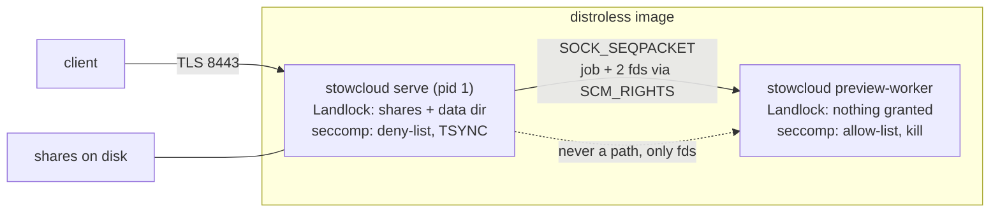

# Go Backend Rewrite - Spec Proposal

| Item       | Detail                           |
|------------|----------------------------------|
| Author     | heavycaffeiner(Dong Hyun Kim)    |
| Created    | 2026-08-12                       |
| Status     | **Draft**                        |
| Reviewers  |                                  |

---

## 1. Summary

Replace the Rust backend (99,614 lines across 16 crates) with a Go
implementation, cut over in one step rather than migrated subsystem by
subsystem. The Go tree lives beside `crates/` in this repository until the
cutover commit removes the Rust one. The REST API and the on-disk state schema
are redesigned; the protocols set outside this repository (RFC 4918 WebDAV,
the Nextcloud sync clients, SMB) keep their wire behaviour because they are not
ours to change.

## 2. Background & Motivation

### 2.1 What exists today

| Measure | Value |
|---|---|
| Rust source | 99,614 lines, 16 crates, 248 files |
| Largest crates | `sc-server` 26,606, `sc-http` 17,543, `sc-compat-nc` 10,825 |
| Test functions | 1,455 |
| Locked dependencies | 376 packages |
| Release profile | `lto = "thin"`, `panic = "abort"`, `strip = true` |
| Ship target | `x86_64-unknown-linux-musl`, static, distroless, about 30 MB |

Every subsystem is already specified in `docs/proposals/`, written from what was
built. Those documents are the functional requirement for this rewrite: the Go
implementation has to satisfy them, and where it cannot, this proposal says so
by name.

### 2.2 What the current design owes to the language

The five principles in `stowcloud-12-architecture.md` are not language-neutral.
Principle 2 ("a path is a kernel handle, not a string") is implemented as direct
`openat2` calls in `crates/sc-vfs/src/backend/linux.rs`, and the security model
of the whole product rests on it. The syscalls actually in use:

| Syscall | Where | Why it cannot be dropped |
|---|---|---|
| `openat2` with `RESOLVE_BENEATH`/`IN_ROOT`/`NO_MAGICLINKS`/`NO_XDEV` | every path resolution | removes TOCTOU by construction |
| `statx` | `stat_path`, `file_stat` | btime, which `fstat` does not carry |
| `renameat2` with `RENAME_NOREPLACE` | `rename` | atomic no-clobber publish |
| `copy_file_range` | `file_copy_range` | reflink on btrfs/XFS, no userspace round trip |
| `fstatfs` | `statfs_space` | per-share free space |
| `close_range` | preview jail | closes every inherited descriptor at once |
| `landlock_*` | process and jail | filesystem sandbox |
| `seccomp` | process and jail | syscall allow-list and deny-list |
| `inotify` | `sc-watch` | external-change invalidation |

Go reaches all of these through `golang.org/x/sys/unix` with no cgo. The
syscall contract is therefore not the thing a Go port loses. What it does lose
is named in §2.3 and §4.3.2.

### 2.3 The recorded decision this proposal reverses

`stowcloud-12-architecture.md` §4.2 records the backend choice as "Rust: memory
safety plus direct syscall control", chosen over "a GC'd runtime, where the
syscall contract is someone else's". That row becomes false the moment this
proposal lands, so amending it is a deliverable here, not a follow-up. The
replacement row has to state what actually changed, which is three things and
not the syscall contract:

1. **`fork` without `exec` stops being available.** The Go runtime is
   multi-threaded before `main` runs, so the preview jail's current shape (a
   forked child of the server that never execs) cannot be reproduced. §4.3.2
   gives the replacement, which the current code's own module documentation
   already calls "a strictly better shape for production".
2. **Deterministic teardown stops being available.** No `Drop`, so every
   descriptor, lock and temporary file needs an explicit close on every path
   including the error paths. §4.4 D1 and D11 make that a lint rather than a
   habit.
3. **Zeroing a secret stops being reliable.** A Go garbage collector may copy a
   value before anything zeroes it. §4.3.8 records this as an accepted residual
   risk with the mitigation that is actually available, rather than claiming
   `zeroize` has an equivalent.

Against those, three things are gained: one toolchain instead of a Rust
toolchain plus a musl cross-linker, a direct dependency set an order of
magnitude smaller (§6-2), and a build that does not need `cargo clean -p
sc-http` to avoid embedding a stale frontend.

### 2.4 The improvement backlog found in the current code

These were found by reading the tree, not by running it. They are the reason
this is a rewrite with fixes folded in rather than a line-for-line translation.
Each one is closed by a named rule in §4.4.

| # | Finding | Location |
|---|---|---|
| F1 | The process seccomp filter never checks `seccomp_data.arch`. It loads offset 0 (the syscall number) and compares it directly. The preview jail's filter does check, and its own documentation names this as the improvement it made over this one. A number matched without pinning the ABI is a number that means something else under another ABI. | `crates/sc-server/src/hardening.rs:155` |
| F2 | The hardening result is logged and discarded. There is no configuration that makes Landlock or seccomp required, so a kernel or container that silently refuses both starts exactly like one that enforces both. | `crates/sc-server/src/lib.rs:358` |
| F3 | The process seccomp deny-list is `x86_64` only. On every other architecture the list is empty and the filter is skipped with a warning, so the published `aarch64` image runs with no process-level seccomp at all. | `crates/sc-server/src/hardening.rs:125` |
| F4 | `dir_read_entries` materialises an entire directory into a `Vec` before any caller filters it. `stowcloud-11-footprint.md` targets 12 TB and millions of files; one directory with millions of entries is bounded only by available memory. | `crates/sc-vfs/src/backend/linux.rs:644` |
| F5 | `open_read` opens `O_RDWR` first and falls back to `O_RDONLY` only on `EACCES`/`EPERM`. Every read path therefore holds a writable descriptor whenever the file mode permits one. The recorded reason is real (upload finalize reads through the same handle), but the effect is that least privilege on a descriptor is decided by the file's mode instead of by the caller's intent. | `crates/sc-vfs/src/backend/linux.rs:258` |
| F6 | `INCLUDE_RESERVED` is a thread-local flag that changes what `read_dir` returns. Ambient state deciding a security-relevant answer. It also has no Go equivalent: goroutines migrate between threads. | `crates/sc-vfs/src/backend/linux.rs:637` |
| F7 | Three metadata writes discard their result: `fchmod` after create, and `chmodat`/`chownat` after `mkdir`. A share whose files must stay readable by the other services on the box is exactly where a silently unapplied mode matters. | `crates/sc-vfs/src/backend/linux.rs:317,330,337` |
| F8 | Two files carry 13% of the tree: `routes.rs` at 9,012 lines and `bridge.rs` at 3,953. | `crates/sc-http/src/routes.rs`, `crates/sc-server/src/bridge.rs` |
| F9 | 3,404 `.unwrap()`, 358 `.expect(`, 40 `panic!(`. With `panic = "abort"` in the release profile, any of them reachable from a request is a process kill, and there is no gate that separates the test-only ones from the rest. | workspace-wide |
| F10 | `now_ns()` unwraps `duration_since(UNIX_EPOCH)`. A clock behind the epoch aborts the process. | `crates/sc-upload/src/engine.rs:37` |
| F11 | The file ETag is `mtime_ns` and size only. A rewrite that lands in the same nanosecond with the same length is invisible to `If-Match`. | `crates/sc-upload/src/engine.rs:46` |
| F12 | The `fanotify` watch backend is accepted in configuration and not implemented: it warns and falls back. A knob that reports a mode it does not deliver. | `crates/sc-watch/src/lib.rs:119` |
| F13 | Principle 4 (the compat layer does not invade the core) is held by a `grep` over core source for `oc:`, `ocs` and `remote.php`. It scans text, so one level of indirection passes it. | `scripts/verify.sh:140` |
| F14 | The Korean-text gate uses `grep -P` with a `\x{AC00}` range. On the Windows development host that pattern does not match, so the gate reports PASS unconditionally and only CI actually checks it. | `scripts/verify.sh:158` |

## 3. Goals & Non-Goals

### 3.1 Goals

- [ ] A Go backend that serves every surface the Rust binary serves: the REST
      API, WebDAV Class 2, the Nextcloud-compatible mounts, resumable upload,
      search, previews, SMB orchestration and OIDC login.
- [ ] The four Linux guarantees kept and provable in Go: `openat2`-resolved
      paths, a process Landlock sandbox, a process seccomp filter, and a
      decoder jail that has no filesystem and no network.
- [ ] The decoder jail moved to an `exec`'d `stowcloud preview-worker`
      subcommand of the same binary, replacing the `fork`-without-`exec` pool.
- [ ] Hardening turned from best-effort-and-logged into a declared policy with
      a `required` mode that refuses to start when the kernel cannot deliver it.
- [ ] Every finding in §2.4 closed, each with a test that fails without the fix.
- [ ] One defensive-coding standard (§4.4) applied across the tree and enforced
      by lints in `scripts/verify.sh`, not by review.
- [ ] `CGO_ENABLED=0`, **one** statically linked binary with four subcommands,
      in a distroless image no larger than today's. Two binaries were proposed
      and rejected: they roughly double the image, and the `healthcheck` argv
      dispatch already in `main.rs` shows why a second one is unnecessary.
- [ ] `stowcloud-12-architecture.md` §4.2 amended so the recorded stack decision
      matches the shipped one.

### 3.2 Non-Goals

- [ ] Feature growth. Every non-goal recorded in an existing proposal stays a
      non-goal: content indexing and OCR, video thumbnails, a high-contrast
      theme, versioning, comments, tags, groupware, federation, office-suite
      integration, activity streams, external storage mounts, workflows.
- [ ] Windows or macOS as a deployment target. They stay development
      conveniences, and the portable backend exists only so the tree builds
      there.
- [ ] Removing `crates/` before the cutover commit.
- [ ] A UI redesign. `web/` keeps its components, its design system and its
      routes; only the API client layer is rewritten against the new contract.
- [ ] Replacing Samba. The SMB sidecar and the `smb.conf` generation contract
      are unchanged in behaviour.
- [ ] Any performance claim that has not been measured on the Linux runtime.
      §6-1 Phase 13 is where measurement happens; nothing before it may assert
      parity.
- [ ] Changing the Nextcloud compatibility boundary. It stays sync, browse,
      share, preview.

## 4. Technical Design

### 4.1 Architecture Overview

#### 4.1.1 Repository layout during the port

```
crates/           the Rust implementation, untouched, deleted at cutover
go/
  cmd/
    stowcloud/   the only binary. Subcommands: serve, healthcheck,
                 preview-worker, migrate
  internal/
    vfs/         kernel-handle filesystem layer, the security core
    store/       SQLite: state.db and cache.db
    acl/         grants and permission evaluation
    auth/        accounts, sessions, app passwords, TOTP, OIDC
    core/        the protocol-agnostic domain API
    watch/       inotify to invalidation
    search/      tiered search and the trigram index
    upload/      resumable upload
    preview/     preview service, cache, and the parent half of the jail
    jail/        the sandbox primitives: landlock, seccomp, rlimit, re-exec
    httpapi/     REST and the middleware chain
    dav/         RFC 4918
    smb/         Samba orchestration
    compat/nc/   legacy clients, behind a build tag
    server/      assembly: config, wiring, TLS, shutdown
web/              unchanged except web/src/lib/api
```

The Go module path is `github.com/heavycaffeiner/stowcloud/go`. Everything below
`internal/` is unimportable from outside the module, which is the compiler
enforcing what the Rust tree enforced by `publish = false` plus a comment.

#### 4.1.2 Process topology



The worker is never told a path. It receives an input descriptor and an output
descriptor over `SCM_RIGHTS`, so a path-traversal bug in a decoder has nothing
to traverse. That property is unchanged from today; only the way the worker
comes into existence changes.

#### 4.1.3 Replacing the compat isolation gate

Principle 4 is currently held by a text `grep` (F13). In Go it becomes two
mechanical facts:

1. `internal/compat/nc` may import any `internal/core`, `internal/dav`,
   `internal/auth`, `internal/acl`, `internal/store` or `internal/upload`
   package. No package under any of those may import anything under
   `internal/compat`. Checked with `go list -deps` in `verify.sh`, which reads
   the real import graph rather than the source text, so an indirection cannot
   pass it.
2. The compat layer sits behind the `compat_nc` build tag, and the release gate
   builds `-tags ''` as well, so a build with the layer stripped is proven to
   link. This is the direct replacement for
   `cargo build --no-default-features`.

The text grep is kept as well, narrowed to catching vocabulary in strings and
comments. It is cheap and it catches a different mistake.

### 4.2 Data Model Changes

The current tree has four separate stores with no version column and schemas
created by `CREATE TABLE IF NOT EXISTS`, which cannot express a change. The
rewrite splits them by durability requirement instead of by crate, because that
is the split the architecture document already has to carve an exception for:
"the database is a cache you can delete" is true of the metadata, and false of
accounts, grants and share links.

#### 4.2.1 `cache.db`, deletable at any time

```sql
CREATE TABLE node (
  id       INTEGER PRIMARY KEY,
  share    INTEGER NOT NULL,
  parent   INTEGER NOT NULL,
  name     TEXT    NOT NULL,
  dev      INTEGER NOT NULL,
  ino      INTEGER NOT NULL,
  btime_ns INTEGER,
  flags    INTEGER NOT NULL,
  size     INTEGER,
  mtime_ns INTEGER
);
CREATE UNIQUE INDEX node_ident ON node(share, dev, ino, btime_ns);

CREATE TABLE diretag (
  share  INTEGER NOT NULL,
  fileid INTEGER NOT NULL,
  etag   TEXT    NOT NULL,
  rsize  INTEGER NOT NULL,
  rcount INTEGER NOT NULL,
  gen    INTEGER NOT NULL,
  valid  INTEGER NOT NULL,
  PRIMARY KEY (share, fileid)
) WITHOUT ROWID;

CREATE TABLE share_gen (
  share INTEGER PRIMARY KEY,
  gen   INTEGER NOT NULL
) WITHOUT ROWID;
```

Carried over unchanged, including the two properties that are load-bearing:
**no path column** and **no index besides `node_ident`**. Path resolution walks
the `parent` chain, which is what makes a directory rename one row update
instead of a subtree fan-out.

#### 4.2.2 `state.db`, not reconstructible, the only thing to back up

Holds what the filesystem cannot regenerate: `user`, `group`, `membership`,
`session`, `app_password`, `totp_secret`, `recovery_code`, `grant`,
`share_link`, `dav_prop`, `dav_lock`, `upload_session`, `upload_interval`,
`settings`, `audit`, `oidc_link`.

Three changes from the current shape, each closing a recorded problem:

- `dav_prop` and `dav_lock` move out of the metadata store. They reference a
  `fileid` that only `cache.db` mints, which is why `node.flags` currently
  carries a `PINNED` bit that nothing ever clears. The cross-store reference
  becomes an explicit `(share, dev, ino, btime_ns)` identity tuple, so deleting
  `cache.db` costs a lookup, not a dangling row, and the pin bit is deleted.
- `upload_session` gains the durability the upload engine already assumes.
- Every table is created by a numbered migration, never by
  `CREATE TABLE IF NOT EXISTS`.

#### 4.2.3 Migrations

```sql
CREATE TABLE schema_version (
  id      INTEGER PRIMARY KEY CHECK (id = 1),
  version INTEGER NOT NULL
);
```

One ordered list of migration functions per database. On open: read the version,
refuse to start if it is **higher** than the binary knows (a downgrade must not
silently write an old shape into a new file), apply each pending migration in
one transaction, write the new version in the same transaction.

#### 4.2.4 Search index

Unchanged on disk: `base.idx`, `delta.NNN.idx`, `tomb.idx`, `meta`, with the
same block-compressed trigram layout and the same `base ∪ Σdelta − tomb` query.
It is a cache directory, not a database. §4.3.10 covers how the codec is proved
identical.

#### 4.2.5 Cutover

Both files are new. The metadata cache regenerates itself. `state.db` is
migrated once by a `stowcloud migrate --from-rust <data-dir>` subcommand that
reads the Rust-era auth and upload databases and writes the new one. It is
read-only against the old files, and it is deleted from the tree one release
after cutover.

### 4.3 Core Logic

#### 4.3.1 Path resolution

The rule is unchanged: below the HTTP layer, no API accepts a path as a string.

```go
// ShareRoot is one configured share, held open as a directory descriptor for
// the process lifetime. Every resolution starts from this descriptor; nothing
// in the package accepts a filesystem path relative to the process cwd.
type ShareRoot struct {
    id     ShareID
    anchor *os.File   // O_PATH|O_DIRECTORY, never a bare int fd
    policy SharePolicy
    dev    uint64
}

// SafePath is a validated, component-wise path relative to a share root. It is
// a distinct type from Vpath (what a client names a file by) and from
// SharePath (what the core returns), and no implicit conversion exists between
// the three.
type SafePath struct{ comps []string }
```

`openat2` is called through `unix.Openat2` with an `unix.OpenHow` whose
`Resolve` field is built from the share's symlink policy, exactly as
`resolve_flags` does today: `RESOLVE_NO_MAGICLINKS` always,
`RESOLVE_BENEATH|RESOLVE_NO_SYMLINKS` for `Deny`, `RESOLVE_IN_ROOT` for
`WithinShare`, `RESOLVE_BENEATH` for `Follow`, plus `RESOLVE_NO_XDEV` unless
the share allows crossing mounts.

Two Go-specific rules that are not optional:

- **Every descriptor is an `*os.File`, never a raw `int`.** A raw fd is an
  integer the garbage collector cannot see, so nothing keeps the owning object
  alive across a syscall, and nothing closes it on an early return. Wrapping
  with `os.NewFile` gives an explicit `Close`, a finalizer as a backstop, and
  makes `defer f.Close()` the shape of every function.
- **`runtime.KeepAlive` around any place a descriptor is passed as `int`** to a
  syscall wrapper, because that is the one case where the wrapper is not
  holding the `*os.File`.

Unicode candidate spellings (the NFC/NFD retry loop that lets a name written by
another program be found) use `golang.org/x/text/unicode/norm` instead of
`unicode-normalization`, with the same candidate order.

Directory reads become streaming (F4): `unix.Getdents` into a fixed buffer,
parsed with `unix.ParseDirent`, delivered through a callback that can stop.
The buffered `[]DirEntry` form stays as a thin wrapper with an explicit cap, and
callers that need every entry of a very large directory get an error instead of
an allocation they cannot afford.

The reserved-name filter loses its thread-local (F6). `ReadDir` takes an
explicit `include reservedPolicy` argument, and the two trusted callers (the
upload orphan sweep and the trash GC) pass `includeReserved` at the call site
where a reader can see it.

#### 4.3.2 The jail, without `fork`

This is the one place where the Go runtime forces a different shape, and it is
worth stating precisely why, because the naive version is silently broken.

**The constraint.** `landlock_restrict_self(2)` restricts *the calling thread*.
A new thread inherits the domain of the thread that created it. The Go runtime
has already started several threads before `main` runs, and it starts more on
demand, so calling it from a goroutine restricts one thread and leaves the rest
unrestricted. `seccomp(2)` has an answer for this,
`SECCOMP_FILTER_FLAG_TSYNC`, which applies the filter to every thread in the
process. Landlock has no such flag.

**The resolution.** A Landlock domain survives `execve` and covers the single
thread that the new program starts with, which then propagates to every thread
that program creates. So the sequence is: restrict, then re-exec, then filter.

Server startup, in order:

1. `runtime.LockOSThread()`.
2. Build the Landlock ruleset: handle every filesystem access right the running
   kernel's ABI knows about, grant `PathBeneath` on each share root, the data
   directory and the SMB config directory, and grant read plus execute on the
   binary's own path (without that grant both the re-exec in step 4 and the
   worker exec in step 6 fail, since both exec the same file).
3. `landlock_restrict_self`.
4. `unix.Exec(self, argv, env)` with `SC_REEXEC=1` in the environment so this
   happens exactly once. The re-exec'd process is single-threaded at the moment
   the Go runtime starts, and the domain covers everything it spawns.
5. Install the process seccomp filter with `SECCOMP_SET_MODE_FILTER` and
   `SECCOMP_FILTER_FLAG_TSYNC`, after `PR_SET_NO_NEW_PRIVS`. The filter checks
   `seccomp_data.arch` before it looks at the syscall number, rejects the x32
   range on `x86_64`, and has an entry for both `x86_64` and `aarch64` (F1, F3).
6. Start the worker pool by `exec`ing this same binary as
   `stowcloud preview-worker`, one process per worker, with the job socket
   passed as fd 3 through `Cmd.ExtraFiles`.

Worker startup, in order, before it reads one byte of user input:

1. `runtime.LockOSThread()`.
2. Build a Landlock ruleset that handles every filesystem right **except**
   `LANDLOCK_ACCESS_FS_EXECUTE` and grants nothing. Execute is left out
   deliberately: a ruleset that denies it would also deny step 4. Denying
   `execve` is seccomp's job in step 6, and seccomp denies it harder, by not
   having it on the allow-list at all.
3. `landlock_restrict_self`.
4. `unix.Exec(self, ["--jailed"], env)`, carrying fd 3 across (the descriptor is
   not `CLOEXEC`).
5. `close_range(4, ~0)` to drop everything else inherited, then `setrlimit` for
   `RLIMIT_AS`, `RLIMIT_CPU`, `RLIMIT_NOFILE`, `RLIMIT_NPROC` and
   `RLIMIT_CORE`, with today's defaults (512 MiB, 10 s, 16, 0, 0).
6. `PR_SET_NO_NEW_PRIVS`, then the 22-call seccomp allow-list with
   `SECCOMP_FILTER_FLAG_TSYNC` and `SECCOMP_RET_KILL_PROCESS`. Absent from the
   list, and each absence is a proof obligation the jail discharges: `openat`,
   `openat2`, `execve`, `socket`, `connect`, `clone`, `ptrace`.
7. Only then, read from fd 3.

The cost of this shape is two extra `execve` per worker start and materially
more resident memory per worker than a copy-on-write fork, because each worker
carries its own Go runtime and heap arenas rather than sharing the parent's
pages. That is measured in Phase 13 against
`stowcloud-11-footprint.md`'s budget, not asserted here, and if it does not fit
the lever is the pool size rather than the isolation. The gain is that the
deadlock window the current code documents (a child that allocates after a fork
taken while another thread held the allocator lock) does not exist, and the
worker can be run standalone under a test.

**Failure is fatal for the worker, never for the server.** If any step from 2
to 6 fails, the worker exits non-zero and the parent reports the pool as
unavailable; previews are refused with a typed error. A worker that could not
be jailed must not run a decoder.

**The proof stays executable.** The `Probe` mechanism is ported: the worker
accepts a probe message that attempts `open("/etc/passwd")`, `socket(AF_INET)`
and `fork()` from inside the jail, and reports which of "the kernel refused" and
"the kernel killed me" happened. A security claim that cannot be executed is a
comment. This runs as a Go test that skips on non-Linux and is required on the
Linux CI job.

#### 4.3.3 Wire protocol to the worker

`postcard` is replaced by a hand-written fixed-layout encoding over
`encoding/binary`, not `encoding/gob` and not JSON. Reasons, in order: the
message is a handful of scalars plus at worst a decoder error string; `gob` is
reflective and its decoder allocates based on what the peer sends; and the peer
here is the least trusted process in the system. Maximum message size stays
8192 bytes, `SOCK_SEQPACKET` preserves message boundaries, and a message that
does not parse exactly kills that job and that worker.

#### 4.3.4 Concurrency, cancellation and panics

- Every request carries a `context.Context` with a deadline. Every blocking
  call below the handler takes it. Filesystem syscalls are not cancellable, so
  the context is checked between operations and before any loop iteration that
  can run long (a recursive walk, a copy loop, a PROPFIND).
- **No bare `go func()`.** Goroutines are started through one helper that
  installs a `recover`, tags the panic with the request id, logs the stack and
  fails that unit of work. A panic anywhere else still kills the process, which
  is the same outcome `panic = "abort"` gives today, so the policy is a
  narrowing rather than a loosening.
- HTTP handlers get the same recover, mapped to a 500 with the request id and
  nothing else in the body.
- The preview worker does **not** recover. A panic there is a decoder that hit
  something it could not handle, and the correct outcome is the process dying
  and one thumbnail failing.

#### 4.3.5 Error model

Typed errors, compared with `errors.Is`/`errors.As`, never by string. One
mapping function turns a domain error into the wire envelope, and it is the only
place a status code is chosen. The existence rule is preserved verbatim: a path
the caller is not allowed to list is 404 everywhere, never 403, on every mount.

Lower-layer error text never reaches the wire. The envelope carries a catalogue
key plus placeholders, and the browser renders it. This is the rule the Korean
gate exists to protect (F14), and in Go it is enforceable properly: the wire
type's message field is only settable from a catalogue constant, because the
constructor takes a `MessageKey`, not a `string`.

#### 4.3.6 The middleware chain

The documented order is kept exactly:

```
1. RequestID   2. TrustedProxy  3. HostGuard   4. SecurityHeaders
5. RateLimit   6. BodyLimit     7. Auth        8. CSRF
9. ACLScope    10. Handler      11. ErrorMapper 12. AuditSink
```

Implemented as explicit `func(http.Handler) http.Handler` wrapping, composed by
one `chain()` call in one file, in source order that matches request order (Go
composes in the readable direction, so the reversal the axum version has to
document goes away). A test asserts the order by running a request through a
chain of recording stubs.

`TrustedProxy` keeps both fail-closed rules, which are the ones that break
quietly when reimplemented casually: walk `X-Forwarded-For` right to left, stop
at the first hop that is not a trusted proxy, and treat both an unparseable hop
and an all-trusted list as "no client address in this header, use the peer". A
request with no determinable source is never treated as coming from a trusted
proxy regardless of configuration.

The bind site keeps a mechanical check. In Go the failure mode is different from
axum's missing `ConnectInfo`: `http.Server` always has `RemoteAddr`, but
`ReadHeaderTimeout` defaults to none. The gate becomes a test that constructs
the server the way `serve` does and asserts every timeout field is non-zero.

#### 4.3.7 WebDAV XML

Go's `encoding/xml` needs specific handling, and getting it wrong is a
vulnerability rather than a bug:

- The decoder does not fetch external entities and errors on undefined ones, so
  XXE is closed by default. It nevertheless surfaces `xml.Directive` (a DOCTYPE)
  and `xml.ProcInst` as ordinary tokens rather than refusing them, so the
  scanner rejects both explicitly, exactly as the current code does. No attempt
  is made to "safely expand" anything.
- Caps are enforced in the scanner, not by the parser: body size, 10,000
  elements, depth 64, 256-byte element names. Same numbers as today.
- Namespaces are resolved to URIs. `xml.Name.Space` carries the URI after
  resolution, so `D:`, `d:`, `a:` and a default namespace compare equal, which
  is what real clients require. A prefix is never compared as text.
- **Responses are written by hand, not marshalled.** `encoding/xml`'s encoder
  cannot emit namespace prefix declarations correctly, and a WebDAV multistatus
  needs them. The PROPFIND writer streams elements to the response writer
  directly, which also keeps the streaming property the current implementation
  has: a PROPFIND over a large collection never buffers the whole document.

#### 4.3.8 Cryptography and secrets

| Purpose | Rust today | Go |
|---|---|---|
| Password hashing | `argon2` | `golang.org/x/crypto/argon2`, same parameters, same three-tier verification path |
| Session and link secrets at rest | `chacha20poly1305` (XChaCha20-Poly1305) | `golang.org/x/crypto/chacha20poly1305`, `NewX` |
| NT hash for SMB | `md4` | `golang.org/x/crypto/md4` (deprecated upstream, and correct here: the algorithm is fixed by the protocol) |
| TOTP | `totp-rs` | stdlib `crypto/hmac` + `crypto/sha1`, about 40 lines |
| OIDC ID token RS256/ES256 | `ring` | stdlib `crypto/rsa`, `crypto/ecdsa`. No JWT library, same as today |
| Directory and file digests | `blake3` | a pure-Go BLAKE3. **Not** SHA-256: an earlier draft of this row dropped BLAKE3 on the grounds that every digest here is an internal cache value, and `Checksum::Blake3` is a TUS `Upload-Checksum` value a client sends (`crates/sc-upload/src/model.rs:95`). The module has to be in the tree for that, so the directory ETag keeps the same hash rather than invalidating every stored rollup for nothing |
| CRC32C | `crc32c` | stdlib `hash/crc32` with the Castagnoli table |
| Constant-time comparison | `subtle` | stdlib `crypto/subtle` |
| Randomness | `getrandom` | stdlib `crypto/rand` only. `math/rand` is banned by lint |
| TLS, server and client | `rustls` + `webpki-roots` | stdlib `crypto/tls` + `crypto/x509`. See the note below on the trust anchors |
| Self-signed certificate | `rcgen` | stdlib `crypto/x509.CreateCertificate` |

**Trust anchors for the one outbound connection.** `webpki-roots` was chosen in
the Rust tree specifically because a compiled-in anchor list does not depend on
the runtime image shipping a CA bundle, which `Cargo.toml` records the
distroless image as not guaranteeing. Go's `crypto/x509.SystemCertPool` reads
the image, so taking it unconditionally would drop that property. The OIDC
client therefore takes an explicit `*x509.CertPool`, built at startup from the
system pool, and startup refuses when that pool is empty and no anchor file is
configured. Phase 11 confirms what the shipped image actually carries; if it
carries nothing, a PEM anchor set is generated at build time and embedded,
which is the Rust behaviour restored rather than reinvented.

**The one honest downgrade.** `zeroize` has no Go equivalent. A garbage
collector may copy a value before anything zeroes it, and a `string` is
immutable so it can never be zeroed at all. The mitigation is what is actually
available and it is stated rather than dressed up: secrets live in `[]byte`,
never in `string`; they are wrapped in a `Secret` type whose `String()` and
`MarshalJSON` return a redaction so a secret cannot be formatted into a log by
accident (§4.4 D12); the buffer is explicitly zeroed when the owner is done with
it; and the residual risk that a copy survives in a dead heap object is
accepted and recorded here. The master key is the one case where this matters
most, and it is held for the process lifetime either way.

#### 4.3.9 Search

The on-disk format does not change, which makes the port verifiable rather than
merely tested: the Rust implementation generates golden files (a base segment,
a delta segment, a tombstone file, and a set of query results over them), those
files are committed as testdata, and the Go implementation is required to read
them and produce byte-identical output when it writes them. The same is done for
the varint codec, the trigram extractor, the Hangul folding table and the
ranking function. A pure translation with a golden test is a much smaller risk
than a reimplementation with a behavioural test.

`zstd` comes from `github.com/klauspost/compress/zstd`. The memory-mapped
segment reads use `unix.Mmap`. The parallel walk becomes a bounded worker pool
over goroutines with `golang.org/x/sync/errgroup`, replacing `rayon` and the
`crossbeam` deque. The HyperLogLog is already hand-written in this tree and is
ported as-is.

#### 4.3.10 Watch

`inotify` directly through `unix.InotifyInit1` and `unix.InotifyAddWatch`; no
`fsnotify`. The `fanotify` option is removed from the configuration surface
until it is implemented (F12). A knob that names a mode it does not deliver is
worse than no knob, and adding it back later is a one-line addition to the
config enum.

#### 4.3.11 Durable writes

Every write that must survive a power cut goes through one helper, and a lint
forbids calling `os.Rename` or `unix.Renameat2` directly from anywhere except
that helper:

1. create the staging file under the reserved `.scpart-` prefix, through
   `SafePath.JoinControl`, which is the only call that may use that prefix;
2. write, then `fdatasync` the file;
3. `fchmod` and `fchown` to match what is being replaced, and **check both
   results** (F7). A failure to restore the mode fails the operation, because
   the whole premise of the product is that other services keep their access;
4. `renameat2` with `RENAME_NOREPLACE` when the caller asked for no-clobber;
5. `fsync` the **parent directory**, which is a separate act from step 2 and is
   what makes the name durable rather than just the bytes.

### 4.4 The defensive-coding standard

Every rule here is enforced by something mechanical. A rule that is only in this
document is a wish.

| # | Rule | Enforced by | Closes |
|---|---|---|---|
| D1 | No discarded error. Every ignored return is annotated with a reason on the same line, or it is a build failure. | `errcheck` with an empty exclude list | F7 |
| D2 | No ambient mutable state. No package-level `var` that is not a constant or a compile-time table; anything that changes a security-relevant answer travels as a parameter. | `gochecknoglobals`, plus review of the annotated exceptions | F6 |
| D3 | Hardening is a policy, not an outcome. `hardening = "required" \| "preferred" \| "off"`, default `required` in the shipped image. Under `required`, a Landlock or seccomp step that cannot be applied is a refusal to start, with the reason on stderr. | startup test with a fault-injected kernel probe | F2 |
| D4 | Any filter that names a syscall number verifies `seccomp_data.arch` first, rejects the x32 range, and refuses to start on an architecture it has no verified mapping for. Numbers come from `unix.SYS_*`, never hardcoded. | unit test over the assembled BPF program, including its jump offsets | F1, F3 |
| D5 | Every input is bounded. Body size, XML elements, XML depth, name length, path components, path length, directory entries per call, concurrent requests, in-flight uploads, upload sessions per user, WebDAV lock count, search result count, archive entry count. Each has a named constant and a test that the limit is what refuses. | table of limits in one file, referenced everywhere | F4 |
| D6 | No unchecked numeric conversion. One `safeCast` helper that returns an error; a lint bans bare conversions between differently sized integer types outside it. Builds are 64-bit only, and the check runs anyway. | `gosec` G115 plus a custom vet check | |
| D7 | Panic policy as in §4.3.4: no bare `go func()`, recover at the goroutine and handler boundary, no recover in the worker. | lint forbidding the `go` statement outside the spawn helper | F9 |
| D8 | One injectable clock. `time.Now()` appears in exactly one constructor; business logic takes a `Clock`. Durations use monotonic readings. Nothing panics on a clock behind the epoch. | lint on `time.Now` outside `internal/clock` | F10 |
| D9 | `crypto/rand` only. | lint banning `math/rand` | |
| D10 | The three path vocabularies are three distinct types with no implicit conversion: `Vpath` (what a client names), `SharePath` (what the core returns, grant subpath already on the front), `SafePath` (validated, component-wise, share-relative). Struct types, not string aliases, so a mix-up is a compile error. | the type system | recorded in `stowcloud-16-correctness-sweep.md` |
| D11 | Durable writes only through the §4.3.11 helper. | lint on direct `os.Rename`/`Renameat2` outside it | |
| D12 | Secrets are `Secret[[]byte]`, redacted by `String()` and `MarshalJSON`, zeroed on release, never stored in a `string`. | the type, plus a lint banning `%v` on a `Secret` | |
| D13 | Every server timeout is set explicitly: `ReadHeaderTimeout`, `ReadTimeout`, `WriteTimeout`, `IdleTimeout`, `MaxHeaderBytes`. Go's zero values are "no limit", which is a slowloris. | the bind-site test in §4.3.6 | |
| D14 | SQL is prepared statements and bound parameters only. No `fmt.Sprintf` reaches a query. | lint on string formatting in `internal/store` | |
| D15 | Client-facing errors carry a catalogue key, never lower-layer text. | the envelope constructor takes a `MessageKey` | F14 |
| D16 | Fuzz targets on every parser that reads untrusted bytes: `SafePath.Parse`, the WebDAV XML scanner, the worker wire decoder, the TUS metadata header, the archive lister, the OIDC discovery document. Go's native fuzzing, seeded corpus committed. | `go test -fuzz` in the nightly job, seed corpus in the gate | |
| D17 | `go test -race ./...` on the whole tree, on every run of the gate. | `verify.sh` | |
| D18 | `govulncheck` on every gate run, and a direct-dependency allowlist checked into the repo. | `verify.sh`, replacing `cargo-deny` | |
| D19 | No file over 1,500 lines. Not a style preference: the two files this closes are 13% of the tree and neither has a seam a reader can find. | a line-count gate in `verify.sh` | F8 |
| D20 | Trust-boundary validation is explicit and lives at the boundary: configuration file, environment, HTTP request, XML body, worker response, IdP response, SMB config output, filesystem contents. Each has one validating constructor, and the type it returns is the only one the layer below accepts. | the type system, plus review | |

### 4.5 What is deliberately not carried over

- The `mimalloc` global allocator. It exists for musl's allocator, and Go does
  not use libc's. The measurement note in `main.rs` stops applying.
- `rust-embed` and the `embed-ui` feature, with its `cargo clean -p sc-http`
  hazard. Go's `embed` package reads `web/build` at compile time with a real
  dependency edge, so a stale frontend cannot be embedded silently.
- **The portable filesystem backend, entirely.** An earlier draft of this
  section kept it "so the tree builds and tests on Windows", which contradicts
  Windows being a non-target and, more to the point, is what hid two real bugs.
  The Rust tree's own comments record both: `sync_dir` returned `EBADF` on every
  write because `fsync` on an `O_PATH` descriptor fails, and `create_excl`
  opened write-only so every upload finalize's digest read failed. Each broke
  the only platform that ships, and each was invisible on the development host
  precisely because a second implementation was standing in for the real one.
  `GOOS=linux go build` and `go vet` run on the Windows box with no toolchain
  at all; the test suite runs in the Linux VM. What that costs is stated in
  `go-port/stowcloud-2-gate-and-toolchain.md` §4.3.3 rather than glossed.

## 5. API Design

### 5-1. New / Modified

#### 5.1.1 REST

The envelope, the route shapes and the session model are kept. The redesign is
confined to the places where an existing proposal already records a defect, on
the principle that churn without a recorded reason costs the frontend a rewrite
for nothing:

| Area | Change | Reason |
|---|---|---|
| Share API paths | one vocabulary, with the subpath named explicitly | `stowcloud-15-sharing.md` records the two vocabularies being mixed |
| Recency query | ISO-8601 timestamps, no bare date literal | `stowcloud-21` records both mobile apps getting a 400 |
| Folder size | one recursive rollup field, documented unit | `stowcloud-16` records no client reading it correctly |
| Settings | typed values with a declared range, and a refusal that names the field | `stowcloud-20` records nine defects |
| Archive listing | listed from the file, with a cost bound stated in the response | `stowcloud-21` |

Everything else is a port. The compatibility mounts (`/remote.php/...`, OCS)
are not touched at all: their shape is set by the clients.

#### 5.1.2 The load-bearing package APIs

```go
// Package vfs

// OpenRead opens p for reading under the share's resolve policy. The returned
// file is opened O_RDONLY unless the caller states it needs to write through
// the same handle, which the upload finalizer does; nothing else may.
// Least privilege on the descriptor is decided here by intent, not by the
// file's mode.
func (r *ShareRoot) OpenRead(p SafePath, intent AccessIntent) (*File, error)

// ReadDirFunc streams entries from p, calling fn once per entry. It never
// materialises the directory. fn returning false stops the walk. Reserved
// control names are included only when policy says so, and that policy is this
// argument, never ambient state.
func (r *ShareRoot) ReadDirFunc(p SafePath, policy ReservedPolicy,
    fn func(DirEntry) bool) error

// Package jail

// Restrict applies the Landlock domain described by spec to the calling thread
// and then re-execs the current binary so every thread of the new process
// inherits it. It does not return on success: the process is replaced. It
// returns an error only when the domain could not be applied, and the caller
// decides whether that is fatal from the hardening policy.
func Restrict(spec Spec, marker string) error

// InstallSeccomp assembles and installs the filter for kind, with
// SECCOMP_FILTER_FLAG_TSYNC so it covers every thread the Go runtime has
// already started. It verifies seccomp_data.arch before comparing any syscall
// number and refuses on an architecture with no verified mapping.
func InstallSeccomp(kind FilterKind) error

// Package preview

// Generate renders a thumbnail for src into a new cache entry. src and the
// destination are passed to the worker as file descriptors over SCM_RIGHTS;
// the worker is never told a path. A worker that dies mid-job fails this call
// with ErrWorkerDied and costs one thumbnail, never the pool.
func (p *Pool) Generate(ctx context.Context, src *os.File, spec Spec) (Result, error)
```

### 5-2. Error Handling

| Status Code | Description | Notes |
|---|---|---|
| 400 | malformed request: unparseable body, bad path, out-of-range parameter | the field is named, the value is not echoed |
| 401 | no session, expired session, failed credential | never distinguishes which |
| 403 | authenticated, and the operation is refused | only when the caller is allowed to know the target exists |
| 404 | not found, or not listable by this caller | the existence rule: an unlistable path is 404 everywhere |
| 405 | method not allowed on this mount | |
| 409 | conflict: concurrent modification, `If-Match` failure, name already taken | carries the current ETag |
| 412 | precondition failed | WebDAV and TUS |
| 413 | body over the limit | the limit is in the response |
| 415 | unsupported media type | |
| 416 | unsatisfiable range | |
| 423 | locked | WebDAV Class 2 |
| 429 | rate limited | login and API buckets are separate |
| 500 | unhandled internal error | request id only, never internal text |
| 503 | a subsystem is unavailable: preview pool down, database write-blocked, storage below the free-space floor | names which |

Internal error kinds, which the mapper above is the only consumer of:

| Kind | Meaning |
|---|---|
| `ErrNotFound` | the object does not exist, or the caller may not know that it does |
| `ErrDenied` | ACL refusal, caller is allowed to know the target exists |
| `ErrConflict` | lost-update, ETag mismatch, `RENAME_NOREPLACE` collision |
| `ErrInvalid` | failed a trust-boundary validation, with the boundary named |
| `ErrTooLarge` | a §4.4 D5 limit refused it, with the limit named |
| `ErrSymlinkDenied` | `openat2` returned `ELOOP` under the share's policy |
| `ErrCrossDevice` | `EXDEV` under `RESOLVE_NO_XDEV` |
| `ErrNoSpace` | `ENOSPC`, or the configured free-space floor |
| `ErrWorkerDied` | the preview worker was killed, including by its own seccomp filter |
| `ErrHardeningRefused` | startup only, under `hardening = "required"` |
| `ErrSchemaAhead` | the database was written by a newer binary |

## 6. Implementation Plan

### 6-1. Milestones

Sizes are relative, not calendar estimates: **S** is a focused sitting, **M** is
a subsystem with its tests, **L** is a subsystem whose behaviour is only proven
against a real client or a real kernel, **XL** is one of the two surfaces that
carry a third of the tree. What matters for scheduling is the dependency
column, not the size.

| Phase | Task | Size | Depends on | Owner |
|---|---|---|---|---|
| Phase 0 | `go/` module, `cmd/` skeletons, lint set (D1, D2, D6, D7, D8, D9, D11, D13, D14, D19), `verify.sh` Go half, CI job. Nothing functional; the gate is the deliverable. | S | none | heavycaffeiner |
| Phase 1 | `internal/vfs` and `internal/jail`: `openat2` resolution, `SafePath`/`Vpath`/`SharePath`, streaming `ReadDir`, the durable-write helper, Landlock plus re-exec, the seccomp assembler with the arch check, the executable jail proof. | L | 0 | heavycaffeiner |
| Phase 2 | `internal/store`: `cache.db`, `state.db`, the migration runner, the pragma set, the pool. Golden test that a deleted `cache.db` rebuilds. | M | 0 | heavycaffeiner |
| Phase 3 | `internal/auth` and `internal/acl`: Argon2 parameters, the three-tier verification path, sessions, app passwords and their scopes, TOTP, recovery codes, the enumeration defence, grants and evaluation. | L | 2 | heavycaffeiner |
| Phase 4 | `internal/core`: the domain API, ACL evaluation against the virtual root, directory ETags and the recursive rollup, trash, conflict detection, share links, quota. | L | 1, 2, 3 | heavycaffeiner |
| Phase 5 | `internal/httpapi`: the twelve-step chain in order, the error envelope and its catalogue keys, the REST surface, static embedding, the WebSocket channel. | XL | 4 | heavycaffeiner |
| Phase 6 | `internal/upload`: TUS, the interval set, the ordering rule, the spool modes, checksum verification, orphan sweep. | M | 4 | heavycaffeiner |
| Phase 7 | `internal/dav`: the hardened XML scanner, the hand-written multistatus writer, streamed PROPFIND, Class 2 locking, dead properties, `/dav-uploads`. | L | 4, 5 | heavycaffeiner |
| Phase 8 | `internal/search`: the walker, the trigram index ported against golden files, the estimator, folding, ranking. | L | 1, 2 | heavycaffeiner |
| Phase 9 | `internal/preview` and `cmd/stowcloud-preview`: the pool parent, the exec-and-restrict sequence, the wire codec, decode limits, EXIF stripping, the cache, archive listing. | M | 1 | heavycaffeiner |
| Phase 10 | `internal/compat/nc` behind the `compat_nc` tag: the port traits, chunked upload v2, OCS, capabilities, the login flow, shares, mobile search, favourites, trashbin, the recency query. The import-graph gate lands with it. | XL | 5, 6, 7, 9 | heavycaffeiner |
| Phase 11 | `internal/smb` and OIDC: `smb.conf` generation with the private-range bind rule enforced at generation, the passdb, the uid contract; discovery, the authorize URL, the back-channel token exchange with the private-address rule enforced on the resolved address, RS256/ES256 verification. | M | 3, 5 | heavycaffeiner |
| Phase 12 | `web/src/lib/api` against the §5.1.1 changes. No component changes. | M | 5 | heavycaffeiner |
| Phase 13 | Parity harness and cutover: run both binaries against one share set and diff every response; the WebDAV conformance run; a real sync client against both; the footprint measurement from `stowcloud-11` redone on the Go build; then the commit that deletes `crates/` and amends `stowcloud-12-architecture.md` §4.2. | L | all | heavycaffeiner |

Phases 6, 7, 8 and 9 are independent of each other and can be taken in any
order once their dependencies are met. Phase 10 needs all four. Phase 13 is the
only phase that may claim a performance or footprint number.

Each phase ends green on the full gate, including `-race`, and no phase is
allowed to leave a `TODO` that a later phase is expected to find.

### 6-2. Dependencies

**Toolchain.** Go 1.24 or newer, `CGO_ENABLED=0`, `GOOS=linux`,
`GOARCH=amd64` and `arm64`. No cross-linker, no C toolchain, no `zig cc`, which
removes the musl-probe skip path from `verify.sh` entirely.

**Direct modules**, and why each is not the standard library:

| Module | Replaces | Why it is unavoidable |
|---|---|---|
| `golang.org/x/sys/unix` | `rustix`, `libc`, `landlock`, `inotify` | the syscalls in §2.2 have no stdlib wrapper |
| `golang.org/x/crypto` | `argon2`, `chacha20poly1305`, `md4` | Argon2id, XChaCha20-Poly1305 and MD4 are not in the stdlib |
| `golang.org/x/image` | part of `image` | BMP, TIFF and WebP decoders; JPEG, PNG and GIF are stdlib |
| `golang.org/x/text` | `unicode-normalization` | NFC/NFD candidate spellings |
| `golang.org/x/sync` | `rayon`, `crossbeam` | `errgroup` and `semaphore`, both small and vendored-quality |
| `modernc.org/sqlite` | `rusqlite`, `r2d2` | pure-Go SQLite; the alternative is cgo, which costs the static build |
| `github.com/klauspost/compress` | `zstd`, `ruzstd` | zstd; `archive/zip` and `compress/flate` are stdlib |
| `github.com/BurntSushi/toml` | `toml` | no stdlib TOML |
| a pure-Go BLAKE3 | `blake3` | a client-facing TUS checksum algorithm, so it cannot be swapped for a standard-library hash |

Everything else the Rust tree carries is stdlib in Go: HTTP server and client,
TLS, X.509 and certificate generation, JSON, XML, zip, base64, hex, UUID
generation, HMAC, SHA-2, CRC32C, LRU (`container/list`), concurrent maps
(`sync`), embedded assets (`embed`), flag parsing, structured logging
(`log/slog`), property tests (`testing/quick`) and fuzzing (`testing.F`).

**Verified at Phase 0, before anything is built on them.** Each of these is an
assumption this document makes that a compile settles in minutes:

- `unix.Openat2`, `unix.Statx`, `unix.Renameat2`, `unix.CopyFileRange`,
  `unix.CloseRange`, `unix.Fstatfs`, `unix.Getdents` are present and take the
  shapes assumed here.
- `x/sys/unix` exposes `LandlockCreateRuleset`, `LandlockAddRule` and
  `LandlockRestrictSelf`; if any is missing, it is a raw `unix.Syscall`, which
  is what the seccomp path uses regardless.
- `golang.org/x/image/webp` decodes the WebP variants the current build accepts.
  If it does not, WebP preview support is stated as reduced rather than quietly
  dropped.
- `modernc.org/sqlite` meets the write throughput the metadata cache needs.
  Measured against the `stowcloud-11-footprint.md` workload at Phase 2, not
  assumed. If it does not, the fallback is stated there and not improvised
  later: the cache moves to a hand-rolled append-only store and SQLite is kept
  for `state.db` only, where the write rate is negligible.

**Non-code dependencies.** The Samba sidecar image, the distroless base, and
the GitHub Actions runners are unchanged. The `docker` workflow gains a second
binary in the same image.

## 7. References

- [`go-port/`](go-port/README.md): the seventeen detail proposals this document
  is the index for, one per phase plus the findings ledger and the defensive
  standard. Its README also carries the contradiction ledger, which records five
  places where an earlier draft of **this** document was wrong and what
  replaced each.
- `docs/proposals/stowcloud-12-architecture.md`: the five principles and the
  §4.2 table this proposal amends.
- `docs/proposals/stowcloud-2-core-vfs.md`: `SafePath`, the syscall contract,
  ACL evaluation, the virtual root, directory ETags, trash.
- `docs/proposals/stowcloud-11-footprint.md`: the 32 GB / 12 TB floor that
  Phase 2 measures the SQLite driver against.
- `docs/proposals/stowcloud-10-auth.md` and `stowcloud-0-oidc-login.md`: the
  Argon2 parameters, the three-tier path and the OIDC back-channel rules
  Phase 3 and Phase 11 have to reproduce.
- `docs/proposals/stowcloud-4-webdav.md`: RFC 4918 Class 2, the XML hardening
  rules §4.3.7 restates in Go terms.
- `docs/proposals/stowcloud-6-preview-sharing.md`: the worker jail this
  proposal re-shapes, and the content origin.
- `docs/proposals/stowcloud-8-compat.md`: the isolation contract whose two
  gates §4.1.3 replaces.
- `docs/proposals/stowcloud-16-correctness-sweep.md`: the three path
  vocabularies D10 turns into three types, and the silent metadata writes F7
  names.
- `docs/proposals/stowcloud-17-audit-gaps.md`: promises the current code does
  not keep, all of which are in scope for the phase that owns the subsystem.
- `scripts/verify.sh`: the gate whose Go half is Phase 0's deliverable.
- `openat2(2)`, `landlock(7)`, `seccomp(2)`, `close_range(2)`, `renameat2(2)`,
  `copy_file_range(2)`, `statx(2)`: the kernel interfaces the security model
  rests on.
- Go: `golang.org/pkg/os/exec` (`ExtraFiles` and the fd-3 convention),
  `runtime.LockOSThread`, `encoding/xml` (Directive and ProcInst tokens),
  `testing` fuzzing.
