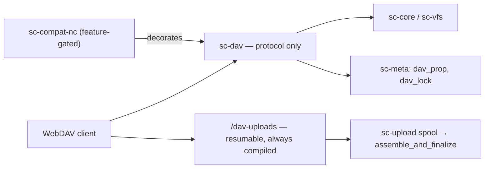

# WebDAV: RFC 4918 Class 2 - Spec Proposal

| Item       | Detail                           |
|------------|----------------------------------|
| Author     | heavycaffeiner(Dong Hyun Kim)    |
| Created    | 2026-08-03                       |
| Status     | Implemented                      |
| Reviewers  |                                  |

---

## 1. Summary

`sc-dav` is a protocol-pure RFC 4918 Class 2 implementation plus RFC 4331
quota. Not one byte of vendor vocabulary lives in it; legacy-client extensions
are a decorator on top, in `sc-compat-nc`.

It also carries `/dav-uploads`, a vendor-neutral resumable upload surface,
because RFC 4918 has no partial-write verb.

## 2. Background & Motivation

### 2.1 Why Class 2 is mandatory

Stopping at Class 1 is not an option. **macOS Finder** mounts read-only — or
refuses to mount — without a `DAV: 1,2` advertisement, and **MS Office** takes
a LOCK on save and blocks the save if it fails.

What that lock actually is, stated honestly: a logical lock valid only inside
our own database. Jellyfin or rsync working the same directory never sees it.
Real protection against concurrent writers is `If-Match`, not LOCK.

### 2.2 Why a second upload surface

`PUT` is whole-body and `Range` is honoured on `GET` only, so a client that
loses its connection 9 GB into a 10 GB `PUT` starts over. Every vendor solves
this out of band. The compat layer already spoke one such dialect — which
meant that turning the compat layer off removed resumable WebDAV upload from
the product. `/dav-uploads` is the same capability, compiled unconditionally.

## 3. Goals & Non-Goals

### 3.1 Goals

- [x] Class 2 + RFC 4331, enough for Finder, Explorer and Office to mount and
      save.
- [x] A PROPFIND over 100k entries that does not build a DOM.
- [x] An XML parser that cannot be made to fetch, expand or recurse.
- [x] Resumable upload without the compat feature compiled in.

### 3.2 Non-Goals

- [ ] `REPORT`. Out of scope for the core; the vendor search REPORT lives in
      the compat layer.
- [ ] Multi-range `GET`. Unused by media clients; a multi-range request gets
      the whole body as `200`, which the RFC permits.
- [ ] Depth-infinity PROPFIND by default. Unbounded on a million-file tree it
      is a single-request DoS, so it is `403` with the RFC's own
      `<DAV:propfind-finite-depth/>` unless enabled, and capped even then.
- [ ] `202 Accepted` for long moves. Technically allowed, poorly supported.
- [ ] `/dav-uploads` for generic clients. It is opt-in and undiscoverable by
      design; rclone, DAVx⁵ and Explorer keep using whole-body `PUT`.

## 4. Technical Design

### 4.1 Architecture Overview



### 4.2 Data Model Changes

| table | key | note |
|---|---|---|
| `dav_prop` | `(fileid, ns, name)` | dead properties, **never** xattrs on disk |
| `dav_lock` | token | locks a fileid, plus the virtual path at lock time |

Dead properties are keyed by fileid, so **a rename carries them**. They are
not written as xattrs because scattering xattrs through a shared folder breaks
backup tools (rsync does not preserve them by default), other services, and
filesystem migration. The value is re-serialized as XML on write —
echoing a client's raw input back verbatim is an injection vector.

### 4.3 Core Logic — XML hardening

The largest remote attack surface here. Namespace-aware reader, with:

- **A DTD event fails the request outright.** No attempt to "safely" expand
  entities — WebDAV has no legitimate reason to need a DTD. This is what
  blocks XXE and billion-laughs, rather than a filter.
- Processing instructions rejected; depth capped at 64; element count capped;
  attribute-name length capped; body capped at 1 MiB.
- Namespace resolution is mandatory on input. Clients send `D:`, `d:`, `a:`,
  or no prefix — a literal prefix comparison on input always breaks eventually.

**Output always declares the prefix lowercase `d:`.** The spec allows any
prefix; reality does not. One iOS client SDK looks elements up by literal
string with no namespace handling at all, and XML names are case-sensitive —
so `D:multistatus` matches nothing and **iOS sees every directory as empty
while the request still reports success.** No error reaches the user; their
data just appears to be gone. Lowercase is what the reference implementation
emits, so it is what every server built on it sends.

Changing the prefix means changing its `xmlns:` declaration too; changing only
the element leaves the prefix undeclared and breaks *every* client. A test
that greps for `<d:getetag>` passes straight through that mistake, so the
guard asserts two properties of real output at once: no uppercase prefix
appears, and every prefix used is declared.

### 4.4 Core Logic — streamed PROPFIND

A 100k-entry multistatus as a DOM costs hundreds of MB, so the body is written
to a channel and streamed, auto-flushing at 64 KiB.

- No `Content-Length` is computed. Windows clients are reported to dislike
  chunked 207s, so below a configurable entry count the response is buffered
  and given one.
- An error after the 207 header is already sent puts the failure in that
  entry's `<d:status>` and continues; a fatal error closes the stream, and the
  client detects incomplete XML.
- **Entries the caller cannot list are simply absent.** A `403` row would leak
  that the entry exists.

Live properties include `getetag` **with quotes** — omitting them makes
several clients refuse to sync — and RFC 4331 quota, without which Finder
reports zero free space and refuses to copy.

### 4.5 Core Logic — locking

A lock is on a **fileid**, so it survives a rename. It lives in memory with
SQLite persistence, because locks must survive a restart or Office loses track
of who owns the document. `Timeout` defaults to 300 s, caps at 3600, and
`Infinite` is clamped rather than honoured. A sweep expires stale locks.

A depth-infinity lock covers every descendant, so a child write must check its
ancestors. **That check compares path prefixes, not a fileid chain**: fileids
are allocated lazily, an ancestor may not have one, and minting one just to
answer a lock check would defeat the laziness. So the lock stores its virtual
path and the small active set is scanned by prefix — while the lock's own
identity stays fileid-based.

**Lock-null**: a LOCK on a path that does not exist creates a zero-byte file,
per the RFC's replacement for lock-null resources. In a shared folder that is
visible to other scanners, so the file is swept once the lock has expired and
it is still empty. A share can turn this off, in which case such a LOCK is
`409`.

The `If` header grammar — tagged lists, `Not`, state tokens mixed with ETags —
is parsed properly and fuzzed. Parse failure is `400`, unsatisfied condition
`412`, and a write to a locked resource without a valid token `423`.

### 4.6 Core Logic — resumable upload (`/dav-uploads`)

```text
MKCOL    /dav-uploads/{tid}        Destination (required)      -> 201
PUT      /dav-uploads/{tid}/{n}    n numeric, 1..10000         -> 201
MOVE     /dav-uploads/{tid}/.file  Upload-Length, X-Mtime      -> 201 / 204 + ETag
DELETE   /dav-uploads/{tid}        abort                       -> 204
PROPFIND /dav-uploads/{tid}        chunk listing, for resume   -> 207
```

`{n}` is a **sort key, not an offset** — chunk sizes are the client's choice
and need not be uniform, so assembly is by ascending name, with leading zeros
accepted and discarded.

`Destination` accepts an absolute URL or a bare path, since no specification
pins down which a client sends. It is fixed at `MKCOL`; if `MOVE` repeats it
they must agree, or `409` — silently honouring a different one would publish
bytes somewhere the client's own bookkeeping says they did not go.

**Not under `/dav`**, because axum matches a literal segment before a
wildcard: registering `/dav/uploads/**` would make a share actually *named*
`uploads` permanently unreachable. A test creates that share and asserts it is
still addressable.

**`{tid}` is attacker-controlled** — guessable and collidable, so it can never
be a session key alone. It resolves through an alias table keyed
`(user, tid)`, every lookup carries the authenticated principal, and a tid
belonging to another account answers `404`, identically to one that never
existed, so it is not an existence oracle. There is deliberately no `{user}`
path segment: a name in the path only recreates the "bob addresses alice's
path" case that then has to be checked. A second `MKCOL` on a live tid is
`409`, not a silent rebind that would orphan the first spool.

**Nothing reaches the destination before `MOVE`.** Chunks live in the upload
spool and publish through the same atomic rename as every other write, so a
disconnect, refresh or restart cannot leave a partial file.

## 5. API Design

### 5-1. New / Modified

| Method | Behaviour |
|---|---|
| `OPTIONS` | `DAV: 1,2,3`, `MS-Author-Via: DAV` — **answerable unauthenticated**, or Windows never mounts |
| `PROPFIND` | Depth 0/1; infinity refused by default (§3.2) |
| `PROPPATCH` | dead properties; required for Office's Win32 properties |
| `GET`/`HEAD` | Range (single), conditional, `sendfile`; forces `Content-Disposition: attachment` |
| `PUT` | atomic replace, `If-Match`/`If-None-Match` |
| `COPY`/`MOVE` | `Destination`, `Overwrite`; cross-mount handling |
| `LOCK`/`UNLOCK` | exclusive write lock, Depth 0/infinity |

### 5-2. Error Handling

| Condition | Status |
|---|---|
| `EACCES`/`EPERM`/`EROFS`/`ELOOP` | 403 |
| `ENOENT`, or a path the caller cannot list | 404 |
| `EEXIST` with `Overwrite: F` | 412; without it, 409 |
| `ENOTEMPTY`, destination parent missing | 409 |
| locked target, no valid token | 423 |
| `ENOSPC`/`EDQUOT`, or a cross-mount move over the size cap | 507 |
| cross-server `Destination` | 502 |
| XML parse failure, `ENAMETOOLONG` | 400 |

**Distinguishing 403 from 404 is itself a leak.** A path the caller cannot
list is `404` whether or not it exists; `403` is reserved for a path that *is*
listable but not writable.

Large cross-mount moves have an acknowledged cap (2 GiB default): WebDAV has
no notion of progress and there is a 100-second proxy window, so a clear error
beats a silent timeout.

## 6. Implementation Plan

### 6-1. Milestones

| Phase | Task | Duration | Owner |
|---|---|---|---|
| Phase 1 | Method surface, error mapping, hardened parser | done | heavycaffeiner |
| Phase 2 | Streamed PROPFIND, live + dead properties | done | heavycaffeiner |
| Phase 3 | Class 2 locking, `If` header, lock-null sweep | done | heavycaffeiner |
| Phase 4 | COPY/MOVE, cross-mount policy | done | heavycaffeiner |
| Phase 5 | `/dav-uploads` | done | heavycaffeiner |

### 6-2. Dependencies

- `quick-xml` (namespace reader), `axum`, `tokio`, `uuid`.
- Litmus, `rclone` and a DAVx⁵ simulation in CI; `cargo-fuzz` for every body
  parser plus the `If` and `Destination` headers.

## 7. Client-specific behaviour

Interoperability is what this table decides, and every row is pinned by a test.

| Client | Symptom | Handling |
|---|---|---|
| Windows Explorer | probes with unauthenticated `OPTIONS /`, gives up if a 401 lacks `WWW-Authenticate` | unauthenticated `OPTIONS`; everything else 401 with the header |
| | 50 MB download cap | registry workaround; nothing the server can do |
| macOS Finder | zero free space without quota props | RFC 4331 always answered |
| | sends NFD filenames | lookups try NFC and NFD |
| | `.DS_Store`/`._*` | not hidden from DAV — hiding them confuses Finder; hidden in the web UI only |
| MS Office | PROPPATCHes Win32 properties; a non-200 fails the save | stored as dead properties, answered 200 |
| Cyberduck | leans on ETag and conditional GET | ETag stability required |
| Joplin / Obsidian | thousands of small files | Depth:1 performance is what matters |

## 8. References

- `crates/sc-dav/`, `crates/sc-server/src/dav_uploads.rs`
- RFC 4918 (Class 2), RFC 4331 (quota)
- `stowcloud-2-core-vfs.md` (the atomic write path and `SafePath` Unicode
  handling), `stowcloud-5-upload.md` (the spool this shares),
  `stowcloud-7-compat-nc.md` (the decorator on top)
