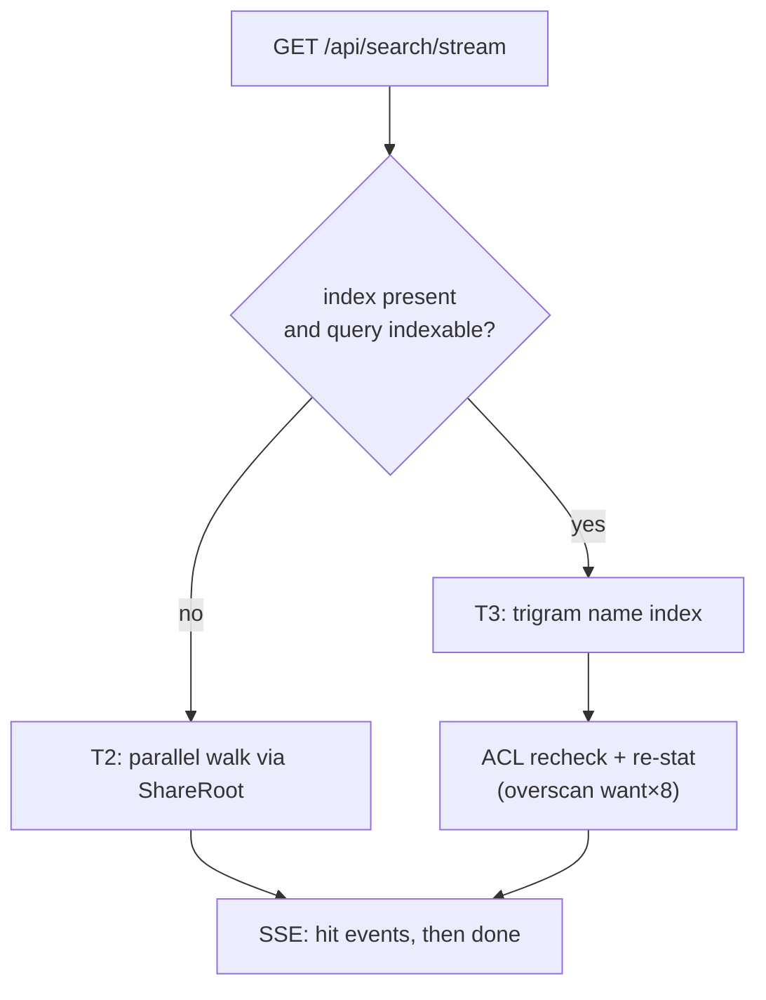

# Search: Parallel Walk, Optional Name Index - Spec Proposal

| Item       | Detail                           |
|------------|----------------------------------|
| Author     | heavycaffeiner(Dong Hyun Kim)    |
| Created    | 2026-08-03                       |
| Status     | Implemented                      |
| Reviewers  |                                  |

---

## 1. Summary

Search runs on a parallel filesystem walk by default, with **zero bytes of
index**. A block-compressed trigram name index exists as an opt-in escalation
an admin turns on after reading a measured estimate. Content indexing and OCR
are out of scope by decision, not pending.

## 2. Background & Motivation

### 2.1 Why the walk is the default

Published measurements, not assumption:

| Benchmark | Result |
|---|---|
| `fd`, 4 M files / 750 k dirs, warm | **855 ms** |
| GNU `find -iname`, same corpus | 2.87 s |
| `jwalk` 8 threads, no metadata | 54.6 ms |
| `jwalk` 8 threads, **with** metadata | 87.0 ms |
| `fd` vs `find` on one small directory | find **8.95× faster** |

Four conclusions follow, and each one is a design decision below: a parallel
walk is practical without an index; metadata is about half the cost, so a
name-only query must never `statx`; parallelism *loses* on small corpora; and
all of it is warm-cache.

### 2.2 Why the index is not on by default

Cold storage is a different world — the same 4 M files take tens of minutes on
a cold 12 TB HDD RAID, one seek per directory. Keeping the dentry cache warm
costs roughly 192 B per file, so 1 M files stay warm on a small box and 10 M
cannot.

The split is therefore not file count; it is whether the tree can stay warm,
which depends on RAM, storage and whatever else competes for both. None of
that is knowable in advance, so the index is a measured decision rather than a
threshold.

### 2.3 Why not an off-the-shelf walker

`jwalk`, `ignore` and `walkdir` all sit on path-based `std::fs`. Adopting one
would revive symlink escape and TOCTOU by bypassing the `openat2` invariant —
and since search sweeps the whole tree, a break there is the broadest possible
leak. Walking through the share's own directory handles also avoids the
whole-path re-resolution a path-based walker pays per entry: the security
boundary is the performance win.

## 3. Goals & Non-Goals

### 3.1 Goals

- [x] Usable search with no index and no configuration.
- [x] Never `statx` for a name-only query.
- [x] No existence leak — neither in results nor in response time.
- [x] An index whose size is *measured* for the actual corpus before anyone
      commits to it.

### 3.2 Non-Goals

- [ ] Content indexing and OCR. Not implemented, not planned. A walk cannot
      substitute (12 TB cannot be grepped per query), so it is the one tier
      that would *require* an index — and therefore the heaviest guardrails.
      Every unbounded implementation of this gets punished at a few million
      files, and the fix on offer is always "index less".
- [ ] Automatic index activation. Nothing measures on its own, recommends, or
      flips the toggle. The estimator exists so the person deciding has a
      number, not so the product decides for them.
- [ ] A search result cache. The kernel's dentry cache already does that job
      better; a userspace copy spends the same RAM twice and reintroduces
      invalidation — which is indistinguishable from having an index.
- [ ] `REPORT`. WebDAV `SEARCH` is no longer excluded:
      `stowcloud-14-compat-mobile.md` adds it, along with the compat search
      the phone apps need. Both are adapters onto the tiers specified here
      and neither introduces a fifth tier.

## 4. Technical Design

### 4.1 Architecture Overview



Tiers: T1 is a client-side filter over the loaded listing; T2 is the walk,
always on; T3 is the name index, off by default; T4 does not exist.

### 4.2 Data Model Changes

Nothing in the main database. An index, when built, is self-contained at
`<share>/.scindex/names/` — `base.idx`, append-only `delta.NNN.idx`,
`tomb.idx`, and a `meta`. That is what keeps it outside the main-DB size
guard, and what lets it be deleted at any time.

### 4.3 Core Logic — the walk

One directory is one unit of work over a work-stealing queue.

- **`statx` is zero for a name-only query** — entry kind comes from `d_type`,
  straight out of the directory read. This alone recovers §2.1's 54.6 → 87.0
  ms gap.
- **ACL pruning happens at descent, not after.** A directory the caller may
  not list is never opened, never read, never counted — which is what makes
  §4.6's no-timing-channel claim true by construction.
- **Thread count is a three-way decision**: fewer than 64 known directories →
  1 thread, never spinning any up; rotational media → 2, avoiding seek
  thrash; otherwise `available_parallelism()` capped at 16. A walk that starts
  on the small-corpus path can still escalate if the queue backs up.
- **BFS, not DFS**: if the deadline expires, "every shallow level was seen" is
  still a useful guarantee, where DFS would have spent the whole budget on one
  deep branch. A truncated walk reports its real numbers rather than a silent
  partial answer.
- When a size or mtime filter forces `statx`, only *matched* entries are
  stat'd, and on rotational media they are sorted by inode first so the disk
  seeks forward monotonically.

### 4.4 Core Logic — the name index

Block-compressed trigram, the plocate model: 27 M files in 466 MB (~17 B per
file) answering in 0.008 s, against ~90 B per file for the FTS5 draft that was
discarded on those grounds.

Three things compound to make it that small:

1. **Postings point at blocks, not documents** — 32 names per block, so
   posting lists are 32× shorter.
2. **Blocks are built in tree order**, so filenames sharing a directory share
   prefixes and compress together. Especially strong for photo libraries.
3. **No positions are stored.** Filename matching does not need them, and
   ranking here is name-based rather than BM25, so no term frequencies either.

The cost is false positives: a posting hit narrows to a block, which is then
unpacked and scanned. Bigger blocks compress better and produce more of them;
32 is the shipped default.

High-df trigrams — appearing in more than 60% of blocks — are pruned, since
they have the worst selectivity and the longest lists. If every trigram in a
query is pruned, that query falls back to the walk.

Filenames are **byte strings**, not text: Linux permits any byte but NUL and
`/`, so trigrams are 3 raw bytes and matching happens on encoded bytes. A
non-UTF-8 name is converted lossily for display only, so it stays findable.
One Hangul syllable is exactly 3 UTF-8 bytes and therefore exactly one
trigram, which suits CJK substring search — at the cost of a larger distinct
trigram dictionary, which is why §4.5 measures rather than assumes.

**Updates**: an immutable block index cannot be upserted, and plocate's answer
— periodic full rebuild — is unacceptable when a change should show up
without waiting. So the structure is segmented: additions append to a delta,
deletions go to a tombstone, a query reads `base ∪ Σdelta` minus tombstones,
and a merge folds delta back into base once it passes 15% of base. Writes stay
O(1) and query overhead stays bounded.

**A corrupt or missing index is never load-bearing.** Every hit is
ACL-rechecked and re-stat'd anyway, and an unreadable index just means that
share falls back to the walk. It is a cache; deleting it costs performance,
not correctness.

**Turning the toggle back off refuses new builds and nothing else.** An
existing index keeps being consulted *and* maintained, deliberately: an index
that stopped updating but kept answering would return a *wrong* answer — a
file created after the flip would be invisible, because a root the index
answers for never falls through to the walk. That is worse than the disk it
occupies. Reclaiming the space means deleting the directory.

### 4.5 Core Logic — the estimator

Compression ratio and trigram density vary by multiples between corpora, so
every coefficient is **measured from a real sample**: blocks are actually
compressed, and distinct trigrams are counted with a HyperLogLog rather than
assumed per file. Posting bytes are measured per sampled block rather than
derived analytically — an analytic model assumes every trigram is equally
common, which is precisely what high-df pruning exists to violate, and
over-predicts that term by roughly 7× on a real photo corpus.

The estimate is single-shot, name-index only, across every share, with no
memory between runs. Its term-by-term derivation goes to the server log, not
the wire — on screen it read as noise to everyone who had not written it.

### 4.6 Core Logic — permissions and leaks

- **Walk**: enforced during descent, so there is nothing to filter afterwards
  and nothing to leak.
- **Index**: the format has no idea what an ACL is, so every hit is rechecked
  and re-stat'd after it returns — which also catches hits gone stale and
  supplies the `is_dir`/`size`/`mtime` the index does not carry. Because
  filtering removes rows, the lookup overscans by `want × 8` (floor 64) per
  round to avoid under-filling a page.

Filtering stays **downstream** of the lookup rather than folded into it: an
index that baked ACL awareness into its postings would need per-user structure
inside an otherwise self-contained immutable format. Filtering afterwards can
only under-return, never leak.

No total count is reported before filtering — there is no total-count field at
all. And because the walk never enters an unreadable subtree, **response time
does not depend on how much is hidden**. That is a real advantage the walk has
over the index, whose overscan does cost more when more is filtered out.

## 5. API Design

### 5-1. New / Modified

```
GET /api/search?q=…&scope=/photos&kind=image
GET /api/search/stream?…          # SSE — the default path
GET|POST /api/admin/index/estimate
GET|PATCH /api/admin/index/settings
POST /api/admin/index/build       # 501 while the toggle is off
sc-server index build|merge|status [--share NAME]
```

A query carrying `kind`, `size` or `mtime` bypasses the index for **every**
root, not just those lacking one: the index stores bare paths, so it cannot
evaluate the filter, and answering from a source that cannot apply it would be
a wrong answer dressed as a fast one.

Wire shape, SSE:

```
event: hit
data: {"path":"…","name":"…","is_dir":false,"size":12345,
       "mtime_ns":"1700000000000000000","score":3.5}
event: done
data: {"state":"truncated","reason":"deadline","seen":3120442,"elapsed_ms":8000}
```

`mtime_ns` travels as a string — JS numbers lose precision above 2^53, the
rule every nanosecond timestamp in this API follows. A hit carries no
`id`/`etag`/`perms`; nothing downstream of a click needs more than the path.

Ranking is `3.0 × exact + 2.0 × prefix + 1.0 × bm25 + 0.5 × recency +
0.3 × below-scope − 1.0 × hidden`. Every term but `bm25` (always 0 without
content) needs only a name and an optional stat, so it works identically on
both tiers. No learned ranking and no click logs — none are collected.

Results stream, so the screen fills as matches are found; ranking conflicts
with streaming, so re-sorting happens client-side once the walk completes.

### 5-2. Error Handling

| Condition | Result |
|---|---|
| single-character query | rejected, with the UI explaining why |
| two-character query, index present | falls back to the walk |
| concurrency budget exhausted | `429` + `Retry-After`, immediately — never a server-side queue |
| deadline reached | `done` with `truncated`, carrying the real counts |
| build requested while the toggle is off | `501` — planting an index directory for a feature nobody enabled would break the off-by-default invariant |
| index missing or corrupt mid-query | silent fallback to the walk, no error |

## 6. Implementation Plan

### 6-1. Milestones

| Phase | Task | Duration | Owner |
|---|---|---|---|
| Phase 1 | `DirSource` + parallel walker, budgets, SSE | done | heavycaffeiner |
| Phase 2 | Ranking, filters, ACL pruning | done | heavycaffeiner |
| Phase 3 | Trigram index: build, query, merge | done | heavycaffeiner |
| Phase 4 | Estimator + admin panel + CLI | done | heavycaffeiner |
| Phase 5 | Runtime toggle in its own store | done | heavycaffeiner |

### 6-2. Dependencies

- `zstd` for block compression; a HyperLogLog implementation for the
  estimator. No search engine dependency — Elasticsearch and friends are
  rejected in the stack notes for the reason §3.2 gives.
- Storage-class detection reads `/sys/block/*/queue/rotational` (Linux only).

## 7. Known gaps

Recorded because they are the difference between "the index is maintained" and
"the index is maintained *by everything*":

- Watcher-driven reconciliation **is** wired: the watch-event forwarder in
  `sc-server`'s `App` calls `bridge::reconcile_watch_event` for every
  directory an event names, and it is a no-op on a share with no index. An
  earlier revision of this section recorded it as written but unwired; that
  is no longer true.
- Two self-write paths do not update the index — a conflict-policy move/copy
  (the destination name is not knowable without re-deriving the conflict
  logic) and TUS finalize (no destination path at that layer). Both fall
  through to the mechanisms above rather than updating nothing.
- "Idle" merge means *no admin build is running*, not low load. This
  deployment has no load signal to sense.

## 8. References

- `crates/sc-search/`, `crates/sc-server/src/bridge.rs`
- [plocate](https://plocate.sesse.net/) — the size and query basis for §4.4
- [Russ Cox, "Regular Expression Matching with a Trigram Index"](https://swtch.com/~rsc/regexp/regexp4.html)
- [sharkdp/fd](https://github.com/sharkdp/fd), [jwalk benchmarks](https://github.com/Byron/jwalk/blob/main/benches/benchmarks.md),
  [fd#1614](https://github.com/sharkdp/fd/issues/1614) — §2.1's numbers
- `stowcloud-2-core-vfs.md` (the handle invariant the walker honours)
