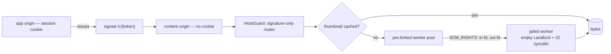

# Content Serving, Preview, Share Links - Spec Proposal

| Item       | Detail                           |
|------------|----------------------------------|
| Author     | heavycaffeiner(Dong Hyun Kim)    |
| Created    | 2026-08-03                       |
| Status     | Implemented                      |
| Reviewers  |                                  |

---

## 1. Summary

The only place arbitrary user-uploaded bytes reach a parser, and therefore the
highest remote-code-execution risk in the project. Two independent defences,
neither substituting for the other: user content is served from an origin with
no session cookie, and every decoder runs in a forked process with an empty
Landlock ruleset and a 22-syscall allow-list.

Share links, streamed archive download and the thumbnail cache all sit on the
same signed-URL capability.

## 2. Background & Motivation

| Threat | Vector | Defence |
|---|---|---|
| **Stored XSS** | uploaded HTML/SVG/PDF rendered on the app origin → session theft | content-origin separation |
| **Decoder RCE** | a crafted JPEG/TIFF fed to a parser → memory corruption | jailed worker process |

Thread-based isolation cannot address the second: a thread shares the address
space, so memory corruption in a decoder is full process compromise. Pure-Rust
decoders and resource limits still leave logic bugs, crashes and infinite
loops.

## 3. Goals & Non-Goals

### 3.1 Goals

- [x] The app origin never returns user-content bytes.
- [x] Access to content is a capability, not a cookie.
- [x] A decoder crash fails one job and nothing else.
- [x] A thumbnail never carries EXIF GPS into a public link.
- [x] Archive listing and streamed zip download that cannot be bombed.

### 3.2 Non-Goals

- [ ] Server-side PDF and office rendering. A PDF renderer's attack surface
      is larger than an image decoder's, and office conversion needs a
      resident LibreOffice. `pdf.js` runs in a sandboxed iframe on the
      content origin instead; office documents are download-only.
- [ ] Video thumbnails. See §4.5 — the refusal is deliberate and honest.
- [ ] IP-binding signed URLs. They false-positive constantly on mobile
      networks; etag binding and audit logging are used instead.
- [ ] Nested archive decompression, and extraction of encrypted archives.

## 4. Technical Design

### 4.1 Architecture Overview



Both origins are served by **the same binary**. A request arriving on the
content host never has its session cookie parsed at all — it goes straight to
the signature-only router. The security property comes from the browser's
same-origin policy, not from process separation, so a second process buys
nothing here.

### 4.2 Data Model Changes

| table | key | note |
|---|---|---|
| `preview_cache` | `(fileid, w, h)` | plus `etag8`, so an external edit misses |
| `preview_negative` | `fileid` | failure cache, default 7-day TTL |
| `share_link` | id, unique `token_hash` | `sha256(token)`; plaintext never stored |

**Without the negative cache**, a file that cannot be previewed would wake the
worker on every scroll past it.

### 4.3 Core Logic — signed URLs

```
/c/<payload>.<sig>
payload = base64url(postcard(Claim))
sig     = base64url(HMAC-SHA256(key[kid], payload)[..16])
```

The claim carries a format version, key id, fileid, the first 8 bytes of the
ETag, an expiry, a disposition, an optional thumbnail size, and the issuing
user for audit only. Verification is **fully stateless** — no database lookup,
constant-time comparison, expiry check, and an etag recheck that answers
`410 Gone` if the file changed underneath.

TTLs are per disposition: 5 minutes for an inline thumbnail (only needed while
the listing renders), 15 minutes for an attachment, 12 hours for a stream —
which must not expire halfway through a two-hour video. That last one is an
accepted trade: a leaked URL grants that one file for that window. Up to four
key ids are valid at once, so revoking one after a leak kills every URL signed
with it.

**`inline` is used only for our own re-encoded output.** Original bytes are
always `attachment`, whatever the type. Thumbnails are decode-then-re-encode,
so they are safe to inline. That single rule removes the entire SVG/HTML
upload XSS path.

**Single-origin fallback**, for deployments that cannot run a second host: the
URL becomes host-relative, and startup warns loudly that a stored XSS can now
reach the session cookie. One function is allowed to assemble a `/c/` URL,
because building it inline as `format!("https://{host}/c/{token}")` with an
empty host does not fail — the URL parser collapses the empty authority and
resolves the host as **`c`**, a real, unrelated, unreachable domain. That
stranded the browser on an error page; both the dev config and production run
with no content host, so it was live rather than theoretical.

### 4.4 Core Logic — the worker jail

The worker is given **no path** — only open descriptors, passed with
`SCM_RIGHTS` — so path traversal inside a decoder has nothing to traverse.

- **Landlock with an empty ruleset**: no path is granted, at all.
- **rlimits**: 512 MiB address space, 10 s CPU, 16 files, `RLIMIT_NPROC 0`
  (no fork), `RLIMIT_CORE 0` (a core dump could leak user data).
- **seccomp allow-list of 22 syscalls**, killing the process on anything else.
  `socket()` is absent, so there is no network. `execve` is absent entirely.
  `recvmsg`/`sendmsg` are present because they are how the worker receives its
  job and its descriptors in the first place.

A worker crash — seccomp kill, OOM, segfault — is a **normal event**: the
parent fails that one job and re-forks a replacement. A crash that does not
take down the service is the entire point of this shape.

The jail is proven against a running kernel rather than asserted: a proof
example attempts `open("/etc/passwd")`, `socket()` and `fork()` from inside a
live worker and checks each is denied or fatal.

### 4.5 Core Logic — what gets decoded

MIME is decided by **magic bytes only** — never the extension, never the
client's `Content-Type` — so an HTML file named `.jpg` never reaches a
decoder. The served type is fixed to `application/octet-stream` (except
thumbnails) which, with `nosniff`, leaves the browser no room to reinterpret
it.

Images use pure-Rust decoders only; no C library is linked. Dimensions are
read from the header and capped at 100M pixels before decoding, as a
decompression-bomb guard. Output is AVIF or WebP at five fixed size presets —
arbitrary sizes would blow up the cache and become a CPU DoS — and a request
rounds up to the nearest. Only EXIF orientation is applied and the rest is
stripped, so GPS coordinates cannot leak into a thumbnail on a public link.

**Video is an honest refusal.** ffmpeg needs `execve` and a Landlock rule
scoped to one input file, so it categorically cannot run in this jail, and
loosening a kernel-verified allow-list to add a feature is not on the table.
So videos are identified by magic bytes, routed to the video job kind, and
refused immediately without touching a byte — classified as *unimplemented*
rather than as a decode error, because otherwise "we don't support this" and
"this file is corrupt" look identical to a client. Nothing advertises a
preview capability for video.

A second jail for ffmpeg is future work, and deliberately not rushed: it opens
a new attack surface (ffmpeg's own SSRF history through crafted HLS/concat
playlists), and it would need proving against a real kernel first. **A second,
unverified jail shipped in a hurry is worse than not shipping one** — it lets
people believe a guarantee nobody checked.

### 4.6 Core Logic — archives

Listing only; extraction is a separate explicit action, bounded by entry
count, total uncompressed size, compression ratio, depth and name length.

Every entry name goes through the same `SafePath::parse` the rest of the
system uses, so `../`, an absolute path or a NUL rejects the whole archive
(zip slip). Symlink, hardlink and device entries are rejected. Decoding is
streamed and stops the moment the cumulative size cap is passed, so nothing is
held in memory at once. Nested archives are not decompressed.

### 4.7 Core Logic — share links

The token is 128 bits of CSPRNG rendered base64url; only its SHA-256 is
stored.

**Keyed by path, not fileid** — but both are stored. A fileid-keyed link dies
safely when the target is deleted; a path-keyed link would expose whatever
different file later lands at that name. So access re-checks the creation-time
fileid against the current one and answers `410 Gone` on a mismatch, taking
the safe intersection of the two schemes.

Password attempts are rate-limited per token, and a failure returns the same
response *and the same timing* as "link does not exist", so a valid token's
existence is never confirmed. A file-drop link carries `CREATE` only — no
listing, no reading, no overwrite — and is the one case that reports its
upload ceiling, since a visitor otherwise discovers it by exceeding it.

`max_downloads` decrements atomically; a connection dropped mid-stream is not
rolled back, because preventing abuse matters more than perfect accounting.

### 4.8 Core Logic — streamed archive download

A multi-select download streams a zip **without ever writing it to disk**:
ZIP64 with data descriptors, so no size is needed up front.

Compression is fixed to STORE. Most selections are already-compressed media,
where deflate burns CPU without shrinking anything; a text-heavy selection
loses out, and predictability wins.

Every entry is ACL-rechecked and unauthorized ones are **silently skipped** —
an error would fail the whole zip — with the skipped list written into
`_skipped.txt` inside it. A file deleted mid-stream truncates that entry and
streaming continues, so the zip stays valid.

## 5. API Design

### 5-1. New / Modified

```
GET  /c/<payload>.<sig>        content origin; signature only, no session
GET  /s/<token>                public share page
POST /api/fs/archive           { paths: [...] } -> signed attachment URL
```

Response headers on every content response:

```
Content-Disposition: attachment; filename="…"; filename*=UTF-8''…
X-Content-Type-Options: nosniff
Content-Security-Policy: default-src 'none'; sandbox
Cross-Origin-Resource-Policy: same-site
Referrer-Policy: no-referrer
X-Robots-Tag: noindex, nofollow
Cache-Control: private, max-age=<remaining exp>, immutable
```

`filename` is RFC 5987-encoded with an ASCII fallback; CR, LF and quotes are
stripped to block header injection.

### 5-2. Error Handling

| Condition | Result |
|---|---|
| bad signature, expired, revoked key id | 403 |
| etag no longer matches the claim | 410 |
| share link expired, exhausted, or its target replaced | 410 |
| wrong link password | same body and timing as an unknown token |
| image over the pixel cap | rejected before decode |
| video preview requested | *unimplemented*, distinct from a decode failure |
| decoder crash | that job fails; the pool re-forks |
| archive over any limit | listing/extraction stops at the cap |

## 6. Implementation Plan

### 6-1. Milestones

| Phase | Task | Duration | Owner |
|---|---|---|---|
| Phase 1 | Content origin, HostGuard, signed claims, key rotation | done | heavycaffeiner |
| Phase 2 | Worker pool, jail, FD passing, crash recovery | done | heavycaffeiner |
| Phase 3 | Image decode, presets, EXIF strip, caches | done | heavycaffeiner |
| Phase 4 | Share links, file drop, public page | done | heavycaffeiner |
| Phase 5 | Archive listing + streamed zip | done | heavycaffeiner |

### 6-2. Dependencies

- `image`, `zune-jpeg`, `zune-png`, `webp`, `avif-decode` — pure Rust, no C.
- `landlock`, `seccompiler`, `nix` for the jail; `hmac`/`sha2`, `postcard`.
- `pdf.js` client-side. ffmpeg is not a dependency and is not bundled.

## 7. Verification

| Item | Method |
|---|---|
| worker isolation | `open`, `socket`, `fork` from inside a live worker — each denied or fatal |
| crash recovery | an input that kills the worker: parent survives, re-forks, one job fails |
| decode bombs | a 1-pixel header declaring 100000×100000 — rejected at the cap |
| XSS | malicious SVG/HTML/PDF upload — every path serves `attachment`, never on the app origin |
| zip slip / zip bomb | `../../etc/cron.d/x` rejected at listing; 42.zip stopped at the cap |
| share links | expiry, exhaustion, password brute force, deleted-then-recreated name → 410 |
| EXIF | a GPS-tagged photo's thumbnail carries none |

## 8. References

- `crates/sc-preview/`, `crates/sc-http/src/content.rs`, `archive_zip.rs`
- `stowcloud-2-core-vfs.md` (`SafePath`, used for archive entry names)
- `stowcloud-9-api.md` (HostGuard and the middleware order)
