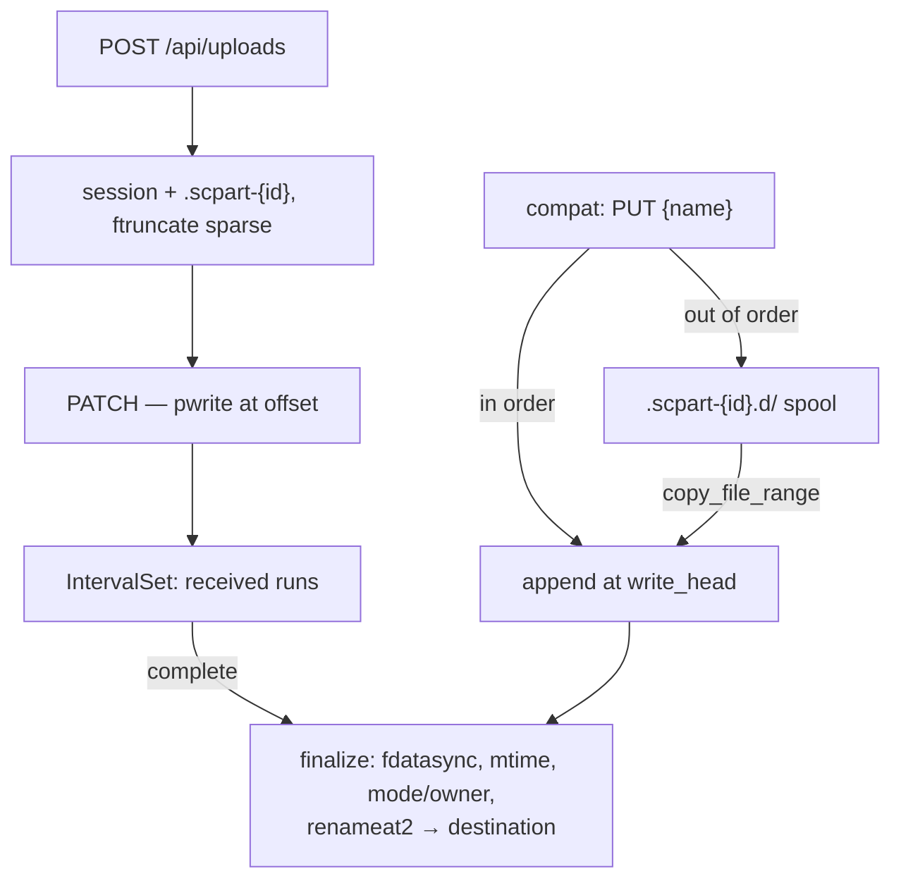

# Resumable Upload - Spec Proposal

| Item       | Detail                           |
|------------|----------------------------------|
| Author     | heavycaffeiner(Dong Hyun Kim)    |
| Created    | 2026-08-03                       |
| Status     | Implemented                      |
| Reviewers  |                                  |

---

## 1. Summary

`sc-upload` implements TUS 1.0.0 with one extension, and a fixed chunk size
instead of dynamic sizing. Throughput comes from parallel transfer, not from
growing chunks.

One ordering rule holds the whole design together: **the database is committed
only after `pwrite` succeeds**. Under that order a crash can only ever make the
server under-report what it holds; the reverse order is silent data corruption.

## 2. Background & Motivation

### 2.1 What the reference implementation does, measured

The legacy desktop client starts at a 100 MB chunk and adjusts dynamically
between 5 MB and 5 GB, aiming at a one-minute transfer per chunk, six requests
in parallel — its numbers, in its own units (§2.2). Its protocol says chunks
are named 1–10000, assembled in name
order, and sessions expire after 24 h of inactivity.

Two problems follow directly:

- **The first chunk 413s at the CDN.** A server can advertise a smaller
  maximum and the client still will not always honour it, and a 100 MB
  request never reaches us anyway — the CDN answers its own 413 first. So
  advertisement plus documentation is the first line of defence, and
  *returning a spec-correct 413 to drive the client's own auto-adjust is
  normal operation, not an error path.*
- **"Assembly-free assembly" does not hold for that protocol.** Variable chunk
  size means a chunk's name does not give its offset, so something has to
  assemble in name order — §4.6.

### 2.2 A note on units

Sizes in this proposal follow the product's own vocabulary — KB/MB/GB, each
1024 of the one below (`stowcloud-3-frontend.md` §4.7). That is what the
admin's chunk-size field takes and what the UI prints back, so the two agree.
The reference client's figures above are its own, and decimal.

### 2.3 Why a fixed chunk size

The server streams a chunk straight to disk: the body flows through a reused
256 KiB buffer into `pwrite`, and nothing buffers a whole chunk anywhere.
**Memory use is independent of chunk size** — a 1 GiB chunk leaves RSS
unchanged. So there is no memory argument for a ceiling, and what dynamic
sizing buys elsewhere, parallelism buys here more simply.

## 3. Goals & Non-Goals

### 3.1 Goals

- [x] Resume after a crash, a reboot, or a closed laptop, with no lost bytes
      and no corrupt destination file.
- [x] Parallel chunk transfer without breaking standard TUS clients.
- [x] Zero-copy assembly: no staging file is ever read back and rewritten on
      the native path.
- [x] A partial upload can never appear at the destination.

### 3.2 Non-Goals

- [ ] Dynamic chunk sizing. Fixed size × parallel transfer instead.
- [ ] A chunk-size ceiling. Not enforcing one does not make middleboxes
      disappear — it means *we* are not the one rejecting. The advertised
      value is a recommendation, never a requirement.
- [ ] Per-chunk `fdatasync`. It would collapse throughput, and skipping it is
      safe under §4.2's ordering rule.

## 4. Technical Design

### 4.1 Architecture Overview



### 4.2 Core Logic — the ordering rule

> **Commit the DB only after `pwrite` succeeds. Never the reverse.**

A crash between the write and the commit makes the server remember a received
chunk as not received, so the client resends the same offset and the same
bytes land again — idempotent and safe. The reverse order makes the server
believe it holds bytes it never durably received, which is silent corruption.

Pinned three ways: a comment at the site, a crash-injection test, and review.
`fdatasync` therefore happens **once, at finalize** — under this rule a crash
can only ever under-report.

### 4.3 Core Logic — assembly-free assembly

The part file is created with `O_CREAT|O_EXCL|O_WRONLY|O_NOFOLLOW` and
`ftruncate`d to the full length — sparse, so it consumes nothing yet. Each
`PATCH` is a `pwrite` at its offset, which is safe under concurrency. Finalize
is `fdatasync`, restore mtime, apply mode/ownership, then `renameat2`.

**Zero copies.** The part file lives in the *same directory* as the final
file, so the rename is atomic and can never hit `EXDEV`.

Replacing an existing file **inherits its permissions and ownership before the
rename** — otherwise an atomic replace silently strips whatever access other
services sharing the directory had a moment ago.

One acknowledged side effect: an in-progress upload is visible in the
destination directory as a dot-file.

### 4.4 Core Logic — IntervalSet

The set of received ranges, kept sorted, non-overlapping and with adjacent
runs merged. `contiguous_prefix()` — the end of the run starting at 0 — is
what TUS's `Upload-Offset` reports.

Two properties matter:

- **Run count is capped.** Normal use is one run sequential, a handful for
  parallel; the cap exists only for a pathological client.
- **`decode` never trusts the database.** It re-validates the sort and
  non-overlap invariants from scratch, cutting the path from "corrupted blob"
  to "wrong offset math" to "silent corruption".

### 4.5 Core Logic — `Sc-Random-Access`

TUS core requires `Upload-Offset` to match the server's current offset exactly,
which is sequential-only. Opting in at session creation lets `PATCH` accept any
offset in range; without it, a mismatch is `409` as the standard specifies.

**Either way `HEAD` reports the contiguous run from 0**, so a standard client
resuming a random-access session behaves correctly without knowing anything
changed — it resends already-received bytes, which land identically.

### 4.6 Core Logic — compat chunking

All of it lives in the compat crate; the engine knows nothing about it.

The client-chosen transfer id is mapped to our own session id through an alias
table and **never used as the session key directly** — it is client-controlled,
so it carries enumeration and collision risk. Chunk names are parsed as
integers and used *only* as a sort key; some real clients send zero-padded
offsets rather than the documented 1–10000.

Two paths, because variable chunk size means the offset is not knowable:

- **Fast path** — the chunk that arrives is the next one, so it is written
  straight to the end of the part file, and any already-spooled chunks that
  are now next get absorbed behind it.
- **Spill path** — out of order, so it goes to its own file in a spool
  directory *in the same directory as the part file*: same filesystem, so
  `copy_file_range` is efficient and `EXDEV` never happens. It reflinks on
  btrfs/XFS when block-aligned and otherwise falls back to an in-kernel copy —
  either way there is no userspace round trip.

Six-way parallel clients still tend to complete close to sorted order, so the
fast path hits often and the spool only absorbs reordering. Once assembly is
done, finalize is **exactly the native path**.

## 5. API Design

### 5-1. New / Modified

```
OPTIONS /api/uploads   → Tus-Extension: creation,creation-with-upload,
                           expiration,termination,checksum
POST    /api/uploads   Upload-Length, Upload-Metadata, Sc-Random-Access
                       → 201 + Location + Upload-Expires
HEAD    /api/uploads/<id> → Upload-Offset (contiguous run from 0),
                            Sc-Received-Runs
PATCH   /api/uploads/<id> Upload-Offset, Upload-Checksum → 204
DELETE  /api/uploads/<id> → 204
```

`dest` is the destination directory's vpath; the leaf appended to it comes
from `relativePath` (directory uploads) or `filename` — neither key alone
names a target.

`chunk_size` is fixed **to the session**, so an admin changing the server
setting mid-upload cannot break a transfer in flight.

An optional whole-file digest is checked at finalize against the finished
file, compared in constant time. A mismatch unlinks the part file and deletes
the session rather than leaving mismatching bytes at the destination or a
session that can never verify.

### 5-2. Error Handling

| Code | Condition |
|---|---|
| 404 | no such session, or one owned by another user |
| 409 | sequential mode and the offset does not match |
| 410 | session expired or aborted |
| 412 | `If-Match` mismatch at finalize, and checksum mismatch |
| 422 | malformed metadata, an under-floor chunk that is not the last, or an offset past the declared length |
| 507 | session count, reserved bytes, or free-space margin |

A 5 MB floor is enforced, exempting the last chunk and any file smaller than
it. Below that, per-chunk overhead swamps transfer: a 100 KiB chunk against a
10 GB file is 100,000 round trips, each costing a session load, a DB commit
and an fd lookup.

`ftruncate` reserves sparsely, so without **logical accounting of reserved
bytes** overcommit would exhaust the disk. Available space is real free space
minus every open session's undelivered bytes.

### 5-3. Known limitation

There is no atomicity between the `If-Match` check and `renameat2` — a window
of microseconds, unclosable in principle because the kernel has no
compare-and-rename. **A brand-new file closes it completely** via
`RENAME_NOREPLACE`. Documented rather than hidden.

## 6. Implementation Plan

### 6-1. Milestones

| Phase | Task | Duration | Owner |
|---|---|---|---|
| Phase 1 | `IntervalSet`, session store, encode/decode | done | heavycaffeiner |
| Phase 2 | TUS surface + `Sc-Random-Access` | done | heavycaffeiner |
| Phase 3 | Finalize path: sync, mtime, ownership, rename | done | heavycaffeiner |
| Phase 4 | Resource limits and reserved-byte accounting | done | heavycaffeiner |
| Phase 5 | Compat chunking: fast path + spool | done | heavycaffeiner |

### 6-2. Dependencies

- `copy_file_range`, `renameat2`, `ftruncate`, `pwrite` — Linux.
- `crc32c`, `blake3`, `subtle` for the optional whole-file check.

## 7. Known gaps

- Session-creation rate limiting has an error variant but nothing constructs
  it — that limit is unwired.
- The per-user concurrent *request* cap is documented but not wired to a live
  check.
- `Tus-Resumable` on a request is not validated; the server always answers
  with its own.
The GC sweep used to be listed here too. It is scheduled now: `App` spawns a
15-minute sweep thread at startup and `UploadApi::drain` runs one final pass
at shutdown, so expired sessions and orphaned part files are reclaimed
without an operator arranging anything.

## 8. References

- `crates/sc-upload/`, `crates/sc-compat-nc/src/chunking.rs`
- [TUS 1.0.0](https://tus.io/protocols/resumable-upload)
- `stowcloud-2-core-vfs.md` (the atomic write path this shares),
  `stowcloud-4-webdav.md` (`/dav-uploads`, the same engine)
