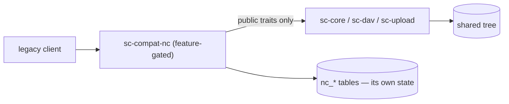

# Legacy-Client Compatibility Layer - Spec Proposal

| Item       | Detail                           |
|------------|----------------------------------|
| Author     | heavycaffeiner(Dong Hyun Kim)    |
| Created    | 2026-08-03                       |
| Status     | Implemented                      |
| Reviewers  |                                  |

---

## 1. Summary

`sc-compat-nc` lets existing desktop and mobile sync clients talk to this
server unmodified. It is a decorator over `sc-dav` and `sc-core`, removable in
full behind a compile feature — and that removability is enforced by CI, not
by discipline.

Scope stops at sync, browse, share and preview. Anything past that boundary is
not a gap; it is rebuilding the server this layer only pretends to be.

## 2. Background & Motivation

The clients exist, they are good, and users already run them. Reimplementing a
desktop and two mobile apps to reach the same tree would be the larger project
by far.

The risk is the obvious one: a compatibility layer that leaks its vocabulary
into the core makes the core permanently shaped by someone else's protocol.
Every design decision here follows from refusing that.

## 3. Goals & Non-Goals

### 3.1 Goals

- [x] Unmodified sync clients work: browse, sync, share, preview.
- [x] Not one line of vendor vocabulary in any core crate.
- [x] `--no-default-features` produces a binary with no trace of it — routes
      included, not merely unrouted.

### 3.2 Non-Goals

Explicitly not implemented, in the documentation *and* in the advertised
capabilities: app store, server-side encryption, versioning, comments, tags,
Talk, groupware (Calendar, Contacts, CalDAV, CardDAV), federation, office
suite integration, push notifications, activity stream, external storage
mounts, workflows.

Advertising a capability we do not have is worse than not having it, because
the client then fails in the middle of a user's work instead of at setup.

## 4. Technical Design

### 4.1 Architecture Overview



Dependencies point one way. The compat crate consumes only the public traits
the core exposes — filesystem, ACL evaluation, auth, metadata, upload engine,
link store — and keeps its own state in its own `nc_*` tables. The core never
learns it exists.

### 4.2 Data Model Changes

Compat-only tables: favourites, the upload transfer-id alias, the login-flow
poll/flow token pair, and an instance-identity key/value. Nothing else.

The alias table is the security-relevant one: the transfer id is chosen by the
client, so it is never used as a session key directly — enumeration and
collision risk — and every lookup carries the authenticated principal.

### 4.3 Core Logic — the isolation test

One question, applied to every feature:

> **Would this feature need to exist without the compat layer?**

| Feature | Verdict | Lives in |
|---|---|---|
| stable file id, directory ETag, recursive size | yes — sync and the UI need them anyway | core |
| chunked upload session engine | yes | core |
| share links | yes | core |
| favourites | no — not a concept in our own UI | compat |
| fileid serialization format, permission strings, OCS envelope | no — pure vendor vocabulary | compat |
| the `MKCOL`/`PUT {n}`/`MOVE` chunk mapping | no | compat |

### 4.4 Core Logic — what enforces it

Two CI gates, which is what makes §4.3 more than a convention:

1. **No vendor vocabulary in core code.** A grep over every core crate's
   sources for the protocol's identifying tokens. Comment lines are skipped,
   so a core crate may still *explain* why a protocol-neutral abstraction
   exists — but a header name, route string or error text in real code fails
   the build.
2. **The stripped build compiles**, proving the crate and all its route
   strings are absent from the binary. A wiring test then checks the other
   half: that the vendor paths fall through to the native stack rather than
   being answered.

### 4.5 Core Logic — the lowercase prefix

The WebDAV decorator emits every element with a lowercase `d:` prefix, which
`stowcloud-4-webdav.md` explains at the protocol layer. It is repeated here
because this layer is where the lesson was learned: an implementation derived
only from reading the desktop client's source emitted an uppercase prefix —
valid XML, correct for every namespace-aware parser — and the iOS client saw
every directory as empty while still reporting success.

Reading a client's source found that bug and also shipped it. So a claim about
client behaviour stays unverified until a real device has run it.

### 4.6 Core Logic — capabilities

Two failure modes drove the shape of the advertised capability document, both
found by auditing real clients rather than by reading a specification:

- **Some keys are switches on presence, not value.** A client tests whether
  the key exists; setting it to `false` enables the feature.
- **Some keys, if absent, discard the whole response.** A client that cannot
  find them treats the server as unusable rather than treating that one
  feature as missing.

So the document is written against measured client behaviour, and the
non-goals in §3.2 are expressed there as explicit `false`, not as omissions.

## 5. API Design

### 5-1. New / Modified

All under the vendor's own prefixes, none of which the native stack uses:

```
GET  /status.php                          server identity probe
GET  /ocs/v{1,2}.php/cloud/capabilities   the §4.6 document
GET  /ocs/v2.php/cloud/user               user + quota
*    /remote.php/dav/files/{user}/**      WebDAV decorator
*    /remote.php/dav/uploads/{user}/{tid} chunked upload session folder
GET  /ocs/v2.php/apps/files_sharing/…     share API
POST /index.php/login/v2                  Login Flow v2
```

Login Flow v2 hands the client an app password after the user approves it in
a browser. The poll token and the flow token are stored hashed, the result is
consumed exactly once, and the whole record expires.

### 5-2. Error Handling

The OCS envelope carries its own status inside a `200`, which is the protocol's
design rather than ours. The decorator keeps the DAV layer's real status codes
on DAV routes and only wraps where the vendor protocol requires it.

The existence rules from the native stack are unchanged: a path the caller
cannot list is `404`, never `403`.

## 6. Implementation Plan

### 6-1. Milestones

| Phase | Task | Duration | Owner |
|---|---|---|---|
| Phase 1 | Feature gate, isolation grep, stripped-build gate | done | heavycaffeiner |
| Phase 2 | `status.php`, OCS envelope, capabilities | done | heavycaffeiner |
| Phase 3 | WebDAV decorator: ids, permissions, ETag, files root | done | heavycaffeiner |
| Phase 4 | Chunked upload mapping | done | heavycaffeiner |
| Phase 5 | Login Flow v2, share API, preview | done | heavycaffeiner |

### 6-2. Dependencies

- No new third-party dependency: the crate is `sc-dav` and `sc-core` plus
  serialization.
- Verification needs real clients — a desktop client, and both mobile apps.

## 7. Known limitations

- Exact per-chunk size cannot be dictated to every client; the advertised
  value is advisory and a spec-correct 413 is part of normal operation.
- `REPORT` is still unhandled. Search is not: it arrived with
  `stowcloud-14-compat-mobile.md`, which specifies WebDAV `SEARCH` and the
  unified-search endpoint the phone apps call.
- Some behaviour is only verifiable on real hardware, and is marked as such
  rather than assumed from source reading — see §4.5 for why that distinction
  is load-bearing here.

## 8. References

- `crates/sc-compat-nc/`, `scripts/verify.sh` (the two gates)
- `stowcloud-4-webdav.md` (the layer this decorates),
  `stowcloud-7-upload.md` (the engine behind the chunk mapping)
