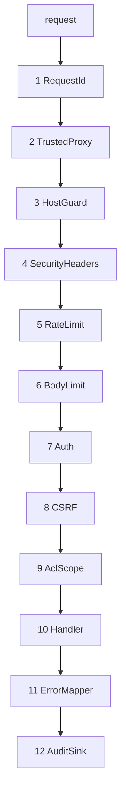

# Native REST API - Spec Proposal

| Item       | Detail                           |
|------------|----------------------------------|
| Author     | heavycaffeiner(Dong Hyun Kim)    |
| Created    | 2026-08-03                       |
| Status     | Implemented                      |
| Reviewers  |                                  |

---

## 1. Summary

The API the web UI is written against: a stable error envelope, cursor-paged
directory listings that survive a million entries, WebSocket invalidation, and
a middleware stack whose *order* is a security property.

## 2. Background & Motivation

Two constraints shape it. A directory can hold 100k entries and the filesystem
offers no sorted iterator — `getdents64` order is unstable and a full sort
means reading every name, so re-sorting per page is O(n) × pages. And the tree
is shared, so anything the client believes about it can be stale the moment
after it is fetched.

## 3. Goals & Non-Goals

### 3.1 Goals

- [x] A client branches on a stable code, never on prose.
- [x] Paging a 100k-entry directory without re-reading it per page.
- [x] Middleware ordered so a flood is rejected before it costs Argon2.
- [x] Nanosecond timestamps that survive JavaScript.

### 3.2 Non-Goals

- [ ] Server-rendered messages. A refusal travels as a code plus parameters;
      the browser owns the wording and the reader's language.
- [ ] A MIME type on a listing entry. The server never states one — the icon
      is the client's business, and a guessed type invites a client to render
      what it should download.

## 4. Technical Design

### 4.1 Architecture Overview



**Order is the security property**, not a style choice:

- `TrustedProxy` is applied **once, outside every mount**, so the native API,
  DAV and the compat layer cannot disagree about who the client is.
- `RateLimit` runs **before** `Auth`, so a flood gets `429` without ever
  reaching Argon2 or a session lookup.
- `BodyLimit` is **not** applied to upload routes — they stream, and a cap
  there would reject a legitimate chunk.
- `CSRF` applies only to cookie-authenticated state-changing requests. Bearer
  requires a custom header a cross-site form cannot forge.
- `ErrorMapper` strips detail from **every** 5xx regardless of origin.

axum layers wrap outside-in in the order they are added, so producing this
request order means adding them in reverse. That inversion is worth stating at
the site, because reading the builder top-down gives exactly the wrong picture.

### 4.2 Data Model Changes

None persisted. A listing session is a short-lived in-memory cache: a
pre-sorted name vector with the directory ETag it was built from, a TTL, and a
small per-user LRU.

### 4.3 Core Logic — the error envelope

```json
{ "error": { "code": "fs.conflict",
             "message": "the destination already exists",
             "detail": { "path": "/Photos/a.jpg", "etag": "3f2a…" } } }
```

`code` is stable and machine-readable; `message` is display-only and the
frontend never branches on it. `detail` carries what the client needs to
recover — the denying grant for `acl.denied`, the current ETag for a
precondition failure, the rejection reason for an invalid name.

Two entries are not errors at all and are documented as such: a TOTP challenge
is a flow step, and cross-device notice is *advance warning* that a move will
become a copy — surfaced before the user commits, not after it is slow.

### 4.4 Core Logic — listing sessions

The first request sorts the directory once and keeps the name vector; later
pages are cursor offsets into it. A 100k-entry directory costs roughly 3 MB
held for a 60-second TTL, with a small per-user cap so this cannot be used to
exhaust memory.

The cached listing carries the directory ETag it was built from, so a client
paging through a tree that changed underneath is detectable rather than
silently inconsistent.

Only what is on screen gets stat'd, per `stowcloud-2-core-vfs.md`: a name sort
can page-at-a-time, while a size or mtime sort needs the whole set and
therefore goes through the metadata cache.

### 4.5 Core Logic — timestamps

Every nanosecond timestamp travels as a **string**. JavaScript numbers lose
precision above 2^53, and a silently-rounded mtime is the kind of bug that
surfaces as a sync loop months later. The rule is uniform across every surface
so no endpoint is the exception someone forgets.

### 4.6 Core Logic — invalidation

A WebSocket subscription per open directory, torn down and re-established on
navigation — including navigating to the same path again, since a sort change
re-lists through the same code path. The previous subscription is always
dropped first, so a directory the user has left cannot keep waking the client.

A watcher that fails to start degrades to lazy revalidation rather than
erroring: stale-but-correct beats a broken page.

## 5. API Design

### 5-1. New / Modified

```
GET   /api/capabilities              unauthenticated feature probe
POST  /api/setup                     first-run bootstrap, one-time token
POST  /api/auth/login                → session cookie (+ TOTP challenge step)
GET   /api/auth/session              identity, roots, CSRF token
GET   /api/fs/list?path=&sort=&limit=    → listing id + cursor + entries
GET   /api/fs/list?listing=&cursor=      → next page
POST  /api/fs/{mkdir,rename,move,copy,delete}
POST  /api/fs/archive                → signed URL for a streamed zip
GET   /api/search[/stream]
GET   /api/jobs, /api/jobs/{id}      long-running work
WS    /api/events                    directory invalidation
*     /api/admin/**                  users, groups, shares, grants, settings
```

Mutating operations take `If-Match` where a lost update is possible, and
report a cross-device move as advance notice rather than performing a silent
copy.

Long-running work (archive, index build) returns a job id immediately and
reports progress through `/api/jobs`, so a browser tab never hangs on it and a
cancel is possible.

### 5-2. Error Handling

| Code | HTTP | Note |
|---|---|---|
| `auth.required` | 401 | |
| `auth.invalid_credentials` | 401 | identical whether or not the account exists |
| `auth.totp_required` | 200 | a flow step, not an error |
| `acl.denied` | 403 | `detail.by` names the denying grant |
| `fs.not_found` | 404 | also what an unlistable path gets |
| `fs.conflict` | 409 | destination exists / name collision |
| `fs.precondition` | 412 | carries `detail.current_etag` |
| `fs.invalid_name` | 422 | carries the rejection reason |
| `fs.cross_device` | 200 | advance notice, not an error |
| `quota.exceeded` | 507 | |
| `rate.limited` | 429 | with `Retry-After` |
| `setup.completed` | 410 | the route is gone for good |

`auth.invalid_credentials` being identical either way is deliberate: a
different code, message or timing for "no such account" is an enumeration
oracle.

## 6. Implementation Plan

### 6-1. Milestones

| Phase | Task | Duration | Owner |
|---|---|---|---|
| Phase 1 | Envelope, error mapping, capabilities | done | heavycaffeiner |
| Phase 2 | Middleware stack in the order above | done | heavycaffeiner |
| Phase 3 | Listing sessions and cursor paging | done | heavycaffeiner |
| Phase 4 | Mutations, jobs, WebSocket invalidation | done | heavycaffeiner |
| Phase 5 | Admin surface | done | heavycaffeiner |

### 6-2. Dependencies

- `axum`, `tower`, `tokio`, `serde`.
- No API framework beyond that; the envelope and the middleware are ours.

## 7. References

- `crates/sc-http/src/{lib,routes,middleware}.rs`
- `stowcloud-2-core-vfs.md` (what a path resolves to),
  `stowcloud-10-auth.md` (sessions, CSRF, app-password scopes),
  `stowcloud-3-frontend.md` (the client written against this)
